# Speech-to-Text 应用详细设计文档

## 1. 概述

### 1.1 项目简介

本项目旨在构建一个类似 [Wispr Flow](https://wisprflow.ai/) 的语音转文字桌面工具，使用 **Tauri 2** 框架和 **ElevenLabs Scribe v2 Realtime API** 实现实时语音转录功能。

### 1.2 核心功能

- 常驻系统托盘（System Tray）
- 全局快捷键 `Cmd+Shift+\` 开启/停止转录
- 实时语音转文字（延迟 ~150ms）
- 智能文本插入到当前活跃应用光标位置
- 剪贴板降级方案

### 1.3 系统架构总览

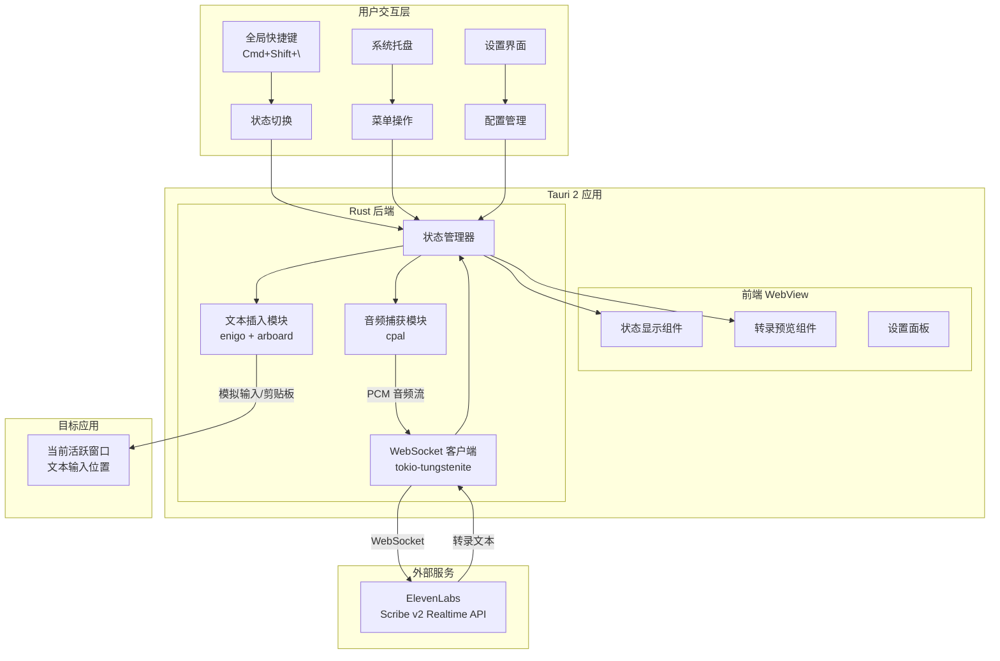

## 2. 技术栈与依赖版本

### 2.1 Rust 依赖 (Cargo.toml)

| 依赖包 | 版本 | 用途 |
|--------|------|------|
| tauri | 2.9.x | 应用框架 |
| tauri-plugin-global-shortcut | 2.3.0 | 全局快捷键 |
| tokio | 1.49.0 | 异步运行时 |
| tokio-tungstenite | 0.28.0 | WebSocket 客户端 |
| cpal | 0.17.1 | 跨平台音频捕获 |
| enigo | 0.6.1 | 键盘/鼠标模拟 |
| arboard | 3.6.1 | 剪贴板操作 |
| serde | 1.0.228 | 序列化框架 |
| serde_json | 1.0.145 | JSON 处理 |
| base64 | 0.22.1 | Base64 编解码 |
| futures-util | 0.3.31 | 异步工具 |

```toml
[package]
name = "speech-to-text"
version = "0.1.0"
edition = "2021"

[dependencies]
tauri = { version = "2.9", features = ["tray-icon"] }
tauri-plugin-global-shortcut = "2.3"
tokio = { version = "1.49", features = ["full"] }
tokio-tungstenite = { version = "0.28", features = ["native-tls"] }
cpal = "0.17"
enigo = "0.6"
arboard = "3.6"
serde = { version = "1.0", features = ["derive"] }
serde_json = "1.0"
base64 = "0.22"
futures-util = "0.3"
http = "1.0"
thiserror = "2.0"
log = "0.4"
env_logger = "0.11"

[build-dependencies]
tauri-build = "2.9"
```

### 2.2 前端依赖 (package.json)

| 依赖包 | 版本 | 用途 |
|--------|------|------|
| svelte | ^5.46 | UI 框架 |
| vite | ^7.3 | 构建工具 |
| @tauri-apps/api | ^2.9 | Tauri JS API |
| @tauri-apps/plugin-global-shortcut | ^2.3 | 快捷键插件 |
| typescript | ^5.7 | 类型支持 |

```json
{
  "name": "speech-to-text",
  "version": "0.1.0",
  "type": "module",
  "scripts": {
    "dev": "vite",
    "build": "vite build",
    "preview": "vite preview",
    "tauri": "tauri"
  },
  "dependencies": {
    "@tauri-apps/api": "^2.9.1",
    "@tauri-apps/plugin-global-shortcut": "^2.3.0"
  },
  "devDependencies": {
    "@sveltejs/vite-plugin-svelte": "^5.0.0",
    "@tauri-apps/cli": "^2.9.6",
    "svelte": "^5.46.4",
    "typescript": "^5.7.0",
    "vite": "^7.3.1"
  }
}
```

## 3. 系统架构设计

### 3.1 分层架构

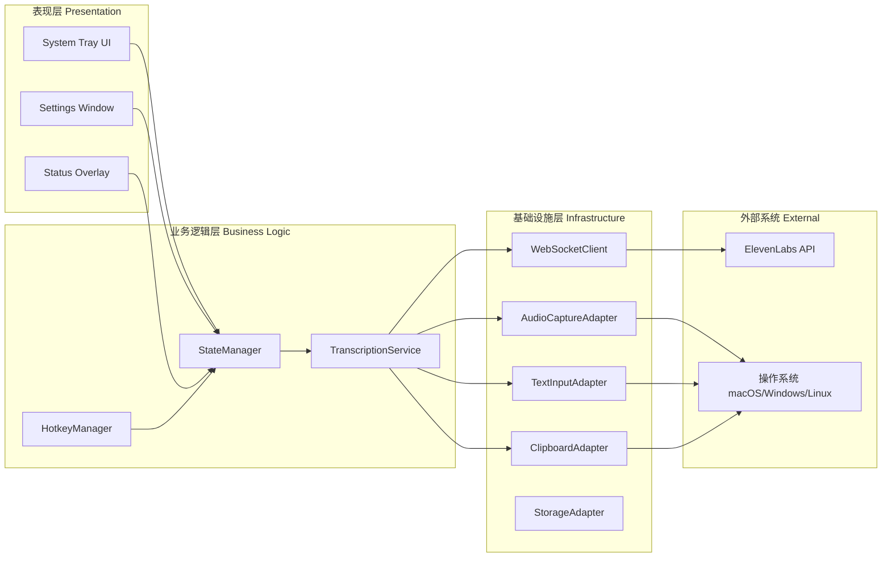

### 3.2 模块职责划分

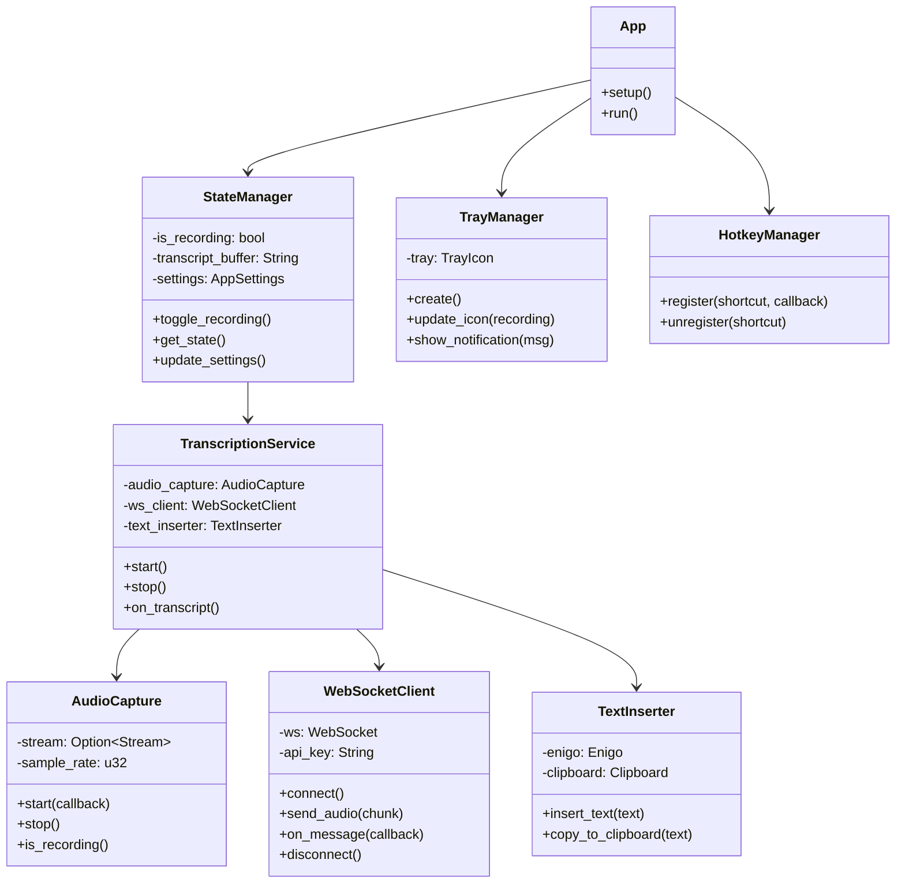

## 4. 核心流程设计

### 4.1 应用启动流程

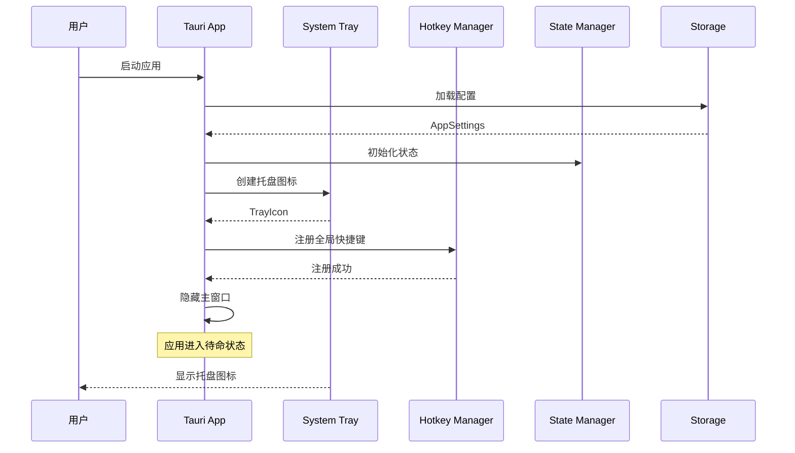

### 4.2 录音与转录流程

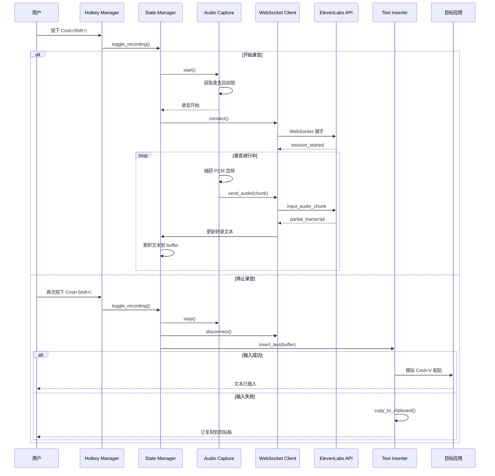

### 4.3 WebSocket 通信流程

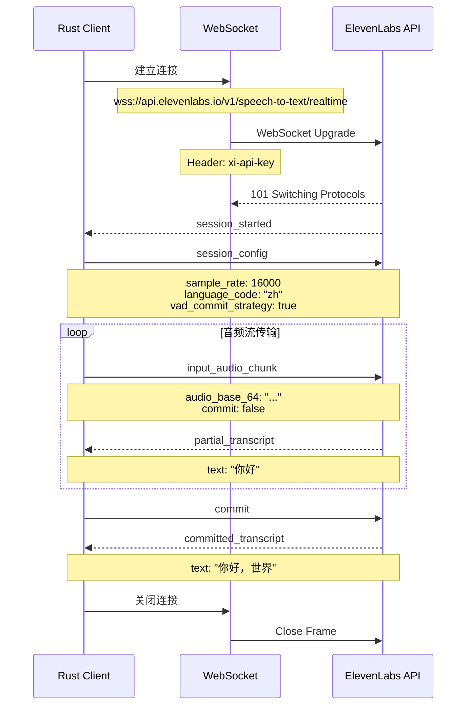

### 4.4 文本插入决策流程

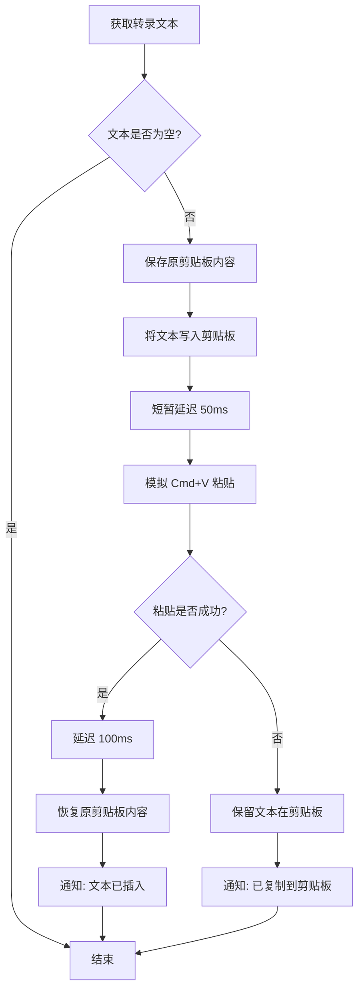

## 5. 组件详细设计

### 5.1 状态管理组件

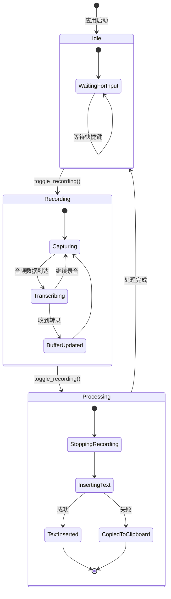

### 5.2 数据结构设计

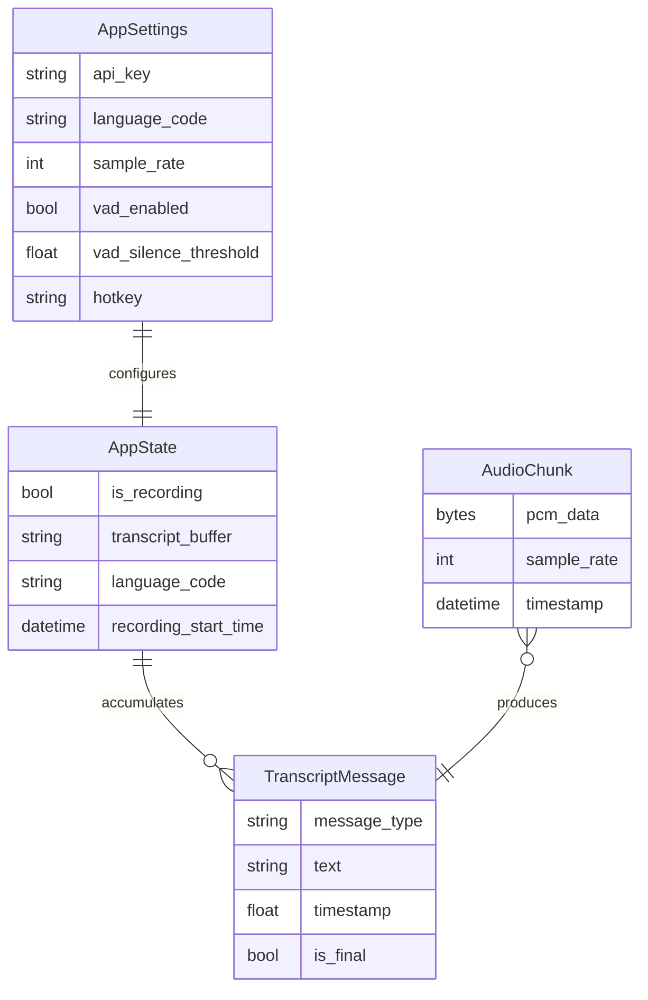

### 5.3 错误处理设计

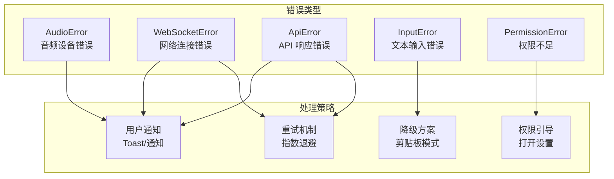

## 6. API 接口设计

### 6.1 ElevenLabs WebSocket API 消息格式

#### 发送消息

```typescript
// 会话配置
interface SessionConfig {
  message_type: "session_config";
  sample_rate: 16000;
  language_code: "zh" | "en" | "ja" | string;
  vad_commit_strategy: boolean;
  vad_silence_threshold_secs?: number;
  include_timestamps?: boolean;
}

// 音频块
interface AudioChunkMessage {
  message_type: "input_audio_chunk";
  audio_base_64: string;  // Base64 编码的 PCM 16-bit 音频
  commit: boolean;
  sample_rate: 16000;
}

// 手动提交
interface CommitMessage {
  message_type: "commit";
}
```

#### 接收消息

```typescript
// 会话开始
interface SessionStarted {
  message_type: "session_started";
  session_id: string;
  config: {
    sample_rate: number;
    audio_format: string;
    language_code: string;
    model_id: "scribe_v2_realtime";
    vad_commit_strategy: boolean;
    vad_silence_threshold_secs: number;
    include_timestamps: boolean;
  };
}

// 部分转录
interface PartialTranscript {
  message_type: "partial_transcript";
  text: string;
  timestamp?: number;
}

// 最终转录
interface CommittedTranscript {
  message_type: "committed_transcript";
  text: string;
  timestamp?: number;
}
```

### 6.2 Tauri 命令接口

```rust
// 前后端通信接口

#[tauri::command]
async fn toggle_recording(
    state: State<'_, AppStateHandle>,
    app: AppHandle,
) -> Result<RecordingStatus, AppError>;

#[tauri::command]
async fn get_status(
    state: State<'_, AppStateHandle>,
) -> Result<AppStatus, AppError>;

#[tauri::command]
async fn update_settings(
    state: State<'_, AppStateHandle>,
    settings: AppSettings,
) -> Result<(), AppError>;

#[tauri::command]
async fn get_settings(
    state: State<'_, AppStateHandle>,
) -> Result<AppSettings, AppError>;

// 返回类型
#[derive(Serialize)]
struct RecordingStatus {
    is_recording: bool,
    duration_ms: Option<u64>,
}

#[derive(Serialize)]
struct AppStatus {
    is_recording: bool,
    transcript: String,
    connection_status: ConnectionStatus,
}

#[derive(Serialize)]
enum ConnectionStatus {
    Disconnected,
    Connecting,
    Connected,
    Error(String),
}
```

## 7. 前端界面设计

### 7.1 组件结构

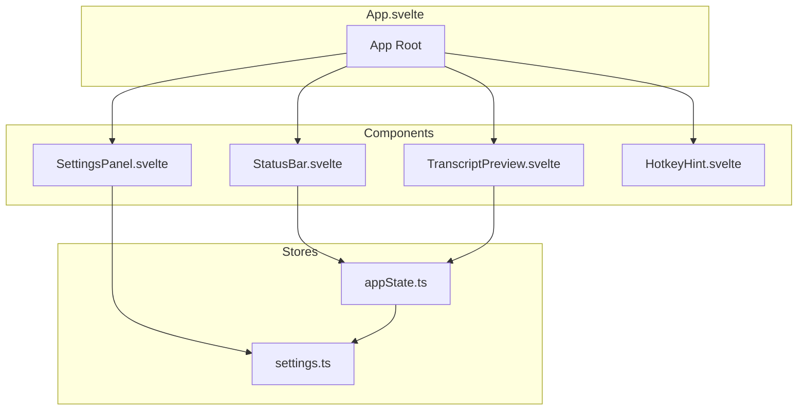

### 7.2 界面布局

```
┌─────────────────────────────────────┐
│  Speech to Text                   ─ │
├─────────────────────────────────────┤
│                                     │
│   ┌─────────────────────────────┐   │
│   │  ● Recording...             │   │
│   │     00:05                   │   │
│   └─────────────────────────────┘   │
│                                     │
│   ┌─────────────────────────────┐   │
│   │                             │   │
│   │  "你好，这是一段测试..."   │   │
│   │                             │   │
│   └─────────────────────────────┘   │
│                                     │
│        ⌘ + ⇧ + \ to toggle         │
│                                     │
├─────────────────────────────────────┤
│  ⚙️ Settings                        │
└─────────────────────────────────────┘
```

### 7.3 系统托盘菜单

```
┌─────────────────────────┐
│ ● Start Recording       │
│ ─────────────────────── │
│   Settings...           │
│   About                 │
│ ─────────────────────── │
│   Quit                  │
└─────────────────────────┘
```

## 8. 项目目录结构

```
speech-to-text/
├── src-tauri/
│   ├── Cargo.toml
│   ├── build.rs
│   ├── tauri.conf.json
│   ├── capabilities/
│   │   └── main.json
│   ├── icons/
│   │   ├── icon.icns
│   │   ├── icon.ico
│   │   ├── icon.png
│   │   ├── tray-idle.png
│   │   └── tray-recording.png
│   └── src/
│       ├── main.rs              # 入口点
│       ├── lib.rs               # 库导出
│       ├── error.rs             # 错误定义
│       ├── state.rs             # 状态管理
│       ├── commands.rs          # Tauri 命令
│       ├── tray.rs              # 系统托盘
│       ├── hotkey.rs            # 快捷键处理
│       ├── audio/
│       │   ├── mod.rs
│       │   └── capture.rs       # 音频捕获
│       ├── transcriber/
│       │   ├── mod.rs
│       │   ├── client.rs        # WebSocket 客户端
│       │   └── message.rs       # 消息类型
│       └── input/
│           ├── mod.rs
│           ├── inserter.rs      # 文本插入
│           └── clipboard.rs     # 剪贴板操作
│
├── src/
│   ├── main.ts                  # 前端入口
│   ├── App.svelte               # 根组件
│   ├── app.css                  # 全局样式
│   ├── lib/
│   │   ├── stores/
│   │   │   ├── appState.ts      # 应用状态
│   │   │   └── settings.ts      # 设置状态
│   │   ├── components/
│   │   │   ├── StatusBar.svelte
│   │   │   ├── TranscriptPreview.svelte
│   │   │   ├── SettingsPanel.svelte
│   │   │   └── HotkeyHint.svelte
│   │   └── utils/
│   │       └── tauri.ts         # Tauri 工具函数
│   └── vite-env.d.ts
│
├── public/
│   └── favicon.ico
├── index.html
├── package.json
├── tsconfig.json
├── svelte.config.js
└── vite.config.ts
```

## 9. 配置文件设计

### 9.1 Tauri 配置 (tauri.conf.json)

```json
{
  "$schema": "https://schema.tauri.app/config/2",
  "productName": "Speech to Text",
  "identifier": "com.example.speech-to-text",
  "version": "0.1.0",
  "build": {
    "frontendDist": "../dist",
    "devUrl": "http://localhost:5173",
    "beforeDevCommand": "npm run dev",
    "beforeBuildCommand": "npm run build"
  },
  "app": {
    "withGlobalTauri": true,
    "trayIcon": {
      "iconPath": "icons/tray-idle.png",
      "iconAsTemplate": true,
      "menuOnLeftClick": false
    },
    "windows": [
      {
        "label": "main",
        "title": "Speech to Text",
        "width": 400,
        "height": 350,
        "minWidth": 350,
        "minHeight": 300,
        "visible": false,
        "center": true,
        "resizable": true,
        "decorations": true,
        "alwaysOnTop": false,
        "skipTaskbar": true
      }
    ],
    "security": {
      "csp": "default-src 'self'; connect-src 'self' wss://api.elevenlabs.io",
      "capabilities": ["main-capability"]
    }
  },
  "bundle": {
    "active": true,
    "targets": ["dmg", "app"],
    "icon": [
      "icons/icon.icns",
      "icons/icon.ico",
      "icons/icon.png"
    ],
    "macOS": {
      "entitlements": "./entitlements.plist",
      "signingIdentity": null,
      "providerShortName": null
    }
  },
  "plugins": {
    "global-shortcut": {}
  }
}
```

### 9.2 macOS 权限配置 (entitlements.plist)

```xml
<?xml version="1.0" encoding="UTF-8"?>
<!DOCTYPE plist PUBLIC "-//Apple//DTD PLIST 1.0//EN" "http://www.apple.com/DTDs/PropertyList-1.0.dtd">
<plist version="1.0">
<dict>
    <key>com.apple.security.app-sandbox</key>
    <false/>
    <key>com.apple.security.device.audio-input</key>
    <true/>
    <key>com.apple.security.network.client</key>
    <true/>
</dict>
</plist>
```

### 9.3 Info.plist 补充

```xml
<key>NSMicrophoneUsageDescription</key>
<string>此应用需要麦克风权限以进行语音转文字。</string>
```

## 10. 安全性设计

### 10.1 API Key 存储

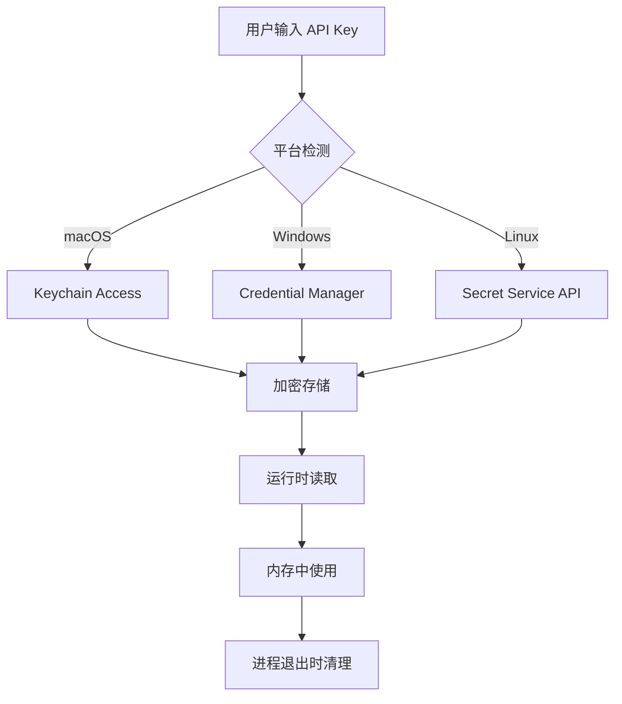

### 10.2 安全考虑

| 风险 | 缓解措施 |
|------|----------|
| API Key 泄露 | 使用系统 Keychain 存储，不存储在配置文件 |
| 网络中间人攻击 | 强制使用 TLS 1.3，验证 SSL 证书 |
| 音频数据隐私 | 音频仅在内存中处理，不持久化存储 |
| 权限滥用 | 最小权限原则，仅请求必要的系统权限 |

## 11. 性能优化

### 11.1 音频处理优化

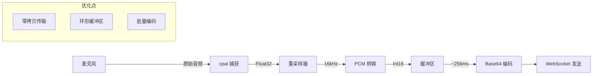

### 11.2 内存管理

- 使用环形缓冲区避免频繁内存分配
- 音频数据使用零拷贝传输
- 转录文本使用 `String` 池化

### 11.3 延迟优化目标

| 阶段 | 目标延迟 |
|------|----------|
| 音频捕获 | < 20ms |
| 编码传输 | < 30ms |
| API 处理 | ~150ms |
| 文本插入 | < 50ms |
| **总延迟** | **< 250ms** |

## 12. 测试策略

### 12.1 测试类型

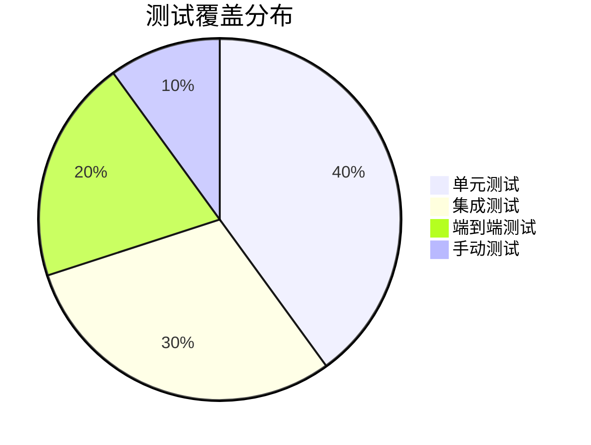

### 12.2 关键测试场景

| 场景 | 测试内容 |
|------|----------|
| 正常录音 | 快捷键触发、音频捕获、转录返回、文本插入 |
| 网络中断 | WebSocket 断开重连、离线提示 |
| 权限拒绝 | 麦克风权限被拒后的处理 |
| 目标应用不可用 | 剪贴板降级方案 |
| 长时间录音 | 内存使用、转录累积 |
| 多语言切换 | 中/英/日等语言转录准确性 |

## 13. 部署与发布

### 13.1 构建流程

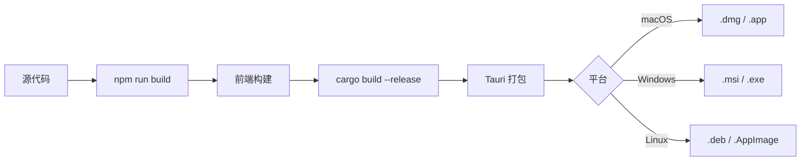

### 13.2 发布清单

- [ ] 版本号更新
- [ ] CHANGELOG 更新
- [ ] 代码签名（macOS: Developer ID, Windows: Authenticode）
- [ ] 公证（macOS Notarization）
- [ ] 自动更新配置
- [ ] 发布说明

## 14. 参考资料

### 官方文档

- [Tauri 2.0 Documentation](https://v2.tauri.app/)
- [ElevenLabs Scribe v2 Realtime API](https://elevenlabs.io/docs/api-reference/speech-to-text/v-1-speech-to-text-realtime)
- [Svelte 5 Documentation](https://svelte.dev/docs)
- [cpal - Rust Audio I/O](https://docs.rs/cpal/latest/cpal/)
- [enigo - Input Simulation](https://docs.rs/enigo/latest/enigo/)

### 相关项目

- [Wispr Flow](https://wisprflow.ai/) - 参考竞品
- [tauri-plugin-global-shortcut](https://github.com/tauri-apps/plugins-workspace/tree/v2/plugins/global-shortcut)
- [tauri-plugin-mic-recorder](https://github.com/ayangweb/tauri-plugin-mic-recorder)

---

**文档版本**: 1.0.0
**最后更新**: 2026-01-18
**作者**: AI Assistant
