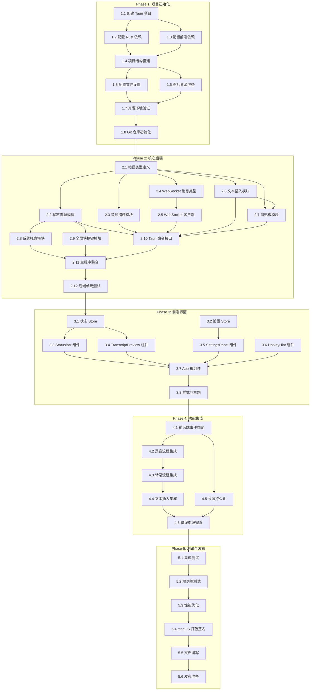

# Speech-to-Text 应用实现计划

## 1. 项目概述

### 1.1 项目目标

基于 `0002-design.md` 中的设计，实现一个类似 Wispr Flow 的语音转文字桌面应用，使用 Tauri 2 + Svelte 5 + ElevenLabs Scribe v2 Realtime API。

### 1.2 里程碑总览

```
┌─────────────────────────────────────────────────────────────────────────────┐
│                              项目实现计划                                    │
├─────────────────────────────────────────────────────────────────────────────┤
│                                                                             │
│  Phase 1         Phase 2         Phase 3         Phase 4         Phase 5   │
│  项目初始化       核心后端        前端界面        功能集成        测试发布   │
│  ━━━━━━━━        ━━━━━━━━        ━━━━━━━━        ━━━━━━━━        ━━━━━━━━   │
│  [████████]      [████████]      [████████]      [████████]      [████████] │
│                                                                             │
│  任务数: 8        任务数: 12      任务数: 8       任务数: 6       任务数: 6  │
│                                                                             │
└─────────────────────────────────────────────────────────────────────────────┘
```

### 1.3 任务依赖关系图



---

## 2. Phase 1: 项目初始化

### 2.1 任务清单

| 任务 ID | 任务名称 | 优先级 | 依赖 |
|---------|----------|--------|------|
| 1.1 | 创建 Tauri 2 项目 | P0 | - |
| 1.2 | 配置 Rust 依赖 | P0 | 1.1 |
| 1.3 | 配置前端依赖 | P0 | 1.1 |
| 1.4 | 项目结构搭建 | P0 | 1.2, 1.3 |
| 1.5 | 配置文件设置 | P1 | 1.4 |
| 1.6 | 图标资源准备 | P1 | 1.4 |
| 1.7 | 开发环境验证 | P0 | 1.5, 1.6 |
| 1.8 | Git 仓库初始化 | P1 | 1.7 |

### 2.2 任务详情

#### 任务 1.1: 创建 Tauri 2 项目

**目标**: 使用 Tauri CLI 创建新项目

**执行步骤**:
```bash
# 1. 安装 Tauri CLI
npm install -g @tauri-apps/cli

# 2. 创建项目
npm create tauri-app@latest speech-to-text -- \
  --template svelte-ts \
  --manager npm

# 3. 进入项目目录
cd speech-to-text
```

**验收标准**:
- [ ] 项目目录结构正确生成
- [ ] `npm run tauri dev` 能够启动开发环境
- [ ] 空白窗口正常显示

---

#### 任务 1.2: 配置 Rust 依赖

**目标**: 在 `src-tauri/Cargo.toml` 中添加所有必需的依赖

**配置内容**:
```toml
[package]
name = "speech-to-text"
version = "0.1.0"
edition = "2021"

[dependencies]
tauri = { version = "2.9", features = ["tray-icon"] }
tauri-plugin-global-shortcut = "2.3"
tokio = { version = "1.49", features = ["full"] }
tokio-tungstenite = { version = "0.28", features = ["native-tls"] }
cpal = "0.17"
enigo = "0.6"
arboard = "3.6"
serde = { version = "1.0", features = ["derive"] }
serde_json = "1.0"
base64 = "0.22"
futures-util = "0.3"
http = "1.0"
thiserror = "2.0"
log = "0.4"
env_logger = "0.11"
parking_lot = "0.12"

[build-dependencies]
tauri-build = "2.9"

[features]
default = ["custom-protocol"]
custom-protocol = ["tauri/custom-protocol"]
```

**验收标准**:
- [ ] `cargo check` 无错误
- [ ] 所有依赖版本正确

---

#### 任务 1.3: 配置前端依赖

**目标**: 更新 `package.json` 添加前端依赖

**配置内容**:
```json
{
  "name": "speech-to-text",
  "version": "0.1.0",
  "type": "module",
  "scripts": {
    "dev": "vite",
    "build": "vite build",
    "preview": "vite preview",
    "tauri": "tauri",
    "check": "svelte-check --tsconfig ./tsconfig.json"
  },
  "dependencies": {
    "@tauri-apps/api": "^2.9.1",
    "@tauri-apps/plugin-global-shortcut": "^2.3.0"
  },
  "devDependencies": {
    "@sveltejs/vite-plugin-svelte": "^5.0.0",
    "@tauri-apps/cli": "^2.9.6",
    "@tsconfig/svelte": "^5.0.0",
    "svelte": "^5.46.4",
    "svelte-check": "^4.0.0",
    "typescript": "^5.7.0",
    "vite": "^7.3.1"
  }
}
```

**执行命令**:
```bash
npm install
```

**验收标准**:
- [ ] `npm install` 无错误
- [ ] `npm run dev` 正常启动

---

#### 任务 1.4: 项目结构搭建

**目标**: 创建设计文档中定义的目录结构

**执行步骤**:
```bash
# Rust 后端结构
mkdir -p src-tauri/src/{audio,transcriber,input}
touch src-tauri/src/error.rs
touch src-tauri/src/state.rs
touch src-tauri/src/commands.rs
touch src-tauri/src/tray.rs
touch src-tauri/src/hotkey.rs
touch src-tauri/src/audio/{mod.rs,capture.rs}
touch src-tauri/src/transcriber/{mod.rs,client.rs,message.rs}
touch src-tauri/src/input/{mod.rs,inserter.rs,clipboard.rs}

# 前端结构
mkdir -p src/lib/{stores,components,utils}
touch src/lib/stores/{appState.ts,settings.ts}
touch src/lib/components/{StatusBar.svelte,TranscriptPreview.svelte,SettingsPanel.svelte,HotkeyHint.svelte}
touch src/lib/utils/tauri.ts

# 配置文件
mkdir -p src-tauri/{capabilities,icons}
touch src-tauri/capabilities/main.json
```

**验收标准**:
- [ ] 目录结构与设计文档一致
- [ ] 所有占位文件创建完成

---

#### 任务 1.5: 配置文件设置

**目标**: 配置 Tauri 和前端构建配置

**文件 1: `src-tauri/tauri.conf.json`**
```json
{
  "$schema": "https://schema.tauri.app/config/2",
  "productName": "Speech to Text",
  "identifier": "com.example.speech-to-text",
  "version": "0.1.0",
  "build": {
    "frontendDist": "../dist",
    "devUrl": "http://localhost:5173",
    "beforeDevCommand": "npm run dev",
    "beforeBuildCommand": "npm run build"
  },
  "app": {
    "withGlobalTauri": true,
    "trayIcon": {
      "iconPath": "icons/tray-idle.png",
      "iconAsTemplate": true,
      "menuOnLeftClick": false
    },
    "windows": [
      {
        "label": "main",
        "title": "Speech to Text",
        "width": 400,
        "height": 350,
        "minWidth": 350,
        "minHeight": 300,
        "visible": false,
        "center": true,
        "resizable": true,
        "decorations": true,
        "alwaysOnTop": false,
        "skipTaskbar": true
      }
    ],
    "security": {
      "csp": "default-src 'self'; connect-src 'self' wss://api.elevenlabs.io; style-src 'self' 'unsafe-inline'",
      "capabilities": ["main-capability"]
    }
  },
  "bundle": {
    "active": true,
    "targets": ["dmg", "app"],
    "icon": [
      "icons/icon.icns",
      "icons/icon.ico",
      "icons/icon.png"
    ],
    "macOS": {
      "entitlements": "./entitlements.plist"
    }
  },
  "plugins": {
    "global-shortcut": {}
  }
}
```

**文件 2: `src-tauri/capabilities/main.json`**
```json
{
  "identifier": "main-capability",
  "description": "Main window capability",
  "windows": ["main"],
  "permissions": [
    "core:default",
    "core:window:default",
    "core:window:allow-show",
    "core:window:allow-hide",
    "core:window:allow-set-focus",
    "core:event:default",
    "global-shortcut:default"
  ]
}
```

**文件 3: `src-tauri/entitlements.plist`**
```xml
<?xml version="1.0" encoding="UTF-8"?>
<!DOCTYPE plist PUBLIC "-//Apple//DTD PLIST 1.0//EN" "http://www.apple.com/DTDs/PropertyList-1.0.dtd">
<plist version="1.0">
<dict>
    <key>com.apple.security.app-sandbox</key>
    <false/>
    <key>com.apple.security.device.audio-input</key>
    <true/>
    <key>com.apple.security.network.client</key>
    <true/>
</dict>
</plist>
```

**文件 4: `vite.config.ts`**
```typescript
import { defineConfig } from 'vite';
import { svelte } from '@sveltejs/vite-plugin-svelte';

export default defineConfig({
  plugins: [svelte()],
  clearScreen: false,
  server: {
    port: 5173,
    strictPort: true,
  },
  envPrefix: ['VITE_', 'TAURI_'],
  build: {
    target: ['es2021', 'chrome100', 'safari13'],
    minify: !process.env.TAURI_DEBUG ? 'esbuild' : false,
    sourcemap: !!process.env.TAURI_DEBUG,
  },
});
```

**验收标准**:
- [ ] 配置文件语法正确
- [ ] `npm run tauri dev` 能正常启动

---

#### 任务 1.6: 图标资源准备

**目标**: 准备应用图标和托盘图标

**所需图标**:
| 文件名 | 尺寸 | 用途 |
|--------|------|------|
| `icon.png` | 512x512 | 通用图标 |
| `icon.icns` | 多尺寸 | macOS 应用图标 |
| `icon.ico` | 多尺寸 | Windows 应用图标 |
| `tray-idle.png` | 22x22 @2x | 托盘图标（空闲状态） |
| `tray-recording.png` | 22x22 @2x | 托盘图标（录音状态） |

**执行步骤**:
```bash
# 使用 Tauri 图标生成工具
npm run tauri icon src-tauri/icons/app-icon.png

# 手动创建托盘图标（需设计师或使用图标工具）
```

**验收标准**:
- [ ] 所有图标文件存在于 `src-tauri/icons/` 目录
- [ ] 图标尺寸和格式正确

---

#### 任务 1.7: 开发环境验证

**目标**: 验证完整的开发环境配置

**验证清单**:
```bash
# 1. Rust 编译检查
cd src-tauri && cargo check

# 2. 前端编译检查
npm run check

# 3. 开发服务器启动
npm run tauri dev

# 4. 生产构建测试
npm run tauri build
```

**验收标准**:
- [ ] Rust 编译无错误
- [ ] TypeScript 类型检查通过
- [ ] 开发模式正常启动
- [ ] 生产构建成功

---

#### 任务 1.8: Git 仓库初始化

**目标**: 初始化版本控制

**执行步骤**:
```bash
# 1. 初始化 Git
git init

# 2. 创建 .gitignore
cat > .gitignore << 'EOF'
# Rust
/src-tauri/target/
Cargo.lock

# Node
node_modules/
dist/

# IDE
.idea/
.vscode/
*.swp

# macOS
.DS_Store

# Logs
*.log

# Environment
.env
.env.local
EOF

# 3. 初始提交
git add .
git commit -m "chore: initial project setup"
```

**验收标准**:
- [ ] Git 仓库初始化完成
- [ ] `.gitignore` 配置正确
- [ ] 初始提交成功

---

## 3. Phase 2: 核心后端实现

### 3.1 任务清单

| 任务 ID | 任务名称 | 优先级 | 依赖 |
|---------|----------|--------|------|
| 2.1 | 错误类型定义 | P0 | 1.8 |
| 2.2 | 状态管理模块 | P0 | 2.1 |
| 2.3 | 音频捕获模块 | P0 | 2.1 |
| 2.4 | WebSocket 消息类型 | P0 | 2.1 |
| 2.5 | WebSocket 客户端 | P0 | 2.4 |
| 2.6 | 文本插入模块 | P1 | 2.1 |
| 2.7 | 剪贴板模块 | P1 | 2.6 |
| 2.8 | 系统托盘模块 | P1 | 2.2 |
| 2.9 | 全局快捷键模块 | P1 | 2.2 |
| 2.10 | Tauri 命令接口 | P0 | 2.2-2.7 |
| 2.11 | 主程序整合 | P0 | 2.8-2.10 |
| 2.12 | 后端单元测试 | P1 | 2.11 |

### 3.2 任务详情

#### 任务 2.1: 错误类型定义

**文件**: `src-tauri/src/error.rs`

```rust
use thiserror::Error;
use serde::Serialize;

#[derive(Error, Debug)]
pub enum AppError {
    #[error("Audio error: {0}")]
    Audio(String),

    #[error("WebSocket error: {0}")]
    WebSocket(String),

    #[error("API error: {0}")]
    Api(String),

    #[error("Input error: {0}")]
    Input(String),

    #[error("Permission error: {0}")]
    Permission(String),

    #[error("Configuration error: {0}")]
    Config(String),

    #[error("State error: {0}")]
    State(String),
}

// 为 Tauri 命令实现序列化
impl Serialize for AppError {
    fn serialize<S>(&self, serializer: S) -> Result<S::Ok, S::Error>
    where
        S: serde::Serializer,
    {
        serializer.serialize_str(&self.to_string())
    }
}

// 错误转换实现
impl From<cpal::BuildStreamError> for AppError {
    fn from(err: cpal::BuildStreamError) -> Self {
        AppError::Audio(err.to_string())
    }
}

impl From<tokio_tungstenite::tungstenite::Error> for AppError {
    fn from(err: tokio_tungstenite::tungstenite::Error) -> Self {
        AppError::WebSocket(err.to_string())
    }
}

impl From<enigo::InputError> for AppError {
    fn from(err: enigo::InputError) -> Self {
        AppError::Input(err.to_string())
    }
}

impl From<arboard::Error> for AppError {
    fn from(err: arboard::Error) -> Self {
        AppError::Input(format!("Clipboard error: {}", err))
    }
}

pub type Result<T> = std::result::Result<T, AppError>;
```

**验收标准**:
- [ ] 所有错误类型定义完整
- [ ] 错误转换实现正确
- [ ] 可序列化用于 Tauri 命令

---

#### 任务 2.2: 状态管理模块

**文件**: `src-tauri/src/state.rs`

```rust
use parking_lot::RwLock;
use serde::{Deserialize, Serialize};
use std::sync::Arc;
use std::time::Instant;

#[derive(Debug, Clone, Serialize, Deserialize)]
pub struct AppSettings {
    pub api_key: String,
    pub language_code: String,
    pub sample_rate: u32,
    pub vad_enabled: bool,
    pub vad_silence_threshold: f32,
    pub hotkey: String,
}

impl Default for AppSettings {
    fn default() -> Self {
        Self {
            api_key: String::new(),
            language_code: "zh".to_string(),
            sample_rate: 16000,
            vad_enabled: true,
            vad_silence_threshold: 1.5,
            hotkey: "CommandOrControl+Shift+\\".to_string(),
        }
    }
}

#[derive(Debug, Clone, Copy, PartialEq, Eq, Serialize)]
pub enum RecordingState {
    Idle,
    Recording,
    Processing,
}

#[derive(Debug, Clone, Copy, PartialEq, Eq, Serialize)]
pub enum ConnectionStatus {
    Disconnected,
    Connecting,
    Connected,
    Error,
}

pub struct AppState {
    pub recording_state: RwLock<RecordingState>,
    pub connection_status: RwLock<ConnectionStatus>,
    pub transcript_buffer: RwLock<String>,
    pub recording_start_time: RwLock<Option<Instant>>,
    pub settings: RwLock<AppSettings>,
}

impl AppState {
    pub fn new() -> Self {
        Self {
            recording_state: RwLock::new(RecordingState::Idle),
            connection_status: RwLock::new(ConnectionStatus::Disconnected),
            transcript_buffer: RwLock::new(String::new()),
            recording_start_time: RwLock::new(None),
            settings: RwLock::new(AppSettings::default()),
        }
    }

    pub fn is_recording(&self) -> bool {
        *self.recording_state.read() == RecordingState::Recording
    }

    pub fn set_recording(&self, recording: bool) {
        let mut state = self.recording_state.write();
        *state = if recording {
            RecordingState::Recording
        } else {
            RecordingState::Idle
        };

        if recording {
            *self.recording_start_time.write() = Some(Instant::now());
        } else {
            *self.recording_start_time.write() = None;
        }
    }

    pub fn append_transcript(&self, text: &str) {
        let mut buffer = self.transcript_buffer.write();
        buffer.push_str(text);
    }

    pub fn take_transcript(&self) -> String {
        let mut buffer = self.transcript_buffer.write();
        std::mem::take(&mut *buffer)
    }

    pub fn clear_transcript(&self) {
        let mut buffer = self.transcript_buffer.write();
        buffer.clear();
    }

    pub fn get_recording_duration_ms(&self) -> Option<u64> {
        self.recording_start_time
            .read()
            .map(|start| start.elapsed().as_millis() as u64)
    }
}

pub type AppStateHandle = Arc<AppState>;

pub fn create_app_state() -> AppStateHandle {
    Arc::new(AppState::new())
}
```

**验收标准**:
- [ ] 状态管理线程安全
- [ ] 支持并发读写
- [ ] 状态转换正确

---

#### 任务 2.3: 音频捕获模块

**文件**: `src-tauri/src/audio/mod.rs`
```rust
mod capture;
pub use capture::*;
```

**文件**: `src-tauri/src/audio/capture.rs`

```rust
use cpal::traits::{DeviceTrait, HostTrait, StreamTrait};
use cpal::{SampleRate, StreamConfig};
use std::sync::atomic::{AtomicBool, Ordering};
use std::sync::Arc;
use tokio::sync::mpsc;

use crate::error::{AppError, Result};

pub struct AudioCapture {
    stream: Option<cpal::Stream>,
    is_recording: Arc<AtomicBool>,
}

impl AudioCapture {
    pub fn new() -> Self {
        Self {
            stream: None,
            is_recording: Arc::new(AtomicBool::new(false)),
        }
    }

    pub fn start(
        &mut self,
        sample_rate: u32,
        audio_tx: mpsc::Sender<Vec<i16>>,
    ) -> Result<()> {
        let host = cpal::default_host();
        let device = host
            .default_input_device()
            .ok_or_else(|| AppError::Audio("No input device available".to_string()))?;

        log::info!("Using audio device: {}", device.name().unwrap_or_default());

        // 获取设备支持的配置
        let supported_config = device
            .supported_input_configs()
            .map_err(|e| AppError::Audio(e.to_string()))?
            .find(|c| {
                c.channels() == 1
                    && c.min_sample_rate().0 <= sample_rate
                    && c.max_sample_rate().0 >= sample_rate
            })
            .ok_or_else(|| {
                AppError::Audio(format!(
                    "Device doesn't support mono {}Hz",
                    sample_rate
                ))
            })?;

        let config = StreamConfig {
            channels: 1,
            sample_rate: SampleRate(sample_rate),
            buffer_size: cpal::BufferSize::Default,
        };

        let is_recording = self.is_recording.clone();
        is_recording.store(true, Ordering::SeqCst);

        let err_fn = |err| log::error!("Audio stream error: {}", err);

        // 根据设备采样格式构建流
        let sample_format = supported_config.sample_format();

        let stream = match sample_format {
            cpal::SampleFormat::F32 => {
                let tx = audio_tx.clone();
                let recording = is_recording.clone();
                device.build_input_stream(
                    &config,
                    move |data: &[f32], _| {
                        if recording.load(Ordering::SeqCst) {
                            let pcm16: Vec<i16> = data
                                .iter()
                                .map(|&s| {
                                    let clamped = s.clamp(-1.0, 1.0);
                                    (clamped * 32767.0) as i16
                                })
                                .collect();
                            let _ = tx.blocking_send(pcm16);
                        }
                    },
                    err_fn,
                    None,
                )?
            }
            cpal::SampleFormat::I16 => {
                let tx = audio_tx.clone();
                let recording = is_recording.clone();
                device.build_input_stream(
                    &config,
                    move |data: &[i16], _| {
                        if recording.load(Ordering::SeqCst) {
                            let _ = tx.blocking_send(data.to_vec());
                        }
                    },
                    err_fn,
                    None,
                )?
            }
            _ => {
                return Err(AppError::Audio(format!(
                    "Unsupported sample format: {:?}",
                    sample_format
                )));
            }
        };

        stream.play().map_err(|e| AppError::Audio(e.to_string()))?;
        self.stream = Some(stream);

        log::info!("Audio capture started at {}Hz", sample_rate);
        Ok(())
    }

    pub fn stop(&mut self) {
        self.is_recording.store(false, Ordering::SeqCst);
        if let Some(stream) = self.stream.take() {
            drop(stream);
        }
        log::info!("Audio capture stopped");
    }

    pub fn is_recording(&self) -> bool {
        self.is_recording.load(Ordering::SeqCst)
    }
}

impl Drop for AudioCapture {
    fn drop(&mut self) {
        self.stop();
    }
}
```

**验收标准**:
- [ ] 支持 16kHz 单声道音频捕获
- [ ] 正确转换为 16-bit PCM
- [ ] 线程安全的开始/停止控制

---

#### 任务 2.4: WebSocket 消息类型

**文件**: `src-tauri/src/transcriber/mod.rs`
```rust
mod client;
mod message;

pub use client::*;
pub use message::*;
```

**文件**: `src-tauri/src/transcriber/message.rs`

```rust
use serde::{Deserialize, Serialize};

// ============ 发送消息类型 ============

#[derive(Debug, Serialize)]
pub struct SessionConfigMessage {
    pub message_type: &'static str,
    pub sample_rate: u32,
    pub language_code: String,
    pub vad_commit_strategy: bool,
    #[serde(skip_serializing_if = "Option::is_none")]
    pub vad_silence_threshold_secs: Option<f32>,
    #[serde(skip_serializing_if = "Option::is_none")]
    pub include_timestamps: Option<bool>,
}

impl SessionConfigMessage {
    pub fn new(language_code: String, vad_enabled: bool, vad_threshold: f32) -> Self {
        Self {
            message_type: "session_config",
            sample_rate: 16000,
            language_code,
            vad_commit_strategy: vad_enabled,
            vad_silence_threshold_secs: if vad_enabled {
                Some(vad_threshold)
            } else {
                None
            },
            include_timestamps: Some(true),
        }
    }
}

#[derive(Debug, Serialize)]
pub struct AudioChunkMessage {
    pub message_type: &'static str,
    pub audio_base_64: String,
    pub commit: bool,
    pub sample_rate: u32,
}

impl AudioChunkMessage {
    pub fn new(audio_data: &[u8], commit: bool) -> Self {
        use base64::{engine::general_purpose::STANDARD, Engine};
        Self {
            message_type: "input_audio_chunk",
            audio_base_64: STANDARD.encode(audio_data),
            commit,
            sample_rate: 16000,
        }
    }
}

#[derive(Debug, Serialize)]
pub struct CommitMessage {
    pub message_type: &'static str,
}

impl CommitMessage {
    pub fn new() -> Self {
        Self {
            message_type: "commit",
        }
    }
}

// ============ 接收消息类型 ============

#[derive(Debug, Deserialize)]
#[serde(tag = "message_type")]
pub enum ServerMessage {
    #[serde(rename = "session_started")]
    SessionStarted(SessionStartedMessage),

    #[serde(rename = "partial_transcript")]
    PartialTranscript(TranscriptMessage),

    #[serde(rename = "committed_transcript")]
    CommittedTranscript(TranscriptMessage),

    #[serde(rename = "error")]
    Error(ErrorMessage),

    #[serde(other)]
    Unknown,
}

#[derive(Debug, Deserialize)]
pub struct SessionStartedMessage {
    pub session_id: String,
    pub config: SessionConfig,
}

#[derive(Debug, Deserialize)]
pub struct SessionConfig {
    pub sample_rate: u32,
    pub audio_format: String,
    pub language_code: String,
    pub model_id: String,
    pub vad_commit_strategy: bool,
    pub vad_silence_threshold_secs: f32,
    pub include_timestamps: bool,
}

#[derive(Debug, Deserialize)]
pub struct TranscriptMessage {
    pub text: String,
    #[serde(default)]
    pub timestamp: Option<f64>,
}

#[derive(Debug, Deserialize)]
pub struct ErrorMessage {
    pub error: String,
    #[serde(default)]
    pub code: Option<String>,
}
```

**验收标准**:
- [ ] 所有消息类型正确定义
- [ ] JSON 序列化/反序列化正确
- [ ] 支持 ElevenLabs API 所有消息格式

---

#### 任务 2.5: WebSocket 客户端

**文件**: `src-tauri/src/transcriber/client.rs`

```rust
use futures_util::{SinkExt, StreamExt};
use tokio::sync::mpsc;
use tokio_tungstenite::{connect_async, tungstenite::Message};

use super::message::*;
use crate::error::{AppError, Result};

const API_URL: &str = "wss://api.elevenlabs.io/v1/speech-to-text/realtime";

pub struct TranscriberClient {
    api_key: String,
    language_code: String,
    vad_enabled: bool,
    vad_threshold: f32,
}

impl TranscriberClient {
    pub fn new(
        api_key: String,
        language_code: String,
        vad_enabled: bool,
        vad_threshold: f32,
    ) -> Self {
        Self {
            api_key,
            language_code,
            vad_enabled,
            vad_threshold,
        }
    }

    pub async fn run(
        &self,
        mut audio_rx: mpsc::Receiver<Vec<i16>>,
        transcript_tx: mpsc::Sender<String>,
        mut shutdown_rx: mpsc::Receiver<()>,
    ) -> Result<()> {
        // 构建 WebSocket 请求
        let request = http::Request::builder()
            .uri(API_URL)
            .header("xi-api-key", &self.api_key)
            .header("Host", "api.elevenlabs.io")
            .header("Connection", "Upgrade")
            .header("Upgrade", "websocket")
            .header("Sec-WebSocket-Version", "13")
            .header(
                "Sec-WebSocket-Key",
                tokio_tungstenite::tungstenite::handshake::client::generate_key(),
            )
            .body(())
            .map_err(|e| AppError::WebSocket(e.to_string()))?;

        log::info!("Connecting to ElevenLabs API...");

        let (ws_stream, _) = connect_async(request)
            .await
            .map_err(|e| AppError::WebSocket(e.to_string()))?;

        let (mut write, mut read) = ws_stream.split();

        // 发送会话配置
        let config = SessionConfigMessage::new(
            self.language_code.clone(),
            self.vad_enabled,
            self.vad_threshold,
        );
        let config_json = serde_json::to_string(&config)
            .map_err(|e| AppError::WebSocket(e.to_string()))?;
        write
            .send(Message::Text(config_json))
            .await
            .map_err(|e| AppError::WebSocket(e.to_string()))?;

        log::info!("Session config sent, waiting for response...");

        // 处理消息的任务
        let tx = transcript_tx.clone();
        let read_task = tokio::spawn(async move {
            while let Some(msg_result) = read.next().await {
                match msg_result {
                    Ok(Message::Text(text)) => {
                        match serde_json::from_str::<ServerMessage>(&text) {
                            Ok(ServerMessage::SessionStarted(session)) => {
                                log::info!(
                                    "Session started: {} (model: {})",
                                    session.session_id,
                                    session.config.model_id
                                );
                            }
                            Ok(ServerMessage::PartialTranscript(transcript)) => {
                                log::debug!("Partial: {}", transcript.text);
                                // 部分转录可以用于实时预览
                            }
                            Ok(ServerMessage::CommittedTranscript(transcript)) => {
                                log::info!("Committed: {}", transcript.text);
                                let _ = tx.send(transcript.text).await;
                            }
                            Ok(ServerMessage::Error(err)) => {
                                log::error!("API error: {} ({:?})", err.error, err.code);
                            }
                            Ok(ServerMessage::Unknown) => {
                                log::warn!("Unknown message: {}", text);
                            }
                            Err(e) => {
                                log::error!("Failed to parse message: {}", e);
                            }
                        }
                    }
                    Ok(Message::Close(_)) => {
                        log::info!("WebSocket closed by server");
                        break;
                    }
                    Err(e) => {
                        log::error!("WebSocket error: {}", e);
                        break;
                    }
                    _ => {}
                }
            }
        });

        // 发送音频的任务
        let write_task = tokio::spawn(async move {
            while let Some(pcm_data) = audio_rx.recv().await {
                // 转换为字节
                let bytes: Vec<u8> = pcm_data
                    .iter()
                    .flat_map(|&s| s.to_le_bytes())
                    .collect();

                let msg = AudioChunkMessage::new(&bytes, false);
                let json = match serde_json::to_string(&msg) {
                    Ok(j) => j,
                    Err(e) => {
                        log::error!("Failed to serialize audio chunk: {}", e);
                        continue;
                    }
                };

                if write.send(Message::Text(json)).await.is_err() {
                    log::error!("Failed to send audio chunk");
                    break;
                }
            }

            // 发送最终提交
            let commit = CommitMessage::new();
            if let Ok(json) = serde_json::to_string(&commit) {
                let _ = write.send(Message::Text(json)).await;
            }

            // 关闭连接
            let _ = write.close().await;
        });

        // 等待任务完成或关闭信号
        tokio::select! {
            _ = read_task => {
                log::info!("Read task completed");
            }
            _ = write_task => {
                log::info!("Write task completed");
            }
            _ = shutdown_rx.recv() => {
                log::info!("Shutdown signal received");
            }
        }

        Ok(())
    }
}
```

**验收标准**:
- [ ] WebSocket 连接成功建立
- [ ] 消息发送/接收正确
- [ ] 支持优雅关闭

---

#### 任务 2.6: 文本插入模块

**文件**: `src-tauri/src/input/mod.rs`
```rust
mod clipboard;
mod inserter;

pub use clipboard::*;
pub use inserter::*;
```

**文件**: `src-tauri/src/input/inserter.rs`

```rust
use enigo::{Direction, Enigo, Key, Keyboard, Settings};
use std::thread;
use std::time::Duration;

use super::ClipboardManager;
use crate::error::{AppError, Result};

pub enum InsertResult {
    Inserted,
    CopiedToClipboard,
}

pub struct TextInserter {
    enigo: Enigo,
    clipboard: ClipboardManager,
}

impl TextInserter {
    pub fn new() -> Result<Self> {
        let enigo = Enigo::new(&Settings::default())
            .map_err(|e| AppError::Input(e.to_string()))?;
        let clipboard = ClipboardManager::new()?;

        Ok(Self { enigo, clipboard })
    }

    /// 通过剪贴板粘贴的方式插入文本
    /// 这是最可靠的跨应用文本插入方式
    pub fn insert_text(&mut self, text: &str) -> Result<InsertResult> {
        if text.is_empty() {
            return Ok(InsertResult::Inserted);
        }

        // 保存原剪贴板内容
        let original = self.clipboard.get_text().ok();

        // 设置新内容
        self.clipboard.set_text(text)?;

        // 等待剪贴板更新
        thread::sleep(Duration::from_millis(50));

        // 模拟 Cmd+V (macOS) / Ctrl+V (Windows/Linux)
        #[cfg(target_os = "macos")]
        let modifier = Key::Meta;
        #[cfg(not(target_os = "macos"))]
        let modifier = Key::Control;

        self.enigo
            .key(modifier, Direction::Press)
            .map_err(|e| AppError::Input(e.to_string()))?;

        thread::sleep(Duration::from_millis(10));

        self.enigo
            .key(Key::Unicode('v'), Direction::Click)
            .map_err(|e| AppError::Input(e.to_string()))?;

        thread::sleep(Duration::from_millis(10));

        self.enigo
            .key(modifier, Direction::Release)
            .map_err(|e| AppError::Input(e.to_string()))?;

        // 等待粘贴完成
        thread::sleep(Duration::from_millis(100));

        // 恢复原剪贴板内容
        if let Some(original_text) = original {
            thread::sleep(Duration::from_millis(50));
            let _ = self.clipboard.set_text(&original_text);
        }

        log::info!("Text inserted via clipboard paste");
        Ok(InsertResult::Inserted)
    }

    /// 仅复制到剪贴板（降级方案）
    pub fn copy_to_clipboard(&mut self, text: &str) -> Result<InsertResult> {
        self.clipboard.set_text(text)?;
        log::info!("Text copied to clipboard (fallback)");
        Ok(InsertResult::CopiedToClipboard)
    }
}
```

**验收标准**:
- [ ] 通过剪贴板粘贴方式工作
- [ ] 正确恢复原剪贴板内容
- [ ] 支持 macOS/Windows/Linux

---

#### 任务 2.7: 剪贴板模块

**文件**: `src-tauri/src/input/clipboard.rs`

```rust
use arboard::Clipboard;

use crate::error::{AppError, Result};

pub struct ClipboardManager {
    clipboard: Clipboard,
}

impl ClipboardManager {
    pub fn new() -> Result<Self> {
        let clipboard = Clipboard::new()
            .map_err(|e| AppError::Input(format!("Failed to access clipboard: {}", e)))?;
        Ok(Self { clipboard })
    }

    pub fn get_text(&mut self) -> Result<String> {
        self.clipboard
            .get_text()
            .map_err(|e| AppError::Input(format!("Failed to get clipboard text: {}", e)))
    }

    pub fn set_text(&mut self, text: &str) -> Result<()> {
        self.clipboard
            .set_text(text)
            .map_err(|e| AppError::Input(format!("Failed to set clipboard text: {}", e)))
    }

    pub fn clear(&mut self) -> Result<()> {
        self.clipboard
            .clear()
            .map_err(|e| AppError::Input(format!("Failed to clear clipboard: {}", e)))
    }
}
```

**验收标准**:
- [ ] 剪贴板读写正常
- [ ] 错误处理完善

---

#### 任务 2.8: 系统托盘模块

**文件**: `src-tauri/src/tray.rs`

```rust
use tauri::{
    image::Image,
    menu::{Menu, MenuItem},
    tray::{TrayIcon, TrayIconBuilder},
    AppHandle, Manager, Runtime,
};

use crate::error::Result;

pub fn create_tray<R: Runtime>(app: &AppHandle<R>) -> Result<TrayIcon<R>> {
    let toggle = MenuItem::with_id(app, "toggle", "Start Recording (⌘⇧\\)", true, None::<&str>)
        .map_err(|e| crate::error::AppError::Config(e.to_string()))?;

    let settings = MenuItem::with_id(app, "settings", "Settings...", true, None::<&str>)
        .map_err(|e| crate::error::AppError::Config(e.to_string()))?;

    let about = MenuItem::with_id(app, "about", "About", true, None::<&str>)
        .map_err(|e| crate::error::AppError::Config(e.to_string()))?;

    let quit = MenuItem::with_id(app, "quit", "Quit", true, None::<&str>)
        .map_err(|e| crate::error::AppError::Config(e.to_string()))?;

    let menu = Menu::with_items(app, &[&toggle, &settings, &about, &quit])
        .map_err(|e| crate::error::AppError::Config(e.to_string()))?;

    let tray = TrayIconBuilder::new()
        .icon(app.default_window_icon().unwrap().clone())
        .menu(&menu)
        .menu_on_left_click(false)
        .tooltip("Speech to Text")
        .on_menu_event(move |app, event| {
            match event.id.as_ref() {
                "quit" => {
                    app.exit(0);
                }
                "toggle" => {
                    let _ = app.emit("toggle-recording", ());
                }
                "settings" => {
                    if let Some(window) = app.get_webview_window("main") {
                        let _ = window.show();
                        let _ = window.set_focus();
                    }
                }
                "about" => {
                    // TODO: 显示关于对话框
                    log::info!("About clicked");
                }
                _ => {}
            }
        })
        .build(app)
        .map_err(|e| crate::error::AppError::Config(e.to_string()))?;

    Ok(tray)
}

pub fn update_tray_menu<R: Runtime>(
    tray: &TrayIcon<R>,
    app: &AppHandle<R>,
    is_recording: bool,
) -> Result<()> {
    let toggle_text = if is_recording {
        "Stop Recording (⌘⇧\\)"
    } else {
        "Start Recording (⌘⇧\\)"
    };

    let toggle = MenuItem::with_id(app, "toggle", toggle_text, true, None::<&str>)
        .map_err(|e| crate::error::AppError::Config(e.to_string()))?;

    let settings = MenuItem::with_id(app, "settings", "Settings...", true, None::<&str>)
        .map_err(|e| crate::error::AppError::Config(e.to_string()))?;

    let about = MenuItem::with_id(app, "about", "About", true, None::<&str>)
        .map_err(|e| crate::error::AppError::Config(e.to_string()))?;

    let quit = MenuItem::with_id(app, "quit", "Quit", true, None::<&str>)
        .map_err(|e| crate::error::AppError::Config(e.to_string()))?;

    let menu = Menu::with_items(app, &[&toggle, &settings, &about, &quit])
        .map_err(|e| crate::error::AppError::Config(e.to_string()))?;

    tray.set_menu(Some(menu))
        .map_err(|e| crate::error::AppError::Config(e.to_string()))?;

    Ok(())
}
```

**验收标准**:
- [ ] 托盘图标正常显示
- [ ] 菜单项功能正常
- [ ] 状态切换时菜单文本更新

---

#### 任务 2.9: 全局快捷键模块

**文件**: `src-tauri/src/hotkey.rs`

```rust
use tauri::{AppHandle, Runtime};
use tauri_plugin_global_shortcut::{
    Builder, Code, GlobalShortcutExt, Modifiers, Shortcut, ShortcutState,
};

use crate::error::{AppError, Result};

pub fn setup_global_shortcut<R: Runtime>(app: &AppHandle<R>) -> Result<()> {
    // Cmd+Shift+\ on macOS, Ctrl+Shift+\ on Windows/Linux
    let shortcut = Shortcut::new(
        Some(Modifiers::SUPER | Modifiers::SHIFT),
        Code::Backslash,
    );

    app.plugin(
        Builder::new()
            .with_handler(move |app, _shortcut, event| {
                if event.state == ShortcutState::Pressed {
                    log::info!("Global shortcut triggered");
                    let _ = app.emit("toggle-recording", ());
                }
            })
            .build(),
    )
    .map_err(|e| AppError::Config(format!("Failed to setup global shortcut plugin: {}", e)))?;

    app.global_shortcut()
        .register(shortcut)
        .map_err(|e| AppError::Config(format!("Failed to register shortcut: {}", e)))?;

    log::info!("Global shortcut registered: Cmd+Shift+\\");
    Ok(())
}

pub fn unregister_shortcuts<R: Runtime>(app: &AppHandle<R>) -> Result<()> {
    app.global_shortcut()
        .unregister_all()
        .map_err(|e| AppError::Config(format!("Failed to unregister shortcuts: {}", e)))?;
    Ok(())
}
```

**验收标准**:
- [ ] 快捷键在后台正常触发
- [ ] 支持 macOS/Windows/Linux
- [ ] 可以正确注销

---

#### 任务 2.10: Tauri 命令接口

**文件**: `src-tauri/src/commands.rs`

```rust
use serde::Serialize;
use tauri::{AppHandle, Manager, State};

use crate::error::{AppError, Result};
use crate::state::{AppSettings, AppStateHandle, ConnectionStatus, RecordingState};

#[derive(Serialize)]
pub struct RecordingStatus {
    pub is_recording: bool,
    pub duration_ms: Option<u64>,
}

#[derive(Serialize)]
pub struct AppStatus {
    pub recording_state: RecordingState,
    pub connection_status: ConnectionStatus,
    pub transcript: String,
    pub duration_ms: Option<u64>,
}

#[tauri::command]
pub async fn toggle_recording(
    state: State<'_, AppStateHandle>,
    app: AppHandle,
) -> Result<RecordingStatus> {
    let is_recording = state.is_recording();
    let new_recording = !is_recording;

    state.set_recording(new_recording);

    if new_recording {
        // 开始录音
        state.clear_transcript();
        app.emit("recording-started", ())
            .map_err(|e| AppError::State(e.to_string()))?;
        log::info!("Recording started");
    } else {
        // 停止录音
        app.emit("recording-stopped", ())
            .map_err(|e| AppError::State(e.to_string()))?;
        log::info!("Recording stopped");
    }

    Ok(RecordingStatus {
        is_recording: new_recording,
        duration_ms: state.get_recording_duration_ms(),
    })
}

#[tauri::command]
pub async fn get_status(state: State<'_, AppStateHandle>) -> Result<AppStatus> {
    let transcript = state.transcript_buffer.read().clone();

    Ok(AppStatus {
        recording_state: *state.recording_state.read(),
        connection_status: *state.connection_status.read(),
        transcript,
        duration_ms: state.get_recording_duration_ms(),
    })
}

#[tauri::command]
pub async fn get_transcript(state: State<'_, AppStateHandle>) -> Result<String> {
    Ok(state.transcript_buffer.read().clone())
}

#[tauri::command]
pub async fn clear_transcript(state: State<'_, AppStateHandle>) -> Result<()> {
    state.clear_transcript();
    Ok(())
}

#[tauri::command]
pub async fn update_settings(
    state: State<'_, AppStateHandle>,
    settings: AppSettings,
) -> Result<()> {
    *state.settings.write() = settings;
    log::info!("Settings updated");
    Ok(())
}

#[tauri::command]
pub async fn get_settings(state: State<'_, AppStateHandle>) -> Result<AppSettings> {
    Ok(state.settings.read().clone())
}
```

**验收标准**:
- [ ] 所有命令正确实现
- [ ] 错误处理完善
- [ ] 返回类型可序列化

---

#### 任务 2.11: 主程序整合

**文件**: `src-tauri/src/lib.rs`

```rust
pub mod audio;
pub mod commands;
pub mod error;
pub mod hotkey;
pub mod input;
pub mod state;
pub mod transcriber;
pub mod tray;
```

**文件**: `src-tauri/src/main.rs`

```rust
#![cfg_attr(not(debug_assertions), windows_subsystem = "windows")]

use tauri::Manager;

mod audio;
mod commands;
mod error;
mod hotkey;
mod input;
mod state;
mod transcriber;
mod tray;

fn main() {
    // 初始化日志
    env_logger::Builder::from_env(env_logger::Env::default().default_filter_or("info")).init();

    tauri::Builder::default()
        .setup(|app| {
            log::info!("Setting up Speech to Text app...");

            // 创建应用状态
            let app_state = state::create_app_state();
            app.manage(app_state);

            // 创建系统托盘
            let _tray = tray::create_tray(app.handle())?;
            log::info!("System tray created");

            // 设置全局快捷键
            hotkey::setup_global_shortcut(app.handle())?;
            log::info!("Global shortcut registered");

            // 隐藏主窗口（仅在托盘运行）
            if let Some(window) = app.get_webview_window("main") {
                #[cfg(debug_assertions)]
                {
                    // 开发模式下显示窗口
                    window.show()?;
                }
                #[cfg(not(debug_assertions))]
                {
                    window.hide()?;
                }
            }

            log::info!("App setup completed");
            Ok(())
        })
        .invoke_handler(tauri::generate_handler![
            commands::toggle_recording,
            commands::get_status,
            commands::get_transcript,
            commands::clear_transcript,
            commands::update_settings,
            commands::get_settings,
        ])
        .run(tauri::generate_context!())
        .expect("error while running tauri application");
}
```

**验收标准**:
- [ ] 应用正常启动
- [ ] 托盘图标显示
- [ ] 快捷键响应
- [ ] 命令可调用

---

#### 任务 2.12: 后端单元测试

**文件**: `src-tauri/src/tests.rs` (以及各模块的测试)

**测试范围**:
- [ ] 状态管理测试
- [ ] 消息序列化测试
- [ ] 错误转换测试

```rust
#[cfg(test)]
mod tests {
    use super::*;

    #[test]
    fn test_app_state_recording() {
        let state = state::create_app_state();
        assert!(!state.is_recording());

        state.set_recording(true);
        assert!(state.is_recording());

        state.set_recording(false);
        assert!(!state.is_recording());
    }

    #[test]
    fn test_transcript_buffer() {
        let state = state::create_app_state();

        state.append_transcript("Hello ");
        state.append_transcript("World");

        let transcript = state.take_transcript();
        assert_eq!(transcript, "Hello World");

        // Buffer should be empty after take
        assert!(state.transcript_buffer.read().is_empty());
    }

    #[test]
    fn test_message_serialization() {
        let config = transcriber::SessionConfigMessage::new(
            "zh".to_string(),
            true,
            1.5,
        );
        let json = serde_json::to_string(&config).unwrap();
        assert!(json.contains("session_config"));
        assert!(json.contains("16000"));
    }
}
```

**验收标准**:
- [ ] 所有测试通过
- [ ] 覆盖核心逻辑

---

## 4. Phase 3: 前端界面实现

### 4.1 任务清单

| 任务 ID | 任务名称 | 优先级 | 依赖 |
|---------|----------|--------|------|
| 3.1 | 状态 Store | P0 | 2.12 |
| 3.2 | 设置 Store | P0 | 2.12 |
| 3.3 | StatusBar 组件 | P0 | 3.1 |
| 3.4 | TranscriptPreview 组件 | P0 | 3.1 |
| 3.5 | SettingsPanel 组件 | P1 | 3.2 |
| 3.6 | HotkeyHint 组件 | P2 | - |
| 3.7 | App 根组件 | P0 | 3.3-3.6 |
| 3.8 | 样式与主题 | P1 | 3.7 |

### 4.2 任务详情

#### 任务 3.1: 状态 Store

**文件**: `src/lib/stores/appState.ts`

```typescript
import { writable, derived, type Readable } from 'svelte/store';
import { invoke } from '@tauri-apps/api/core';
import { listen } from '@tauri-apps/api/event';

export type RecordingState = 'Idle' | 'Recording' | 'Processing';
export type ConnectionStatus = 'Disconnected' | 'Connecting' | 'Connected' | 'Error';

export interface AppStatus {
  recording_state: RecordingState;
  connection_status: ConnectionStatus;
  transcript: string;
  duration_ms: number | null;
}

function createAppState() {
  const { subscribe, set, update } = writable<AppStatus>({
    recording_state: 'Idle',
    connection_status: 'Disconnected',
    transcript: '',
    duration_ms: null,
  });

  // 监听后端事件
  listen('recording-started', () => {
    update(state => ({
      ...state,
      recording_state: 'Recording',
    }));
  });

  listen('recording-stopped', () => {
    update(state => ({
      ...state,
      recording_state: 'Idle',
    }));
  });

  listen<string>('transcript-update', (event) => {
    update(state => ({
      ...state,
      transcript: state.transcript + event.payload,
    }));
  });

  return {
    subscribe,

    async toggleRecording() {
      try {
        const result = await invoke<{ is_recording: boolean; duration_ms: number | null }>('toggle_recording');
        update(state => ({
          ...state,
          recording_state: result.is_recording ? 'Recording' : 'Idle',
          duration_ms: result.duration_ms,
        }));
        return result;
      } catch (error) {
        console.error('Failed to toggle recording:', error);
        throw error;
      }
    },

    async refresh() {
      try {
        const status = await invoke<AppStatus>('get_status');
        set(status);
      } catch (error) {
        console.error('Failed to get status:', error);
      }
    },

    async clearTranscript() {
      try {
        await invoke('clear_transcript');
        update(state => ({
          ...state,
          transcript: '',
        }));
      } catch (error) {
        console.error('Failed to clear transcript:', error);
      }
    },
  };
}

export const appState = createAppState();

// 派生状态
export const isRecording: Readable<boolean> = derived(
  appState,
  $state => $state.recording_state === 'Recording'
);

export const isConnected: Readable<boolean> = derived(
  appState,
  $state => $state.connection_status === 'Connected'
);

export const formattedDuration: Readable<string> = derived(
  appState,
  $state => {
    if ($state.duration_ms === null) return '00:00';
    const seconds = Math.floor($state.duration_ms / 1000);
    const mins = Math.floor(seconds / 60);
    const secs = seconds % 60;
    return `${mins.toString().padStart(2, '0')}:${secs.toString().padStart(2, '0')}`;
  }
);
```

**验收标准**:
- [ ] Store 正确管理状态
- [ ] 事件监听正常
- [ ] 派生状态正确计算

---

#### 任务 3.2: 设置 Store

**文件**: `src/lib/stores/settings.ts`

```typescript
import { writable } from 'svelte/store';
import { invoke } from '@tauri-apps/api/core';

export interface AppSettings {
  api_key: string;
  language_code: string;
  sample_rate: number;
  vad_enabled: boolean;
  vad_silence_threshold: number;
  hotkey: string;
}

const defaultSettings: AppSettings = {
  api_key: '',
  language_code: 'zh',
  sample_rate: 16000,
  vad_enabled: true,
  vad_silence_threshold: 1.5,
  hotkey: 'CommandOrControl+Shift+\\',
};

function createSettingsStore() {
  const { subscribe, set, update } = writable<AppSettings>(defaultSettings);

  return {
    subscribe,

    async load() {
      try {
        const settings = await invoke<AppSettings>('get_settings');
        set(settings);
      } catch (error) {
        console.error('Failed to load settings:', error);
      }
    },

    async save(newSettings: Partial<AppSettings>) {
      update(current => {
        const updated = { ...current, ...newSettings };
        invoke('update_settings', { settings: updated }).catch(console.error);
        return updated;
      });
    },

    async setApiKey(apiKey: string) {
      await this.save({ api_key: apiKey });
    },

    async setLanguage(languageCode: string) {
      await this.save({ language_code: languageCode });
    },
  };
}

export const settings = createSettingsStore();

// 支持的语言列表
export const supportedLanguages = [
  { code: 'zh', name: '中文' },
  { code: 'en', name: 'English' },
  { code: 'ja', name: '日本語' },
  { code: 'ko', name: '한국어' },
  { code: 'es', name: 'Español' },
  { code: 'fr', name: 'Français' },
  { code: 'de', name: 'Deutsch' },
];
```

**验收标准**:
- [ ] 设置加载/保存正常
- [ ] 支持部分更新

---

#### 任务 3.3: StatusBar 组件

**文件**: `src/lib/components/StatusBar.svelte`

```svelte
<script lang="ts">
  import { appState, isRecording, formattedDuration } from '../stores/appState';

  $: statusText = $isRecording ? 'Recording...' : 'Ready';
  $: statusClass = $isRecording ? 'recording' : 'idle';
</script>

<div class="status-bar {statusClass}">
  <div class="indicator"></div>
  <span class="status-text">{statusText}</span>
  {#if $isRecording}
    <span class="duration">{$formattedDuration}</span>
  {/if}
</div>

<style>
  .status-bar {
    display: flex;
    align-items: center;
    gap: 12px;
    padding: 16px 20px;
    background: var(--bg-secondary);
    border-radius: 12px;
  }

  .indicator {
    width: 12px;
    height: 12px;
    border-radius: 50%;
    background: var(--color-idle);
    transition: background 0.2s;
  }

  .recording .indicator {
    background: var(--color-recording);
    animation: pulse 1.5s ease-in-out infinite;
  }

  @keyframes pulse {
    0%, 100% { opacity: 1; transform: scale(1); }
    50% { opacity: 0.7; transform: scale(1.1); }
  }

  .status-text {
    font-weight: 500;
    color: var(--text-primary);
  }

  .duration {
    margin-left: auto;
    font-family: 'SF Mono', monospace;
    color: var(--text-secondary);
  }
</style>
```

**验收标准**:
- [ ] 状态正确显示
- [ ] 动画流畅
- [ ] 时间格式正确

---

#### 任务 3.4: TranscriptPreview 组件

**文件**: `src/lib/components/TranscriptPreview.svelte`

```svelte
<script lang="ts">
  import { appState } from '../stores/appState';

  $: transcript = $appState.transcript;
  $: hasContent = transcript.length > 0;
</script>

<div class="transcript-preview" class:has-content={hasContent}>
  {#if hasContent}
    <p class="transcript-text">{transcript}</p>
  {:else}
    <p class="placeholder">Transcribed text will appear here...</p>
  {/if}
</div>

<style>
  .transcript-preview {
    padding: 16px 20px;
    background: var(--bg-secondary);
    border-radius: 12px;
    min-height: 120px;
    max-height: 200px;
    overflow-y: auto;
  }

  .transcript-text {
    margin: 0;
    line-height: 1.6;
    color: var(--text-primary);
    white-space: pre-wrap;
    word-break: break-word;
  }

  .placeholder {
    margin: 0;
    color: var(--text-tertiary);
    font-style: italic;
  }

  .has-content {
    border: 1px solid var(--border-color);
  }
</style>
```

**验收标准**:
- [ ] 文本正确显示
- [ ] 滚动正常
- [ ] 空状态提示

---

#### 任务 3.5: SettingsPanel 组件

**文件**: `src/lib/components/SettingsPanel.svelte`

```svelte
<script lang="ts">
  import { settings, supportedLanguages } from '../stores/settings';
  import { onMount } from 'svelte';

  let apiKey = '';
  let languageCode = 'zh';
  let showApiKey = false;

  onMount(async () => {
    await settings.load();
    settings.subscribe(s => {
      apiKey = s.api_key;
      languageCode = s.language_code;
    });
  });

  async function handleApiKeyChange() {
    await settings.setApiKey(apiKey);
  }

  async function handleLanguageChange() {
    await settings.setLanguage(languageCode);
  }
</script>

<div class="settings-panel">
  <h3>Settings</h3>

  <div class="setting-item">
    <label for="api-key">ElevenLabs API Key</label>
    <div class="input-group">
      <input
        id="api-key"
        type={showApiKey ? 'text' : 'password'}
        bind:value={apiKey}
        on:blur={handleApiKeyChange}
        placeholder="Enter your API key"
      />
      <button
        class="toggle-visibility"
        on:click={() => showApiKey = !showApiKey}
      >
        {showApiKey ? '🙈' : '👁️'}
      </button>
    </div>
  </div>

  <div class="setting-item">
    <label for="language">Language</label>
    <select
      id="language"
      bind:value={languageCode}
      on:change={handleLanguageChange}
    >
      {#each supportedLanguages as lang}
        <option value={lang.code}>{lang.name}</option>
      {/each}
    </select>
  </div>
</div>

<style>
  .settings-panel {
    padding: 20px;
    background: var(--bg-secondary);
    border-radius: 12px;
  }

  h3 {
    margin: 0 0 16px;
    font-size: 14px;
    font-weight: 600;
    color: var(--text-secondary);
    text-transform: uppercase;
    letter-spacing: 0.5px;
  }

  .setting-item {
    margin-bottom: 16px;
  }

  .setting-item:last-child {
    margin-bottom: 0;
  }

  label {
    display: block;
    margin-bottom: 8px;
    font-size: 14px;
    font-weight: 500;
    color: var(--text-primary);
  }

  .input-group {
    display: flex;
    gap: 8px;
  }

  input, select {
    flex: 1;
    padding: 10px 12px;
    border: 1px solid var(--border-color);
    border-radius: 8px;
    background: var(--bg-primary);
    color: var(--text-primary);
    font-size: 14px;
  }

  input:focus, select:focus {
    outline: none;
    border-color: var(--color-primary);
  }

  .toggle-visibility {
    padding: 10px;
    border: 1px solid var(--border-color);
    border-radius: 8px;
    background: var(--bg-primary);
    cursor: pointer;
  }
</style>
```

**验收标准**:
- [ ] API Key 输入/隐藏功能
- [ ] 语言选择正常
- [ ] 设置自动保存

---

#### 任务 3.6: HotkeyHint 组件

**文件**: `src/lib/components/HotkeyHint.svelte`

```svelte
<script lang="ts">
  // 检测操作系统
  const isMac = navigator.platform.toUpperCase().indexOf('MAC') >= 0;
  const modifierKey = isMac ? '⌘' : 'Ctrl';
</script>

<div class="hotkey-hint">
  <kbd>{modifierKey}</kbd>
  <span>+</span>
  <kbd>⇧</kbd>
  <span>+</span>
  <kbd>\</kbd>
  <span class="hint-text">to toggle recording</span>
</div>

<style>
  .hotkey-hint {
    display: flex;
    align-items: center;
    justify-content: center;
    gap: 6px;
    padding: 12px;
    color: var(--text-tertiary);
    font-size: 13px;
  }

  kbd {
    display: inline-flex;
    align-items: center;
    justify-content: center;
    min-width: 24px;
    height: 24px;
    padding: 0 8px;
    background: var(--bg-secondary);
    border: 1px solid var(--border-color);
    border-radius: 6px;
    font-family: inherit;
    font-size: 12px;
    font-weight: 500;
    color: var(--text-secondary);
    box-shadow: 0 1px 2px rgba(0, 0, 0, 0.05);
  }

  .hint-text {
    margin-left: 8px;
  }
</style>
```

**验收标准**:
- [ ] 正确检测操作系统
- [ ] 显示对应的快捷键符号

---

#### 任务 3.7: App 根组件

**文件**: `src/App.svelte`

```svelte
<script lang="ts">
  import { onMount } from 'svelte';
  import { listen } from '@tauri-apps/api/event';
  import { appState } from './lib/stores/appState';
  import StatusBar from './lib/components/StatusBar.svelte';
  import TranscriptPreview from './lib/components/TranscriptPreview.svelte';
  import SettingsPanel from './lib/components/SettingsPanel.svelte';
  import HotkeyHint from './lib/components/HotkeyHint.svelte';

  let showSettings = false;

  onMount(async () => {
    // 初始化状态
    await appState.refresh();

    // 监听快捷键事件
    await listen('toggle-recording', async () => {
      await appState.toggleRecording();
    });
  });
</script>

<main>
  <div class="container">
    <StatusBar />

    <TranscriptPreview />

    <HotkeyHint />

    <button
      class="settings-toggle"
      on:click={() => showSettings = !showSettings}
    >
      {showSettings ? 'Hide Settings' : 'Settings'}
    </button>

    {#if showSettings}
      <SettingsPanel />
    {/if}
  </div>
</main>

<style>
  :global(:root) {
    --bg-primary: #ffffff;
    --bg-secondary: #f5f5f7;
    --text-primary: #1d1d1f;
    --text-secondary: #86868b;
    --text-tertiary: #aeaeb2;
    --border-color: #d2d2d7;
    --color-primary: #007aff;
    --color-recording: #ff3b30;
    --color-idle: #34c759;
  }

  :global(body) {
    margin: 0;
    font-family: -apple-system, BlinkMacSystemFont, 'Segoe UI', Roboto, sans-serif;
    background: var(--bg-primary);
    color: var(--text-primary);
    -webkit-font-smoothing: antialiased;
  }

  main {
    min-height: 100vh;
    padding: 20px;
    box-sizing: border-box;
  }

  .container {
    display: flex;
    flex-direction: column;
    gap: 16px;
    max-width: 400px;
    margin: 0 auto;
  }

  .settings-toggle {
    padding: 10px 16px;
    background: transparent;
    border: 1px solid var(--border-color);
    border-radius: 8px;
    color: var(--text-secondary);
    font-size: 14px;
    cursor: pointer;
    transition: all 0.2s;
  }

  .settings-toggle:hover {
    background: var(--bg-secondary);
    color: var(--text-primary);
  }
</style>
```

**验收标准**:
- [ ] 组件正确渲染
- [ ] 事件处理正常
- [ ] 布局响应式

---

#### 任务 3.8: 样式与主题

**文件**: `src/app.css`

```css
:root {
  /* Light theme */
  --bg-primary: #ffffff;
  --bg-secondary: #f5f5f7;
  --text-primary: #1d1d1f;
  --text-secondary: #86868b;
  --text-tertiary: #aeaeb2;
  --border-color: #d2d2d7;
  --color-primary: #007aff;
  --color-recording: #ff3b30;
  --color-idle: #34c759;
  --shadow-sm: 0 1px 2px rgba(0, 0, 0, 0.05);
  --shadow-md: 0 4px 6px rgba(0, 0, 0, 0.1);
}

@media (prefers-color-scheme: dark) {
  :root {
    --bg-primary: #1c1c1e;
    --bg-secondary: #2c2c2e;
    --text-primary: #f5f5f7;
    --text-secondary: #aeaeb2;
    --text-tertiary: #636366;
    --border-color: #38383a;
  }
}

* {
  box-sizing: border-box;
}

body {
  margin: 0;
  font-family: -apple-system, BlinkMacSystemFont, 'Segoe UI', Roboto,
    'Helvetica Neue', Arial, sans-serif;
  background: var(--bg-primary);
  color: var(--text-primary);
  -webkit-font-smoothing: antialiased;
  -moz-osx-font-smoothing: grayscale;
}

/* Scrollbar styling */
::-webkit-scrollbar {
  width: 8px;
}

::-webkit-scrollbar-track {
  background: transparent;
}

::-webkit-scrollbar-thumb {
  background: var(--border-color);
  border-radius: 4px;
}

::-webkit-scrollbar-thumb:hover {
  background: var(--text-tertiary);
}
```

**验收标准**:
- [ ] 支持亮色/暗色主题
- [ ] 样式一致性
- [ ] 滚动条美化

---

## 5. Phase 4: 功能集成

### 5.1 任务清单

| 任务 ID | 任务名称 | 优先级 | 依赖 |
|---------|----------|--------|------|
| 4.1 | 前后端事件绑定 | P0 | 3.8 |
| 4.2 | 录音流程集成 | P0 | 4.1 |
| 4.3 | 转录流程集成 | P0 | 4.2 |
| 4.4 | 文本插入集成 | P0 | 4.3 |
| 4.5 | 设置持久化 | P1 | 4.1 |
| 4.6 | 错误处理完善 | P1 | 4.4, 4.5 |

### 5.2 任务详情

（由于篇幅限制，此处简化描述）

#### 任务 4.1-4.6 核心集成点

- **事件绑定**: 连接前端 Store 与后端 Tauri 命令
- **录音流程**: 整合 `AudioCapture` -> `TranscriberClient`
- **转录流程**: 处理 WebSocket 消息，更新 UI
- **文本插入**: 录音结束时调用 `TextInserter`
- **设置持久化**: 使用 Tauri 的文件 API 存储设置
- **错误处理**: 统一错误提示机制

---

## 6. Phase 5: 测试与发布

### 6.1 任务清单

| 任务 ID | 任务名称 | 优先级 | 依赖 |
|---------|----------|--------|------|
| 5.1 | 集成测试 | P0 | 4.6 |
| 5.2 | 端到端测试 | P1 | 5.1 |
| 5.3 | 性能优化 | P1 | 5.2 |
| 5.4 | macOS 打包签名 | P0 | 5.3 |
| 5.5 | 文档编写 | P1 | 5.4 |
| 5.6 | 发布准备 | P0 | 5.5 |

### 6.2 测试场景

| 测试场景 | 测试步骤 | 预期结果 |
|----------|----------|----------|
| 正常录音转录 | 按快捷键 -> 说话 -> 再按快捷键 | 文本正确插入 |
| 网络断开 | 录音中断开网络 | 显示错误提示 |
| 权限被拒 | 拒绝麦克风权限 | 引导用户开启 |
| 长时间录音 | 连续录音 5 分钟 | 内存稳定 |
| 快速开关 | 快速连续按快捷键 | 状态正确 |

### 6.3 发布清单

- [ ] 版本号: `0.1.0`
- [ ] CHANGELOG.md 更新
- [ ] README.md 完善
- [ ] macOS 代码签名
- [ ] macOS 公证 (Notarization)
- [ ] DMG 安装包测试
- [ ] GitHub Release 创建

---

## 7. 风险评估与缓解

| 风险 | 概率 | 影响 | 缓解措施 |
|------|------|------|----------|
| enigo 在 Tauri 中崩溃 | 中 | 高 | 使用剪贴板方案作为主要方式 |
| cpal 不支持某些音频设备 | 低 | 中 | 提供设备选择功能 |
| ElevenLabs API 限流 | 中 | 中 | 实现重试机制和错误提示 |
| macOS 权限问题 | 中 | 高 | 提供详细的权限引导 |
| WebSocket 连接不稳定 | 中 | 中 | 实现断线重连机制 |

---

## 8. 附录

### 8.1 命令速查

```bash
# 开发
npm run tauri dev

# 构建
npm run tauri build

# Rust 检查
cd src-tauri && cargo check

# Rust 测试
cd src-tauri && cargo test

# 前端类型检查
npm run check
```

### 8.2 参考链接

- [Tauri 2.0 Documentation](https://v2.tauri.app/)
- [ElevenLabs API Reference](https://elevenlabs.io/docs/api-reference/speech-to-text/v-1-speech-to-text-realtime)
- [Svelte 5 Documentation](https://svelte.dev/docs)
- [cpal Documentation](https://docs.rs/cpal/latest/cpal/)
- [enigo Documentation](https://docs.rs/enigo/latest/enigo/)

---

**文档版本**: 1.0.0
**创建日期**: 2026-01-18
**最后更新**: 2026-01-18
