# Raflow 详细设计文档

> **版本**: 2.0.0  
> **更新日期**: 2026-01-18  
> **基于代码版本**: 0.1.0

---

## 1. 概述

### 1.1 项目简介

Raflow 是一款类似 [Wispr Flow](https://wisprflow.ai/) 的语音转文字桌面应用，基于 **Tauri 2** + **Svelte 5** + **Rust 2024 Edition** 构建。应用使用 **ElevenLabs Scribe v2 Realtime API** 进行实时语音识别，支持**实时文本插入**——在用户说话的同时，转录文本会实时出现在目标应用的光标位置。

### 1.2 核心功能

| 功能 | 描述 |
|------|------|
| **实时语音转文字** | 基于 ElevenLabs Scribe v2 Realtime API，延迟约 150-250ms |
| **实时文本插入** | 转录文本实时插入到目标应用光标位置，支持增量更新 |
| **音频降噪** | 使用 nnnoiseless (RNNoise) 进行实时音频降噪 |
| **全局快捷键** | 可配置的全局快捷键切换录音（默认 ⌘+⇧+\） |
| **系统托盘** | 后台运行，托盘图标快速访问 |
| **多语言支持** | 支持中文、英语、日语、韩语等多种语言 |
| **VAD 检测** | 语音活动检测，自动分段提交 |
| **设置持久化** | 配置自动保存到本地文件 |

### 1.3 系统架构总览

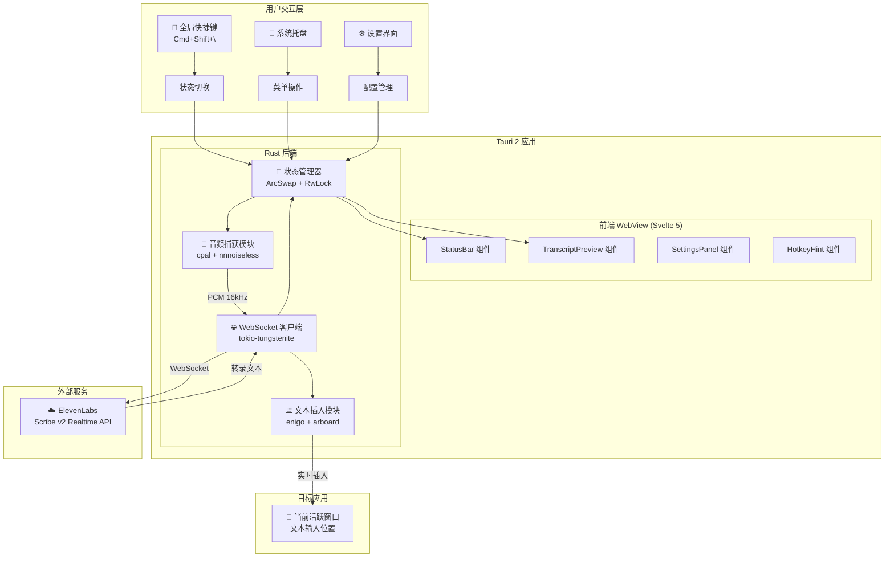

---

## 2. 技术栈

### 2.1 后端依赖 (Rust)

| 依赖包 | 版本 | 用途 |
|--------|------|------|
| `tauri` | 2.0 | 应用框架 |
| `tauri-plugin-global-shortcut` | 2.0 | 全局快捷键 |
| `tokio` | 1.49 | 异步运行时 |
| `tokio-tungstenite` | 0.28 | WebSocket 客户端 |
| `cpal` | 0.15 | 跨平台音频捕获 |
| `nnnoiseless` | 0.5 | RNNoise 音频降噪 |
| `enigo` | 0.2 | 键盘/鼠标模拟 |
| `arboard` | 3.6 | 剪贴板操作 |
| `arc-swap` | 1.7 | 无锁原子指针交换 |
| `serde` / `serde_json` | 1.0 | 序列化 |
| `base64` | 0.22 | Base64 编解码 |
| `thiserror` | 2.0 | 错误定义 |
| `dirs` | 6.0 | 跨平台目录 |

### 2.2 前端依赖 (TypeScript)

| 依赖包 | 版本 | 用途 |
|--------|------|------|
| `svelte` | ^5.46 | UI 框架 |
| `vite` | ^6.0 | 构建工具 |
| `@tauri-apps/api` | ^2.9 | Tauri JS API |
| `@tauri-apps/plugin-global-shortcut` | ^2.3 | 快捷键插件 |
| `typescript` | ^5.7 | 类型支持 |

### 2.3 Rust 版本要求

```toml
[package]
edition = "2024"
rust-version = "1.85"
```

---

## 3. 项目结构

```
raflow/
├── src/                              # Svelte 前端代码
│   ├── App.svelte                   # 主应用组件
│   ├── main.ts                      # 入口文件
│   └── lib/
│       ├── components/              # UI 组件
│       │   ├── StatusBar.svelte     # 状态栏
│       │   ├── TranscriptPreview.svelte  # 转录预览
│       │   ├── SettingsPanel.svelte # 设置面板
│       │   └── HotkeyHint.svelte    # 快捷键提示
│       └── stores/                  # Svelte stores
│           ├── appState.ts          # 应用状态
│           └── settings.ts          # 设置状态
│
├── src-tauri/                       # Rust 后端代码
│   ├── Cargo.toml                   # Rust 依赖
│   ├── tauri.conf.json              # Tauri 配置
│   ├── capabilities/main.json       # 权限配置
│   ├── entitlements.plist           # macOS 权限
│   ├── Info.plist                   # macOS 应用信息
│   └── src/
│       ├── main.rs                  # 应用入口
│       ├── lib.rs                   # 库导出
│       ├── commands.rs              # Tauri 命令 (423 行)
│       ├── state.rs                 # 状态管理 (231 行)
│       ├── error.rs                 # 错误定义 (98 行)
│       ├── hotkey.rs                # 快捷键处理 (221 行)
│       ├── tray.rs                  # 系统托盘 (110 行)
│       ├── settings_store.rs        # 设置持久化 (66 行)
│       ├── audio/                   # 音频处理模块
│       │   ├── mod.rs               # 模块导出
│       │   ├── capture.rs           # 音频捕获 (340 行)
│       │   └── denoise.rs           # 音频降噪 (151 行)
│       ├── transcriber/             # 转录客户端模块
│       │   ├── mod.rs               # 模块导出
│       │   ├── client.rs            # WebSocket 客户端 (279 行)
│       │   └── message.rs           # 消息类型定义 (204 行)
│       └── input/                   # 文本插入模块
│           ├── mod.rs               # 模块导出
│           ├── inserter.rs          # 文本插入器 (455 行)
│           └── clipboard.rs         # 剪贴板管理 (35 行)
│
├── package.json                     # 前端依赖
├── vite.config.ts                   # Vite 配置
├── tsconfig.json                    # TypeScript 配置
└── README.md                        # 项目说明
```

---

## 4. 核心模块设计

### 4.1 模块依赖关系

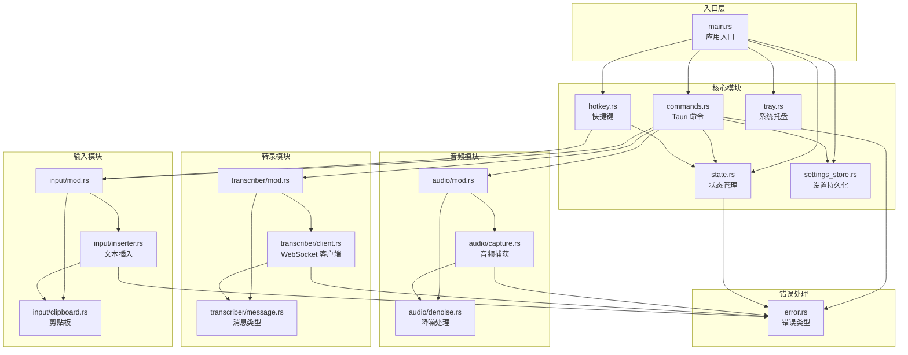

### 4.2 类型定义

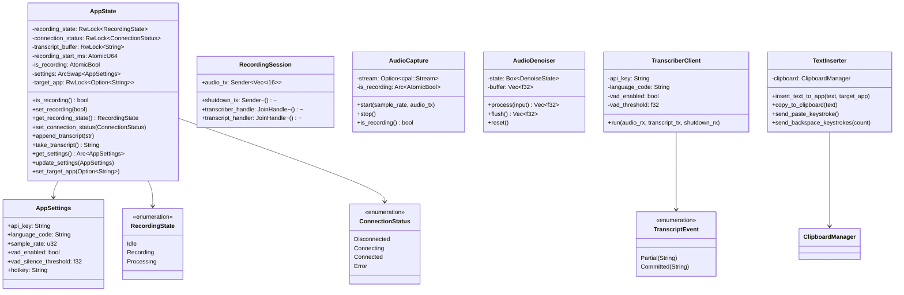

---

## 5. 应用启动流程

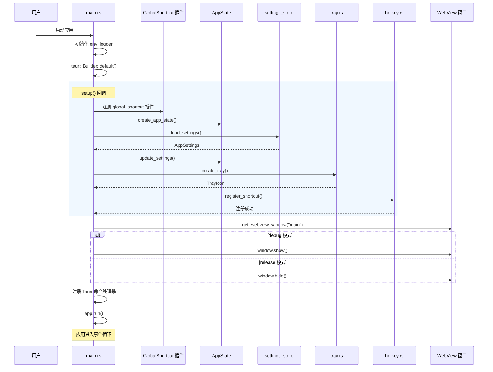

---

## 6. 录音与转录流程

### 6.1 完整录音流程

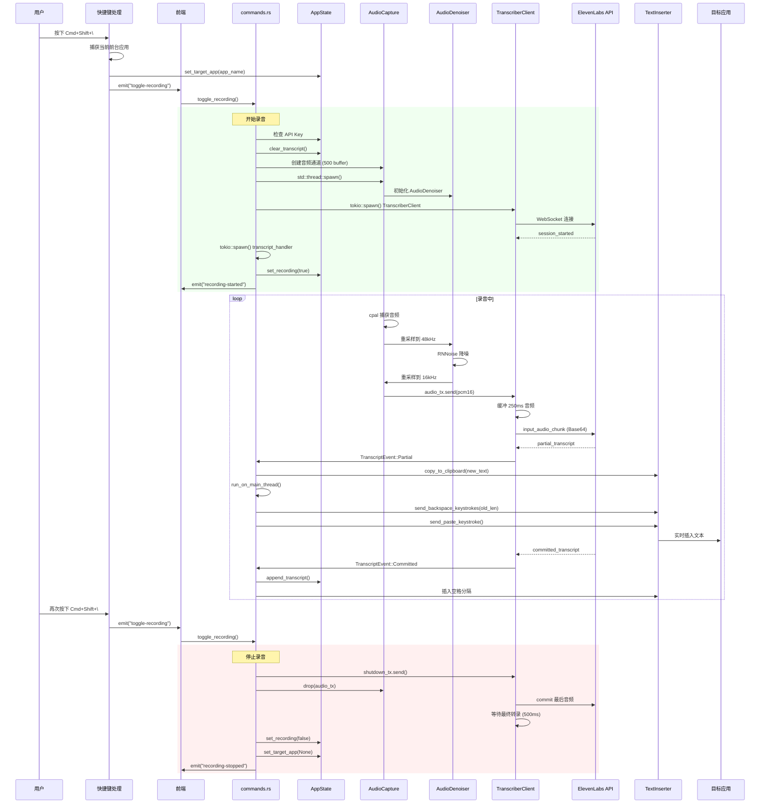

### 6.2 状态机

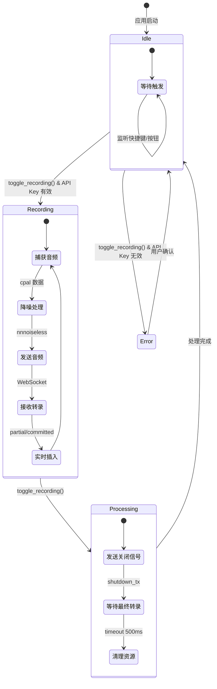

---

## 7. 音频处理流水线

### 7.1 音频处理架构

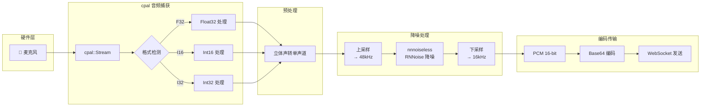

### 7.2 降噪处理细节

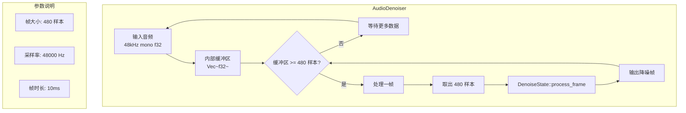

### 7.3 重采样算法

```rust
/// 线性插值重采样
pub fn resample(input: &[f32], source_rate: u32, target_rate: u32) -> Vec<f32> {
    let ratio = target_rate as f64 / source_rate as f64;
    let output_len = (input.len() as f64 * ratio).ceil() as usize;
    
    (0..output_len).map(|i| {
        let src_idx = i as f64 / ratio;
        let src_floor = src_idx.floor() as usize;
        let frac = (src_idx - src_floor as f64) as f32;
        
        if src_floor + 1 < input.len() {
            input[src_floor] * (1.0 - frac) + input[src_floor + 1] * frac
        } else {
            input.get(src_floor).copied().unwrap_or(0.0)
        }
    }).collect()
}
```

---

## 8. WebSocket 通信协议

### 8.1 连接流程

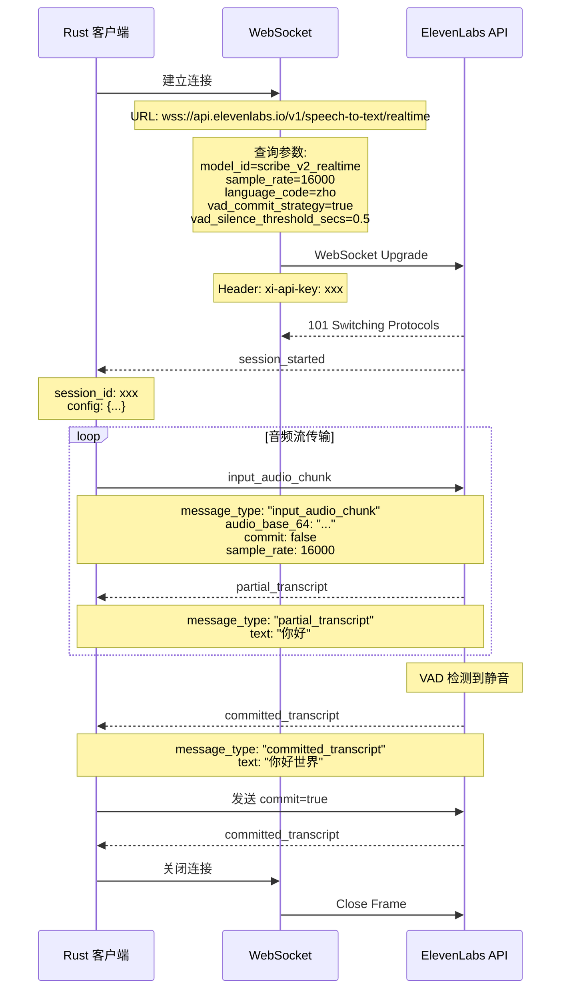

### 8.2 消息类型定义

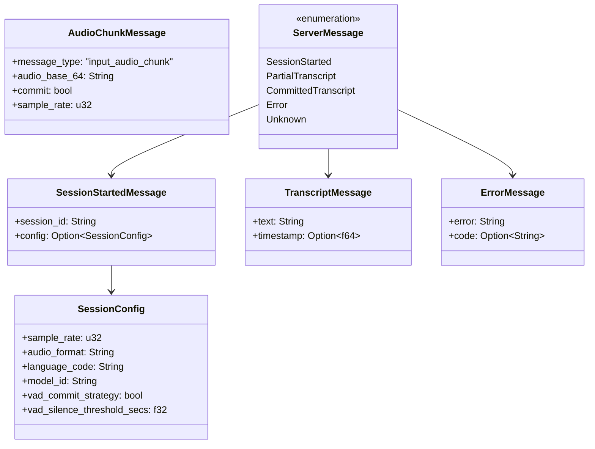

---

## 9. 实时文本插入机制

### 9.1 文本插入流程

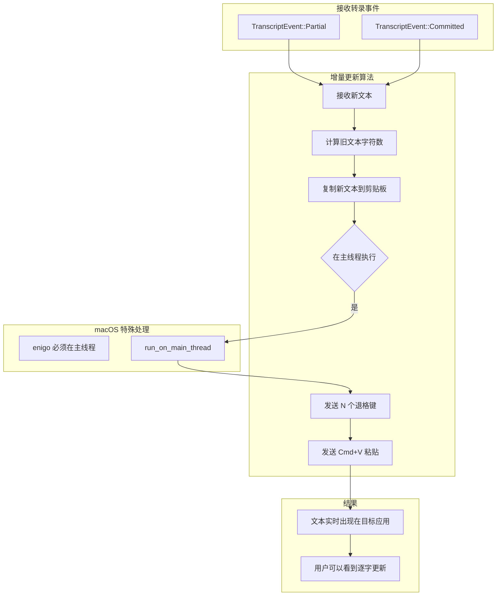

### 9.2 目标应用捕获

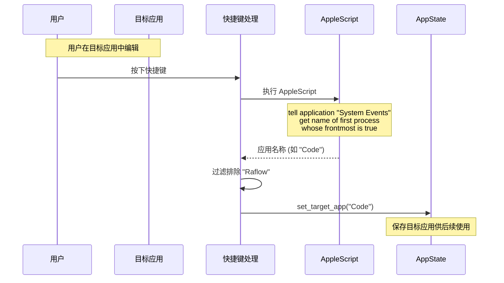

### 9.3 AppleScript 交互

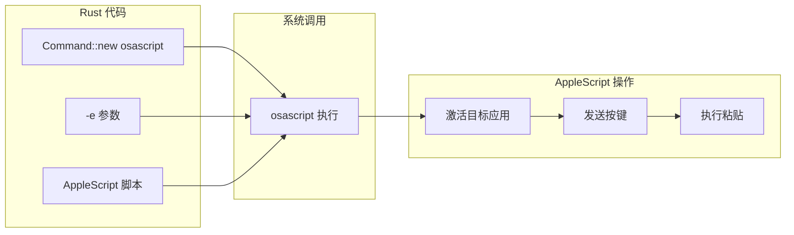

---

## 10. 状态管理

### 10.1 状态架构

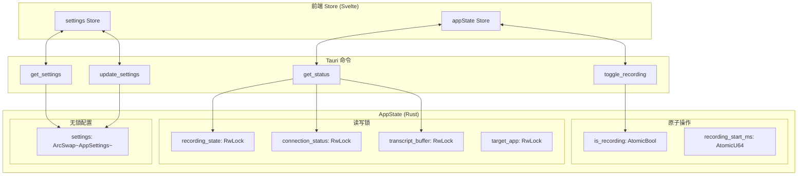

### 10.2 并发访问模式

| 数据 | 类型 | 访问模式 | 选择理由 |
|------|------|----------|----------|
| `is_recording` | `AtomicBool` | 高频读取 | 简单布尔值，原子操作最高效 |
| `recording_start_ms` | `AtomicU64` | 低频读取 | 时间戳，原子操作足够 |
| `recording_state` | `RwLock<RecordingState>` | 读多写少 | 枚举状态，需要互斥 |
| `connection_status` | `RwLock<ConnectionStatus>` | 读多写少 | 枚举状态，需要互斥 |
| `transcript_buffer` | `RwLock<String>` | 频繁追加 | 字符串操作，需要互斥 |
| `settings` | `ArcSwap<AppSettings>` | 极少修改 | 配置很少改动，ArcSwap 无锁替换 |

---

## 11. 前端设计

### 11.1 组件结构

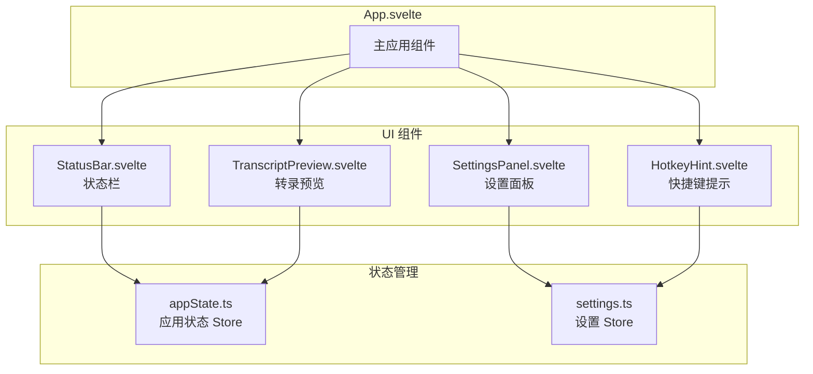

### 11.2 事件通信

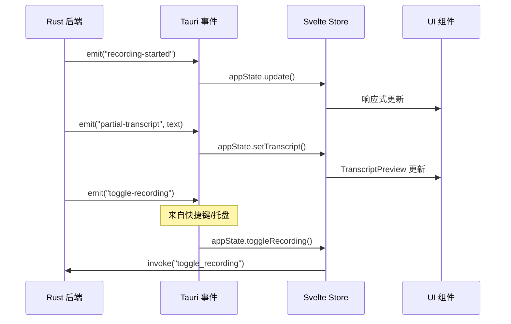

### 11.3 界面布局

```
┌─────────────────────────────────────────┐
│  Raflow                              ─ □ │
├─────────────────────────────────────────┤
│                                         │
│  ┌─────────────────────────────────┐   │
│  │ ● Recording...                  │   │ ← StatusBar
│  └─────────────────────────────────┘   │
│                                         │
│  ┌─────────────────────────────────┐   │
│  │ TRANSCRIPT                      │   │
│  ├─────────────────────────────────┤   │
│  │                                 │   │ ← TranscriptPreview
│  │  "你好，这是一段测试..."       │   │
│  │                                 │   │
│  └─────────────────────────────────┘   │
│                                         │
│       Press ⌘ ⇧ \ to toggle            │ ← HotkeyHint
│                                         │
│  ┌──────────────┐  ┌───────────┐       │
│  │ Stop Recording│  │ Settings  │       │ ← 操作按钮
│  └──────────────┘  └───────────┘       │
│                                         │
│  ┌─────────────────────────────────┐   │
│  │ Settings                        │   │
│  │ ─────────────────────────────── │   │
│  │ ElevenLabs API Key              │   │ ← SettingsPanel
│  │ [••••••••••••••••••••] 👁️       │   │   (可折叠)
│  │                                 │   │
│  │ Language: [Chinese ▼]           │   │
│  │ Hotkey: [Cmd+Shift+\ ]          │   │
│  │ ☑ Enable VAD                    │   │
│  └─────────────────────────────────┘   │
│                                         │
└─────────────────────────────────────────┘
```

---

## 12. 配置持久化

### 12.1 配置文件位置

| 平台 | 路径 |
|------|------|
| macOS | `~/.config/raflow/settings.json` |
| Windows | `%APPDATA%\raflow\settings.json` |
| Linux | `~/.config/raflow/settings.json` |

### 12.2 配置文件格式

```json
{
  "api_key": "sk-xxxxxxxxxxxxxxxxxxxx",
  "language_code": "zho",
  "sample_rate": 16000,
  "vad_enabled": true,
  "vad_silence_threshold": 0.5,
  "hotkey": "CommandOrControl+Shift+\\"
}
```

### 12.3 配置加载流程

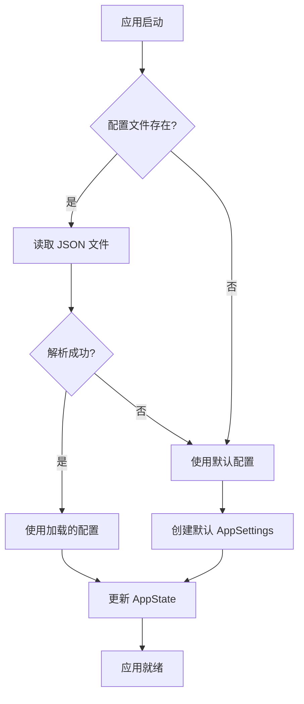

---

## 13. 错误处理

### 13.1 错误类型

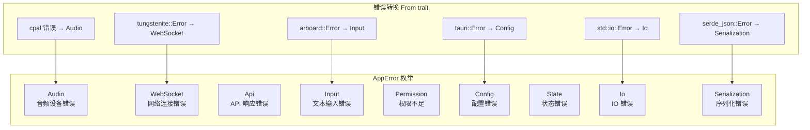

### 13.2 错误处理策略

| 错误类型 | 处理策略 |
|----------|----------|
| `Audio` | 显示错误消息，允许重试 |
| `WebSocket` | 自动重试（当前未实现），显示错误 |
| `Api` | 检查 API Key，显示错误详情 |
| `Input` | 降级到剪贴板模式 |
| `Permission` | 引导用户打开系统设置 |
| `Config` | 使用默认配置，记录警告 |

---

## 14. Tauri 命令接口

### 14.1 命令列表

```mermaid
graph LR
    subgraph "Tauri 命令"
        C1[toggle_recording]
        C2[get_status]
        C3[get_transcript]
        C4[clear_transcript]
        C5[update_settings]
        C6[get_settings]
        C7[load_settings]
        C8[update_hotkey]
        C9[check_accessibility]
        C10[request_accessibility]
    end

    subgraph "返回类型"
        R1[RecordingStatus]
        R2[AppStatus]
        R3[String]
        R4[()]
        R5[AppSettings]
        R6[bool]
    end

    C1 --> R1
    C2 --> R2
    C3 --> R3
    C4 --> R4
    C5 --> R4
    C6 --> R5
    C7 --> R5
    C8 --> R4
    C9 --> R6
    C10 --> R4
```

### 14.2 命令参数与返回值

```typescript
// toggle_recording
interface RecordingStatus {
  is_recording: boolean;
  duration_ms: number | null;
}

// get_status
interface AppStatus {
  recording_state: 'Idle' | 'Recording' | 'Processing';
  connection_status: 'Disconnected' | 'Connecting' | 'Connected' | 'Error';
  transcript: string;
  duration_ms: number | null;
}

// get_settings / update_settings
interface AppSettings {
  api_key: string;
  language_code: string;
  sample_rate: number;
  vad_enabled: boolean;
  vad_silence_threshold: number;
  hotkey: string;
}
```

---

## 15. 安全性设计

### 15.1 权限要求

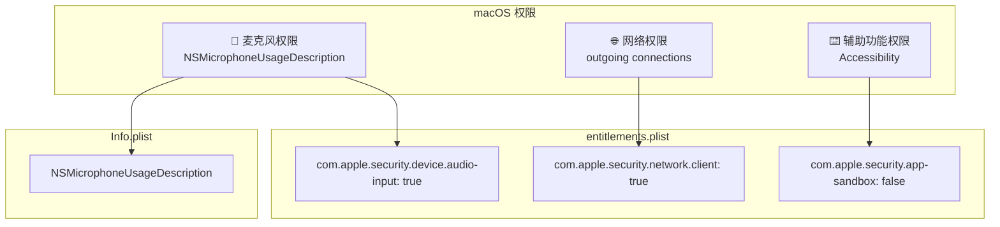

### 15.2 CSP 安全策略

```json
{
  "security": {
    "csp": "default-src 'self'; connect-src 'self' wss://api.elevenlabs.io; style-src 'self' 'unsafe-inline'"
  }
}
```

### 15.3 API Key 存储

| 当前实现 | 建议改进 |
|----------|----------|
| JSON 文件明文存储 | macOS Keychain |
| `~/.config/raflow/settings.json` | 使用 `security-framework` crate |

---

## 16. 性能优化

### 16.1 音频处理延迟

```mermaid
gantt
    title 音频处理延迟分析
    dateFormat X
    axisFormat %L ms

    section 音频捕获
    cpal 回调 :a1, 0, 10

    section 降噪处理
    上采样 48kHz :a2, 10, 15
    RNNoise 处理 :a3, 15, 25
    下采样 16kHz :a4, 25, 30

    section 网络传输
    缓冲 250ms :a5, 30, 280
    WebSocket 发送 :a6, 280, 290
    API 处理 :a7, 290, 440

    section 文本插入
    剪贴板写入 :a8, 440, 445
    按键模拟 :a9, 445, 495
```

### 16.2 内存使用

| 组件 | 缓冲区大小 | 说明 |
|------|------------|------|
| 音频通道 | 500 条消息 | `mpsc::channel` |
| 转录通道 | 100 条消息 | `mpsc::channel` |
| 音频块 | 4000 样本 (~250ms) | 16kHz × 0.25s |
| 降噪缓冲 | 1920 样本 | 48kHz × 4 帧 |

### 16.3 延迟目标

| 阶段 | 目标延迟 |
|------|----------|
| 音频捕获 + 降噪 | < 30ms |
| 缓冲 + 编码 | 250ms |
| API 处理 | ~150ms |
| 文本插入 | < 70ms |
| **总端到端延迟** | **< 500ms** |

---

## 17. 构建与部署

### 17.1 构建流程

```mermaid
flowchart LR
    subgraph "前端构建"
        F1[npm install]
        F2[vite build]
        F3[dist/]
    end

    subgraph "Rust 构建"
        R1[cargo build --release]
        R2[编译 Rust 代码]
        R3[链接 tauri-runtime]
    end

    subgraph "Tauri 打包"
        T1[tauri build]
        T2[嵌入前端资源]
        T3[代码签名]
        T4[DMG/App 打包]
    end

    subgraph "输出产物"
        O1[Raflow.app]
        O2[Raflow_0.1.0_aarch64.dmg]
    end

    F1 --> F2 --> F3
    R1 --> R2 --> R3
    F3 --> T1
    R3 --> T1
    T1 --> T2 --> T3 --> T4
    T4 --> O1
    T4 --> O2
```

### 17.2 构建命令

```bash
# 开发模式
npm run tauri dev

# 生产构建
npm run tauri build

# 输出路径
# src-tauri/target/release/bundle/macos/Raflow.app
# src-tauri/target/release/bundle/dmg/Raflow_0.1.0_aarch64.dmg
```

---

## 18. 未来改进方向

### 18.1 功能增强

| 优先级 | 功能 | 描述 |
|--------|------|------|
| 高 | Windows/Linux 支持 | 跨平台文本插入 |
| 高 | API Key 安全存储 | 使用系统 Keychain |
| 中 | WebSocket 重连 | 网络断开后自动重连 |
| 中 | 多语言切换热键 | 快速切换识别语言 |
| 低 | 本地 Whisper 支持 | 离线语音识别 |
| 低 | 语音命令 | 识别特殊命令如 "删除上一句" |

### 18.2 架构优化

```mermaid
graph TB
    subgraph "当前架构"
        A1[单一 WebSocket 连接]
        A2[JSON 配置文件]
        A3[同步文本插入]
    end

    subgraph "优化方向"
        B1[连接池 + 自动重连]
        B2[系统 Keychain 集成]
        B3[异步插入队列]
        B4[本地模型支持]
    end

    A1 -.-> B1
    A2 -.-> B2
    A3 -.-> B3
```

---

## 附录 A: 支持的语言代码

| 代码 | 语言 |
|------|------|
| `zho` | 中文 |
| `eng` | 英语 |
| `jpn` | 日语 |
| `kor` | 韩语 |
| `spa` | 西班牙语 |
| `fra` | 法语 |
| `deu` | 德语 |
| `ita` | 意大利语 |
| `por` | 葡萄牙语 |
| `rus` | 俄语 |
| `ara` | 阿拉伯语 |
| `hin` | 印地语 |
| `tha` | 泰语 |
| `vie` | 越南语 |
| `ind` | 印尼语 |
| `tur` | 土耳其语 |
| `pol` | 波兰语 |

---

## 附录 B: 快捷键格式

### 支持的修饰键

| 修饰键 | 别名 |
|--------|------|
| `Command` | `Cmd`, `Super`, `Meta` |
| `Control` | `Ctrl` |
| `Shift` | - |
| `Alt` | `Option` |
| `CommandOrControl` | `CmdOrCtrl` |

### 支持的按键

| 类型 | 示例 |
|------|------|
| 字母 | `A`-`Z` |
| 数字 | `0`-`9` |
| 功能键 | `F1`-`F12` |
| 符号 | `\`, `/`, `Space`, `Enter`, `Tab` |
| 方向键 | `Up`, `Down`, `Left`, `Right` |

### 示例

```
CommandOrControl+Shift+\
Cmd+R
Ctrl+Alt+Space
F8
Shift+F12
```

---

**文档结束**
