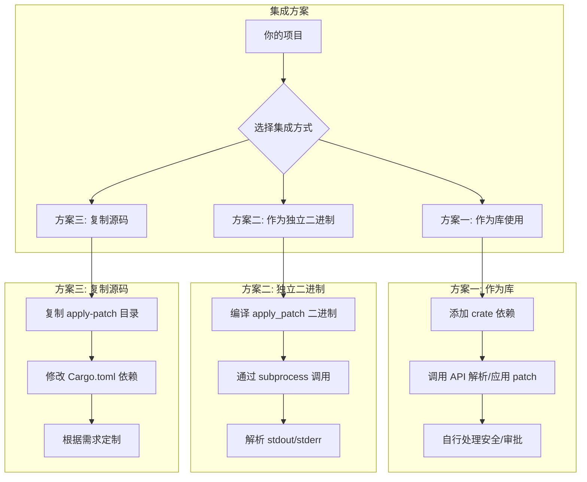
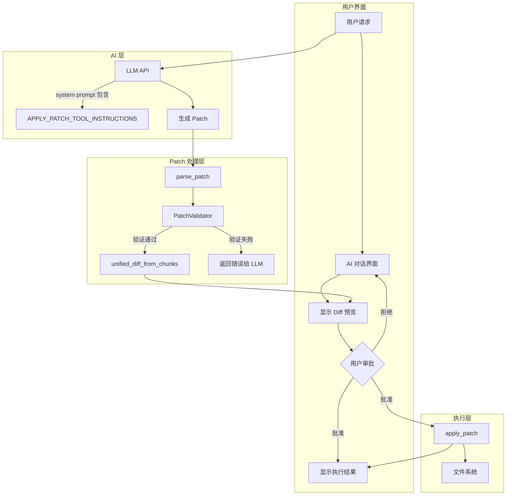
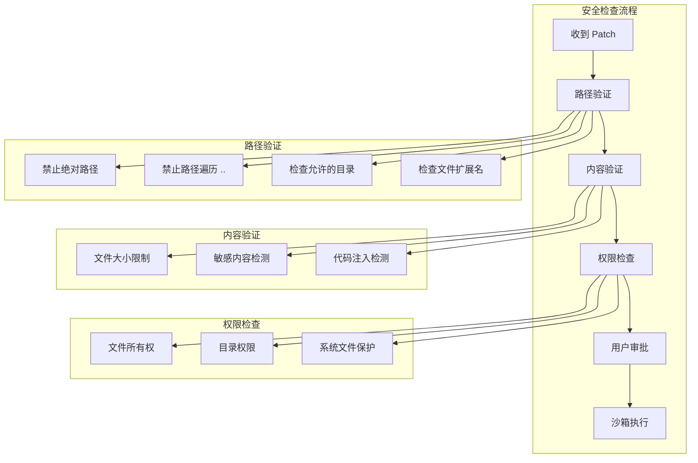

# Apply Patch 工具集成指南

本文档详细介绍如何将 Codex 的 `apply_patch` 工具集成到你自己的项目中。

## 1. 集成方案概览

根据你的需求，有三种主要的集成方式：



---

## 2. 方案一：作为 Rust 库使用（推荐）

### 2.1 添加依赖

由于 `codex-apply-patch` 没有发布到 crates.io，你需要通过 git 或 path 依赖：

```toml
# Cargo.toml

[dependencies]
# 方式 1: Git 依赖（推荐，保持更新）
codex-apply-patch = { git = "https://github.com/openai/codex", path = "codex-rs/apply-patch" }

# 方式 2: 本地路径依赖
codex-apply-patch = { path = "../vendors/codex/codex-rs/apply-patch" }

# 必需的传递依赖（如果不通过 workspace 管理）
anyhow = "1"
similar = "2.7.0"
thiserror = "2.0"
tree-sitter = "0.25"
tree-sitter-bash = "0.25"
```

### 2.2 公开 API 概览

```rust
// codex_apply_patch 公开的主要 API

// === 常量 ===
/// LLM 使用说明，可嵌入 system prompt
pub const APPLY_PATCH_TOOL_INSTRUCTIONS: &str;

// === 核心函数 ===
/// 解析 patch 文本为 Hunks
pub fn parse_patch(patch: &str) -> Result<ApplyPatchArgs, ParseError>;

/// 应用 patch 到文件系统
pub fn apply_patch(
    patch: &str,
    stdout: &mut impl Write,
    stderr: &mut impl Write,
) -> Result<(), ApplyPatchError>;

/// 应用已解析的 hunks
pub fn apply_hunks(
    hunks: &[Hunk],
    stdout: &mut impl Write,
    stderr: &mut impl Write,
) -> Result<(), ApplyPatchError>;

/// 从 shell 命令参数中解析 apply_patch 调用（支持 heredoc）
pub fn maybe_parse_apply_patch_verified(
    argv: &[String],
    cwd: &Path,
) -> MaybeApplyPatchVerified;

/// 生成 unified diff
pub fn unified_diff_from_chunks(
    path: &Path,
    chunks: &[UpdateFileChunk],
) -> Result<ApplyPatchFileUpdate, ApplyPatchError>;

// === 类型 ===
pub struct ApplyPatchArgs {
    pub patch: String,
    pub hunks: Vec<Hunk>,
    pub workdir: Option<String>,
}

pub enum Hunk {
    AddFile { path: PathBuf, contents: String },
    DeleteFile { path: PathBuf },
    UpdateFile {
        path: PathBuf,
        move_path: Option<PathBuf>,
        chunks: Vec<UpdateFileChunk>,
    },
}

pub enum ApplyPatchError {
    ParseError(ParseError),
    IoError(IoError),
    ComputeReplacements(String),
    ImplicitInvocation,
}
```

### 2.3 基础使用示例

```rust
use codex_apply_patch::{apply_patch, parse_patch, ApplyPatchError};
use std::io::{stdout, stderr};

fn main() -> Result<(), ApplyPatchError> {
    let patch = r#"*** Begin Patch
*** Add File: hello.txt
+Hello, World!
+This is a new file.
*** End Patch"#;

    // 方式 1: 直接应用 patch
    let mut out = Vec::new();
    let mut err = Vec::new();
    apply_patch(patch, &mut out, &mut err)?;

    println!("stdout: {}", String::from_utf8_lossy(&out));
    if !err.is_empty() {
        eprintln!("stderr: {}", String::from_utf8_lossy(&err));
    }

    Ok(())
}
```

### 2.4 解析但不立即应用

```rust
use codex_apply_patch::{parse_patch, Hunk};
use std::path::Path;

fn preview_patch(patch: &str) -> anyhow::Result<()> {
    let parsed = parse_patch(patch)?;

    println!("Patch contains {} operations:", parsed.hunks.len());

    for hunk in &parsed.hunks {
        match hunk {
            Hunk::AddFile { path, contents } => {
                println!("  ADD: {} ({} bytes)", path.display(), contents.len());
            }
            Hunk::DeleteFile { path } => {
                println!("  DELETE: {}", path.display());
            }
            Hunk::UpdateFile { path, move_path, chunks } => {
                let dest = move_path.as_ref().map(|p| p.display().to_string())
                    .unwrap_or_else(|| "(same)".to_string());
                println!("  UPDATE: {} -> {} ({} chunks)",
                    path.display(), dest, chunks.len());
            }
        }
    }

    Ok(())
}
```

### 2.5 生成 Unified Diff（用于审批 UI）

```rust
use codex_apply_patch::{parse_patch, unified_diff_from_chunks, Hunk};

fn generate_diffs_for_review(patch: &str) -> anyhow::Result<Vec<(String, String)>> {
    let parsed = parse_patch(patch)?;
    let mut diffs = Vec::new();

    for hunk in &parsed.hunks {
        if let Hunk::UpdateFile { path, chunks, .. } = hunk {
            let update = unified_diff_from_chunks(path, chunks)?;
            diffs.push((path.display().to_string(), update.unified_diff));
        }
    }

    Ok(diffs)
}
```

### 2.6 处理 Shell Heredoc 格式

```rust
use codex_apply_patch::{maybe_parse_apply_patch_verified, MaybeApplyPatchVerified};
use std::path::Path;

fn handle_shell_command(argv: &[String], cwd: &Path) {
    match maybe_parse_apply_patch_verified(argv, cwd) {
        MaybeApplyPatchVerified::Body(action) => {
            println!("Detected apply_patch command!");
            println!("Working directory: {}", action.cwd.display());
            println!("Changes: {:?}", action.changes().keys().collect::<Vec<_>>());

            // 可以在这里添加审批逻辑
            // ...

            // 执行 patch
            // apply_patch(&action.patch, &mut stdout, &mut stderr)?;
        }
        MaybeApplyPatchVerified::CorrectnessError(e) => {
            eprintln!("Patch error: {}", e);
        }
        MaybeApplyPatchVerified::ShellParseError(e) => {
            eprintln!("Shell parse error: {:?}", e);
        }
        MaybeApplyPatchVerified::NotApplyPatch => {
            println!("Not an apply_patch command");
        }
    }
}

// 示例调用
fn main() {
    let cwd = std::env::current_dir().unwrap();

    // 直接调用
    let direct = vec!["apply_patch".to_string(), "*** Begin Patch\n...".to_string()];
    handle_shell_command(&direct, &cwd);

    // Shell heredoc 调用
    let heredoc = vec![
        "bash".to_string(),
        "-lc".to_string(),
        "apply_patch <<'EOF'\n*** Begin Patch\n*** Add File: x\n+hi\n*** End Patch\nEOF".to_string(),
    ];
    handle_shell_command(&heredoc, &cwd);
}
```

---

## 3. 方案二：作为独立二进制使用

### 3.1 编译二进制

```bash
# 克隆仓库
git clone https://github.com/openai/codex
cd codex/codex-rs

# 编译 apply_patch 二进制
cargo build --release -p codex-apply-patch --bin apply_patch

# 二进制位置
ls target/release/apply_patch
```

### 3.2 命令行使用

```bash
# 通过参数传递 patch
./apply_patch '*** Begin Patch
*** Add File: hello.txt
+Hello World
*** End Patch'

# 通过 stdin 传递 patch
echo '*** Begin Patch
*** Add File: hello.txt
+Hello World
*** End Patch' | ./apply_patch

# 从文件读取
cat patch.txt | ./apply_patch
```

### 3.3 在其他语言中调用

#### Python

```python
import subprocess
import os
from pathlib import Path

def apply_patch(patch: str, cwd: str = None) -> tuple[bool, str, str]:
    """
    Apply a patch using the apply_patch binary.

    Returns: (success, stdout, stderr)
    """
    result = subprocess.run(
        ["./apply_patch", patch],
        capture_output=True,
        text=True,
        cwd=cwd or os.getcwd()
    )

    return (
        result.returncode == 0,
        result.stdout,
        result.stderr
    )

# 使用示例
patch = """*** Begin Patch
*** Add File: hello.txt
+Hello from Python!
*** End Patch"""

success, stdout, stderr = apply_patch(patch)
if success:
    print(f"Success: {stdout}")
else:
    print(f"Failed: {stderr}")
```

#### Node.js / TypeScript

```typescript
import { execSync, spawn } from 'child_process';
import { promisify } from 'util';

interface ApplyPatchResult {
  success: boolean;
  stdout: string;
  stderr: string;
}

async function applyPatch(patch: string, cwd?: string): Promise<ApplyPatchResult> {
  return new Promise((resolve) => {
    const proc = spawn('./apply_patch', [patch], {
      cwd: cwd || process.cwd(),
    });

    let stdout = '';
    let stderr = '';

    proc.stdout.on('data', (data) => { stdout += data; });
    proc.stderr.on('data', (data) => { stderr += data; });

    proc.on('close', (code) => {
      resolve({
        success: code === 0,
        stdout,
        stderr,
      });
    });
  });
}

// 使用示例
const patch = `*** Begin Patch
*** Add File: hello.txt
+Hello from Node.js!
*** End Patch`;

applyPatch(patch).then(({ success, stdout, stderr }) => {
  if (success) {
    console.log('Success:', stdout);
  } else {
    console.error('Failed:', stderr);
  }
});
```

#### Go

```go
package main

import (
    "bytes"
    "fmt"
    "os/exec"
)

type ApplyPatchResult struct {
    Success bool
    Stdout  string
    Stderr  string
}

func ApplyPatch(patch string, cwd string) (*ApplyPatchResult, error) {
    cmd := exec.Command("./apply_patch", patch)
    if cwd != "" {
        cmd.Dir = cwd
    }

    var stdout, stderr bytes.Buffer
    cmd.Stdout = &stdout
    cmd.Stderr = &stderr

    err := cmd.Run()

    return &ApplyPatchResult{
        Success: err == nil,
        Stdout:  stdout.String(),
        Stderr:  stderr.String(),
    }, nil
}

func main() {
    patch := `*** Begin Patch
*** Add File: hello.txt
+Hello from Go!
*** End Patch`

    result, _ := ApplyPatch(patch, "")
    if result.Success {
        fmt.Println("Success:", result.Stdout)
    } else {
        fmt.Println("Failed:", result.Stderr)
    }
}
```

---

## 4. 方案三：复制源码并定制

### 4.1 复制必要文件

```bash
# 创建目标目录
mkdir -p your-project/crates/apply-patch

# 复制核心文件
cp -r vendors/codex/codex-rs/apply-patch/src your-project/crates/apply-patch/
cp vendors/codex/codex-rs/apply-patch/apply_patch_tool_instructions.md your-project/crates/apply-patch/
```

### 4.2 创建独立的 Cargo.toml

```toml
# your-project/crates/apply-patch/Cargo.toml

[package]
name = "your-apply-patch"
version = "0.1.0"
edition = "2021"

[lib]
name = "your_apply_patch"
path = "src/lib.rs"

[[bin]]
name = "apply_patch"
path = "src/main.rs"

[dependencies]
anyhow = "1"
similar = "2.7"
thiserror = "2.0"
tree-sitter = "0.25"
tree-sitter-bash = "0.25"

[dev-dependencies]
assert_cmd = "2"
pretty_assertions = "1.4"
tempfile = "3"
```

### 4.3 可定制的扩展点

```rust
// 示例: 添加自定义验证逻辑

use your_apply_patch::{parse_patch, Hunk};
use std::path::Path;

/// 自定义验证规则
pub struct PatchValidator {
    /// 允许修改的目录
    allowed_dirs: Vec<String>,
    /// 禁止的文件模式
    forbidden_patterns: Vec<String>,
    /// 最大文件大小
    max_file_size: usize,
}

impl PatchValidator {
    pub fn validate(&self, patch: &str) -> Result<(), String> {
        let parsed = parse_patch(patch)
            .map_err(|e| format!("Parse error: {}", e))?;

        for hunk in &parsed.hunks {
            let path = match hunk {
                Hunk::AddFile { path, contents } => {
                    // 检查文件大小
                    if contents.len() > self.max_file_size {
                        return Err(format!(
                            "File {} exceeds max size ({} > {})",
                            path.display(), contents.len(), self.max_file_size
                        ));
                    }
                    path
                }
                Hunk::DeleteFile { path } => path,
                Hunk::UpdateFile { path, .. } => path,
            };

            // 检查路径是否在允许的目录中
            let path_str = path.to_string_lossy();
            let allowed = self.allowed_dirs.iter()
                .any(|dir| path_str.starts_with(dir));
            if !allowed {
                return Err(format!(
                    "Path {} is not in allowed directories",
                    path.display()
                ));
            }

            // 检查禁止的模式
            for pattern in &self.forbidden_patterns {
                if path_str.contains(pattern) {
                    return Err(format!(
                        "Path {} matches forbidden pattern '{}'",
                        path.display(), pattern
                    ));
                }
            }
        }

        Ok(())
    }
}
```

---

## 5. 完整集成架构示例

### 5.1 典型 AI 代码助手集成



### 5.2 完整代码示例

```rust
use codex_apply_patch::{
    apply_patch, parse_patch, unified_diff_from_chunks,
    ApplyPatchError, Hunk, APPLY_PATCH_TOOL_INSTRUCTIONS,
};
use std::collections::HashMap;
use std::path::PathBuf;

/// AI 代码助手的 Patch 管理器
pub struct PatchManager {
    /// 工作目录
    cwd: PathBuf,
    /// 待审批的更改
    pending_changes: HashMap<PathBuf, PendingChange>,
}

pub struct PendingChange {
    pub path: PathBuf,
    pub operation: ChangeOperation,
    pub unified_diff: Option<String>,
    pub new_content: Option<String>,
}

pub enum ChangeOperation {
    Add,
    Delete,
    Update { move_to: Option<PathBuf> },
}

impl PatchManager {
    pub fn new(cwd: PathBuf) -> Self {
        Self {
            cwd,
            pending_changes: HashMap::new(),
        }
    }

    /// 获取要嵌入 system prompt 的说明
    pub fn get_tool_instructions() -> &'static str {
        APPLY_PATCH_TOOL_INSTRUCTIONS
    }

    /// 解析并预览 patch，返回用于审批的更改列表
    pub fn preview_patch(&mut self, patch: &str) -> Result<Vec<PendingChange>, String> {
        let parsed = parse_patch(patch)
            .map_err(|e| format!("Failed to parse patch: {}", e))?;

        self.pending_changes.clear();
        let mut changes = Vec::new();

        for hunk in parsed.hunks {
            let change = match hunk {
                Hunk::AddFile { path, contents } => {
                    let abs_path = self.cwd.join(&path);
                    PendingChange {
                        path: abs_path.clone(),
                        operation: ChangeOperation::Add,
                        unified_diff: None,
                        new_content: Some(contents),
                    }
                }
                Hunk::DeleteFile { path } => {
                    let abs_path = self.cwd.join(&path);
                    PendingChange {
                        path: abs_path.clone(),
                        operation: ChangeOperation::Delete,
                        unified_diff: None,
                        new_content: None,
                    }
                }
                Hunk::UpdateFile { path, move_path, chunks } => {
                    let abs_path = self.cwd.join(&path);
                    let diff = unified_diff_from_chunks(&abs_path, &chunks)
                        .map_err(|e| format!("Failed to generate diff: {}", e))?;

                    PendingChange {
                        path: abs_path.clone(),
                        operation: ChangeOperation::Update {
                            move_to: move_path.map(|p| self.cwd.join(p)),
                        },
                        unified_diff: Some(diff.unified_diff),
                        new_content: Some(diff.content),
                    }
                }
            };

            self.pending_changes.insert(change.path.clone(), change.clone());
            changes.push(change);
        }

        Ok(changes)
    }

    /// 执行已批准的 patch
    pub fn apply_approved_patch(&self, patch: &str) -> Result<String, ApplyPatchError> {
        let mut stdout = Vec::new();
        let mut stderr = Vec::new();

        apply_patch(patch, &mut stdout, &mut stderr)?;

        Ok(String::from_utf8_lossy(&stdout).to_string())
    }

    /// 获取特定文件的 unified diff（用于 UI 显示）
    pub fn get_diff_for_file(&self, path: &PathBuf) -> Option<&str> {
        self.pending_changes.get(path)
            .and_then(|c| c.unified_diff.as_deref())
    }
}

// === 使用示例 ===

fn main() -> Result<(), Box<dyn std::error::Error>> {
    let mut manager = PatchManager::new(std::env::current_dir()?);

    // 1. 构建 system prompt（包含工具说明）
    let system_prompt = format!(
        "You are a code assistant.\n\n{}",
        PatchManager::get_tool_instructions()
    );
    println!("System prompt prepared ({} chars)", system_prompt.len());

    // 2. 假设 LLM 生成了以下 patch
    let llm_response = r#"*** Begin Patch
*** Add File: src/hello.rs
+pub fn greet(name: &str) -> String {
+    format!("Hello, {}!", name)
+}
*** Update File: src/main.rs
@@
 fn main() {
-    println!("Hello, world!");
+    println!("{}", hello::greet("World"));
 }
*** End Patch"#;

    // 3. 预览更改
    let changes = manager.preview_patch(llm_response)?;
    println!("\nPending changes:");
    for change in &changes {
        match &change.operation {
            ChangeOperation::Add => {
                println!("  [ADD] {}", change.path.display());
            }
            ChangeOperation::Delete => {
                println!("  [DEL] {}", change.path.display());
            }
            ChangeOperation::Update { move_to } => {
                let dest = move_to.as_ref()
                    .map(|p| format!(" -> {}", p.display()))
                    .unwrap_or_default();
                println!("  [UPD] {}{}", change.path.display(), dest);
                if let Some(diff) = &change.unified_diff {
                    println!("    Diff:\n{}", diff);
                }
            }
        }
    }

    // 4. 模拟用户审批
    println!("\n[Simulating user approval...]");

    // 5. 应用 patch
    // let result = manager.apply_approved_patch(llm_response)?;
    // println!("Applied: {}", result);

    Ok(())
}
```

---

## 6. 安全考虑

### 6.1 必须实现的安全措施



### 6.2 安全验证器实现

```rust
use std::path::{Path, PathBuf};

pub struct SecurityValidator {
    /// 项目根目录
    project_root: PathBuf,
    /// 允许的文件扩展名
    allowed_extensions: Vec<String>,
    /// 禁止修改的路径模式
    protected_paths: Vec<String>,
    /// 最大文件大小 (bytes)
    max_file_size: usize,
}

#[derive(Debug)]
pub enum SecurityError {
    AbsolutePathNotAllowed(PathBuf),
    PathTraversalDetected(PathBuf),
    PathOutsideProject(PathBuf),
    ProtectedPath(PathBuf),
    DisallowedExtension(PathBuf),
    FileTooLarge { path: PathBuf, size: usize, max: usize },
}

impl SecurityValidator {
    pub fn new(project_root: PathBuf) -> Self {
        Self {
            project_root,
            allowed_extensions: vec![
                "rs", "py", "js", "ts", "go", "java", "c", "cpp", "h",
                "json", "yaml", "yml", "toml", "md", "txt",
            ].into_iter().map(String::from).collect(),
            protected_paths: vec![
                ".git".to_string(),
                ".env".to_string(),
                "secrets".to_string(),
                "credentials".to_string(),
            ],
            max_file_size: 1024 * 1024, // 1MB
        }
    }

    pub fn validate_path(&self, path: &Path) -> Result<PathBuf, SecurityError> {
        // 1. 禁止绝对路径
        if path.is_absolute() {
            return Err(SecurityError::AbsolutePathNotAllowed(path.to_path_buf()));
        }

        // 2. 检测路径遍历
        let path_str = path.to_string_lossy();
        if path_str.contains("..") {
            return Err(SecurityError::PathTraversalDetected(path.to_path_buf()));
        }

        // 3. 确保在项目目录内
        let resolved = self.project_root.join(path);
        let canonical = resolved.canonicalize()
            .unwrap_or_else(|_| resolved.clone());

        if !canonical.starts_with(&self.project_root) {
            return Err(SecurityError::PathOutsideProject(path.to_path_buf()));
        }

        // 4. 检查受保护路径
        for protected in &self.protected_paths {
            if path_str.contains(protected) {
                return Err(SecurityError::ProtectedPath(path.to_path_buf()));
            }
        }

        // 5. 检查文件扩展名
        if let Some(ext) = path.extension() {
            let ext_str = ext.to_string_lossy().to_lowercase();
            if !self.allowed_extensions.contains(&ext_str) {
                return Err(SecurityError::DisallowedExtension(path.to_path_buf()));
            }
        }

        Ok(canonical)
    }

    pub fn validate_content(&self, path: &Path, content: &str) -> Result<(), SecurityError> {
        if content.len() > self.max_file_size {
            return Err(SecurityError::FileTooLarge {
                path: path.to_path_buf(),
                size: content.len(),
                max: self.max_file_size,
            });
        }
        Ok(())
    }
}
```

### 6.3 沙箱执行建议

```rust
use std::process::{Command, Stdio};

/// 在受限环境中执行 apply_patch
pub fn execute_in_sandbox(patch: &str, cwd: &Path) -> Result<String, String> {
    // 方式 1: 使用 Docker
    #[cfg(feature = "docker-sandbox")]
    {
        let output = Command::new("docker")
            .args(&[
                "run", "--rm",
                "-v", &format!("{}:/workspace", cwd.display()),
                "-w", "/workspace",
                "--network", "none",  // 禁用网络
                "--memory", "256m",   // 限制内存
                "--cpus", "0.5",      // 限制 CPU
                "apply-patch-sandbox",
                patch,
            ])
            .output()
            .map_err(|e| format!("Docker error: {}", e))?;

        if output.status.success() {
            Ok(String::from_utf8_lossy(&output.stdout).to_string())
        } else {
            Err(String::from_utf8_lossy(&output.stderr).to_string())
        }
    }

    // 方式 2: 使用 Landlock (Linux)
    #[cfg(all(target_os = "linux", feature = "landlock-sandbox"))]
    {
        // 需要 landlock crate
        // 限制文件系统访问到 cwd 目录
    }

    // 方式 3: 直接执行（不推荐用于生产环境）
    #[cfg(not(any(feature = "docker-sandbox", feature = "landlock-sandbox")))]
    {
        let mut stdout = Vec::new();
        let mut stderr = Vec::new();

        codex_apply_patch::apply_patch(patch, &mut stdout, &mut stderr)
            .map_err(|e| format!("Apply error: {}", e))?;

        Ok(String::from_utf8_lossy(&stdout).to_string())
    }
}
```

---

## 7. 与 LLM API 集成

### 7.1 工具定义（OpenAI Function Calling 格式）

```json
{
  "type": "function",
  "function": {
    "name": "apply_patch",
    "description": "Use the `apply_patch` tool to edit files. Your patch language is a stripped-down, file-oriented diff format...",
    "parameters": {
      "type": "object",
      "properties": {
        "input": {
          "type": "string",
          "description": "The entire contents of the apply_patch command"
        }
      },
      "required": ["input"]
    }
  }
}
```

### 7.2 System Prompt 模板

```rust
fn build_system_prompt(project_context: &str) -> String {
    format!(
        r#"You are an AI coding assistant.

## Project Context
{project_context}

## File Editing Tool
{tool_instructions}

## Guidelines
1. Always use relative paths from the project root
2. Provide 3 lines of context before and after changes
3. Use @@ markers to locate specific functions/classes when needed
4. Never modify files outside the project directory
5. Never modify configuration files containing secrets
"#,
        project_context = project_context,
        tool_instructions = codex_apply_patch::APPLY_PATCH_TOOL_INSTRUCTIONS,
    )
}
```

### 7.3 处理 LLM 响应

```rust
use serde::Deserialize;

#[derive(Deserialize)]
struct ToolCall {
    id: String,
    function: FunctionCall,
}

#[derive(Deserialize)]
struct FunctionCall {
    name: String,
    arguments: String,
}

#[derive(Deserialize)]
struct ApplyPatchArgs {
    input: String,
}

fn handle_tool_call(tool_call: &ToolCall, manager: &mut PatchManager) -> Result<String, String> {
    if tool_call.function.name != "apply_patch" {
        return Err(format!("Unknown tool: {}", tool_call.function.name));
    }

    let args: ApplyPatchArgs = serde_json::from_str(&tool_call.function.arguments)
        .map_err(|e| format!("Failed to parse arguments: {}", e))?;

    // 1. 预览更改
    let changes = manager.preview_patch(&args.input)?;

    // 2. 生成审批摘要
    let summary = changes.iter()
        .map(|c| format!("{:?}: {}", c.operation, c.path.display()))
        .collect::<Vec<_>>()
        .join("\n");

    Ok(format!("Pending changes:\n{}\n\nAwait user approval.", summary))
}
```

---

## 8. 测试策略

### 8.1 单元测试

```rust
#[cfg(test)]
mod tests {
    use super::*;
    use tempfile::tempdir;
    use std::fs;

    #[test]
    fn test_add_file() {
        let tmp = tempdir().unwrap();
        let patch = format!(
            "*** Begin Patch\n*** Add File: test.txt\n+hello\n*** End Patch"
        );

        let mut stdout = Vec::new();
        let mut stderr = Vec::new();

        // 需要设置工作目录
        std::env::set_current_dir(tmp.path()).unwrap();
        apply_patch(&patch, &mut stdout, &mut stderr).unwrap();

        let content = fs::read_to_string(tmp.path().join("test.txt")).unwrap();
        assert_eq!(content, "hello\n");
    }

    #[test]
    fn test_security_validator_rejects_path_traversal() {
        let validator = SecurityValidator::new(PathBuf::from("/project"));
        let result = validator.validate_path(Path::new("../../../etc/passwd"));
        assert!(matches!(result, Err(SecurityError::PathTraversalDetected(_))));
    }

    #[test]
    fn test_security_validator_rejects_protected_path() {
        let validator = SecurityValidator::new(PathBuf::from("/project"));
        let result = validator.validate_path(Path::new(".env"));
        assert!(matches!(result, Err(SecurityError::ProtectedPath(_))));
    }
}
```

### 8.2 集成测试

```rust
#[test]
fn test_full_workflow() {
    let tmp = tempdir().unwrap();
    let mut manager = PatchManager::new(tmp.path().to_path_buf());

    // 创建初始文件
    fs::write(tmp.path().join("main.rs"), "fn main() {}\n").unwrap();

    // LLM 生成的 patch
    let patch = r#"*** Begin Patch
*** Update File: main.rs
@@
 fn main() {
+    println!("Hello!");
 }
*** End Patch"#;

    // 预览
    let changes = manager.preview_patch(patch).unwrap();
    assert_eq!(changes.len(), 1);
    assert!(changes[0].unified_diff.is_some());

    // 应用
    let result = manager.apply_approved_patch(patch).unwrap();
    assert!(result.contains("Success"));

    // 验证
    let content = fs::read_to_string(tmp.path().join("main.rs")).unwrap();
    assert!(content.contains("println!"));
}
```

---

## 9. 常见问题

### 9.1 Patch 解析失败

**问题**: `InvalidPatchError: The first line must be '*** Begin Patch'`

**解决方案**:
```rust
// 确保 patch 格式正确
let patch = patch.trim();  // 移除首尾空白
if !patch.starts_with("*** Begin Patch") {
    // 可能是 heredoc 格式，尝试提取
    if patch.starts_with("<<") {
        // 使用 maybe_parse_apply_patch_verified
    }
}
```

### 9.2 找不到上下文行

**问题**: `ComputeReplacements: Failed to find expected lines in file.rs`

**解决方案**:
- 确保上下文行与文件内容完全匹配
- 检查空白字符（空格 vs Tab）
- 增加上下文行数或使用 `@@` 定位

### 9.3 Unicode 字符问题

**问题**: 文件包含 Unicode 标点但 patch 使用 ASCII

**说明**: `apply_patch` 内置了模糊匹配，会自动将 Unicode 破折号、引号等转换为 ASCII 进行匹配。

---

## 10. 总结

| 集成方式 | 优点 | 缺点 | 适用场景 |
|---------|------|------|---------|
| 作为库 | 最大灵活性，可定制 | 需要 Rust 环境 | Rust 项目 |
| 独立二进制 | 语言无关，简单 | 需要管理进程 | 任何语言项目 |
| 复制源码 | 完全可控 | 需要维护 fork | 深度定制需求 |

**推荐流程**:
1. 将 `APPLY_PATCH_TOOL_INSTRUCTIONS` 嵌入 system prompt
2. 实现安全验证器
3. 解析 patch 并生成 diff 预览
4. 用户审批后在沙箱中执行
5. 返回执行结果给 LLM

通过以上步骤，你可以安全地将 `apply_patch` 工具集成到你的 AI 代码助手项目中。
