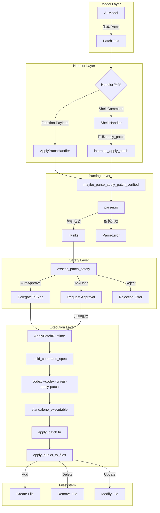
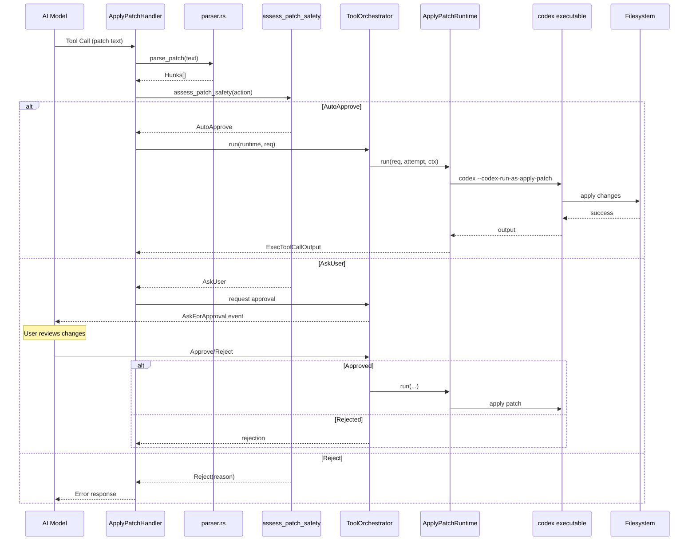
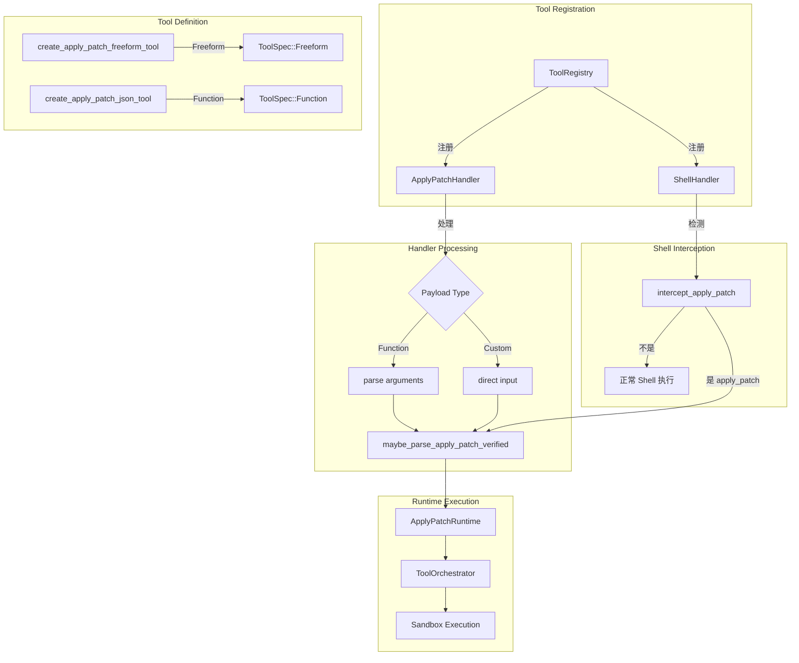
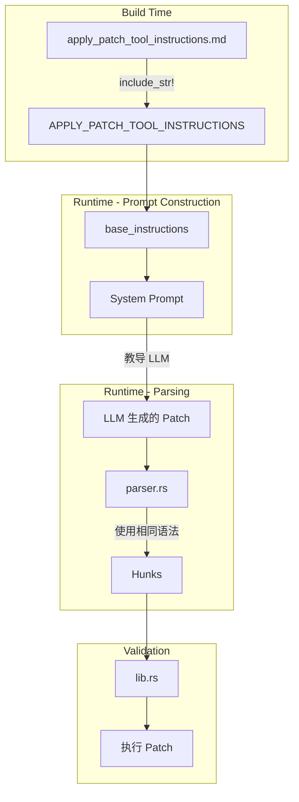
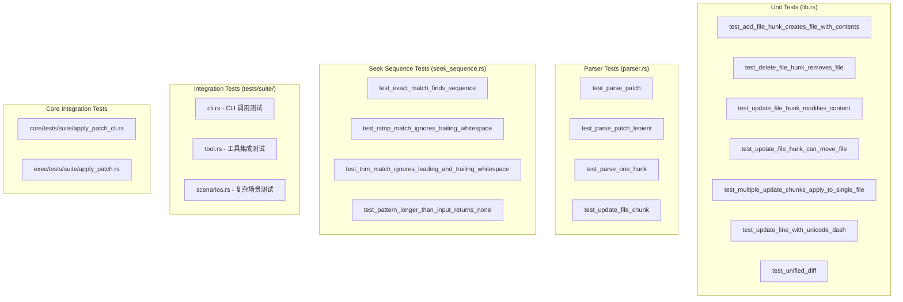

# Codex Apply Patch Tool 深度解析

## 1. 概述

`apply_patch` 是 Codex 中的一个核心文件编辑工具，允许 AI 模型通过一种高级的、基于文本的 diff 格式来安全、精确地修改文件系统中的文件。

### 1.1 设计目标

- **安全性**：需要显式批准才能应用更改
- **精确性**：使用上下文行（context lines）来精确定位修改位置
- **灵活性**：支持添加、更新和删除文件操作
- **模型友好**：格式设计易于语言模型生成和解析

### 1.2 目录结构

```
vendors/codex/codex-rs/apply-patch/
├── apply_patch_tool_instructions.md    # LLM 使用说明
├── Cargo.toml                          # Rust 包配置
├── BUILD.bazel                         # Bazel 构建配置
├── src/
│   ├── lib.rs                          # 核心应用逻辑 (1066 lines)
│   ├── main.rs                         # CLI 入口点
│   ├── parser.rs                       # Patch 格式解析器 (764 lines)
│   ├── invocation.rs                   # Shell 调用检测 (814 lines)
│   ├── seek_sequence.rs                # 模糊行匹配 (152 lines)
│   └── standalone_executable.rs        # 独立运行模式
└── tests/
    └── suite/
        ├── cli.rs                      # CLI 测试
        ├── tool.rs                     # 集成测试
        └── scenarios.rs                # 复杂场景测试
```

---

## 2. 工作原理

### 2.1 整体架构



### 2.2 数据流



---

## 3. Patch 格式详解

### 3.1 基本结构

```
*** Begin Patch
[ 一个或多个文件操作 ]
*** End Patch
```

### 3.2 三种文件操作

| 操作 | 语法 | 描述 |
|------|------|------|
| Add File | `*** Add File: <path>` | 创建新文件，后续每行以 `+` 开头 |
| Delete File | `*** Delete File: <path>` | 删除现有文件，无后续内容 |
| Update File | `*** Update File: <path>` | 修改现有文件，使用 hunks |

### 3.3 Update File Hunks

```
*** Update File: path/to/file.py
*** Move to: new/path/file.py    # 可选：重命名
@@                               # Hunk 开始
 context line                    # 空格开头：上下文行
-old line                        # 减号开头：要删除的行
+new line                        # 加号开头：要添加的行
 context line                    # 空格开头：上下文行
*** End of File                  # 可选：标记文件结尾
```

### 3.4 上下文定位策略

```
@@ class BaseClass              # 第一层：定位到类
@@ def method():                # 第二层：定位到方法
 [3 lines of pre-context]       # 3 行前置上下文
-[old_code]
+[new_code]
 [3 lines of post-context]      # 3 行后置上下文
```

### 3.5 完整示例

```
*** Begin Patch
*** Add File: hello.txt
+Hello world
*** Update File: src/app.py
*** Move to: src/main.py
@@ def greet():
-print("Hi")
+print("Hello, world!")
*** Delete File: obsolete.txt
*** End Patch
```

### 3.6 正式语法（Lark 格式）

```lark
start: begin_patch hunk+ end_patch
begin_patch: "*** Begin Patch" LF
end_patch: "*** End Patch" LF?

hunk: add_hunk | delete_hunk | update_hunk
add_hunk: "*** Add File: " filename LF add_line+
delete_hunk: "*** Delete File: " filename LF
update_hunk: "*** Update File: " filename LF change_move? change?
filename: /(.+)/
add_line: "+" /(.+)/ LF -> line

change_move: "*** Move to: " filename LF
change: (change_context | change_line)+ eof_line?
change_context: ("@@" | "@@ " /(.+)/) LF
change_line: ("+" | "-" | " ") /(.+)/ LF
eof_line: "*** End of File" LF
```

---

## 4. 核心实现

### 4.1 主要数据结构

```rust
// lib.rs - 核心类型定义

/// Patch 应用操作
pub struct ApplyPatchAction {
    changes: HashMap<PathBuf, ApplyPatchFileChange>,
    pub patch: String,           // 原始 patch 文本
    pub cwd: PathBuf,            // 工作目录
}

/// 文件变更类型
pub enum ApplyPatchFileChange {
    Add { content: String },
    Delete { content: String },
    Update {
        unified_diff: String,
        move_path: Option<PathBuf>,
        new_content: String,
    },
}

// parser.rs - 解析后的 Hunk 类型
pub enum Hunk {
    AddFile { path: PathBuf, contents: String },
    DeleteFile { path: PathBuf },
    UpdateFile {
        path: PathBuf,
        move_path: Option<PathBuf>,
        chunks: Vec<UpdateFileChunk>,
    },
}

pub struct UpdateFileChunk {
    pub change_context: Option<String>,  // @@ 后的上下文行
    pub old_lines: Vec<String>,          // 要删除的行
    pub new_lines: Vec<String>,          // 要添加的行
    pub is_end_of_file: bool,            // 是否在文件末尾
}
```

### 4.2 核心函数

```rust
// lib.rs:174 - 主入口
pub fn apply_patch(
    patch: &str,
    stdout: &mut impl std::io::Write,
    stderr: &mut impl std::io::Write,
) -> Result<(), ApplyPatchError> {
    let hunks = parse_patch(patch)?.hunks;
    apply_hunks(&hunks, stdout, stderr)
}

// lib.rs:270 - 应用 hunks 到文件系统
fn apply_hunks_to_files(hunks: &[Hunk]) -> anyhow::Result<AffectedPaths> {
    for hunk in hunks {
        match hunk {
            Hunk::AddFile { path, contents } => {
                // 创建父目录并写入文件
                std::fs::create_dir_all(parent)?;
                std::fs::write(path, contents)?;
            }
            Hunk::DeleteFile { path } => {
                std::fs::remove_file(path)?;
            }
            Hunk::UpdateFile { path, move_path, chunks } => {
                let new_contents = derive_new_contents_from_chunks(path, chunks)?;
                // 处理重命名或原地更新
            }
        }
    }
}

// lib.rs:377 - 计算替换位置
fn compute_replacements(
    original_lines: &[String],
    path: &Path,
    chunks: &[UpdateFileChunk],
) -> Result<Vec<(usize, usize, Vec<String>)>, ApplyPatchError> {
    // 对每个 chunk:
    // 1. 如果有 change_context，用 seek_sequence 找到它
    // 2. 用 seek_sequence 找到 old_lines 在文件中的位置
    // 3. 记录替换信息 (start_idx, old_len, new_lines)
    // 4. 按索引排序，从后向前应用以避免索引偏移
}
```

### 4.3 模糊匹配算法 (seek_sequence.rs)

```rust
/// 在 lines 中从 start 位置开始查找 pattern
/// 按降序尝试不同的匹配严格度：
pub fn seek_sequence(
    lines: &[String],
    pattern: &[String],
    start: usize,
    eof: bool,           // 如果 true，优先从文件末尾开始搜索
) -> Option<usize> {
    // 1. 精确匹配
    for i in search_start..=max_start {
        if lines[i..i + pattern.len()] == *pattern {
            return Some(i);
        }
    }

    // 2. 忽略尾部空白匹配
    for i in search_start..=max_start {
        if all lines[i..].trim_end() == pattern[..].trim_end() {
            return Some(i);
        }
    }

    // 3. 忽略首尾空白匹配
    for i in search_start..=max_start {
        if all lines[i..].trim() == pattern[..].trim() {
            return Some(i);
        }
    }

    // 4. Unicode 规范化匹配
    // 将 Unicode 标点符号转换为 ASCII 等价物：
    // - EN DASH (–) → -
    // - Fancy quotes (" ") → "
    // - Non-breaking space → regular space
    fn normalise(s: &str) -> String {
        s.trim().chars().map(|c| match c {
            '\u{2010}'..='\u{2015}' | '\u{2212}' => '-',
            '\u{2018}'..='\u{201B}' => '\'',
            '\u{201C}'..='\u{201F}' => '"',
            '\u{00A0}' | '\u{2002}'..='\u{3000}' => ' ',
            other => other,
        }).collect()
    }
}
```

### 4.4 Shell 调用检测 (invocation.rs)

```rust
// 支持的调用形式：
// 1. 直接调用: ["apply_patch", "<patch>"]
// 2. Shell heredoc: ["bash", "-lc", "apply_patch <<'EOF'\n...\nEOF"]
// 3. 带 cd: ["bash", "-lc", "cd path && apply_patch <<'EOF'\n...\nEOF"]

pub fn maybe_parse_apply_patch_verified(
    argv: &[String],
    cwd: &Path,
) -> MaybeApplyPatchVerified {
    // 检测隐式调用（原始 patch 体作为命令）
    if let [body] = argv && parse_patch(body).is_ok() {
        return CorrectnessError(ImplicitInvocation);
    }

    match maybe_parse_apply_patch(argv) {
        Body(args) => {
            // 解析成功，构建 ApplyPatchAction
            // 解析每个 hunk，生成 unified diff
        }
        ShellParseError(_) | PatchParseError(_) | NotApplyPatch => ...
    }
}

// 使用 tree-sitter 解析 bash 脚本
fn extract_apply_patch_from_bash(script: &str) -> Result<(String, Option<String>), ExtractHeredocError> {
    // 解析 bash AST
    // 提取 heredoc 内容
    // 识别可选的 cd 命令
}
```

---

## 5. 与 Codex 的集成

### 5.1 集成架构



### 5.2 Handler 实现 (handlers/apply_patch.rs)

```rust
pub struct ApplyPatchHandler;

#[async_trait]
impl ToolHandler for ApplyPatchHandler {
    fn kind(&self) -> ToolKind { ToolKind::Function }

    fn matches_kind(&self, payload: &ToolPayload) -> bool {
        matches!(payload, ToolPayload::Function { .. } | ToolPayload::Custom { .. })
    }

    async fn is_mutating(&self, _: &ToolInvocation) -> bool { true }

    async fn handle(&self, invocation: ToolInvocation) -> Result<ToolOutput, FunctionCallError> {
        // 1. 提取 patch 输入
        let patch_input = match payload {
            ToolPayload::Function { arguments } => parse_arguments(&arguments)?.input,
            ToolPayload::Custom { input } => input,
        };

        // 2. 验证和解析 patch
        let command = vec!["apply_patch".to_string(), patch_input];
        match codex_apply_patch::maybe_parse_apply_patch_verified(&command, &cwd) {
            MaybeApplyPatchVerified::Body(changes) => {
                // 3. 评估安全性并执行
                match apply_patch::apply_patch(turn.as_ref(), changes).await {
                    InternalApplyPatchInvocation::Output(item) => { /* 直接返回 */ }
                    InternalApplyPatchInvocation::DelegateToExec(apply) => {
                        // 4. 通过 orchestrator 执行
                        let req = ApplyPatchRequest { action, ... };
                        let out = orchestrator.run(&mut runtime, &req, ...).await;
                    }
                }
            }
            // 错误处理...
        }
    }
}
```

### 5.3 Shell 拦截 (intercept_apply_patch)

```rust
/// 当 shell 命令可能是 apply_patch 调用时拦截处理
pub async fn intercept_apply_patch(
    command: &[String],
    cwd: &Path,
    ...,
) -> Result<Option<ToolOutput>, FunctionCallError> {
    match codex_apply_patch::maybe_parse_apply_patch_verified(command, cwd) {
        MaybeApplyPatchVerified::Body(changes) => {
            // 记录警告：应使用 apply_patch 工具而非 exec_command
            session.record_model_warning(...).await;

            // 执行 apply_patch
            match apply_patch::apply_patch(turn, changes).await {
                InternalApplyPatchInvocation::DelegateToExec(apply) => {
                    // 同 handler 处理逻辑
                }
            }
        }
        MaybeApplyPatchVerified::NotApplyPatch => Ok(None),  // 不是 apply_patch，继续正常处理
    }
}
```

### 5.4 Runtime 实现 (runtimes/apply_patch.rs)

```rust
pub struct ApplyPatchRuntime;

impl ToolRuntime<ApplyPatchRequest, ExecToolCallOutput> for ApplyPatchRuntime {
    async fn run(
        &mut self,
        req: &ApplyPatchRequest,
        attempt: &SandboxAttempt<'_>,
        ctx: &ToolCtx<'_>,
    ) -> Result<ExecToolCallOutput, ToolError> {
        // 构建命令规格
        let spec = Self::build_command_spec(req)?;
        // 在沙箱环境中执行
        let env = attempt.env_for(spec)?;
        execute_env(env, attempt.policy, Self::stdout_stream(ctx)).await
    }
}

fn build_command_spec(req: &ApplyPatchRequest) -> Result<CommandSpec, ToolError> {
    let exe = req.codex_exe.clone().unwrap_or(env::current_exe()?);
    Ok(CommandSpec {
        program: exe.to_string_lossy().to_string(),
        args: vec![CODEX_APPLY_PATCH_ARG1.to_string(), req.action.patch.clone()],
        cwd: req.action.cwd.clone(),
        env: HashMap::new(),  // 最小化环境变量
        ...
    })
}
```

### 5.5 安全评估 (core/src/apply_patch.rs)

```rust
pub async fn apply_patch(
    turn_context: &TurnContext,
    action: ApplyPatchAction,
) -> InternalApplyPatchInvocation {
    match assess_patch_safety(&action, approval_policy, sandbox_policy, cwd) {
        SafetyCheck::AutoApprove { user_explicitly_approved, .. } => {
            // 自动批准，委托给 exec
            InternalApplyPatchInvocation::DelegateToExec(ApplyPatchExec {
                action,
                auto_approved: !user_explicitly_approved,
                exec_approval_requirement: ExecApprovalRequirement::Skip { ... },
            })
        }
        SafetyCheck::AskUser => {
            // 需要用户批准
            InternalApplyPatchInvocation::DelegateToExec(ApplyPatchExec {
                exec_approval_requirement: ExecApprovalRequirement::NeedsApproval { ... },
                ...
            })
        }
        SafetyCheck::Reject { reason } => {
            // 拒绝执行
            InternalApplyPatchInvocation::Output(Err(
                FunctionCallError::RespondToModel(format!("patch rejected: {reason}"))
            ))
        }
    }
}
```

---

## 6. apply_patch_tool_instructions.md 的作用

### 6.1 文件位置和内容

该文件位于 `apply-patch/apply_patch_tool_instructions.md`，包含约 76 行内容，是一份教 LLM 如何使用 `apply_patch` 工具的详细说明。

### 6.2 代码中的引用

```rust
// lib.rs:26
/// 详细的 apply_patch 工具使用说明，用于 gpt-4.1 等模型
pub const APPLY_PATCH_TOOL_INSTRUCTIONS: &str = include_str!("../apply_patch_tool_instructions.md");
```

### 6.3 使用场景


### 6.4 关键内容摘要

1. **格式介绍**：解释 patch 语言是一种精简的、面向文件的 diff 格式
2. **操作说明**：详细说明三种文件操作（Add/Delete/Update）
3. **Hunk 语法**：说明 `@@` 上下文标记和行前缀（` `/`-`/`+`）
4. **上下文规则**：默认 3 行上下文，如何使用 `@@` 定位
5. **语法定义**：提供正式的 Lark 格式语法
6. **调用示例**：展示如何通过 shell tool 调用

### 6.5 与 apply_patch crate 的关系



说明文档和解析器共享相同的语法定义，确保：
- LLM 按照说明生成的 patch 能被正确解析
- 解析器的行为符合说明文档的描述
- 错误消息与文档中的术语一致

---

## 7. 测试策略

### 7.1 测试层次



### 7.2 关键测试用例

#### 单元测试示例

```rust
// 文件添加测试
#[test]
fn test_add_file_hunk_creates_file_with_contents() {
    let dir = tempdir().unwrap();
    let path = dir.path().join("add.txt");
    let patch = wrap_patch(&format!(
        r#"*** Add File: {}
+ab
+cd"#,
        path.display()
    ));
    apply_patch(&patch, &mut stdout, &mut stderr).unwrap();
    let contents = fs::read_to_string(path).unwrap();
    assert_eq!(contents, "ab\ncd\n");
}

// Unicode 规范化测试
#[test]
fn test_update_line_with_unicode_dash() {
    // 原始文件包含 EN DASH (\u{2013}) 和 NON-BREAKING HYPHEN (\u{2011})
    let original = "import asyncio  # local import \u{2013} avoids top\u{2011}level dep\n";
    std::fs::write(&path, original).unwrap();

    // Patch 使用普通 ASCII 破折号
    let patch = wrap_patch(&format!(
        r#"*** Update File: {}
@@
-import asyncio  # local import - avoids top-level dep
+import asyncio  # HELLO"#,
        path.display()
    ));

    apply_patch(&patch, &mut stdout, &mut stderr).unwrap();
    // 验证更新成功
}
```

#### 解析器测试示例

```rust
#[test]
fn test_parse_patch_lenient() {
    let patch_text = r#"*** Begin Patch
*** Update File: file2.py
 import foo
+bar
*** End Patch"#;

    // 测试 heredoc 格式
    let patch_text_in_heredoc = format!("<<EOF\n{patch_text}\nEOF\n");

    // Strict 模式应该失败
    assert!(parse_patch_text(&patch_text_in_heredoc, ParseMode::Strict).is_err());

    // Lenient 模式应该成功
    assert!(parse_patch_text(&patch_text_in_heredoc, ParseMode::Lenient).is_ok());
}
```

### 7.3 运行测试

```bash
# 运行 apply-patch crate 的所有测试
cd vendors/codex/codex-rs/apply-patch
cargo test

# 运行特定测试
cargo test test_add_file_hunk

# 运行 core 集成测试
cd vendors/codex/codex-rs/core
cargo test apply_patch
```

---

## 8. 错误处理

### 8.1 错误类型

```rust
pub enum ApplyPatchError {
    /// 解析错误
    ParseError(ParseError),

    /// I/O 错误
    IoError(IoError),

    /// 计算替换位置时的错误（找不到上下文行）
    ComputeReplacements(String),

    /// 原始 patch 体未通过显式 apply_patch 调用
    ImplicitInvocation,
}

pub enum ParseError {
    /// 无效的 patch 格式
    InvalidPatchError(String),

    /// 无效的 hunk
    InvalidHunkError { message: String, line_number: usize },
}
```

### 8.2 常见错误场景

| 错误场景 | 错误类型 | 示例消息 |
|---------|---------|---------|
| 缺少 Begin Patch | `InvalidPatchError` | "The first line must be '*** Begin Patch'" |
| 空的 Update hunk | `InvalidHunkError` | "Update file hunk for path 'x' is empty" |
| 找不到上下文 | `ComputeReplacements` | "Failed to find context 'def foo()' in file.py" |
| 文件不存在 | `IoError` | "Failed to read file to update path/to/file" |
| 隐式调用 | `ImplicitInvocation` | "patch detected without explicit call to apply_patch" |

---

## 9. 使用建议

### 9.1 生成 Patch 的最佳实践

1. **始终使用相对路径**：永远不要使用绝对路径
2. **提供足够的上下文**：默认 3 行上下文，必要时使用 `@@` 定位
3. **处理重复代码**：使用多层 `@@` 来精确定位
4. **标记文件末尾**：在文件末尾添加内容时使用 `*** End of File`

### 9.2 调用方式

```json
// Function 方式（推荐）
{
  "name": "apply_patch",
  "arguments": {
    "input": "*** Begin Patch\n*** Add File: hello.txt\n+Hello, world!\n*** End Patch\n"
  }
}

// Shell 方式
{
  "name": "shell",
  "arguments": {
    "command": ["apply_patch", "*** Begin Patch\n*** Add File: hello.txt\n+Hello, world!\n*** End Patch\n"]
  }
}
```

---

## 10. 总结

`apply_patch` 工具是 Codex 文件编辑功能的核心组件，通过以下特性实现了安全、精确的文件修改：

1. **清晰的格式设计**：基于 diff 的高级抽象，易于 LLM 理解和生成
2. **多层模糊匹配**：通过 `seek_sequence` 实现灵活的上下文定位
3. **完整的安全机制**：集成审批流程和沙箱执行
4. **良好的集成设计**：与 shell 拦截、tool handler 系统紧密配合
5. **全面的测试覆盖**：从单元测试到集成测试的完整测试策略

这种设计使得 AI 模型能够通过一种结构化的方式安全地修改代码，同时保持用户对所有更改的控制权。
