# OpenAI Codex CLI 深度架构分析

> 本文档由 Claude 撰写，对 OpenAI Codex CLI 的架构进行全面深入的分析。

## 目录

1. [项目概述](#1-项目概述)
2. [整体架构设计](#2-整体架构设计)
3. [核心模块深度分析](#3-核心模块深度分析)
4. [工具系统架构](#4-工具系统架构)
5. [沙箱安全机制](#5-沙箱安全机制)
6. [MCP 协议集成](#6-mcp-协议集成)
7. [配置系统](#7-配置系统)
8. [用户界面层](#8-用户界面层)
9. [数据流与控制流](#9-数据流与控制流)
10. [技术栈与依赖](#10-技术栈与依赖)
11. [关键设计模式](#11-关键设计模式)
12. [总结与架构评估](#12-总结与架构评估)

---

## 1. 项目概述

### 1.1 Codex CLI 定位

Codex CLI 是 OpenAI 开发的本地运行的 AI 编码代理（Coding Agent），具有以下核心特点：

- **本地优先**：在用户计算机上直接运行，无需云端托管
- **安全沙箱**：所有命令在受控沙箱环境中执行，保护系统安全
- **多接口支持**：TUI、VS Code 扩展、SDK 等多种使用方式
- **可扩展性**：通过 MCP 协议支持第三方工具集成
- **跨平台**：支持 macOS、Linux、Windows 三大平台

### 1.2 项目结构总览

```
codex/
├── codex-cli/              # Node.js CLI 启动器（包装层）
├── codex-rs/               # Rust 核心实现（50+ crates）
│   ├── core/               # 核心业务逻辑库
│   ├── protocol/           # 通信协议定义
│   ├── cli/                # CLI 多工具入口
│   ├── tui/                # 终端用户界面 (Ratatui)
│   ├── tui2/               # TUI v2 实验版本
│   ├── exec/               # 非交互式执行模式
│   ├── app-server/         # IDE 集成服务器
│   ├── mcp-server/         # MCP 服务器实现
│   ├── linux-sandbox/      # Linux 沙箱实现
│   ├── windows-sandbox-rs/ # Windows 沙箱实现
│   ├── client/             # API 客户端
│   ├── auth/               # 身份验证
│   ├── login/              # 登录管理
│   └── utils/              # 工具库集合
├── sdk/typescript/         # TypeScript SDK
├── shell-tool-mcp/         # Shell 工具 MCP 服务器
└── docs/                   # 文档
```

### 1.3 代码规模统计

| 组件 | 文件数 | 主要大文件 |
|------|--------|----------|
| core/src/ | ~75 个 Rust 文件 | codex.rs (4558 行) |
| tools/handlers/ | 13 个处理器 | spec.rs (88.5KB) |
| config/ | 8 个文件 | mod.rs (159KB) |
| tui/src/ | 63 个文件 | chatwidget.rs (180KB) |
| 总 crates | 50+ | - |

---

## 2. 整体架构设计

### 2.1 高层架构图

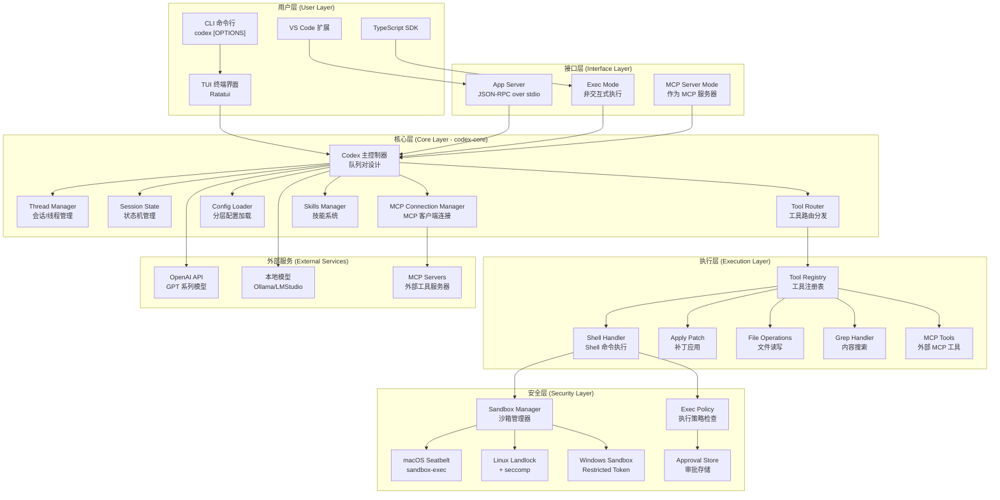

### 2.2 Cargo 工作区依赖图

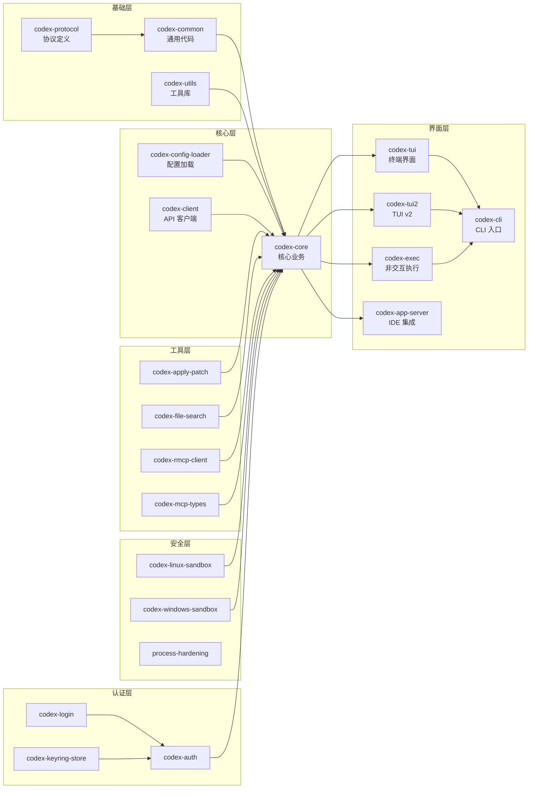

---

## 3. 核心模块深度分析

### 3.1 Codex 主控制器架构

Codex 主控制器采用**队列对设计模式**，通过异步通道实现解耦：

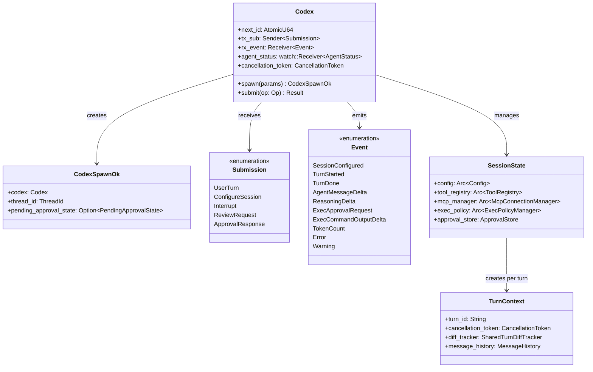

### 3.2 会话与轮次生命周期

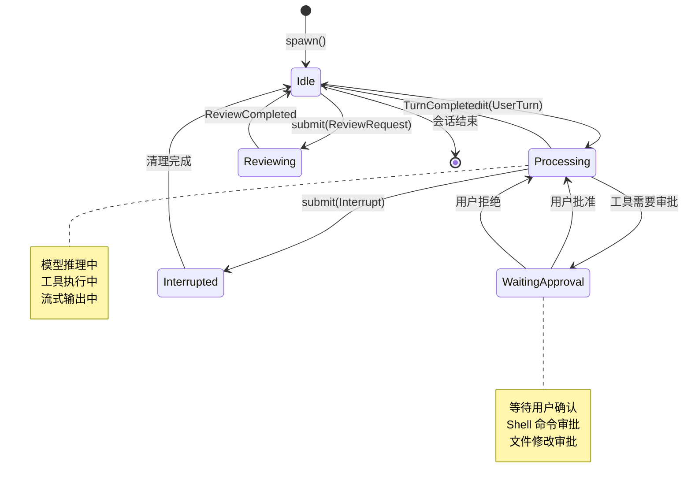

### 3.3 Thread 与 Turn 概念模型

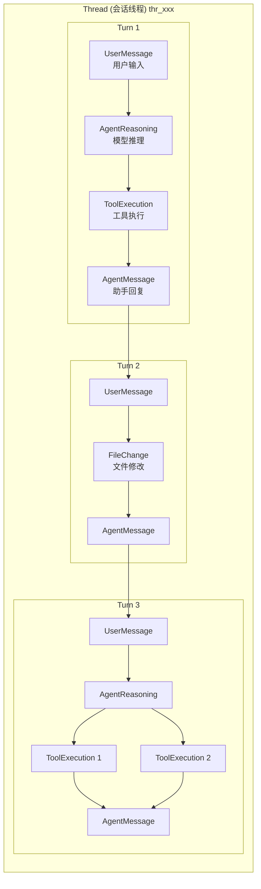

### 3.4 核心文件职责映射

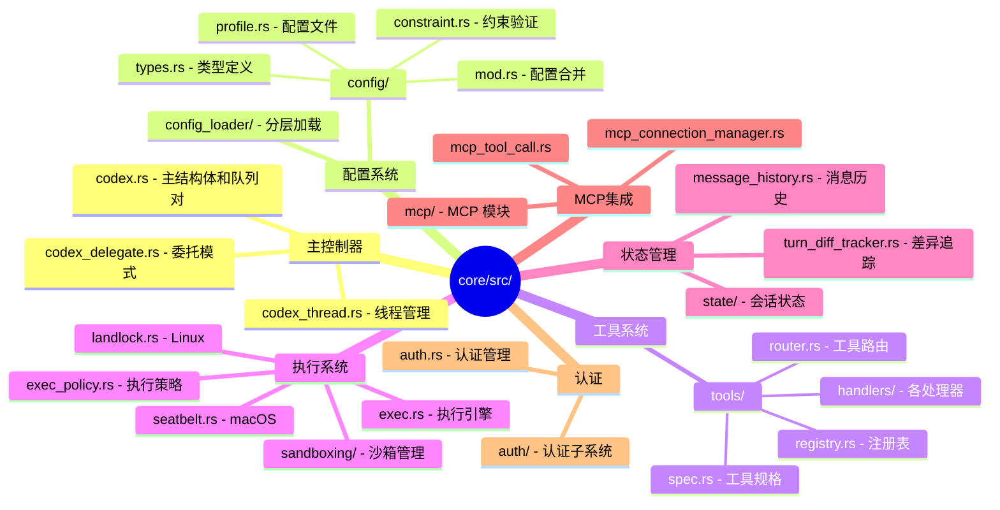

---

## 4. 工具系统架构

### 4.1 工具注册与路由流程

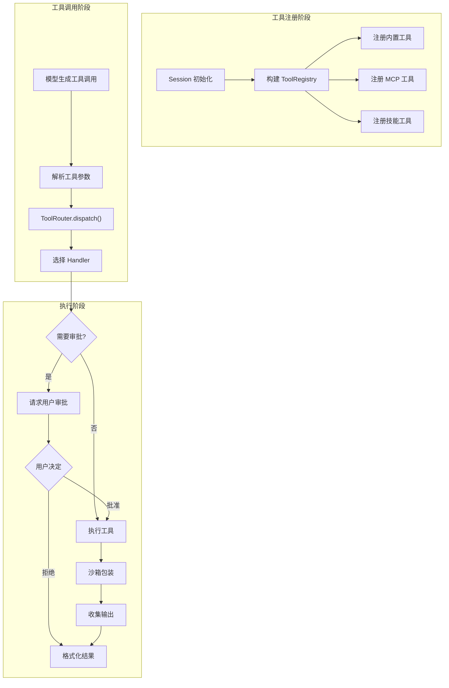

### 4.2 内置工具处理器层次

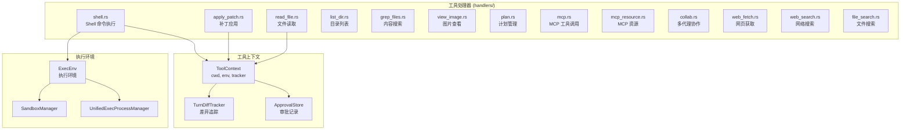

### 4.3 工具规格定义结构

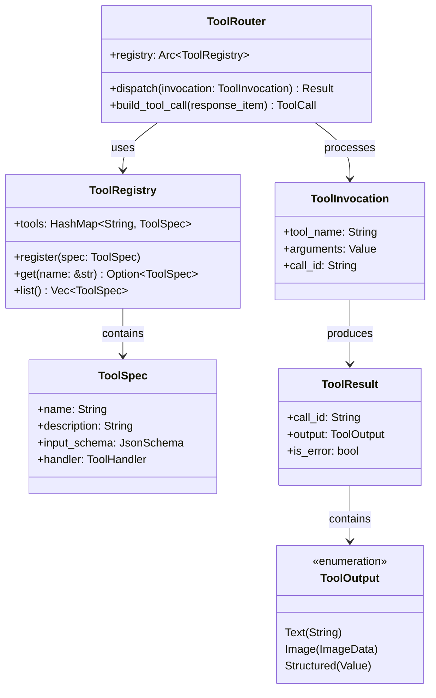

### 4.4 工具详细列表

| 工具名称 | 处理器 | 描述 | 需要沙箱 |
|---------|--------|------|---------|
| `shell` | ShellHandler | 执行 shell 命令 | 是 |
| `local_shell` | ShellCommandHandler | 本地 shell 执行 | 是 |
| `apply_patch` | ApplyPatchHandler | 应用文件补丁 | 否 |
| `read_file` | ReadFileHandler | 读取文件内容 | 否 |
| `list_dir` | ListDirHandler | 列出目录内容 | 否 |
| `grep_files` | GrepFilesHandler | 搜索文件内容 | 否 |
| `view_image` | ViewImageHandler | 查看图片 | 否 |
| `plan` | PlanHandler | 更新执行计划 | 否 |
| `web_fetch` | WebFetchHandler | 获取网页内容 | 否 |
| `web_search` | WebSearchHandler | 网络搜索 | 否 |
| `file_search` | FileSearchHandler | 文件搜索 | 否 |
| `mcp_*` | McpHandler | MCP 工具调用 | 取决于工具 |
| `collab_*` | CollabHandler | 多代理协作 | 否 |

---

## 5. 沙箱安全机制

### 5.1 多平台沙箱策略

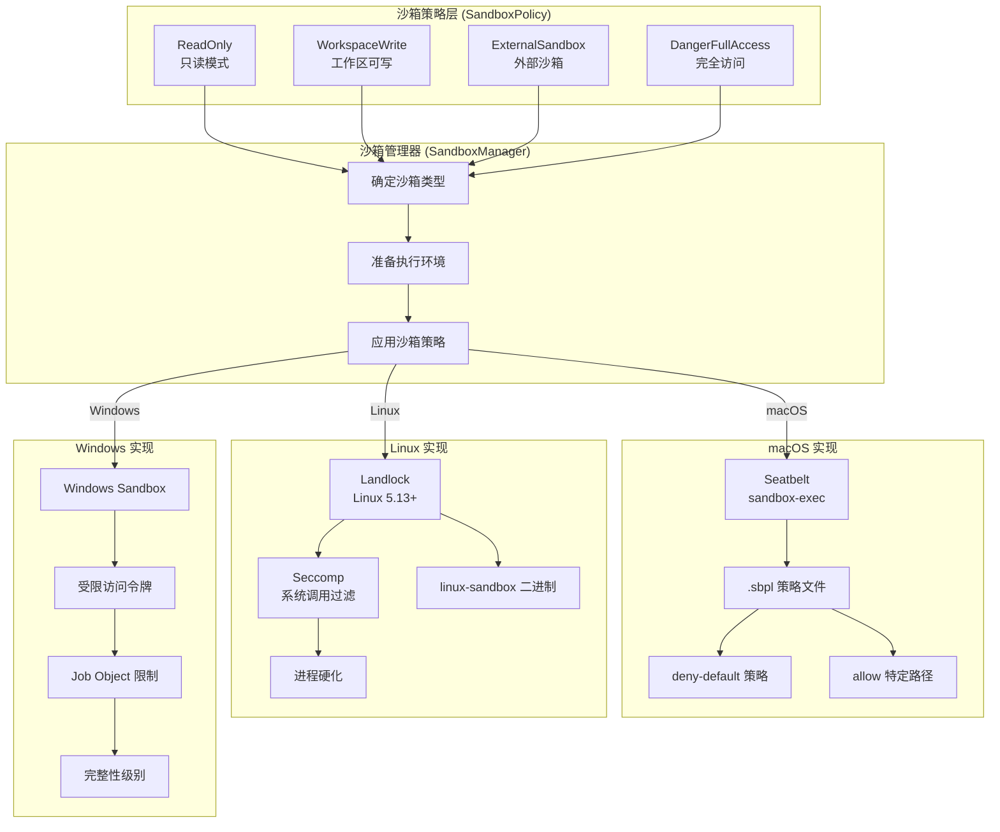

### 5.2 沙箱模式权限矩阵

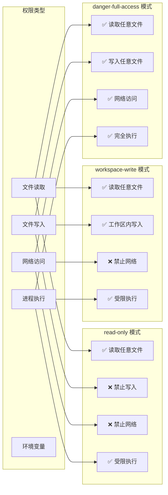

### 5.3 执行策略检查流程

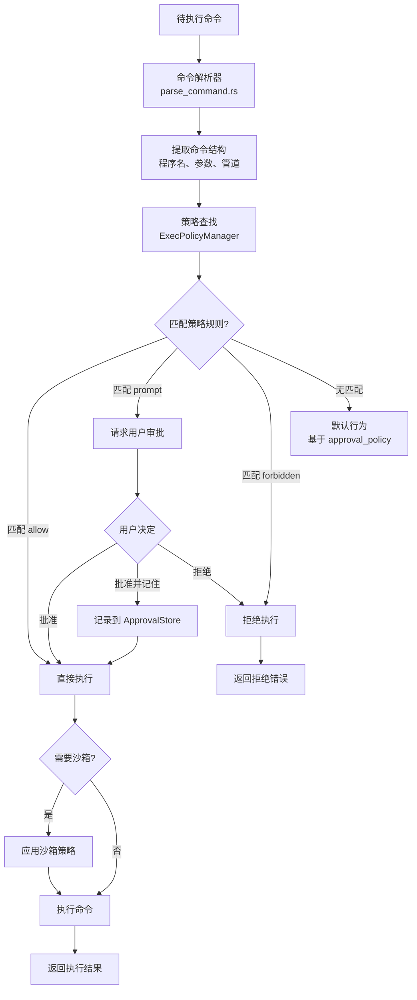

### 5.4 macOS Seatbelt 策略示例

```mermaid
graph TB
    subgraph "Seatbelt 策略结构"
        Version["(version 1)"]
        DenyDefault["(deny default)"]

        subgraph "允许规则"
            AllowRead["(allow file-read*<br/>  (subpath \"/\"))"]
            AllowWrite["(allow file-write*<br/>  (subpath workspace))"]
            AllowProcess["(allow process-exec<br/>  (subpath \"/usr/bin\"))"]
            AllowSignal["(allow signal<br/>  (target self))"]
        end

        subgraph "拒绝规则"
            DenyNetwork["(deny network*)"]
            DenySysctl["(deny sysctl-write)"]
            DenyIPC["(deny ipc-posix-shm-write*)"]
        end
    end

    Version --> DenyDefault
    DenyDefault --> AllowRead
    DenyDefault --> AllowWrite
    DenyDefault --> AllowProcess
    DenyDefault --> AllowSignal
    DenyDefault --> DenyNetwork
    DenyDefault --> DenySysctl
    DenyDefault --> DenyIPC
```

---

## 6. MCP 协议集成

### 6.1 MCP 双向架构

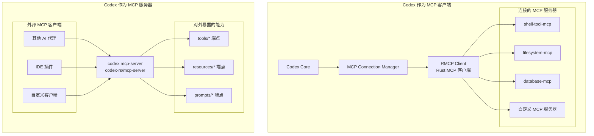

### 6.2 MCP 连接生命周期

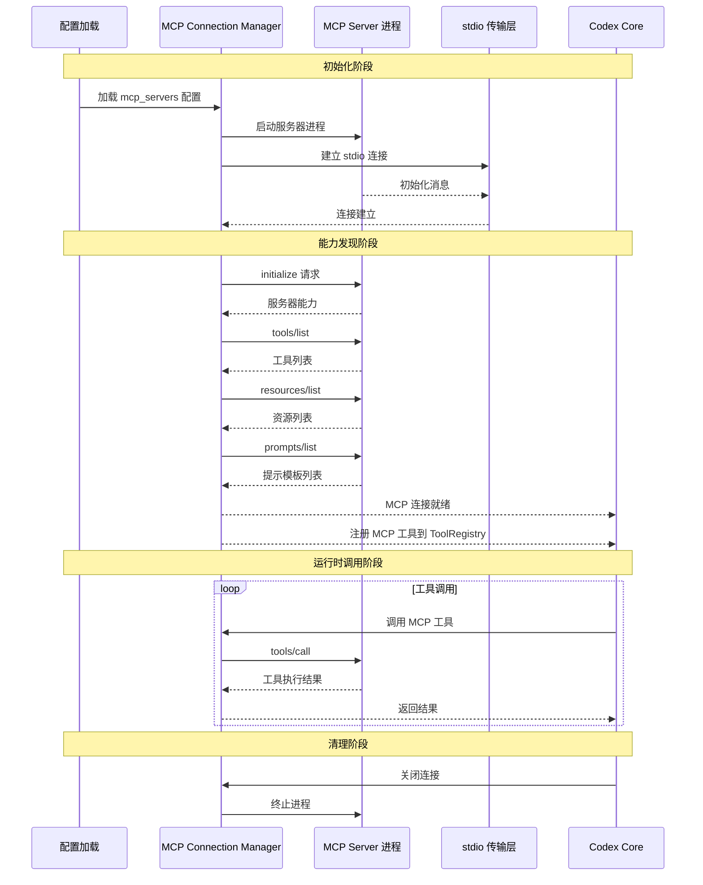

### 6.3 MCP 配置示例

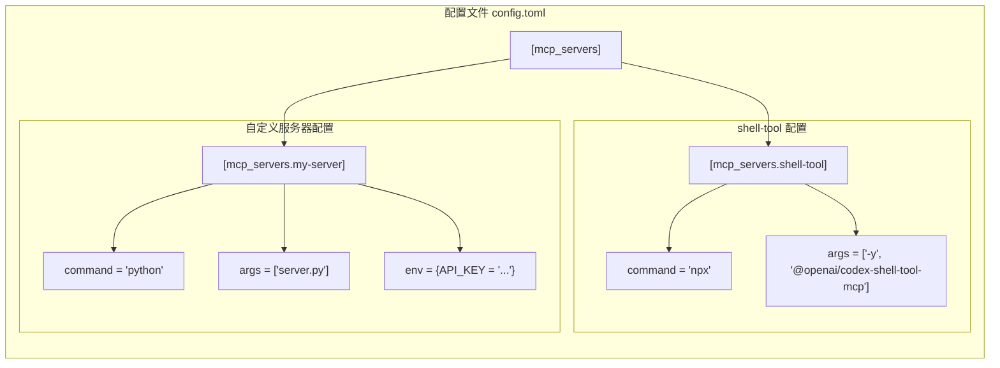

---

## 7. 配置系统

### 7.1 配置分层架构

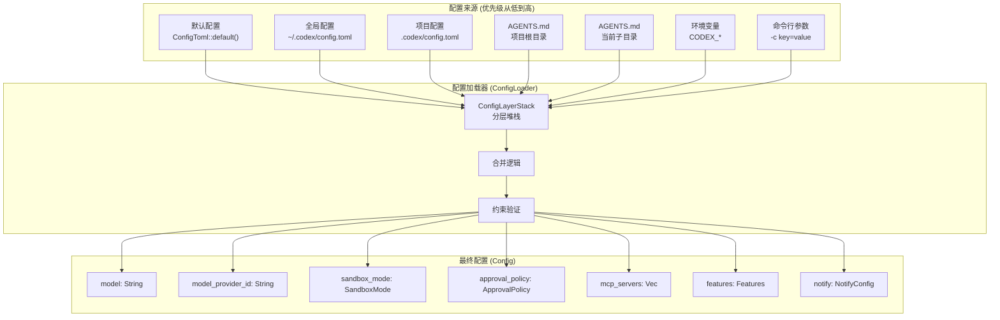

### 7.2 配置约束系统

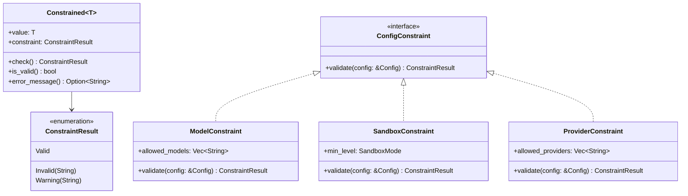

### 7.3 主要配置项详解

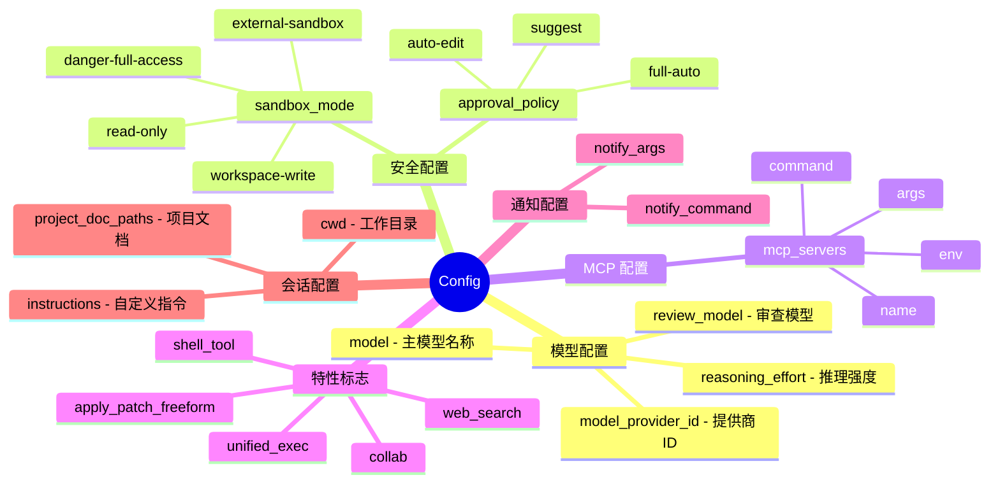

---

## 8. 用户界面层

### 8.1 TUI 架构

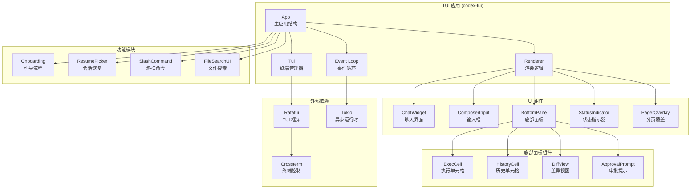

### 8.2 App Server 架构 (IDE 集成)

```mermaid
graph TB
    subgraph "VS Code 扩展"
        Extension["Codex VS Code Extension"]
        WebView["WebView UI"]
        Commands["命令面板"]
    end

    subgraph "App Server (codex-app-server)"
        StdinReader["stdin 读取器"]
        StdoutWriter["stdout 写入器"]
        MessageRouter["消息路由器"]

        subgraph "API 处理器"
            InitHandler["initialize 处理器"]
            ThreadHandler["thread/* 处理器"]
            TurnHandler["turn/* 处理器"]
            ConfigHandler["config/* 处理器"]
            AccountHandler["account/* 处理器"]
            SkillsHandler["skills/* 处理器"]
        end
    end

    subgraph "Codex Core"
        CodexInstance["Codex 实例"]
        EventStream["事件流"]
    end

    Extension <-->|"JSON-RPC<br/>over stdio"| StdinReader
    Extension <-->|"JSON-RPC<br/>over stdio"| StdoutWriter

    StdinReader --> MessageRouter
    MessageRouter --> StdoutWriter

    MessageRouter --> InitHandler
    MessageRouter --> ThreadHandler
    MessageRouter --> TurnHandler
    MessageRouter --> ConfigHandler
    MessageRouter --> AccountHandler
    MessageRouter --> SkillsHandler

    ThreadHandler --> CodexInstance
    TurnHandler --> CodexInstance
    CodexInstance --> EventStream
    EventStream --> StdoutWriter
```

### 8.3 CLI 多工具入口

```mermaid
flowchart TB
    subgraph "codex CLI 入口 (codex-rs/cli)"
        Main["main.rs<br/>入口点"]
        Parser["Clap 参数解析"]
    end

    subgraph "子命令"
        Default["默认: 交互式 TUI"]
        Exec["codex exec<br/>非交互式执行"]
        Review["codex review<br/>代码审查"]
        Login["codex login<br/>身份验证"]
        MCP["codex mcp<br/>MCP 管理"]
        Sandbox["codex sandbox<br/>沙箱测试"]
        Resume["codex resume<br/>恢复会话"]
        Fork["codex fork<br/>分叉会话"]
        AppServer["codex app-server<br/>IDE 集成服务"]
        MCPServer["codex mcp-server<br/>MCP 服务器模式"]
    end

    subgraph "目标模块"
        TUIModule["codex-tui"]
        ExecModule["codex-exec"]
        AppServerModule["codex-app-server"]
        MCPServerModule["codex-mcp-server"]
        LoginModule["codex-login"]
    end

    Main --> Parser
    Parser --> Default
    Parser --> Exec
    Parser --> Review
    Parser --> Login
    Parser --> MCP
    Parser --> Sandbox
    Parser --> Resume
    Parser --> Fork
    Parser --> AppServer
    Parser --> MCPServer

    Default --> TUIModule
    Exec --> ExecModule
    Review --> ExecModule
    AppServer --> AppServerModule
    MCPServer --> MCPServerModule
    Login --> LoginModule
```

---

## 9. 数据流与控制流

### 9.1 完整请求处理流程

```mermaid
sequenceDiagram
    participant User as 用户
    participant TUI as TUI 界面
    participant Codex as Codex 控制器
    participant Session as SessionState
    participant ModelClient as 模型客户端
    participant ToolRouter as 工具路由器
    participant Sandbox as 沙箱
    participant API as OpenAI API

    User->>TUI: 输入 "Create a hello.txt file"
    TUI->>Codex: submit(UserTurn)

    Codex->>Session: 创建 TurnContext
    Codex->>Session: 构建消息历史

    Codex->>ModelClient: 发送请求
    ModelClient->>API: HTTP 请求

    loop 流式响应
        API-->>ModelClient: SSE 事件
        ModelClient-->>Codex: ResponseEvent

        alt 推理内容
            Codex-->>TUI: ReasoningDelta
            TUI-->>User: 显示推理过程
        else 文本内容
            Codex-->>TUI: AgentMessageDelta
            TUI-->>User: 显示助手回复
        else 工具调用
            Codex->>ToolRouter: dispatch_tool_call()
            ToolRouter->>ToolRouter: 检查审批需求

            alt 需要审批
                ToolRouter-->>TUI: ExecApprovalRequest
                TUI-->>User: 显示审批对话框
                User->>TUI: 批准/拒绝
                TUI->>Codex: ApprovalResponse
            end

            ToolRouter->>Sandbox: 沙箱化执行
            Sandbox-->>ToolRouter: 执行结果
            ToolRouter-->>Codex: 工具输出
            Codex->>ModelClient: 提交工具结果
        end
    end

    Codex-->>TUI: TurnCompleted
    TUI-->>User: 显示完成状态
```

### 9.2 异步事件流模型

```mermaid
graph TB
    subgraph "提交队列 (Submission Channel)"
        UserTurn["UserTurn<br/>用户输入"]
        ConfigSession["ConfigureSession<br/>配置会话"]
        Interrupt["Interrupt<br/>中断请求"]
        ReviewReq["ReviewRequest<br/>审查请求"]
        ApprovalResp["ApprovalResponse<br/>审批响应"]
    end

    subgraph "Codex 主循环"
        RxSub["rx_sub.recv()"]
        HandleSubmission["处理提交"]
        EmitEvents["发射事件"]
    end

    subgraph "事件队列 (Event Channel)"
        SessionEvents["会话事件"]
        TurnEvents["轮次事件"]
        ItemEvents["项目事件"]
        ExecEvents["执行事件"]
        ApprovalEvents["审批事件"]
        ErrorEvents["错误事件"]
    end

    subgraph "UI 事件循环"
        RxEvent["rx_event.recv()"]
        UpdateUI["更新 UI 状态"]
        RenderFrame["渲染帧"]
    end

    UserTurn --> RxSub
    ConfigSession --> RxSub
    Interrupt --> RxSub
    ReviewReq --> RxSub
    ApprovalResp --> RxSub

    RxSub --> HandleSubmission
    HandleSubmission --> EmitEvents

    EmitEvents --> SessionEvents
    EmitEvents --> TurnEvents
    EmitEvents --> ItemEvents
    EmitEvents --> ExecEvents
    EmitEvents --> ApprovalEvents
    EmitEvents --> ErrorEvents

    SessionEvents --> RxEvent
    TurnEvents --> RxEvent
    ItemEvents --> RxEvent
    ExecEvents --> RxEvent
    ApprovalEvents --> RxEvent
    ErrorEvents --> RxEvent

    RxEvent --> UpdateUI
    UpdateUI --> RenderFrame
```

### 9.3 Shell 命令执行详细流程

```mermaid
flowchart TB
    subgraph "1. 工具调用解析"
        ModelOutput["模型输出工具调用"]
        ParseArgs["解析参数<br/>{command: [...]}"]
        BuildInvocation["构建 ToolInvocation"]
    end

    subgraph "2. 权限检查"
        CheckPolicy["检查执行策略"]
        PolicyMatch{"策略匹配?"}
        AllowPolicy["allow - 直接执行"]
        PromptPolicy["prompt - 请求审批"]
        ForbidPolicy["forbidden - 拒绝"]
        DefaultPolicy["default - 使用默认"]
    end

    subgraph "3. 审批流程"
        EmitApprovalReq["发送审批请求事件"]
        WaitApproval["等待用户响应"]
        ApprovalDecision{"用户决定"}
        RecordApproval["记录到 ApprovalStore"]
    end

    subgraph "4. 执行准备"
        CreateExecEnv["创建 ExecEnv"]
        DetermineCwd["确定工作目录"]
        SetupEnv["设置环境变量"]
        SelectSandbox["选择沙箱类型"]
    end

    subgraph "5. 沙箱执行"
        PrepareSandbox["准备沙箱策略"]
        SpawnProcess["生成子进程"]
        SetupPTY["设置 PTY/ConPTY"]
        ApplyRestrictions["应用限制"]
    end

    subgraph "6. 输出处理"
        StreamOutput["流式输出"]
        CollectStdout["收集 stdout"]
        CollectStderr["收集 stderr"]
        WaitExit["等待退出"]
        TruncateOutput["截断长输出"]
    end

    subgraph "7. 结果返回"
        BuildResult["构建 ToolResult"]
        EmitOutputDelta["发送输出事件"]
        ReturnToModel["返回给模型"]
    end

    ModelOutput --> ParseArgs --> BuildInvocation
    BuildInvocation --> CheckPolicy

    CheckPolicy --> PolicyMatch
    PolicyMatch -->|allow| AllowPolicy --> CreateExecEnv
    PolicyMatch -->|prompt| PromptPolicy --> EmitApprovalReq
    PolicyMatch -->|forbidden| ForbidPolicy --> BuildResult
    PolicyMatch -->|no match| DefaultPolicy --> EmitApprovalReq

    EmitApprovalReq --> WaitApproval --> ApprovalDecision
    ApprovalDecision -->|批准| RecordApproval --> CreateExecEnv
    ApprovalDecision -->|拒绝| BuildResult

    CreateExecEnv --> DetermineCwd --> SetupEnv --> SelectSandbox

    SelectSandbox --> PrepareSandbox --> SpawnProcess
    SpawnProcess --> SetupPTY --> ApplyRestrictions

    ApplyRestrictions --> StreamOutput
    StreamOutput --> CollectStdout
    StreamOutput --> CollectStderr
    CollectStdout --> WaitExit
    CollectStderr --> WaitExit
    WaitExit --> TruncateOutput

    TruncateOutput --> BuildResult --> EmitOutputDelta --> ReturnToModel
```

### 9.4 会话持久化流程

```mermaid
graph TB
    subgraph "运行时会话"
        ActiveSession["活动会话<br/>SessionState"]
        TurnHistory["Turn 历史<br/>Vec<Turn>"]
        MessageHistory["消息历史<br/>MessageHistory"]
    end

    subgraph "序列化"
        RolloutManager["Rollout Manager"]
        Serializer["JSON 序列化"]
    end

    subgraph "存储层"
        SessionsDir["~/.codex/sessions/"]
        ThreadDir["sessions/{thread_id}/"]
        RolloutFile["rollout.jsonl<br/>NDJSON 格式"]
        MetadataFile["metadata.json"]
        ArchivedDir["archived/"]
    end

    subgraph "操作"
        Save["保存会话"]
        Load["加载会话"]
        Resume["恢复会话"]
        Fork["分叉会话"]
        Archive["归档会话"]
        List["列出会话"]
    end

    ActiveSession --> RolloutManager
    TurnHistory --> RolloutManager
    MessageHistory --> RolloutManager

    RolloutManager --> Serializer
    Serializer --> RolloutFile
    Serializer --> MetadataFile

    RolloutFile --> ThreadDir
    MetadataFile --> ThreadDir
    ThreadDir --> SessionsDir

    Save --> RolloutManager
    Load --> RolloutFile
    Resume --> Load
    Fork --> Load
    Archive --> ArchivedDir
    List --> SessionsDir
```

---

## 10. 技术栈与依赖

### 10.1 核心依赖图

```mermaid
graph TB
    subgraph "异步运行时"
        Tokio["tokio<br/>异步 I/O"]
        Futures["futures<br/>Future 组合"]
        AsyncChannel["async-channel<br/>异步通道"]
    end

    subgraph "网络"
        Reqwest["reqwest<br/>HTTP 客户端"]
        TokioTungstenite["tokio-tungstenite<br/>WebSocket"]
        Hyper["hyper<br/>HTTP 基础"]
    end

    subgraph "序列化"
        Serde["serde<br/>序列化框架"]
        SerdeJson["serde_json<br/>JSON"]
        Toml["toml<br/>配置解析"]
    end

    subgraph "TUI"
        Ratatui["ratatui<br/>TUI 框架"]
        Crossterm["crossterm<br/>终端控制"]
    end

    subgraph "CLI"
        Clap["clap<br/>命令行解析"]
    end

    subgraph "日志追踪"
        Tracing["tracing<br/>结构化日志"]
        OpenTelemetry["opentelemetry<br/>可观测性"]
    end

    subgraph "安全"
        Keyring["keyring<br/>凭证存储"]
        Landlock["landlock<br/>Linux 沙箱"]
        Seccompiler["seccompiler<br/>系统调用过滤"]
    end

    subgraph "代码解析"
        TreeSitter["tree-sitter<br/>语法解析"]
        TreeSitterBash["tree-sitter-bash"]
    end

    subgraph "错误处理"
        Thiserror["thiserror<br/>错误定义"]
        ColorEyre["color-eyre<br/>错误报告"]
    end
```

### 10.2 构建系统

```mermaid
graph LR
    subgraph "构建工具"
        Cargo["Cargo<br/>Rust 包管理"]
        Bazel["Bazel<br/>大规模构建"]
        PNPM["pnpm<br/>Node.js 包管理"]
        Nix["Nix<br/>可复现构建"]
    end

    subgraph "构建目标"
        Debug["Debug 构建"]
        Release["Release 构建"]
        Cross["交叉编译"]
    end

    subgraph "发布产物"
        NPM["@openai/codex<br/>npm 包"]
        Homebrew["brew cask<br/>macOS 安装"]
        GitHub["GitHub Releases<br/>二进制发布"]
        Crates["crates.io<br/>(部分库)"]
    end

    Cargo --> Debug
    Cargo --> Release
    Bazel --> Cross
    PNPM --> NPM

    Release --> NPM
    Release --> GitHub
    GitHub --> Homebrew
    Release --> Crates
```

### 10.3 平台支持矩阵

| 平台 | 架构 | 沙箱实现 | 状态 |
|-----|------|---------|------|
| macOS 12+ | x86_64 | Seatbelt | ✅ 完全支持 |
| macOS 12+ | Apple Silicon (arm64) | Seatbelt | ✅ 完全支持 |
| Linux | x86_64 | Landlock + seccomp | ✅ 完全支持 |
| Linux | arm64 | Landlock + seccomp | ✅ 完全支持 |
| Windows 11 | x86_64 | Restricted Token | ✅ 完全支持 |
| Windows (WSL2) | x86_64 | Linux 沙箱 | ✅ 完全支持 |

---

## 11. 关键设计模式

### 11.1 队列对模式 (Queue-Pair Pattern)

```mermaid
graph LR
    subgraph "生产者 (UI/SDK)"
        Producer["用户界面<br/>SDK 客户端"]
    end

    subgraph "通道"
        SubChannel["Submission Channel<br/>async_channel::Sender"]
        EventChannel["Event Channel<br/>async_channel::Receiver"]
    end

    subgraph "消费者 (Core)"
        Consumer["Codex 主循环<br/>后台任务"]
    end

    Producer -->|"submit()"| SubChannel
    SubChannel -->|"rx_sub.recv()"| Consumer
    Consumer -->|"tx_event.send()"| EventChannel
    EventChannel -->|"rx_event.recv()"| Producer
```

**优点：**
- 完全解耦 UI 和核心逻辑
- 支持多种前端（TUI、SDK、IDE）
- 天然支持异步和并发
- 便于测试和调试

### 11.2 分层配置模式 (Layered Configuration)

```mermaid
graph TB
    subgraph "配置层次"
        L1["Layer 1: 默认值"]
        L2["Layer 2: 全局配置"]
        L3["Layer 3: 项目配置"]
        L4["Layer 4: 目录配置"]
        L5["Layer 5: 环境变量"]
        L6["Layer 6: CLI 参数"]
    end

    subgraph "合并策略"
        Merge["合并器<br/>后层覆盖前层"]
    end

    subgraph "最终配置"
        Final["Config 对象"]
    end

    L1 --> Merge
    L2 --> Merge
    L3 --> Merge
    L4 --> Merge
    L5 --> Merge
    L6 --> Merge

    Merge --> Final
```

### 11.3 策略模式 (Strategy Pattern) - 沙箱

```mermaid
classDiagram
    class SandboxStrategy {
        <<interface>>
        +apply(command: &Command) Result
        +get_policy() SandboxPolicy
    }

    class SeatbeltStrategy {
        +profile: String
        +apply(command: &Command) Result
        +get_policy() SandboxPolicy
    }

    class LandlockStrategy {
        +rules: Vec~LandlockRule~
        +seccomp_filter: SeccompFilter
        +apply(command: &Command) Result
        +get_policy() SandboxPolicy
    }

    class WindowsSandboxStrategy {
        +token: RestrictedToken
        +apply(command: &Command) Result
        +get_policy() SandboxPolicy
    }

    class SandboxManager {
        +strategy: Box~dyn SandboxStrategy~
        +execute(command: &Command) Result
    }

    SandboxStrategy <|.. SeatbeltStrategy
    SandboxStrategy <|.. LandlockStrategy
    SandboxStrategy <|.. WindowsSandboxStrategy
    SandboxManager --> SandboxStrategy
```

### 11.4 事件驱动模式 (Event-Driven)

```mermaid
graph TB
    subgraph "事件类型层次"
        Event["Event (枚举)"]

        SessionEvents["会话事件"]
        TurnEvents["轮次事件"]
        ContentEvents["内容事件"]
        ExecEvents["执行事件"]
        ApprovalEvents["审批事件"]
        ErrorEvents["错误事件"]
    end

    subgraph "事件处理"
        EventLoop["事件循环"]
        Handler1["UI 更新处理器"]
        Handler2["日志处理器"]
        Handler3["持久化处理器"]
    end

    Event --> SessionEvents
    Event --> TurnEvents
    Event --> ContentEvents
    Event --> ExecEvents
    Event --> ApprovalEvents
    Event --> ErrorEvents

    SessionEvents --> EventLoop
    TurnEvents --> EventLoop
    ContentEvents --> EventLoop
    ExecEvents --> EventLoop
    ApprovalEvents --> EventLoop
    ErrorEvents --> EventLoop

    EventLoop --> Handler1
    EventLoop --> Handler2
    EventLoop --> Handler3
```

### 11.5 约束类型模式 (Constrained Types)

```mermaid
classDiagram
    class Constrained~T~ {
        -value: T
        -constraint: ConstraintResult
        +new(value: T) Self
        +check() ConstraintResult
        +value() &T
        +into_value() T
        +is_valid() bool
    }

    class ConstraintResult {
        <<enumeration>>
        Valid
        Invalid(message: String)
        Warning(message: String)
    }

    class ConstrainedConfig {
        +model: Constrained~String~
        +sandbox_mode: Constrained~SandboxMode~
        +approval_policy: Constrained~ApprovalPolicy~
    }

    Constrained --> ConstraintResult
    ConstrainedConfig --> Constrained
```

---

## 12. 总结与架构评估

### 12.1 架构优势

```mermaid
mindmap
  root((架构优势))
    模块化设计
      50+ crate 清晰分离
      单一职责原则
      依赖注入友好
    安全优先
      多层沙箱保护
      执行策略系统
      审批机制
    可扩展性
      MCP 协议支持
      插件式工具系统
      技能系统
    跨平台
      三大 OS 支持
      统一抽象层
      平台特定优化
    高性能
      Rust 实现
      异步优先
      流式处理
    开发体验
      多接口支持
      完善的 SDK
      丰富的配置
```

### 12.2 架构特点总结

| 维度 | 特点 | 说明 |
|------|------|------|
| **语言选择** | Rust | 内存安全、高性能、零成本抽象 |
| **并发模型** | Tokio 异步 | 非阻塞 I/O、高效资源利用 |
| **通信模式** | 队列对 + 事件驱动 | 解耦、可测试、多前端支持 |
| **配置系统** | 分层合并 + 约束验证 | 灵活、安全、可追溯 |
| **安全机制** | 多层沙箱 + 策略控制 | 防御纵深、最小权限 |
| **可扩展性** | MCP + 技能系统 | 开放协议、插件架构 |
| **代码组织** | Cargo 工作区 | 模块化、依赖管理清晰 |

### 12.3 数据流要点

```mermaid
graph LR
    Input["输入<br/>Submission Channel"] --> Process["处理<br/>主事件循环"]
    Process --> Output["输出<br/>Event Channel"]
    Process --> Storage["存储<br/>会话档案"]
    Process --> External["外部<br/>API/MCP"]
```

- **输入**：通过 Submission 通道提交操作
- **处理**：主事件循环协调会话状态、工具执行
- **输出**：Event 流支持流式传输到多种前端
- **存储**：会话档案、配置文件、凭证存储
- **外部**：API 调用、MCP 服务器通信

### 12.4 架构评分

| 评估项 | 评分 | 说明 |
|--------|------|------|
| 可维护性 | ⭐⭐⭐⭐⭐ | 清晰的模块边界和职责划分 |
| 可扩展性 | ⭐⭐⭐⭐⭐ | MCP 协议、技能系统、工具插件 |
| 安全性 | ⭐⭐⭐⭐⭐ | 多层沙箱、策略控制、审批机制 |
| 性能 | ⭐⭐⭐⭐⭐ | Rust + Tokio 异步、流式处理 |
| 可测试性 | ⭐⭐⭐⭐ | 队列对模式便于单元测试 |
| 文档完整性 | ⭐⭐⭐ | 代码注释较少，但结构清晰 |

---

## 附录：关键文件索引

| 文件路径 | 大小 | 职责 |
|---------|------|------|
| `core/src/codex.rs` | 4558 行 | 主控制器，队列对实现 |
| `core/src/config/mod.rs` | 159KB | 配置系统核心 |
| `core/src/tools/spec.rs` | 88.5KB | 工具规格定义 |
| `core/src/exec.rs` | 28.5KB | 执行引擎 |
| `core/src/exec_policy.rs` | 44KB | 执行策略管理 |
| `core/src/parse_command.rs` | 86KB | 命令解析 |
| `core/src/mcp_connection_manager.rs` | 43KB | MCP 连接管理 |
| `core/src/auth.rs` | 44KB | 认证管理 |
| `core/src/git_info.rs` | 40KB | Git 信息提取 |
| `core/src/terminal.rs` | 37.7KB | 终端操作 |
| `tui/src/chatwidget.rs` | 180KB | 聊天界面组件 |

---

*本文档由 Claude 基于 codex 源码分析生成，版本日期：2026-01-19*
