# OpenAI Codex CLI 架构分析文档

## 目录

1. [项目概述](#1-项目概述)
2. [整体架构设计](#2-整体架构设计)
3. [核心模块分析](#3-核心模块分析)
4. [工具系统](#4-工具系统)
5. [沙箱安全机制](#5-沙箱安全机制)
6. [MCP 协议支持](#6-mcp-协议支持)
7. [用户界面层](#7-用户界面层)
8. [SDK 与 API](#8-sdk-与-api)
9. [通信协议](#9-通信协议)
10. [配置系统](#10-配置系统)
11. [技术栈与依赖](#11-技术栈与依赖)
12. [数据流分析](#12-数据流分析)

---

## 1. 项目概述

### 1.1 什么是 Codex CLI

Codex CLI 是 OpenAI 开发的本地运行的编码代理 (Coding Agent)，它可以：

- **本地运行**：在用户计算机上直接运行，无需云端依赖
- **支持多种接口**：命令行 TUI、VS Code 扩展、程序化 SDK 调用
- **安全沙箱执行**：所有命令在受控沙箱环境中执行
- **MCP 协议支持**：作为 MCP 客户端连接外部工具服务器

### 1.2 安装方式

```bash
# npm 安装
npm install -g @openai/codex

# Homebrew 安装
brew install --cask codex
```

### 1.3 项目结构总览

```
codex/
├── codex-cli/           # Node.js CLI 启动器包装
├── codex-rs/            # Rust 核心实现 (主要代码库)
│   ├── core/            # 核心业务逻辑
│   ├── cli/             # CLI 多工具入口
│   ├── tui/             # 终端用户界面 (Ratatui)
│   ├── tui2/            # TUI v2 实现
│   ├── exec/            # 无头执行模式
│   ├── app-server/      # IDE 集成服务器
│   ├── mcp-server/      # MCP 服务器实现
│   ├── protocol/        # 协议类型定义
│   └── ...              # 其他辅助模块
├── sdk/typescript/      # TypeScript SDK
├── shell-tool-mcp/      # Shell 工具 MCP 服务器
└── docs/                # 文档
```

---

## 2. 整体架构设计

### 2.1 高层架构图

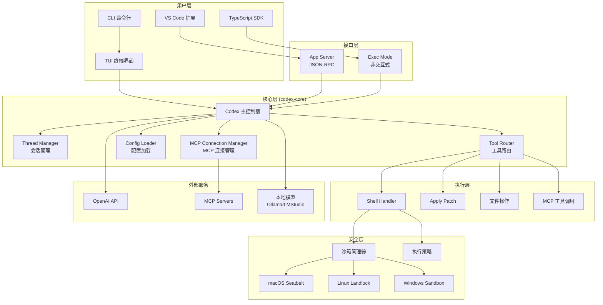
```mermaid
graph TB
    subgraph "用户层"
        CLI[CLI 命令行]
        TUI[TUI 终端界面]
        VSCODE[VS Code 扩展]
        SDK[TypeScript SDK]
    end
    
    subgraph "接口层"
        AppServer[App Server<br/>JSON-RPC]
        ExecMode[Exec Mode<br/>非交互式]
    end
    
    subgraph "核心层 (codex-core)"
        Codex[Codex 主控制器]
        ThreadMgr[Thread Manager<br/>会话管理]
        ToolRouter[Tool Router<br/>工具路由]
        ConfigLoader[Config Loader<br/>配置加载]
        MCPConnMgr[MCP Connection Manager<br/>MCP 连接管理]
    end
    
    subgraph "执行层"
        ShellHandler[Shell Handler]
        ApplyPatch[Apply Patch]
        FileOps[文件操作]
        MCPTools[MCP 工具调用]
    end
    
    subgraph "安全层"
        Sandbox[沙箱管理器]
        Seatbelt[macOS Seatbelt]
        Landlock[Linux Landlock]
        WinSandbox[Windows Sandbox]
        ExecPolicy[执行策略]
    end
    
    subgraph "外部服务"
        OpenAI[OpenAI API]
        MCPServers[MCP Servers]
        LocalModels[本地模型<br/>Ollama/LMStudio]
    end
    
    CLI --> TUI
    VSCODE --> AppServer
    SDK --> ExecMode
    
    TUI --> Codex
    AppServer --> Codex
    ExecMode --> Codex
    
    Codex --> ThreadMgr
    Codex --> ToolRouter
    Codex --> ConfigLoader
    Codex --> MCPConnMgr
    
    ToolRouter --> ShellHandler
    ToolRouter --> ApplyPatch
    ToolRouter --> FileOps
    ToolRouter --> MCPTools
    
    ShellHandler --> Sandbox
    Sandbox --> Seatbelt
    Sandbox --> Landlock
    Sandbox --> WinSandbox
    
    ShellHandler --> ExecPolicy
    
    Codex --> OpenAI
    Codex --> LocalModels
    MCPConnMgr --> MCPServers
```

### 2.2 模块依赖关系

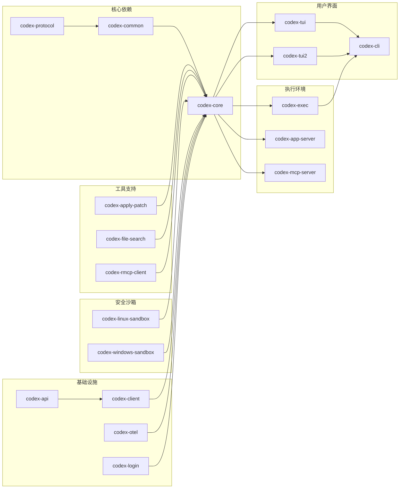
```mermaid
graph LR
    subgraph "核心依赖"
        protocol[codex-protocol]
        common[codex-common]
        core[codex-core]
    end
    
    subgraph "用户界面"
        tui[codex-tui]
        tui2[codex-tui2]
        cli[codex-cli]
    end
    
    subgraph "执行环境"
        exec[codex-exec]
        app_server[codex-app-server]
        mcp_server[codex-mcp-server]
    end
    
    subgraph "安全沙箱"
        linux_sandbox[codex-linux-sandbox]
        windows_sandbox[codex-windows-sandbox]
    end
    
    subgraph "工具支持"
        apply_patch[codex-apply-patch]
        file_search[codex-file-search]
        rmcp_client[codex-rmcp-client]
    end
    
    subgraph "基础设施"
        api[codex-api]
        client[codex-client]
        otel[codex-otel]
        login[codex-login]
    end
    
    protocol --> common
    common --> core
    
    core --> tui
    core --> tui2
    core --> exec
    core --> app_server
    core --> mcp_server
    
    tui --> cli
    tui2 --> cli
    exec --> cli
    
    apply_patch --> core
    file_search --> core
    rmcp_client --> core
    
    linux_sandbox --> core
    windows_sandbox --> core
    
    api --> client
    client --> core
    otel --> core
    login --> core
```

---

## 3. 核心模块分析

### 3.1 codex-core 模块结构

`codex-core` 是整个系统的核心，包含所有业务逻辑：

```
core/src/
├── codex.rs              # 主控制器 - Codex 结构体
├── codex_thread.rs       # 会话线程管理
├── thread_manager.rs     # 线程生命周期管理
├── client.rs             # 模型客户端
├── config/               # 配置管理
│   ├── mod.rs
│   └── types.rs
├── config_loader/        # 配置加载器
├── tools/                # 工具系统
│   ├── router.rs         # 工具路由
│   ├── registry.rs       # 工具注册表
│   ├── handlers/         # 各工具处理器
│   └── spec.rs           # 工具规格定义
├── mcp_connection_manager.rs  # MCP 连接管理
├── sandboxing/           # 沙箱抽象
├── seatbelt.rs           # macOS 沙箱
├── landlock.rs           # Linux 沙箱
└── ...
```

### 3.2 Codex 主控制器

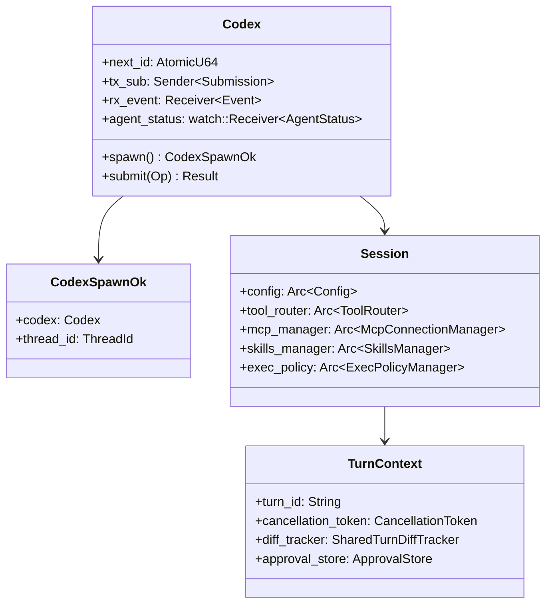
```mermaid
classDiagram
    class Codex {
        +next_id: AtomicU64
        +tx_sub: Sender~Submission~
        +rx_event: Receiver~Event~
        +agent_status: watch::Receiver~AgentStatus~
        +spawn() CodexSpawnOk
        +submit(Op) Result
    }
    
    class CodexSpawnOk {
        +codex: Codex
        +thread_id: ThreadId
    }
    
    class Session {
        +config: Arc~Config~
        +tool_router: Arc~ToolRouter~
        +mcp_manager: Arc~McpConnectionManager~
        +skills_manager: Arc~SkillsManager~
        +exec_policy: Arc~ExecPolicyManager~
    }
    
    class TurnContext {
        +turn_id: String
        +cancellation_token: CancellationToken
        +diff_tracker: SharedTurnDiffTracker
        +approval_store: ApprovalStore
    }
    
    Codex --> CodexSpawnOk
    Codex --> Session
    Session --> TurnContext
```

#### Codex 操作流程

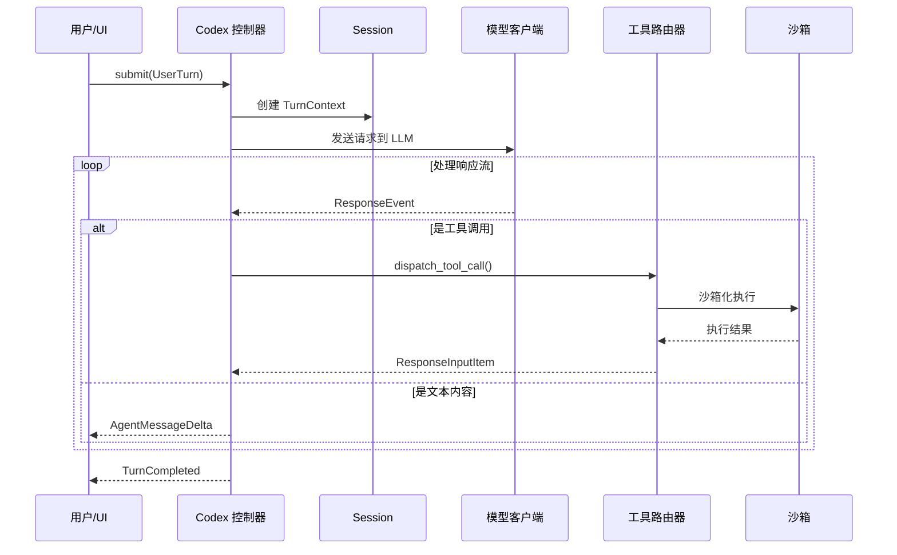
```mermaid
sequenceDiagram
    participant User as 用户/UI
    participant Codex as Codex 控制器
    participant Session as Session
    participant ModelClient as 模型客户端
    participant ToolRouter as 工具路由器
    participant Sandbox as 沙箱
    
    User->>Codex: submit(UserTurn)
    Codex->>Session: 创建 TurnContext
    Codex->>ModelClient: 发送请求到 LLM
    
    loop 处理响应流
        ModelClient-->>Codex: ResponseEvent
        alt 是工具调用
            Codex->>ToolRouter: dispatch_tool_call()
            ToolRouter->>Sandbox: 沙箱化执行
            Sandbox-->>ToolRouter: 执行结果
            ToolRouter-->>Codex: ResponseInputItem
        else 是文本内容
            Codex-->>User: AgentMessageDelta
        end
    end
    
    Codex-->>User: TurnCompleted
```

### 3.3 Thread 与 Turn 概念

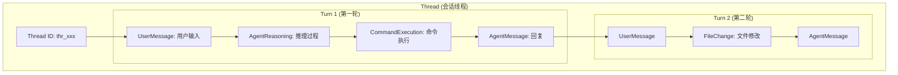
```mermaid
graph TB
    subgraph "Thread (会话线程)"
        T1[Thread ID: thr_xxx]
        
        subgraph "Turn 1 (第一轮)"
            U1[UserMessage: 用户输入]
            A1[AgentReasoning: 推理过程]
            E1[CommandExecution: 命令执行]
            R1[AgentMessage: 回复]
        end
        
        subgraph "Turn 2 (第二轮)"
            U2[UserMessage]
            F2[FileChange: 文件修改]
            R2[AgentMessage]
        end
    end
    
    T1 --> U1
    U1 --> A1
    A1 --> E1
    E1 --> R1
    R1 --> U2
    U2 --> F2
    F2 --> R2
```

**核心概念说明**：

- **Thread**：一个完整的对话会话，包含多个 Turn
- **Turn**：一轮对话交互，从用户输入开始，到代理完成回复结束
- **Item**：Turn 中的各个组成部分（用户消息、代理推理、命令执行、文件修改等）

---

## 4. 工具系统

### 4.1 工具架构

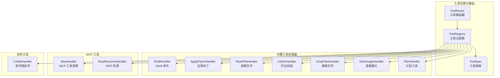
```mermaid
graph TB
    subgraph "工具注册与路由"
        ToolRouter[ToolRouter<br/>工具路由器]
        ToolRegistry[ToolRegistry<br/>工具注册表]
        ToolSpec[ToolSpec<br/>工具规格]
    end
    
    subgraph "内置工具处理器"
        ShellHandler[ShellHandler<br/>Shell 命令]
        ApplyPatchHandler[ApplyPatchHandler<br/>应用补丁]
        ReadFileHandler[ReadFileHandler<br/>读取文件]
        ListDirHandler[ListDirHandler<br/>列出目录]
        GrepFilesHandler[GrepFilesHandler<br/>搜索文件]
        ViewImageHandler[ViewImageHandler<br/>查看图片]
        PlanHandler[PlanHandler<br/>计划工具]
    end
    
    subgraph "MCP 工具"
        McpHandler[McpHandler<br/>MCP 工具调用]
        McpResourceHandler[McpResourceHandler<br/>MCP 资源]
    end
    
    subgraph "协作工具"
        CollabHandler[CollabHandler<br/>多代理协作]
    end
    
    ToolRouter --> ToolRegistry
    ToolRegistry --> ToolSpec
    
    ToolRegistry --> ShellHandler
    ToolRegistry --> ApplyPatchHandler
    ToolRegistry --> ReadFileHandler
    ToolRegistry --> ListDirHandler
    ToolRegistry --> GrepFilesHandler
    ToolRegistry --> ViewImageHandler
    ToolRegistry --> PlanHandler
    ToolRegistry --> McpHandler
    ToolRegistry --> McpResourceHandler
    ToolRegistry --> CollabHandler
```

### 4.2 工具调用流程

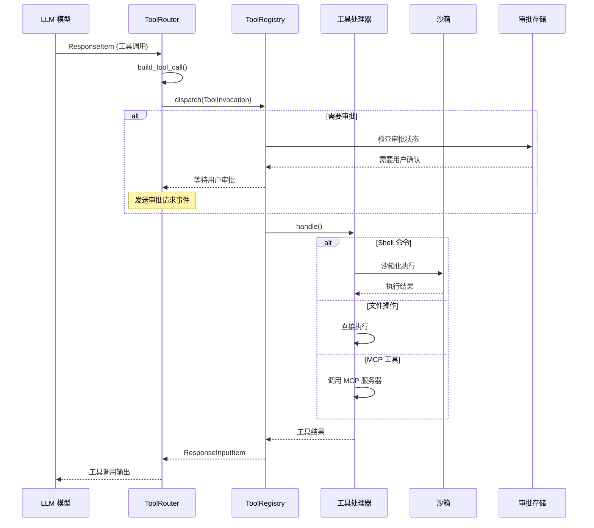
```mermaid
sequenceDiagram
    participant Model as LLM 模型
    participant Router as ToolRouter
    participant Registry as ToolRegistry
    participant Handler as 工具处理器
    participant Sandbox as 沙箱
    participant ApprovalStore as 审批存储
    
    Model->>Router: ResponseItem (工具调用)
    Router->>Router: build_tool_call()
    Router->>Registry: dispatch(ToolInvocation)
    
    alt 需要审批
        Registry->>ApprovalStore: 检查审批状态
        ApprovalStore-->>Registry: 需要用户确认
        Registry-->>Router: 等待用户审批
        Note over Router: 发送审批请求事件
    end
    
    Registry->>Handler: handle()
    
    alt Shell 命令
        Handler->>Sandbox: 沙箱化执行
        Sandbox-->>Handler: 执行结果
    else 文件操作
        Handler->>Handler: 直接执行
    else MCP 工具
        Handler->>Handler: 调用 MCP 服务器
    end
    
    Handler-->>Registry: 工具结果
    Registry-->>Router: ResponseInputItem
    Router-->>Model: 工具调用输出
```

### 4.3 内置工具列表

| 工具名称 | 描述 | 处理器 |
|---------|------|--------|
| `shell` | 执行 shell 命令 | `ShellHandler` |
| `local_shell` | 本地 shell 执行 | `ShellCommandHandler` |
| `apply_patch` | 应用文件补丁 | `ApplyPatchHandler` |
| `read_file` | 读取文件内容 | `ReadFileHandler` |
| `list_dir` | 列出目录内容 | `ListDirHandler` |
| `grep_files` | 搜索文件内容 | `GrepFilesHandler` |
| `view_image` | 查看图片 | `ViewImageHandler` |
| `plan` | 更新执行计划 | `PlanHandler` |
| `mcp_*` | MCP 工具调用 | `McpHandler` |

---

## 5. 沙箱安全机制

### 5.1 多平台沙箱架构

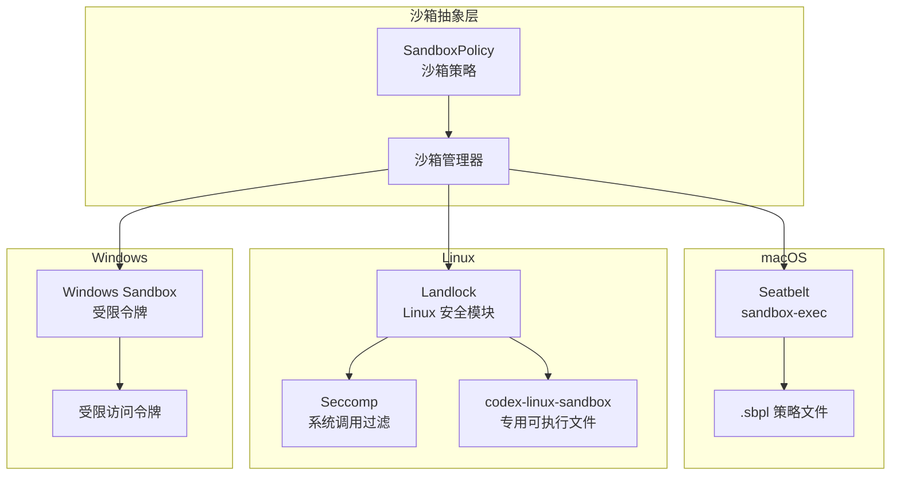
```mermaid
graph TB
    subgraph "沙箱抽象层"
        SandboxPolicy[SandboxPolicy<br/>沙箱策略]
        SandboxManager[沙箱管理器]
    end
    
    subgraph "macOS"
        Seatbelt[Seatbelt<br/>sandbox-exec]
        SeatbeltPolicy[.sbpl 策略文件]
    end
    
    subgraph "Linux"
        Landlock[Landlock<br/>Linux 安全模块]
        Seccomp[Seccomp<br/>系统调用过滤]
        LinuxSandbox[codex-linux-sandbox<br/>专用可执行文件]
    end
    
    subgraph "Windows"
        WinSandbox[Windows Sandbox<br/>受限令牌]
        RestrictedToken[受限访问令牌]
    end
    
    SandboxPolicy --> SandboxManager
    SandboxManager --> Seatbelt
    SandboxManager --> Landlock
    SandboxManager --> WinSandbox
    
    Seatbelt --> SeatbeltPolicy
    Landlock --> Seccomp
    Landlock --> LinuxSandbox
    WinSandbox --> RestrictedToken
```

### 5.2 沙箱模式

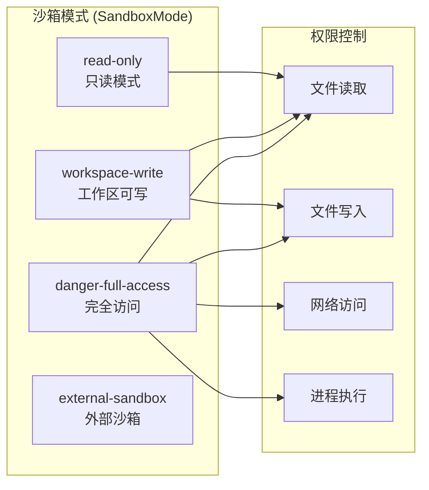
```mermaid
graph LR
    subgraph "沙箱模式 (SandboxMode)"
        ReadOnly[read-only<br/>只读模式]
        WorkspaceWrite[workspace-write<br/>工作区可写]
        DangerFull[danger-full-access<br/>完全访问]
        ExternalSandbox[external-sandbox<br/>外部沙箱]
    end
    
    subgraph "权限控制"
        FileRead[文件读取]
        FileWrite[文件写入]
        NetworkAccess[网络访问]
        ProcessExec[进程执行]
    end
    
    ReadOnly --> FileRead
    WorkspaceWrite --> FileRead
    WorkspaceWrite --> FileWrite
    DangerFull --> FileRead
    DangerFull --> FileWrite
    DangerFull --> NetworkAccess
    DangerFull --> ProcessExec
```

### 5.3 执行策略 (ExecPolicy)

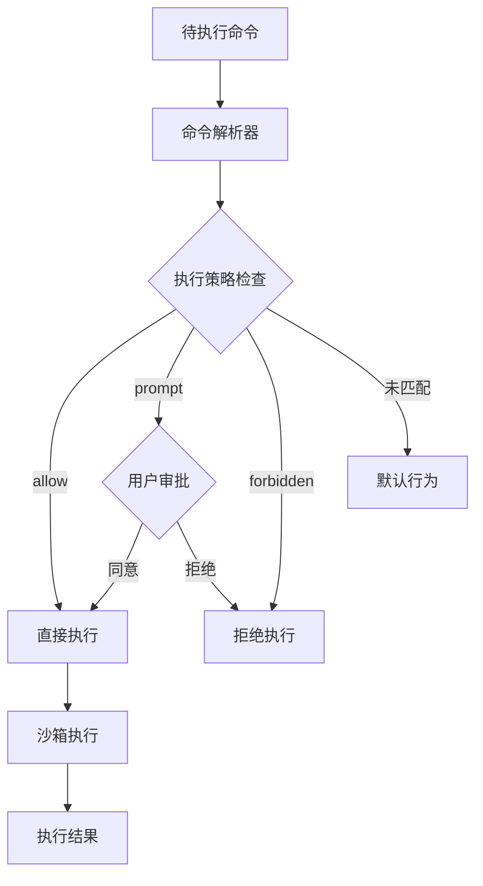
```mermaid
flowchart TD
    Command[待执行命令] --> Parser[命令解析器]
    Parser --> PolicyCheck{执行策略检查}
    
    PolicyCheck -->|allow| Execute[直接执行]
    PolicyCheck -->|prompt| UserApproval{用户审批}
    PolicyCheck -->|forbidden| Reject[拒绝执行]
    PolicyCheck -->|未匹配| DefaultBehavior[默认行为]
    
    UserApproval -->|同意| Execute
    UserApproval -->|拒绝| Reject
    
    Execute --> Sandbox[沙箱执行]
    Sandbox --> Result[执行结果]
```

---

## 6. MCP 协议支持

### 6.1 MCP 架构概览

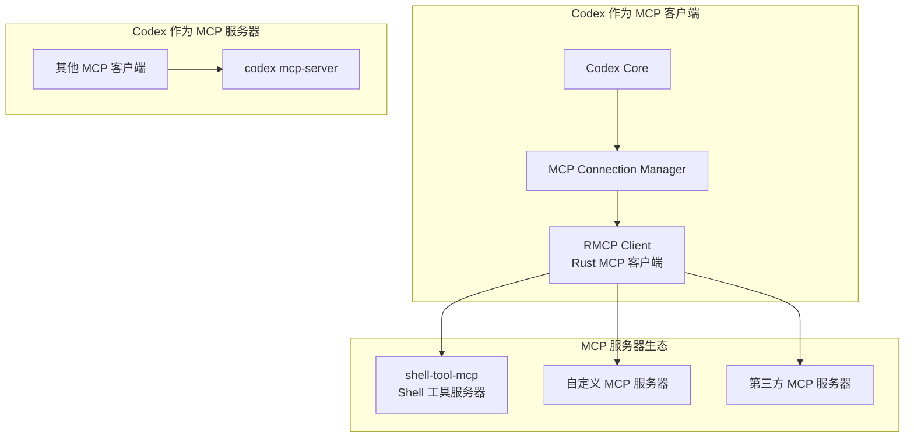
```mermaid
graph TB
    subgraph "Codex 作为 MCP 客户端"
        Codex[Codex Core]
        MCPConnMgr[MCP Connection Manager]
        RMCPClient[RMCP Client<br/>Rust MCP 客户端]
    end
    
    subgraph "MCP 服务器生态"
        ShellToolMCP[shell-tool-mcp<br/>Shell 工具服务器]
        CustomMCP[自定义 MCP 服务器]
        ThirdPartyMCP[第三方 MCP 服务器]
    end
    
    subgraph "Codex 作为 MCP 服务器"
        CodexMCPServer[codex mcp-server]
        MCPClient[其他 MCP 客户端]
    end
    
    Codex --> MCPConnMgr
    MCPConnMgr --> RMCPClient
    RMCPClient --> ShellToolMCP
    RMCPClient --> CustomMCP
    RMCPClient --> ThirdPartyMCP
    
    MCPClient --> CodexMCPServer
```

### 6.2 MCP 连接管理

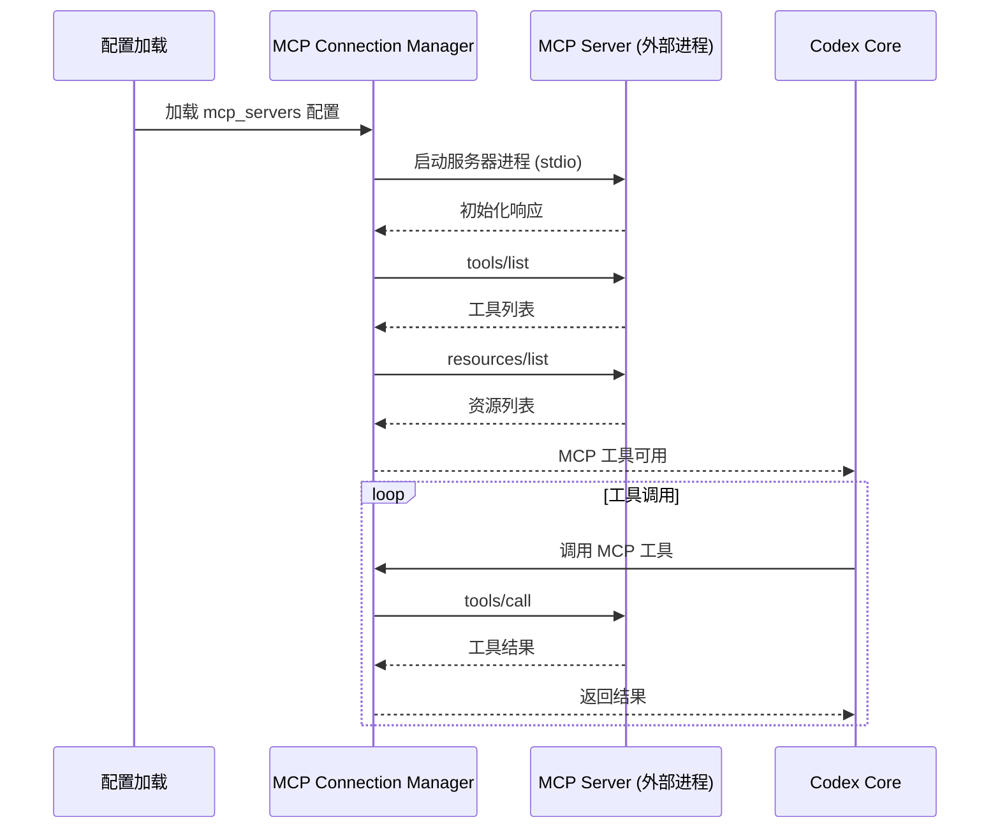
```mermaid
sequenceDiagram
    participant Config as 配置加载
    participant MCPMgr as MCP Connection Manager
    participant Server as MCP Server (外部进程)
    participant Codex as Codex Core
    
    Config->>MCPMgr: 加载 mcp_servers 配置
    MCPMgr->>Server: 启动服务器进程 (stdio)
    Server-->>MCPMgr: 初始化响应
    
    MCPMgr->>Server: tools/list
    Server-->>MCPMgr: 工具列表
    
    MCPMgr->>Server: resources/list
    Server-->>MCPMgr: 资源列表
    
    MCPMgr-->>Codex: MCP 工具可用
    
    loop 工具调用
        Codex->>MCPMgr: 调用 MCP 工具
        MCPMgr->>Server: tools/call
        Server-->>MCPMgr: 工具结果
        MCPMgr-->>Codex: 返回结果
    end
```

### 6.3 shell-tool-mcp 特性

`shell-tool-mcp` 是一个特殊的 MCP 服务器，提供增强的 Shell 执行能力：

```mermaid
graph TB
    subgraph "shell-tool-mcp 架构"
        Launcher[启动器 (JS)]
        MCPServer[codex-exec-mcp-server<br/>Rust 二进制]
        BashWrapper[Bash Wrapper<br/>拦截 execve]
        EscalationServer[Escalation Server]
    end
    
    subgraph "执行流程"
        Command[Shell 命令]
        ExecveIntercept[execve 拦截]
        PolicyCheck[策略检查]
        SandboxExec[沙箱执行]
        EscalatedExec[提权执行]
    end
    
    Launcher --> MCPServer
    MCPServer --> BashWrapper
    MCPServer --> EscalationServer
    
    Command --> BashWrapper
    BashWrapper --> ExecveIntercept
    ExecveIntercept --> PolicyCheck
    PolicyCheck -->|allow| EscalatedExec
    PolicyCheck -->|sandbox| SandboxExec
```

---

## 7. 用户界面层

### 7.1 TUI 架构

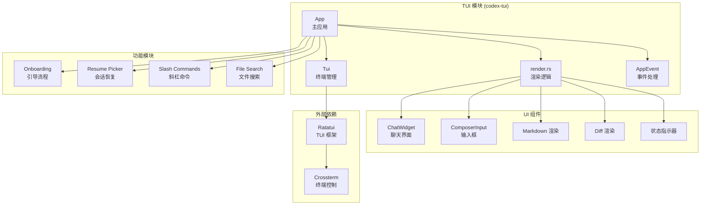
```mermaid
graph TB
    subgraph "TUI 模块 (codex-tui)"
        App[App<br/>主应用]
        Tui[Tui<br/>终端管理]
        Render[render.rs<br/>渲染逻辑]
        AppEvent[AppEvent<br/>事件处理]
    end
    
    subgraph "UI 组件"
        ChatWidget[ChatWidget<br/>聊天界面]
        ComposerInput[ComposerInput<br/>输入框]
        MarkdownRender[Markdown 渲染]
        DiffRender[Diff 渲染]
        StatusIndicator[状态指示器]
    end
    
    subgraph "功能模块"
        Onboarding[Onboarding<br/>引导流程]
        ResumePicker[Resume Picker<br/>会话恢复]
        SlashCommand[Slash Commands<br/>斜杠命令]
        FileSearch[File Search<br/>文件搜索]
    end
    
    subgraph "外部依赖"
        Ratatui[Ratatui<br/>TUI 框架]
        Crossterm[Crossterm<br/>终端控制]
    end
    
    App --> Tui
    App --> Render
    App --> AppEvent
    
    Render --> ChatWidget
    Render --> ComposerInput
    Render --> MarkdownRender
    Render --> DiffRender
    Render --> StatusIndicator
    
    App --> Onboarding
    App --> ResumePicker
    App --> SlashCommand
    App --> FileSearch
    
    Tui --> Ratatui
    Ratatui --> Crossterm
```

### 7.2 App Server 架构 (IDE 集成)

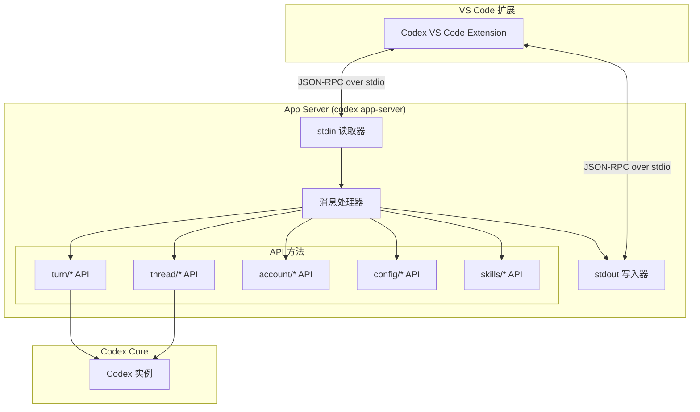
```mermaid
graph TB
    subgraph "VS Code 扩展"
        Extension[Codex VS Code Extension]
    end
    
    subgraph "App Server (codex app-server)"
        StdinReader[stdin 读取器]
        StdoutWriter[stdout 写入器]
        MessageProcessor[消息处理器]
        
        subgraph "API 方法"
            ThreadAPI[thread/* API]
            TurnAPI[turn/* API]
            AccountAPI[account/* API]
            ConfigAPI[config/* API]
            SkillsAPI[skills/* API]
        end
    end
    
    subgraph "Codex Core"
        CodexInstance[Codex 实例]
    end
    
    Extension <-->|JSON-RPC over stdio| StdinReader
    Extension <-->|JSON-RPC over stdio| StdoutWriter
    
    StdinReader --> MessageProcessor
    MessageProcessor --> StdoutWriter
    
    MessageProcessor --> ThreadAPI
    MessageProcessor --> TurnAPI
    MessageProcessor --> AccountAPI
    MessageProcessor --> ConfigAPI
    MessageProcessor --> SkillsAPI
    
    ThreadAPI --> CodexInstance
    TurnAPI --> CodexInstance
```

---

## 8. SDK 与 API

### 8.1 TypeScript SDK 架构

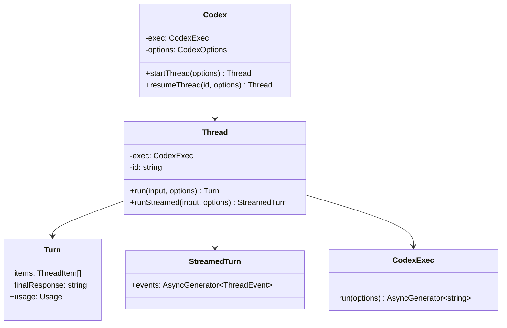
```mermaid
classDiagram
    class Codex {
        -exec: CodexExec
        -options: CodexOptions
        +startThread(options) Thread
        +resumeThread(id, options) Thread
    }
    
    class Thread {
        -exec: CodexExec
        -id: string
        +run(input, options) Turn
        +runStreamed(input, options) StreamedTurn
    }
    
    class Turn {
        +items: ThreadItem[]
        +finalResponse: string
        +usage: Usage
    }
    
    class StreamedTurn {
        +events: AsyncGenerator~ThreadEvent~
    }
    
    class CodexExec {
        +run(options) AsyncGenerator~string~
    }
    
    Codex --> Thread
    Thread --> Turn
    Thread --> StreamedTurn
    Thread --> CodexExec
```

### 8.2 SDK 使用流程

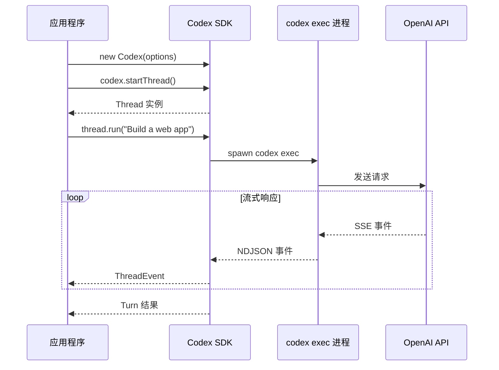
```mermaid
sequenceDiagram
    participant App as 应用程序
    participant SDK as Codex SDK
    participant CLI as codex exec 进程
    participant API as OpenAI API
    
    App->>SDK: new Codex(options)
    App->>SDK: codex.startThread()
    SDK-->>App: Thread 实例
    
    App->>SDK: thread.run("Build a web app")
    SDK->>CLI: spawn codex exec
    CLI->>API: 发送请求
    
    loop 流式响应
        API-->>CLI: SSE 事件
        CLI-->>SDK: NDJSON 事件
        SDK-->>App: ThreadEvent
    end
    
    SDK-->>App: Turn 结果
```

---

## 9. 通信协议

### 9.1 事件类型层次

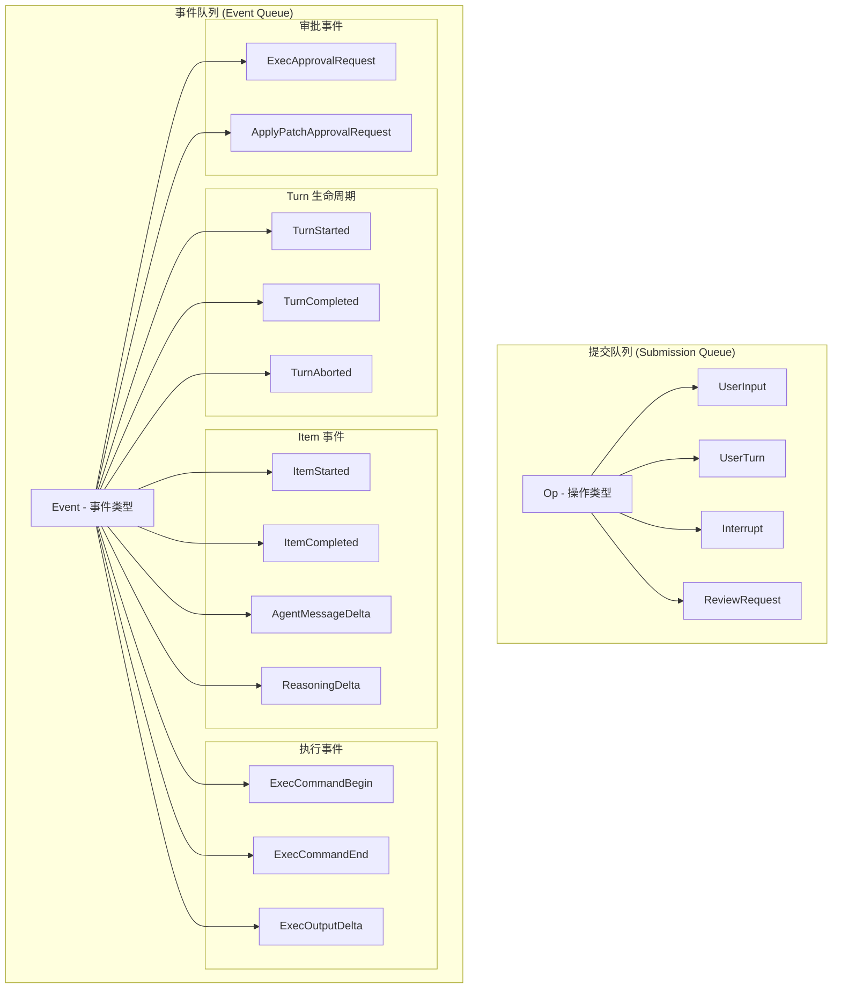
```mermaid
graph TB
    subgraph "提交队列 (Submission Queue)"
        Op[Op - 操作类型]
        UserInput[UserInput]
        UserTurn[UserTurn]
        Interrupt[Interrupt]
        ReviewRequest[ReviewRequest]
    end
    
    subgraph "事件队列 (Event Queue)"
        Event[Event - 事件类型]
        
        subgraph "Turn 生命周期"
            TurnStarted[TurnStarted]
            TurnCompleted[TurnCompleted]
            TurnAborted[TurnAborted]
        end
        
        subgraph "Item 事件"
            ItemStarted[ItemStarted]
            ItemCompleted[ItemCompleted]
            AgentMessageDelta[AgentMessageDelta]
            ReasoningDelta[ReasoningDelta]
        end
        
        subgraph "执行事件"
            ExecCommandBegin[ExecCommandBegin]
            ExecCommandEnd[ExecCommandEnd]
            ExecOutputDelta[ExecOutputDelta]
        end
        
        subgraph "审批事件"
            ExecApprovalRequest[ExecApprovalRequest]
            ApplyPatchApprovalRequest[ApplyPatchApprovalRequest]
        end
    end
    
    Op --> UserInput
    Op --> UserTurn
    Op --> Interrupt
    Op --> ReviewRequest
    
    Event --> TurnStarted
    Event --> TurnCompleted
    Event --> TurnAborted
    Event --> ItemStarted
    Event --> ItemCompleted
    Event --> AgentMessageDelta
    Event --> ReasoningDelta
    Event --> ExecCommandBegin
    Event --> ExecCommandEnd
    Event --> ExecOutputDelta
    Event --> ExecApprovalRequest
    Event --> ApplyPatchApprovalRequest
```

### 9.2 App Server JSON-RPC 协议

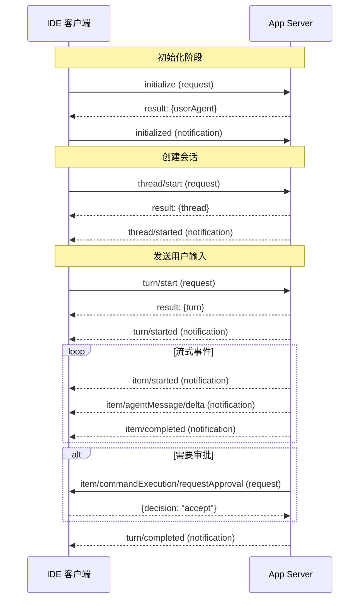
```mermaid
sequenceDiagram
    participant Client as IDE 客户端
    participant Server as App Server
    
    Note over Client,Server: 初始化阶段
    Client->>Server: initialize (request)
    Server-->>Client: result: {userAgent}
    Client->>Server: initialized (notification)
    
    Note over Client,Server: 创建会话
    Client->>Server: thread/start (request)
    Server-->>Client: result: {thread}
    Server-->>Client: thread/started (notification)
    
    Note over Client,Server: 发送用户输入
    Client->>Server: turn/start (request)
    Server-->>Client: result: {turn}
    Server-->>Client: turn/started (notification)
    
    loop 流式事件
        Server-->>Client: item/started (notification)
        Server-->>Client: item/agentMessage/delta (notification)
        Server-->>Client: item/completed (notification)
    end
    
    alt 需要审批
        Server->>Client: item/commandExecution/requestApproval (request)
        Client-->>Server: {decision: "accept"}
    end
    
    Server-->>Client: turn/completed (notification)
```

---

## 10. 配置系统

### 10.1 配置层级

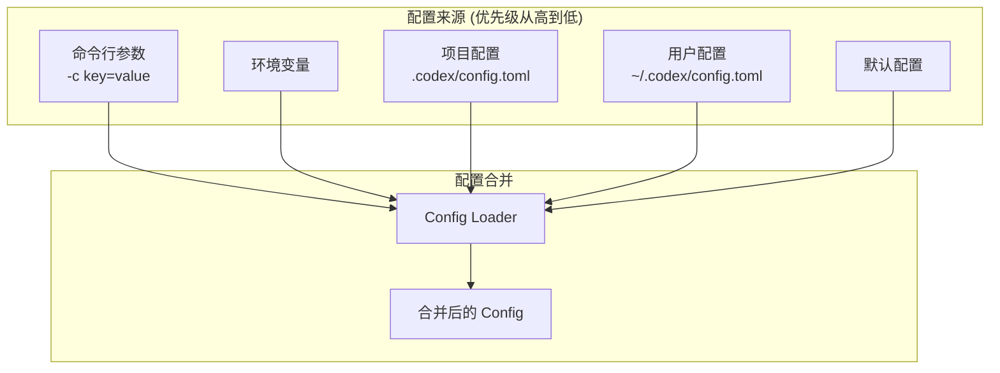
```mermaid
graph TB
    subgraph "配置来源 (优先级从高到低)"
        CLI[命令行参数<br/>-c key=value]
        EnvVar[环境变量]
        ProjectConfig[项目配置<br/>.codex/config.toml]
        UserConfig[用户配置<br/>~/.codex/config.toml]
        DefaultConfig[默认配置]
    end
    
    subgraph "配置合并"
        ConfigLoader[Config Loader]
        MergedConfig[合并后的 Config]
    end
    
    CLI --> ConfigLoader
    EnvVar --> ConfigLoader
    ProjectConfig --> ConfigLoader
    UserConfig --> ConfigLoader
    DefaultConfig --> ConfigLoader
    
    ConfigLoader --> MergedConfig
```

### 10.2 主要配置项

```toml
# ~/.codex/config.toml 示例

# 模型配置
model = "gpt-5.1-codex"
model_provider = "openai"

# 沙箱模式
sandbox_mode = "workspace-write"

# 审批策略
approval_policy = "unless-trusted"

# MCP 服务器配置
[mcp_servers.shell-tool]
command = "npx"
args = ["-y", "@openai/codex-shell-tool-mcp"]

# 功能开关
[features]
shell_tool = true
web_search = "live"

# 通知配置
[notify]
command = "terminal-notifier"
args = ["-title", "Codex", "-message", "{message}"]
```

---

## 11. 技术栈与依赖

### 11.1 主要技术栈

```mermaid
pie title 代码语言分布
    "Rust" : 85
    "TypeScript" : 10
    "Shell/其他" : 5
```

### 11.2 核心依赖

| 类别 | 依赖 | 用途 |
|------|------|------|
| **异步运行时** | tokio | 异步 I/O、任务调度 |
| **HTTP 客户端** | reqwest | API 请求 |
| **TUI 框架** | ratatui | 终端用户界面 |
| **终端控制** | crossterm | 跨平台终端操作 |
| **序列化** | serde, serde_json | JSON 序列化 |
| **配置** | toml | TOML 配置解析 |
| **CLI** | clap | 命令行参数解析 |
| **日志** | tracing | 结构化日志 |
| **MCP** | rmcp | Rust MCP 客户端 |
| **安全** | landlock, seccompiler | Linux 沙箱 |

### 11.3 构建系统

```mermaid
graph LR
    subgraph "构建工具"
        Cargo[Cargo<br/>Rust 包管理]
        Bazel[Bazel<br/>大规模构建]
        PNPM[pnpm<br/>Node.js 包管理]
    end
    
    subgraph "发布产物"
        NPM[@openai/codex<br/>npm 包]
        Homebrew[brew cask<br/>macOS 安装]
        GitHub[GitHub Releases<br/>二进制发布]
    end
    
    Cargo --> NPM
    Bazel --> GitHub
    PNPM --> NPM
    GitHub --> Homebrew
```

---

## 12. 数据流分析

### 12.1 完整请求流程

```mermaid
flowchart TB
    subgraph "用户输入"
        User[用户]
        Input[输入: "Create a web app"]
    end
    
    subgraph "TUI 处理"
        TUI[TUI App]
        EventLoop[事件循环]
    end
    
    subgraph "核心处理"
        Codex[Codex 控制器]
        Session[Session]
        ContextMgr[Context Manager]
    end
    
    subgraph "模型交互"
        Prompt[构建 Prompt]
        APIClient[API Client]
        OpenAI[OpenAI API]
    end
    
    subgraph "工具执行"
        ToolRouter[Tool Router]
        ShellExec[Shell 执行]
        FileOps[文件操作]
        Sandbox[沙箱]
    end
    
    subgraph "结果输出"
        StreamEvents[流式事件]
        UIRender[UI 渲染]
        Response[最终响应]
    end
    
    User --> Input
    Input --> TUI
    TUI --> EventLoop
    EventLoop --> Codex
    
    Codex --> Session
    Session --> ContextMgr
    ContextMgr --> Prompt
    Prompt --> APIClient
    APIClient --> OpenAI
    
    OpenAI --> APIClient
    APIClient --> Codex
    
    Codex --> ToolRouter
    ToolRouter --> ShellExec
    ToolRouter --> FileOps
    ShellExec --> Sandbox
    Sandbox --> ToolRouter
    
    ToolRouter --> Codex
    Codex --> StreamEvents
    StreamEvents --> UIRender
    UIRender --> Response
    Response --> User
```

### 12.2 会话持久化

```mermaid
graph TB
    subgraph "运行时"
        ActiveSession[活动会话]
        TurnHistory[Turn 历史]
    end
    
    subgraph "持久化存储"
        SessionDir[~/.codex/sessions/]
        RolloutFile[rollout.jsonl<br/>会话记录文件]
        ArchivedDir[archived/<br/>归档会话]
    end
    
    subgraph "操作"
        Save[保存会话]
        Resume[恢复会话]
        Fork[分叉会话]
        Archive[归档会话]
    end
    
    ActiveSession --> Save
    Save --> RolloutFile
    
    RolloutFile --> Resume
    Resume --> ActiveSession
    
    RolloutFile --> Fork
    Fork --> ActiveSession
    
    RolloutFile --> Archive
    Archive --> ArchivedDir
```

---

## 总结

OpenAI Codex CLI 是一个设计精良的本地编码代理系统，其架构特点包括：

1. **模块化设计**：清晰的核心/接口/执行分层
2. **多平台支持**：macOS、Linux、Windows 全平台沙箱实现
3. **安全优先**：多层次的沙箱和执行策略保护
4. **可扩展性**：通过 MCP 协议支持第三方工具集成
5. **多种接口**：TUI、App Server、SDK 满足不同使用场景
6. **现代技术栈**：Rust 核心实现保证性能和安全性

该项目展示了如何构建一个生产级别的 AI 编码代理，平衡了功能丰富性、安全性和用户体验。
