# Codex 代码变更历史脉络分析

> 本文档梳理 OpenAI Codex CLI 项目的 commit history，分析其代码变更的演进脉络。

## 目录

1. [项目概览](#1-项目概览)
2. [时间线总览](#2-时间线总览)
3. [版本演进](#3-版本演进)
4. [核心功能演进](#4-核心功能演进)
5. [架构演进](#5-架构演进)
6. [主要贡献者](#6-主要贡献者)
7. [关键里程碑](#7-关键里程碑)

---

## 1. 项目概览

### 1.1 基本统计

| 指标 | 数值 |
|------|------|
| 总 Commit 数 | 11,448 |
| 项目起始时间 | 2025年4月 |
| 主要语言演进 | TypeScript → Rust |
| 当前版本 | 0.88.x |

### 1.2 月度 Commit 分布

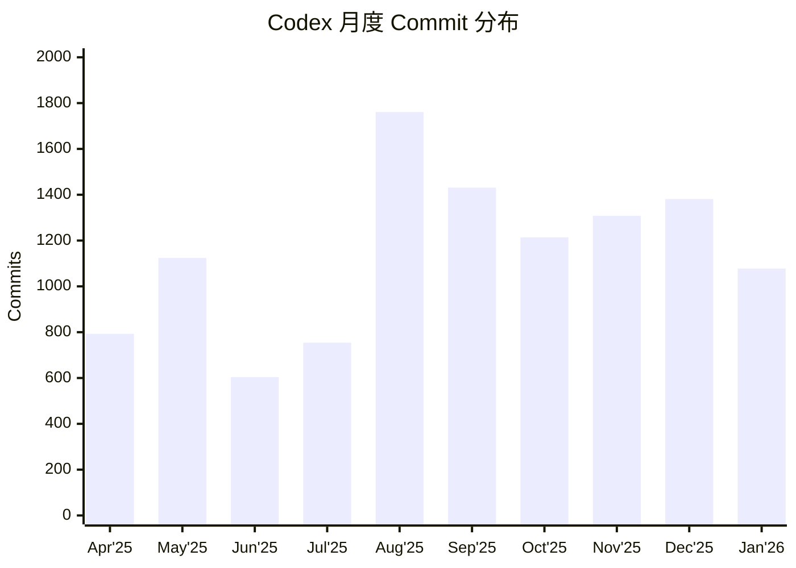

**观察**：
- 2025年8月达到开发高峰（1761 commits）
- 保持每月 1000+ commits 的高频迭代
- 显示出快速迭代的开发节奏

---

## 2. 时间线总览

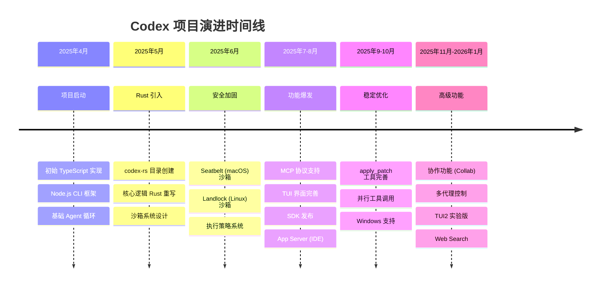

---

## 3. 版本演进

### 3.1 主要版本里程碑

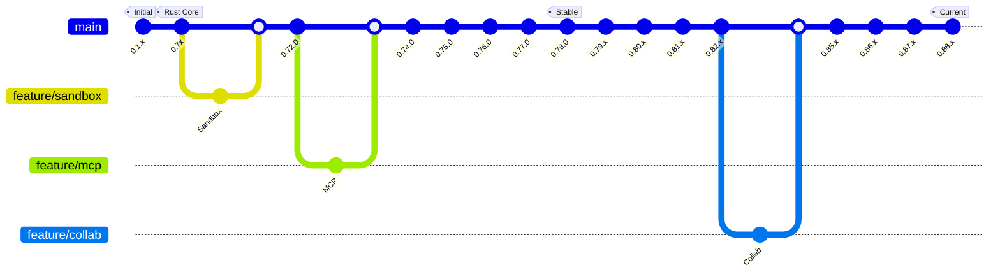

### 3.2 版本发布统计

| 主版本 | Alpha 版本数 | 主要变更 |
|--------|-------------|---------|
| 0.72.x | 8 | 基础架构稳定 |
| 0.73.x | 3 | MCP 集成 |
| 0.74.x | 9 | 工具系统完善 |
| 0.75.x | 1 | 稳定版本 |
| 0.76.x | 9 | TUI 改进 |
| 0.77.x | 3 | SDK 增强 |
| 0.78.x | 12 | 沙箱优化 |
| 0.79.x | 3 | App Server |
| 0.80.x | 6 | 会话管理 |
| 0.81.x | 11 | Unified Exec |
| 0.82.x | 3 | 配置系统 |
| 0.85.x | 2 | 协作功能 |
| 0.86.x | 1 | 热重载 |
| 0.87.x | 2 | 多代理 |
| 0.88.x | 4+ | 当前开发 |

---

## 4. 核心功能演进

### 4.1 功能演进时间线

```mermaid
flowchart TB
    subgraph "Phase 1: 基础 (2025.04)"
        P1_1["初始 TypeScript 实现"]
        P1_2["基础 CLI 框架"]
        P1_3["OpenAI API 集成"]
        P1_4["简单 Agent 循环"]
    end

    subgraph "Phase 2: Rust 核心 (2025.05)"
        P2_1["codex-rs 引入"]
        P2_2["异步架构 (Tokio)"]
        P2_3["协议定义"]
        P2_4["沙箱设计"]
    end

    subgraph "Phase 3: 安全 (2025.06)"
        P3_1["macOS Seatbelt"]
        P3_2["Linux Landlock"]
        P3_3["执行策略"]
        P3_4["审批机制"]
    end

    subgraph "Phase 4: 扩展 (2025.07-08)"
        P4_1["MCP 协议"]
        P4_2["TUI 界面"]
        P4_3["TypeScript SDK"]
        P4_4["App Server"]
    end

    subgraph "Phase 5: 工具 (2025.09-10)"
        P5_1["apply_patch"]
        P5_2["Unified Exec"]
        P5_3["并行执行"]
        P5_4["Windows 沙箱"]
    end

    subgraph "Phase 6: 协作 (2025.11-2026.01)"
        P6_1["多代理控制"]
        P6_2["协作工具"]
        P6_3["TUI2"]
        P6_4["Web Search"]
    end

    P1_1 --> P1_2 --> P1_3 --> P1_4
    P1_4 --> P2_1
    P2_1 --> P2_2 --> P2_3 --> P2_4
    P2_4 --> P3_1
    P3_1 --> P3_2 --> P3_3 --> P3_4
    P3_4 --> P4_1
    P4_1 --> P4_2 --> P4_3 --> P4_4
    P4_4 --> P5_1
    P5_1 --> P5_2 --> P5_3 --> P5_4
    P5_4 --> P6_1
    P6_1 --> P6_2 --> P6_3 --> P6_4
```

### 4.2 沙箱系统演进

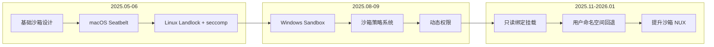

**关键 Commit**:
- `feat: initial import of Rust implementation` - Rust 核心引入
- `[codex-rs] More fine-grained sandbox flag support on Linux` - Linux 沙箱
- `feat: add support for read-only bind mounts in the linux sandbox` - 只读挂载
- `linux-sandbox: fallback to userns when mountns is denied` - 命名空间回退

### 4.3 MCP 协议演进

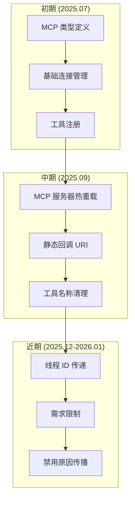

### 4.4 执行系统演进

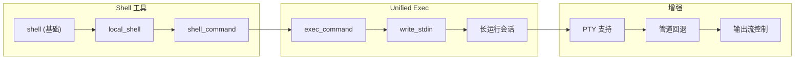

### 4.5 协作功能演进

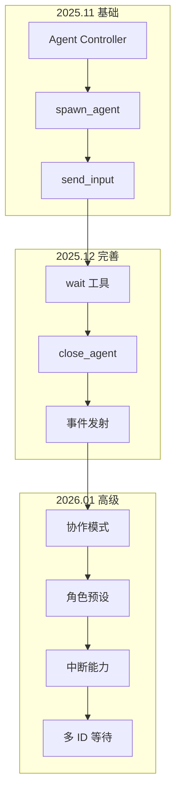

---

## 5. 架构演进

### 5.1 从 TypeScript 到 Rust

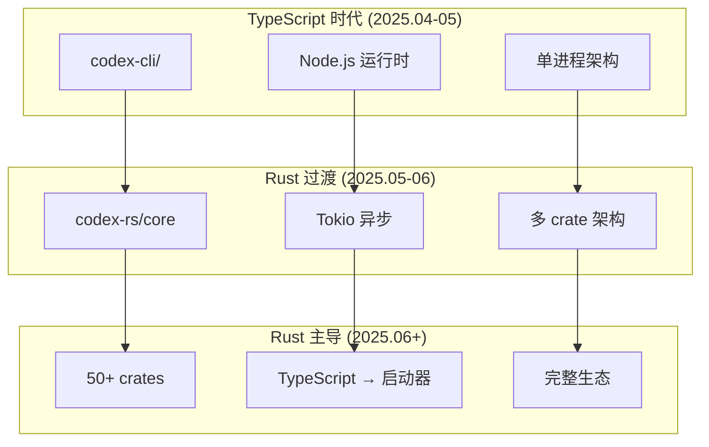

**关键转折点**:
```
59a180dde Initial commit                                    # 项目开始
31d0d7a30 feat: initial import of Rust implementation      # Rust 引入
```

### 5.2 模块架构演进

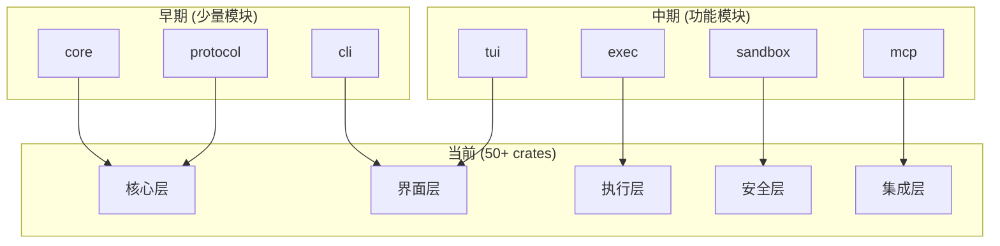

### 5.3 配置系统演进

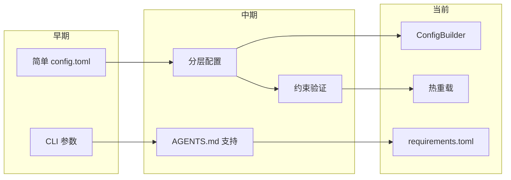

---

## 6. 主要贡献者

### 6.1 Top 20 贡献者

| 排名 | 贡献者 | Commits | 主要贡献领域 |
|------|--------|---------|-------------|
| 1 | Michael Bolin | 4,289 | 核心架构、TUI、工具系统 |
| 2 | Ahmed Ibrahim | 1,043 | 核心功能、MCP |
| 3 | github-actions[bot] | 744 | CI/CD 自动化 |
| 4 | jif-oai | 651 | 协作功能、Agent Control |
| 5 | kevin zhao | 361 | 执行系统 |
| 6 | Jeremy Rose | 335 | Windows 支持 |
| 7 | pakrym-oai | 303 | SDK、协议 |
| 8 | Rai (Michael Pokorny) | 251 | 沙箱系统 |
| 9 | Dylan Hurd | 192 | TUI、文档 |
| 10 | jimmyfraiture | 192 | 配置系统 |
| 11 | easong-openai | 165 | App Server |
| 12 | Daniel Edrisian | 163 | MCP 集成 |
| 13 | pap | 158 | 测试、质量 |
| 14 | Owen Lin | 154 | 功能开发 |
| 15 | aibrahim-oai | 149 | 核心功能 |
| 16 | Gabriel Peal | 132 | 执行系统 |
| 17 | Thibault Sottiaux | 124 | 界面改进 |
| 18 | Eric Traut | 120 | TypeScript |
| 19 | dependabot[bot] | 107 | 依赖更新 |
| 20 | Fouad Matin | 100 | 功能开发 |

### 6.2 贡献分布

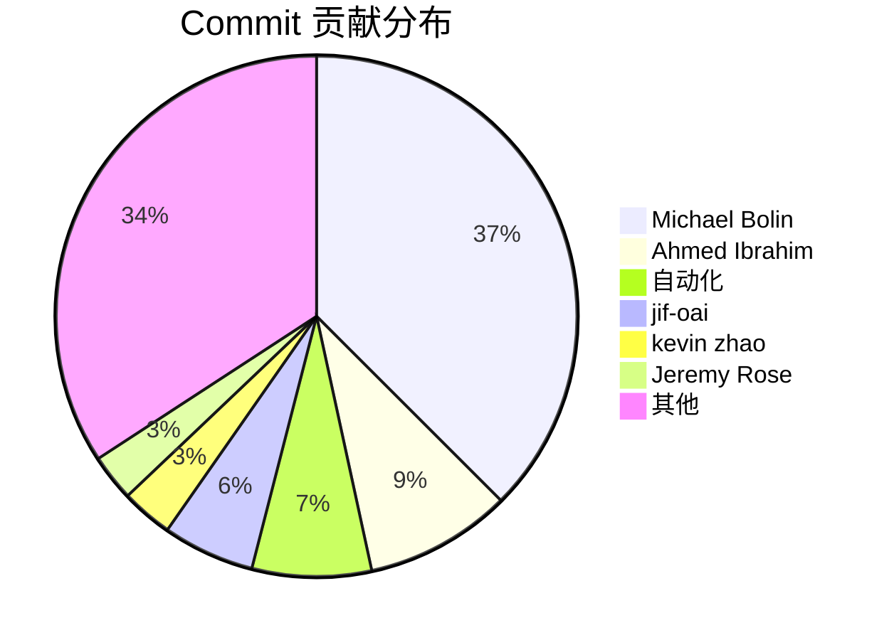

---

## 7. 关键里程碑

### 7.1 里程碑列表

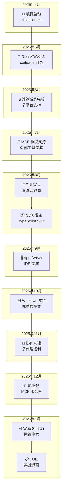

### 7.2 关键 Commit 详解

#### 项目启动
```
59a180dde Initial commit
ae7b518c5 Initial commit
```
- 项目初始化
- TypeScript/Node.js 架构

#### Rust 核心引入
```
31d0d7a30 feat: initial import of Rust implementation of Codex CLI in codex-rs/ (#629)
```
- 标志性的架构转型
- 引入 50+ crate 的 Rust 实现

#### 沙箱系统
```
b34ed2ab8 [codex-rs] More fine-grained sandbox flag support on Linux (#632)
```
- Linux Landlock + seccomp
- macOS Seatbelt
- 执行策略系统

#### MCP 支持
```
987dd7fde Chore: remove rmcp feature and exp flag usages (#8087)
53f53173a chore: upgrade rmcp crate from 0.10.0 to 0.12.0 (#8288)
```
- MCP 协议从实验性到稳定
- 外部工具生态集成

#### 协作功能
```
b43e04d9c feat: agent controller (#8783)
246f50655 Introduce collaboration modes (#9340)
```
- 多代理控制架构
- 协作模式和角色预设

#### Unified Exec
```
72b95db12 feat: intercept apply_patch for unified_exec (#7446)
813bdb901 feat: fallback unified_exec to shell_command (#8075)
```
- 统一的执行系统
- 长运行会话支持

---

## 8. 代码变更模式分析

### 8.1 Commit 类型分布

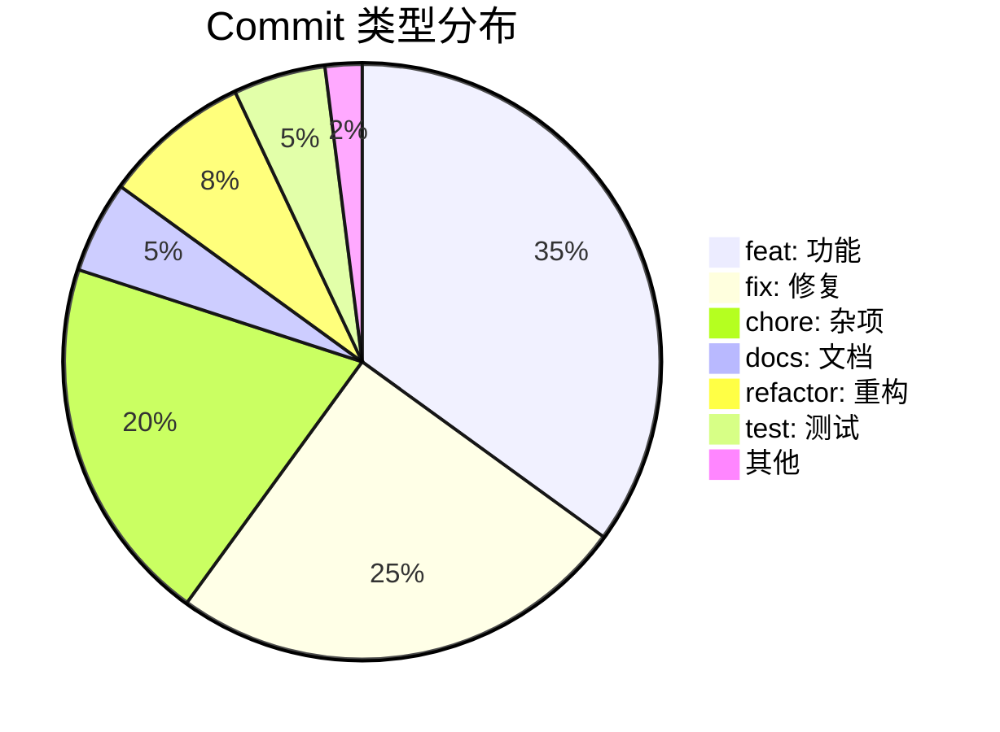

### 8.2 变更频率热图

| 模块 | Apr | May | Jun | Jul | Aug | Sep | Oct | Nov | Dec | Jan |
|------|-----|-----|-----|-----|-----|-----|-----|-----|-----|-----|
| core | 🟡 | 🟢 | 🟢 | 🟢 | 🔴 | 🔴 | 🟢 | 🟢 | 🟢 | 🟢 |
| tui | ⚪ | 🟡 | 🟢 | 🟢 | 🔴 | 🟢 | 🟢 | 🟢 | 🟢 | 🟢 |
| sandbox | ⚪ | 🟡 | 🔴 | 🟢 | 🟢 | 🟢 | 🟡 | 🟡 | 🟢 | 🟢 |
| mcp | ⚪ | ⚪ | 🟡 | 🟢 | 🟢 | 🟢 | 🟢 | 🟢 | 🟢 | 🟢 |
| sdk | ⚪ | ⚪ | ⚪ | 🟡 | 🟢 | 🟢 | 🟢 | 🟡 | 🟡 | 🟡 |
| collab | ⚪ | ⚪ | ⚪ | ⚪ | ⚪ | ⚪ | ⚪ | 🟢 | 🔴 | 🔴 |

图例: ⚪无 🟡低 🟢中 🔴高

---

## 9. 总结

### 9.1 项目演进特点

1. **快速迭代**
   - 月均 1000+ commits
   - 频繁的 alpha 版本发布
   - 持续的功能迭代

2. **架构演进**
   - TypeScript → Rust 的成功迁移
   - 模块化的 crate 架构
   - 清晰的分层设计

3. **安全优先**
   - 早期就引入沙箱系统
   - 多平台安全支持
   - 持续的安全加固

4. **生态扩展**
   - MCP 协议支持外部工具
   - SDK 支持程序化使用
   - IDE 集成 (App Server)

5. **协作能力**
   - 多代理控制
   - 协作工具
   - 角色预设

### 9.2 技术债务管理

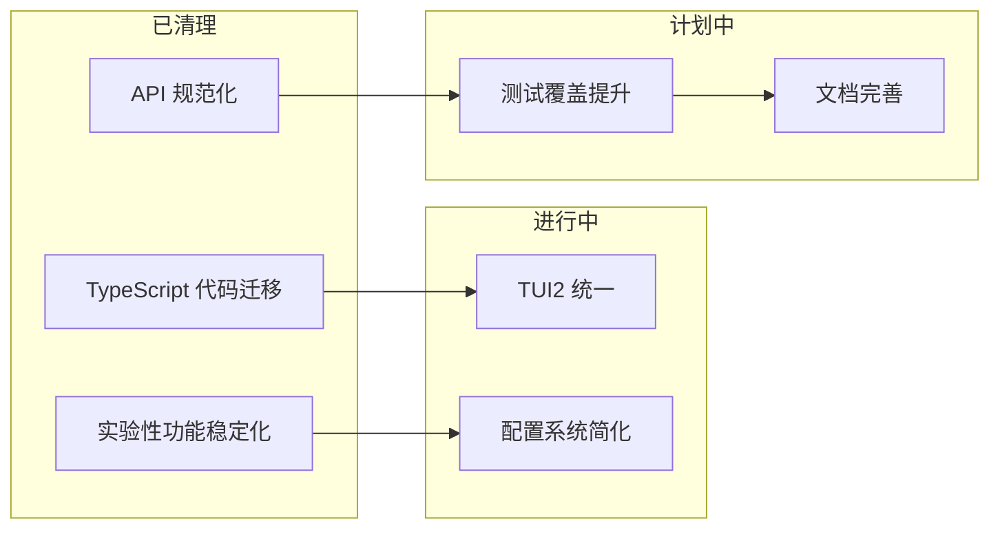

### 9.3 未来展望

基于 commit history 的趋势，可以预见：

- **协作功能深化** - 更强大的多代理协作
- **TUI2 成熟** - 统一的终端界面
- **生态扩展** - 更多 MCP 集成
- **性能优化** - 持续的 Rust 优化
- **跨平台完善** - Windows 体验提升

---

*本文档基于 Codex 仓库 11,448 个 commits 的分析生成，版本日期：2026-01-19*
