# Codex 事件循环与 Agentic Loop 深度解析

> 本文档深入解析 Codex 的事件循环机制，详细说明当用户发起任务后，Codex 如何分解处理任务、自我迭代并最终完成任务的全过程。

## 目录

1. [核心概念](#1-核心概念)
2. [三层事件循环架构](#2-三层事件循环架构)
3. [用户任务处理流程](#3-用户任务处理流程)
4. [Agentic Loop - 代理循环](#4-agentic-loop---代理循环)
5. [工具调用与执行](#5-工具调用与执行)
6. [迭代决策机制](#6-迭代决策机制)
7. [多轮工具调用处理](#7-多轮工具调用处理)
8. [完整执行示例](#8-完整执行示例)
9. [关键代码索引](#9-关键代码索引)

---

## 1. 核心概念

### 1.1 关键术语

| 术语 | 说明 |
|------|------|
| **Thread** | 一个完整的对话会话，包含多个 Turn |
| **Turn** | 一轮对话交互，从用户输入开始，到代理完成回复结束 |
| **Submission** | 用户提交的操作，通过通道发送到核心 |
| **Event** | 核心向 UI 发送的事件，通过通道传递 |
| **Agentic Loop** | 代理循环，核心的迭代处理机制 |
| **needs_follow_up** | 关键标志，决定是否需要继续迭代 |

### 1.2 核心架构：队列对模式

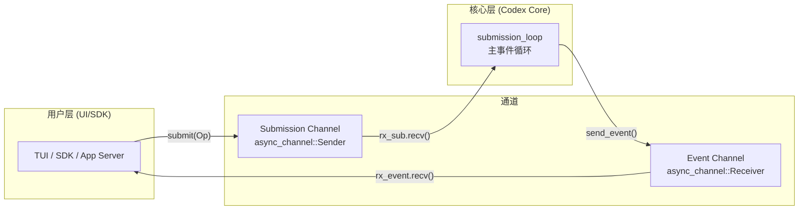
```mermaid
graph LR
    subgraph "用户层 (UI/SDK)"
        UI["TUI / SDK / App Server"]
    end

    subgraph "通道"
        SubChan["Submission Channel<br/>async_channel::Sender"]
        EventChan["Event Channel<br/>async_channel::Receiver"]
    end

    subgraph "核心层 (Codex Core)"
        Loop["submission_loop<br/>主事件循环"]
    end

    UI -->|"submit(Op)"| SubChan
    SubChan -->|"rx_sub.recv()"| Loop
    Loop -->|"send_event()"| EventChan
    EventChan -->|"rx_event.recv()"| UI
```

**设计优势**：
- 完全解耦 UI 和核心逻辑
- 支持多种前端（TUI、SDK、IDE）
- 天然支持异步和并发

---

## 2. 三层事件循环架构

Codex 的事件处理分为三个层次，每层负责不同粒度的处理：

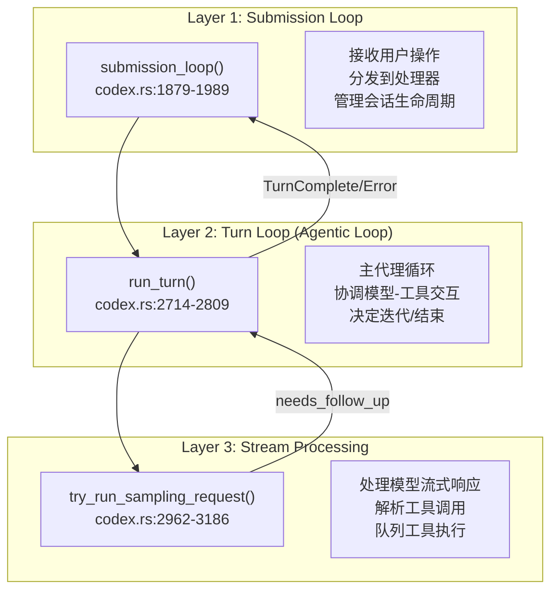
```mermaid
graph TB
    subgraph "Layer 1: Submission Loop"
        SL["submission_loop()<br/>codex.rs:1879-1989"]
        SL_Desc["接收用户操作<br/>分发到处理器<br/>管理会话生命周期"]
    end

    subgraph "Layer 2: Turn Loop (Agentic Loop)"
        TL["run_turn()<br/>codex.rs:2714-2809"]
        TL_Desc["主代理循环<br/>协调模型-工具交互<br/>决定迭代/结束"]
    end

    subgraph "Layer 3: Stream Processing"
        SP["try_run_sampling_request()<br/>codex.rs:2962-3186"]
        SP_Desc["处理模型流式响应<br/>解析工具调用<br/>队列工具执行"]
    end

    SL --> TL
    TL --> SP
    SP -->|"needs_follow_up"| TL
    TL -->|"TurnComplete/Error"| SL
```

### 2.1 Layer 1: Submission Loop（提交循环）

**文件位置**: `codex.rs:1879-1989`

这是最外层的事件循环，持续监听用户提交：

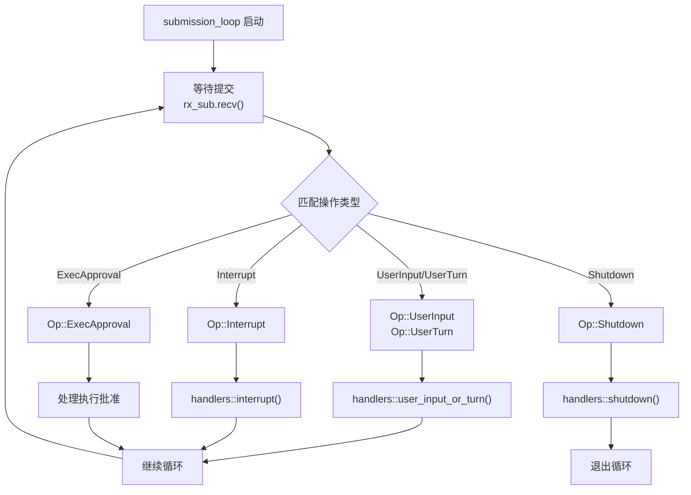
```mermaid
flowchart TD
    Start["submission_loop 启动"]
    Wait["等待提交<br/>rx_sub.recv()"]
    Match{"匹配操作类型"}

    UserInput["Op::UserInput<br/>Op::UserTurn"]
    Interrupt["Op::Interrupt"]
    Approval["Op::ExecApproval"]
    Shutdown["Op::Shutdown"]

    HandleUI["handlers::user_input_or_turn()"]
    HandleInt["handlers::interrupt()"]
    HandleAppr["处理执行批准"]
    HandleShut["handlers::shutdown()"]

    Continue["继续循环"]
    Exit["退出循环"]

    Start --> Wait
    Wait --> Match

    Match -->|UserInput/UserTurn| UserInput --> HandleUI --> Continue
    Match -->|Interrupt| Interrupt --> HandleInt --> Continue
    Match -->|ExecApproval| Approval --> HandleAppr --> Continue
    Match -->|Shutdown| Shutdown --> HandleShut --> Exit

    Continue --> Wait
```

### 2.2 Layer 2: Turn Loop（转换循环 / Agentic Loop）

**文件位置**: `codex.rs:2714-2809`

这是核心的代理循环，实现了 LLM Agent 的迭代逻辑：

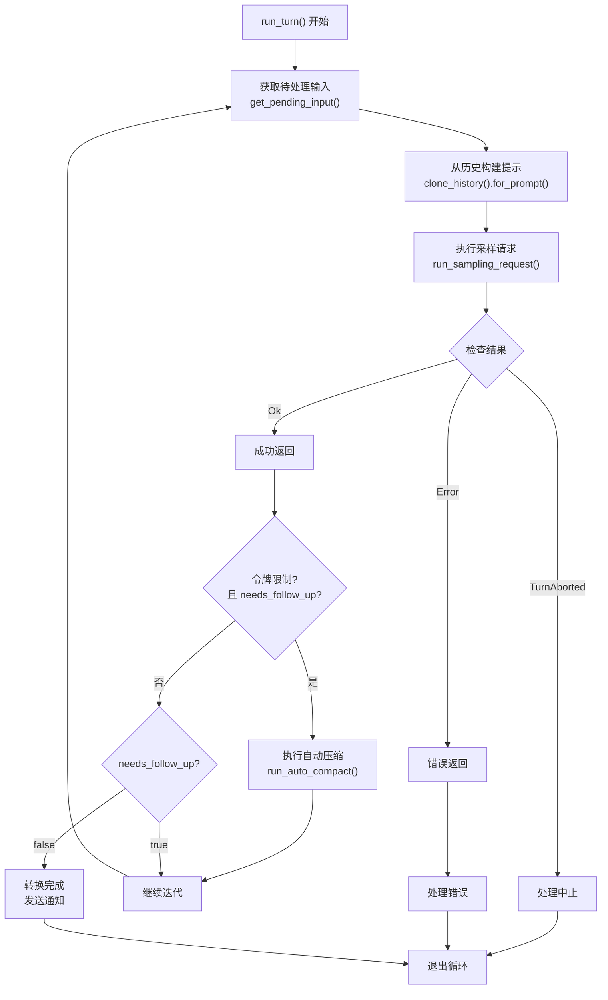
```mermaid
flowchart TD
    Start["run_turn() 开始"]
    GetPending["获取待处理输入<br/>get_pending_input()"]
    BuildPrompt["从历史构建提示<br/>clone_history().for_prompt()"]
    Sample["执行采样请求<br/>run_sampling_request()"]

    CheckResult{"检查结果"}
    Success["成功返回"]
    Error["错误返回"]

    CheckTokens{"令牌限制?<br/>且 needs_follow_up?"}
    Compact["执行自动压缩<br/>run_auto_compact()"]

    CheckFollowUp{"needs_follow_up?"}

    Complete["转换完成<br/>发送通知"]
    Continue["继续迭代"]

    HandleAbort["处理中止"]
    HandleError["处理错误"]
    Exit["退出循环"]

    Start --> GetPending --> BuildPrompt --> Sample

    Sample --> CheckResult
    CheckResult -->|Ok| Success
    CheckResult -->|TurnAborted| HandleAbort --> Exit
    CheckResult -->|Error| Error --> HandleError --> Exit

    Success --> CheckTokens
    CheckTokens -->|是| Compact --> Continue
    CheckTokens -->|否| CheckFollowUp

    CheckFollowUp -->|true| Continue
    CheckFollowUp -->|false| Complete --> Exit

    Continue --> GetPending
```

### 2.3 Layer 3: Stream Processing（流处理）

**文件位置**: `codex.rs:2962-3186`

处理来自模型的实时流式响应：

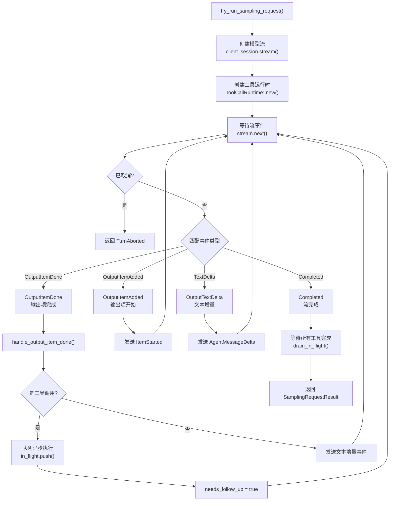
```mermaid
flowchart TD
    Start["try_run_sampling_request()"]
    CreateStream["创建模型流<br/>client_session.stream()"]
    CreateRuntime["创建工具运行时<br/>ToolCallRuntime::new()"]

    WaitEvent["等待流事件<br/>stream.next()"]
    CheckCancel{"已取消?"}
    Cancelled["返回 TurnAborted"]

    MatchEvent{"匹配事件类型"}

    OutputDone["OutputItemDone<br/>输出项完成"]
    OutputAdded["OutputItemAdded<br/>输出项开始"]
    TextDelta["OutputTextDelta<br/>文本增量"]
    Completed["Completed<br/>流完成"]

    HandleDone["handle_output_item_done()"]
    CheckTool{"是工具调用?"}
    QueueTool["队列异步执行<br/>in_flight.push()"]
    SetFollowUp["needs_follow_up = true"]
    HandleText["发送文本增量事件"]

    EmitStart["发送 ItemStarted"]
    EmitDelta["发送 AgentMessageDelta"]

    DrainFlight["等待所有工具完成<br/>drain_in_flight()"]
    ReturnResult["返回 SamplingRequestResult"]

    Start --> CreateStream --> CreateRuntime --> WaitEvent

    WaitEvent --> CheckCancel
    CheckCancel -->|是| Cancelled
    CheckCancel -->|否| MatchEvent

    MatchEvent -->|OutputItemDone| OutputDone --> HandleDone
    MatchEvent -->|OutputItemAdded| OutputAdded --> EmitStart --> WaitEvent
    MatchEvent -->|TextDelta| TextDelta --> EmitDelta --> WaitEvent
    MatchEvent -->|Completed| Completed --> DrainFlight --> ReturnResult

    HandleDone --> CheckTool
    CheckTool -->|是| QueueTool --> SetFollowUp --> WaitEvent
    CheckTool -->|否| HandleText --> WaitEvent
```

---

## 3. 用户任务处理流程

当用户提交一个任务时，经历以下完整流程：

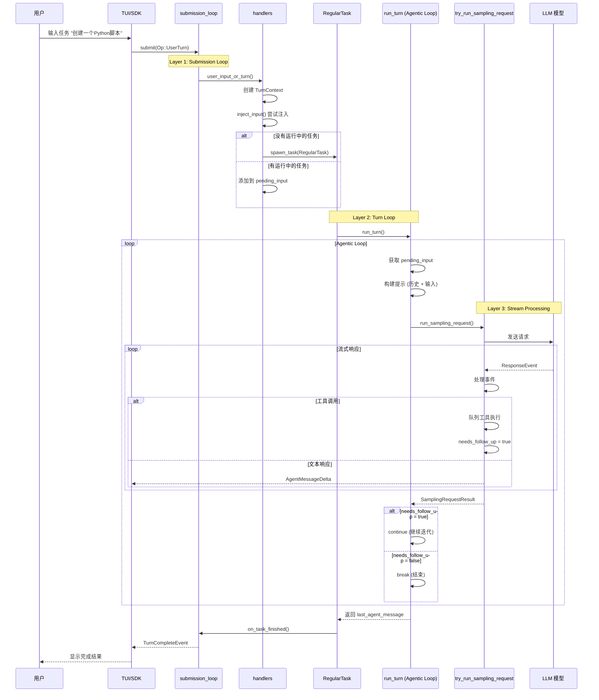
```mermaid
sequenceDiagram
    participant User as 用户
    participant UI as TUI/SDK
    participant SL as submission_loop
    participant Handler as handlers
    participant Task as RegularTask
    participant TL as run_turn (Agentic Loop)
    participant SP as try_run_sampling_request
    participant Model as LLM 模型

    User->>UI: 输入任务 "创建一个Python脚本"
    UI->>SL: submit(Op::UserTurn)

    Note over SL: Layer 1: Submission Loop
    SL->>Handler: user_input_or_turn()

    Handler->>Handler: 创建 TurnContext
    Handler->>Handler: inject_input() 尝试注入
    alt 没有运行中的任务
        Handler->>Task: spawn_task(RegularTask)
    else 有运行中的任务
        Handler->>Handler: 添加到 pending_input
    end

    Note over Task,TL: Layer 2: Turn Loop
    Task->>TL: run_turn()

    loop Agentic Loop
        TL->>TL: 获取 pending_input
        TL->>TL: 构建提示 (历史 + 输入)

        Note over SP,Model: Layer 3: Stream Processing
        TL->>SP: run_sampling_request()
        SP->>Model: 发送请求

        loop 流式响应
            Model-->>SP: ResponseEvent
            SP->>SP: 处理事件
            alt 工具调用
                SP->>SP: 队列工具执行
                SP->>SP: needs_follow_up = true
            else 文本响应
                SP-->>UI: AgentMessageDelta
            end
        end

        SP-->>TL: SamplingRequestResult

        alt needs_follow_up = true
            TL->>TL: continue (继续迭代)
        else needs_follow_up = false
            TL->>TL: break (结束)
        end
    end

    TL-->>Task: 返回 last_agent_message
    Task->>SL: on_task_finished()
    SL-->>UI: TurnCompleteEvent
    UI-->>User: 显示完成结果
```

---

## 4. Agentic Loop - 代理循环

### 4.1 核心循环伪代码

```
function run_turn(context, input):
    while true:
        # 1. 检查并获取待处理的用户输入
        pending_input = get_pending_input()

        # 2. 将输入记录到历史
        record_to_history(pending_input)

        # 3. 从历史构建完整提示
        prompt = history.for_prompt()

        # 4. 执行模型采样请求
        result = run_sampling_request(prompt)

        # 5. 检查结果
        if result is Error:
            handle_error(result)
            break

        # 6. 检查是否需要自动压缩
        if token_limit_reached AND result.needs_follow_up:
            run_auto_compact()
            continue

        # 7. 决策点：是否继续迭代
        if result.needs_follow_up:
            continue  # 有工具调用或待处理输入，继续
        else:
            break     # 任务完成

    return last_agent_message
```

### 4.2 `needs_follow_up` 标志的设置

这是决定迭代的核心标志：

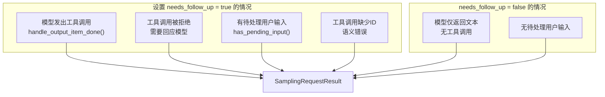
```mermaid
graph TD
    subgraph "设置 needs_follow_up = true 的情况"
        TC["模型发出工具调用<br/>handle_output_item_done()"]
        RM["工具调用被拒绝<br/>需要回应模型"]
        PI["有待处理用户输入<br/>has_pending_input()"]
        ME["工具调用缺少ID<br/>语义错误"]
    end

    subgraph "needs_follow_up = false 的情况"
        NTC["模型仅返回文本<br/>无工具调用"]
        NPI["无待处理用户输入"]
    end

    Result["SamplingRequestResult"]

    TC --> Result
    RM --> Result
    PI --> Result
    ME --> Result
    NTC --> Result
    NPI --> Result
```

### 4.3 消息历史的累积

每次迭代，历史记录不断累积：

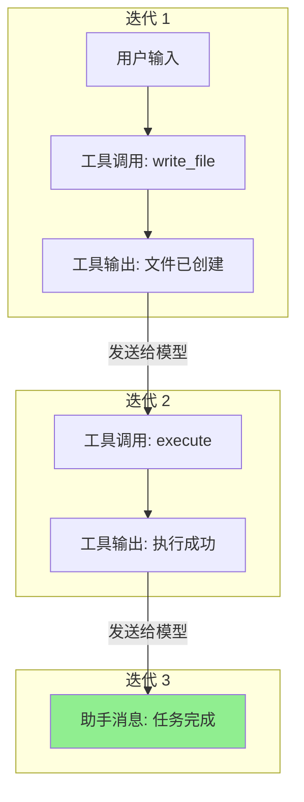
```mermaid
graph TB
    subgraph "迭代 1"
        H1_User["用户输入"]
        H1_Tool["工具调用: write_file"]
        H1_Out["工具输出: 文件已创建"]
    end

    subgraph "迭代 2"
        H2_Tool["工具调用: execute"]
        H2_Out["工具输出: 执行成功"]
    end

    subgraph "迭代 3"
        H3_Msg["助手消息: 任务完成"]
    end

    H1_User --> H1_Tool --> H1_Out
    H1_Out -->|"发送给模型"| H2_Tool
    H2_Tool --> H2_Out
    H2_Out -->|"发送给模型"| H3_Msg

    style H3_Msg fill:#90EE90
```

---

## 5. 工具调用与执行

### 5.1 工具调用识别与处理

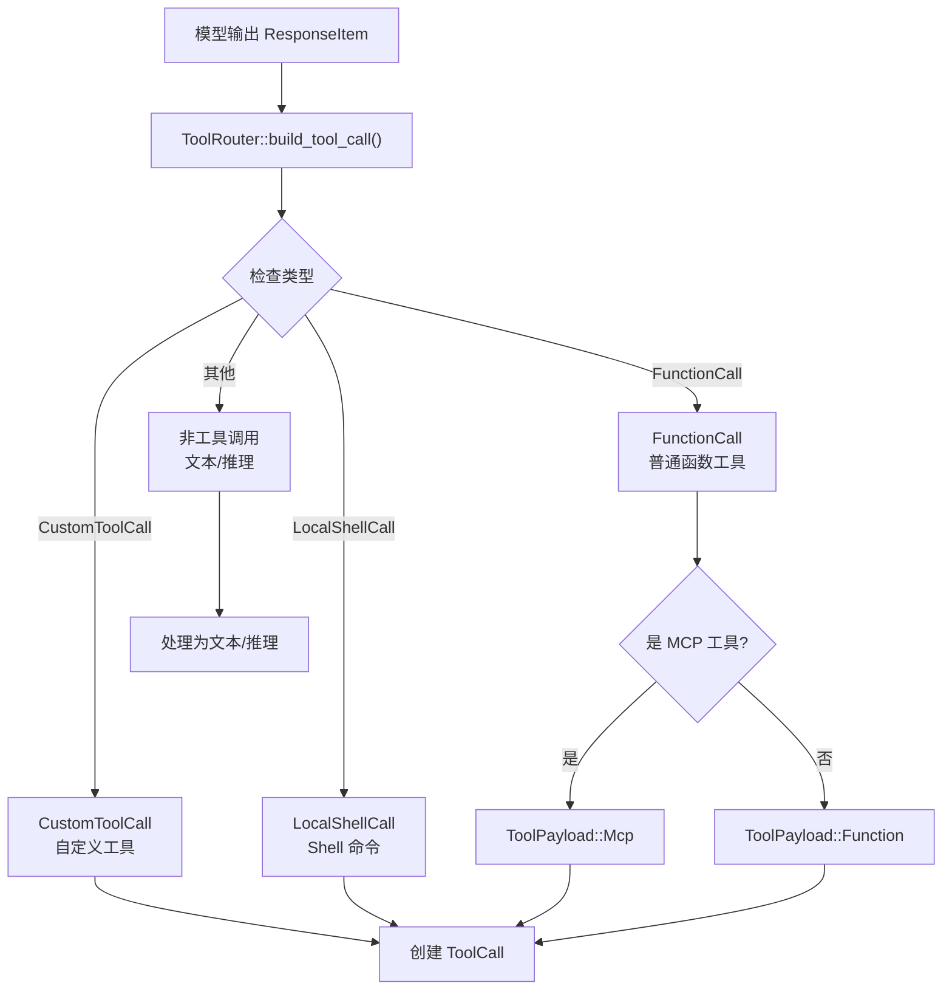
```mermaid
flowchart TD
    ModelOutput["模型输出 ResponseItem"]
    BuildCall["ToolRouter::build_tool_call()"]

    CheckType{"检查类型"}
    FuncCall["FunctionCall<br/>普通函数工具"]
    CustomCall["CustomToolCall<br/>自定义工具"]
    ShellCall["LocalShellCall<br/>Shell 命令"]
    NotTool["非工具调用<br/>文本/推理"]

    ParseMCP{"是 MCP 工具?"}
    MCPPayload["ToolPayload::Mcp"]
    FuncPayload["ToolPayload::Function"]

    CreateInvocation["创建 ToolCall"]
    HandleText["处理为文本/推理"]

    ModelOutput --> BuildCall --> CheckType

    CheckType -->|FunctionCall| FuncCall --> ParseMCP
    CheckType -->|CustomToolCall| CustomCall --> CreateInvocation
    CheckType -->|LocalShellCall| ShellCall --> CreateInvocation
    CheckType -->|其他| NotTool --> HandleText

    ParseMCP -->|是| MCPPayload --> CreateInvocation
    ParseMCP -->|否| FuncPayload --> CreateInvocation
```

### 5.2 工具执行流程

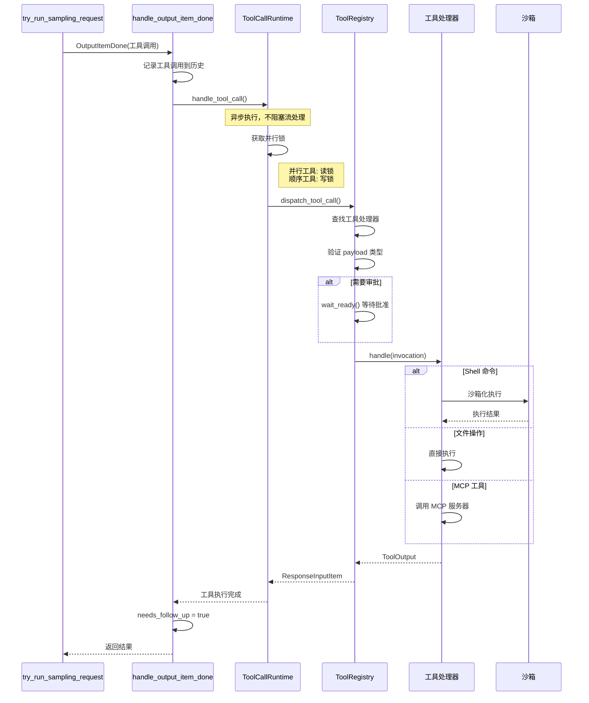
```mermaid
sequenceDiagram
    participant SR as try_run_sampling_request
    participant HO as handle_output_item_done
    participant TR as ToolCallRuntime
    participant Reg as ToolRegistry
    participant Handler as 工具处理器
    participant Sandbox as 沙箱

    SR->>HO: OutputItemDone(工具调用)

    HO->>HO: 记录工具调用到历史
    HO->>TR: handle_tool_call()

    Note over TR: 异步执行，不阻塞流处理

    TR->>TR: 获取并行锁
    Note right of TR: 并行工具: 读锁<br/>顺序工具: 写锁

    TR->>Reg: dispatch_tool_call()
    Reg->>Reg: 查找工具处理器
    Reg->>Reg: 验证 payload 类型

    alt 需要审批
        Reg->>Reg: wait_ready() 等待批准
    end

    Reg->>Handler: handle(invocation)

    alt Shell 命令
        Handler->>Sandbox: 沙箱化执行
        Sandbox-->>Handler: 执行结果
    else 文件操作
        Handler->>Handler: 直接执行
    else MCP 工具
        Handler->>Handler: 调用 MCP 服务器
    end

    Handler-->>Reg: ToolOutput
    Reg-->>TR: ResponseInputItem
    TR-->>HO: 工具执行完成

    HO->>HO: needs_follow_up = true
    HO-->>SR: 返回结果
```

### 5.3 并行与顺序执行

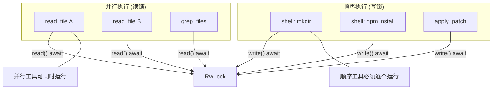
```mermaid
graph TB
    subgraph "并行执行 (读锁)"
        P1["read_file A"]
        P2["read_file B"]
        P3["grep_files"]
    end

    subgraph "顺序执行 (写锁)"
        S1["shell: mkdir"]
        S2["shell: npm install"]
        S3["apply_patch"]
    end

    Lock["RwLock"]

    P1 -->|"read().await"| Lock
    P2 -->|"read().await"| Lock
    P3 -->|"read().await"| Lock

    S1 -->|"write().await"| Lock
    S2 -->|"write().await"| Lock
    S3 -->|"write().await"| Lock

    Note1["并行工具可同时运行"]
    Note2["顺序工具必须逐个运行"]

    P1 --- Note1
    S1 --- Note2
```

---

## 6. 迭代决策机制

### 6.1 决策流程图

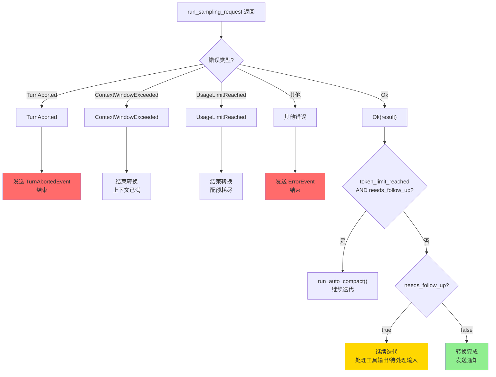
```mermaid
flowchart TD
    Start["run_sampling_request 返回"]
    CheckError{"错误类型?"}

    Success["Ok(result)"]
    Aborted["TurnAborted"]
    CtxExceeded["ContextWindowExceeded"]
    UsageLimit["UsageLimitReached"]
    OtherError["其他错误"]

    HandleAbort["发送 TurnAbortedEvent<br/>结束"]
    HandleCtx["结束转换<br/>上下文已满"]
    HandleUsage["结束转换<br/>配额耗尽"]
    HandleErr["发送 ErrorEvent<br/>结束"]

    CheckTokens{"token_limit_reached<br/>AND needs_follow_up?"}
    RunCompact["run_auto_compact()<br/>继续迭代"]

    CheckFollowUp{"needs_follow_up?"}
    ContinueLoop["继续迭代<br/>处理工具输出/待处理输入"]
    EndLoop["转换完成<br/>发送通知"]

    Start --> CheckError

    CheckError -->|Ok| Success
    CheckError -->|TurnAborted| Aborted --> HandleAbort
    CheckError -->|ContextWindowExceeded| CtxExceeded --> HandleCtx
    CheckError -->|UsageLimitReached| UsageLimit --> HandleUsage
    CheckError -->|其他| OtherError --> HandleErr

    Success --> CheckTokens
    CheckTokens -->|是| RunCompact
    CheckTokens -->|否| CheckFollowUp

    CheckFollowUp -->|true| ContinueLoop
    CheckFollowUp -->|false| EndLoop

    style ContinueLoop fill:#FFD700
    style EndLoop fill:#90EE90
    style HandleAbort fill:#FF6B6B
    style HandleErr fill:#FF6B6B
```

### 6.2 继续迭代的条件

| 条件 | 说明 | 来源 |
|------|------|------|
| **工具调用存在** | 模型发出了一个或多个工具调用 | `handle_output_item_done()` |
| **工具调用被拒绝** | 需要回应模型说明拒绝原因 | `FunctionCallError::RespondToModel` |
| **待处理用户输入** | 用户在模型运行时提交了新输入 | `has_pending_input()` |
| **工具调用语义错误** | 例如缺少 ID | `FunctionCallError::MissingLocalShellCallId` |

### 6.3 结束迭代的条件

| 条件 | 事件 | 说明 |
|------|------|------|
| **`needs_follow_up = false`** | `TurnCompleteEvent` | 模型仅返回文本，无工具调用，无待处理输入 |
| **用户中止** | `TurnAbortedEvent` | 用户主动取消任务 |
| **上下文窗口超出** | `ErrorEvent` | 消息历史太长 |
| **使用量限制** | `ErrorEvent` | API 配额耗尽 |
| **致命错误** | `ErrorEvent` | 不可恢复的错误 |

---

## 7. 多轮工具调用处理

### 7.1 工具调用队列机制

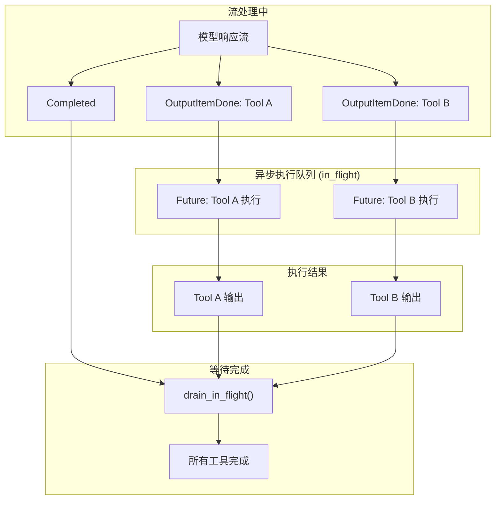
```mermaid
graph TB
    subgraph "流处理中"
        Stream["模型响应流"]
        Event1["OutputItemDone: Tool A"]
        Event2["OutputItemDone: Tool B"]
        Event3["Completed"]
    end

    subgraph "异步执行队列 (in_flight)"
        Future1["Future: Tool A 执行"]
        Future2["Future: Tool B 执行"]
    end

    subgraph "执行结果"
        Result1["Tool A 输出"]
        Result2["Tool B 输出"]
    end

    subgraph "等待完成"
        Drain["drain_in_flight()"]
        AllDone["所有工具完成"]
    end

    Stream --> Event1
    Event1 --> Future1
    Stream --> Event2
    Event2 --> Future2
    Stream --> Event3
    Event3 --> Drain

    Future1 --> Result1
    Future2 --> Result2
    Result1 --> Drain
    Result2 --> Drain
    Drain --> AllDone
```

### 7.2 用户输入注入机制

当用户在模型运行时提交新输入：

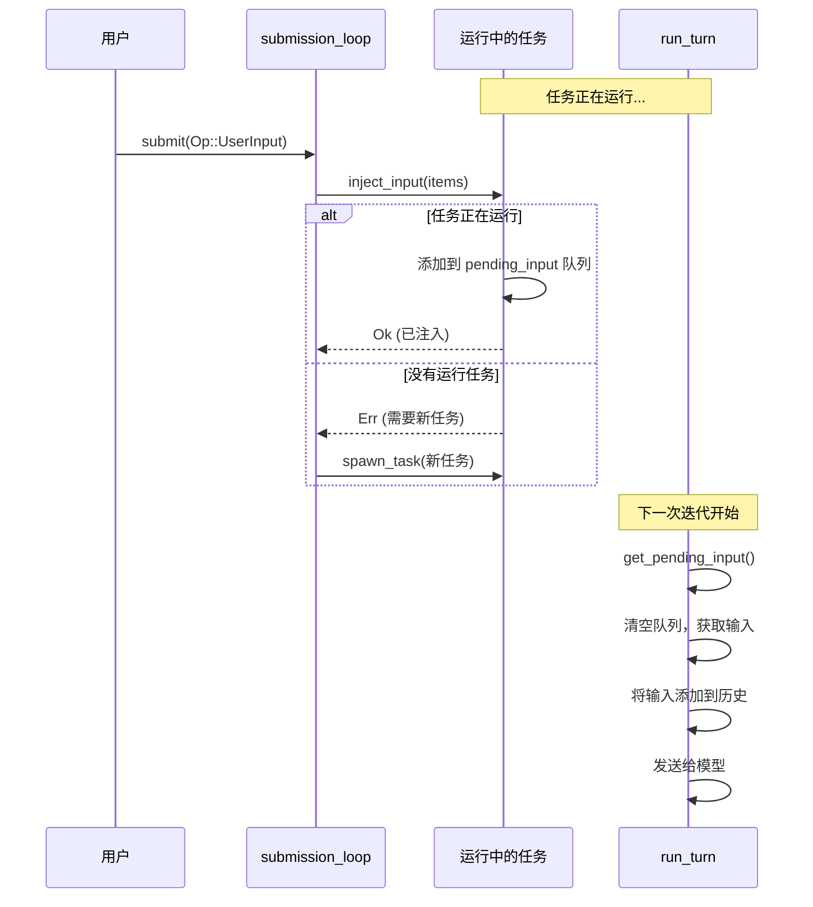
```mermaid
sequenceDiagram
    participant User as 用户
    participant SL as submission_loop
    participant Task as 运行中的任务
    participant TL as run_turn

    Note over Task,TL: 任务正在运行...

    User->>SL: submit(Op::UserInput)
    SL->>Task: inject_input(items)

    alt 任务正在运行
        Task->>Task: 添加到 pending_input 队列
        Task-->>SL: Ok (已注入)
    else 没有运行任务
        Task-->>SL: Err (需要新任务)
        SL->>Task: spawn_task(新任务)
    end

    Note over TL: 下一次迭代开始

    TL->>TL: get_pending_input()
    TL->>TL: 清空队列，获取输入
    TL->>TL: 将输入添加到历史
    TL->>TL: 发送给模型
```

### 7.3 历史记录的结构

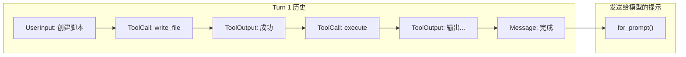
```mermaid
graph LR
    subgraph "Turn 1 历史"
        T1U["UserInput: 创建脚本"]
        T1C1["ToolCall: write_file"]
        T1O1["ToolOutput: 成功"]
        T1C2["ToolCall: execute"]
        T1O2["ToolOutput: 输出..."]
        T1M["Message: 完成"]
    end

    T1U --> T1C1 --> T1O1 --> T1C2 --> T1O2 --> T1M

    subgraph "发送给模型的提示"
        Prompt["for_prompt()"]
    end

    T1M --> Prompt
```

---

## 8. 完整执行示例

### 8.1 场景：用户请求创建并运行 Python 脚本

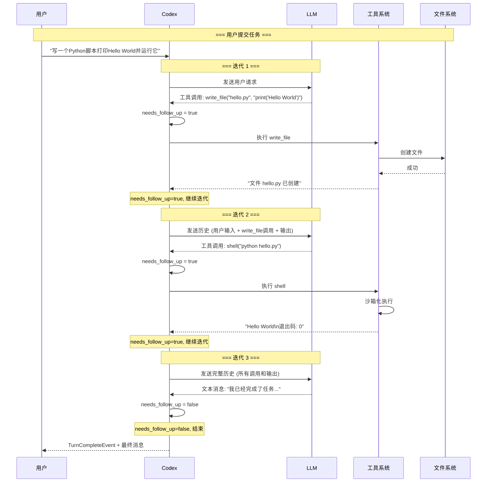
```mermaid
sequenceDiagram
    participant User as 用户
    participant Codex as Codex
    participant Model as LLM
    participant Tools as 工具系统
    participant FS as 文件系统

    Note over User,FS: === 用户提交任务 ===
    User->>Codex: "写一个Python脚本打印Hello World并运行它"

    Note over Codex,Model: === 迭代 1 ===
    Codex->>Model: 发送用户请求
    Model-->>Codex: 工具调用: write_file("hello.py", "print('Hello World')")
    Codex->>Codex: needs_follow_up = true

    Codex->>Tools: 执行 write_file
    Tools->>FS: 创建文件
    FS-->>Tools: 成功
    Tools-->>Codex: "文件 hello.py 已创建"

    Note over Codex: needs_follow_up=true, 继续迭代

    Note over Codex,Model: === 迭代 2 ===
    Codex->>Model: 发送历史 (用户输入 + write_file调用 + 输出)
    Model-->>Codex: 工具调用: shell("python hello.py")
    Codex->>Codex: needs_follow_up = true

    Codex->>Tools: 执行 shell
    Tools->>Tools: 沙箱化执行
    Tools-->>Codex: "Hello World\n退出码: 0"

    Note over Codex: needs_follow_up=true, 继续迭代

    Note over Codex,Model: === 迭代 3 ===
    Codex->>Model: 发送完整历史 (所有调用和输出)
    Model-->>Codex: 文本消息: "我已经完成了任务..."
    Codex->>Codex: needs_follow_up = false

    Note over Codex: needs_follow_up=false, 结束

    Codex-->>User: TurnCompleteEvent + 最终消息
```

### 8.2 执行流程详解

```
Step 1: 用户提交 Op::UserTurn { items: ["写一个Python脚本并运行它"] }
        ↓ submission_loop()

Step 2: handlers::user_input_or_turn()
        → 创建新 TurnContext
        → inject_input() 返回 Err (没有运行任务)
        → spawn_task(RegularTask)
        ↓

Step 3: RegularTask::run() 调用 run_turn()
        ↓ (进入 Agentic Loop)

Step 4: [迭代 1] run_sampling_request()
        ↓ try_run_sampling_request()
        → 模型返回: Tool Call "write_file" (hello.py)
        ↓ handle_output_item_done()
        → 记录工具调用，队列异步执行
        → needs_follow_up = true
        → 工具执行完成，输出记录到历史
        ↓

Step 5: run_turn() 主循环检查
        → needs_follow_up = true
        → continue (继续迭代)
        ↓

Step 6: [迭代 2] run_sampling_request()
        → 历史: 用户输入 + write_file调用 + 输出
        → 模型返回: Tool Call "shell" (python hello.py)
        → 工具执行完成，输出记录到历史
        → needs_follow_up = true
        ↓

Step 7: run_turn() 主循环检查
        → needs_follow_up = true
        → continue (继续迭代)
        ↓

Step 8: [迭代 3] run_sampling_request()
        → 历史: 所有之前的调用和输出
        → 模型返回: 文本消息 "任务完成..."
        → needs_follow_up = false (无工具调用)
        ↓

Step 9: run_turn() 主循环检查
        → needs_follow_up = false
        → break (退出循环)
        ↓

Step 10: run_turn() 返回 last_agent_message
         ↓

Step 11: on_task_finished() 发送 TurnCompleteEvent
         ↓

Step 12: UI 显示完成结果
```

---

## 9. 关键代码索引

### 9.1 核心文件

| 文件 | 行号 | 功能 |
|------|------|------|
| `codex.rs` | 1879-1989 | Submission Loop - 主事件循环 |
| `codex.rs` | 2081-2167 | 用户输入处理 |
| `codex.rs` | 2714-2809 | Turn Loop (Agentic Loop) |
| `codex.rs` | 2827-2927 | 采样请求（含重试） |
| `codex.rs` | 2962-3186 | 流处理（核心） |

### 9.2 工具系统

| 文件 | 行号 | 功能 |
|------|------|------|
| `stream_events_utils.rs` | 42-151 | 工具输出处理 |
| `tools/router.rs` | 58-127 | 工具调用构建 |
| `tools/parallel.rs` | 1-138 | 工具运行时（并行执行） |
| `tools/registry.rs` | 67-149 | 工具注册表和分发 |
| `tools/orchestrator.rs` | 35-162 | 工具编排（审批+沙箱） |

### 9.3 任务管理

| 文件 | 行号 | 功能 |
|------|------|------|
| `tasks/mod.rs` | 105-247 | 任务生命周期 |
| `tasks/regular.rs` | 1-41 | 正规任务实现 |
| `codex.rs` | 1665-1715 | 待处理输入机制 |

---

## 10. 总结：Codex 如何决定任务完成

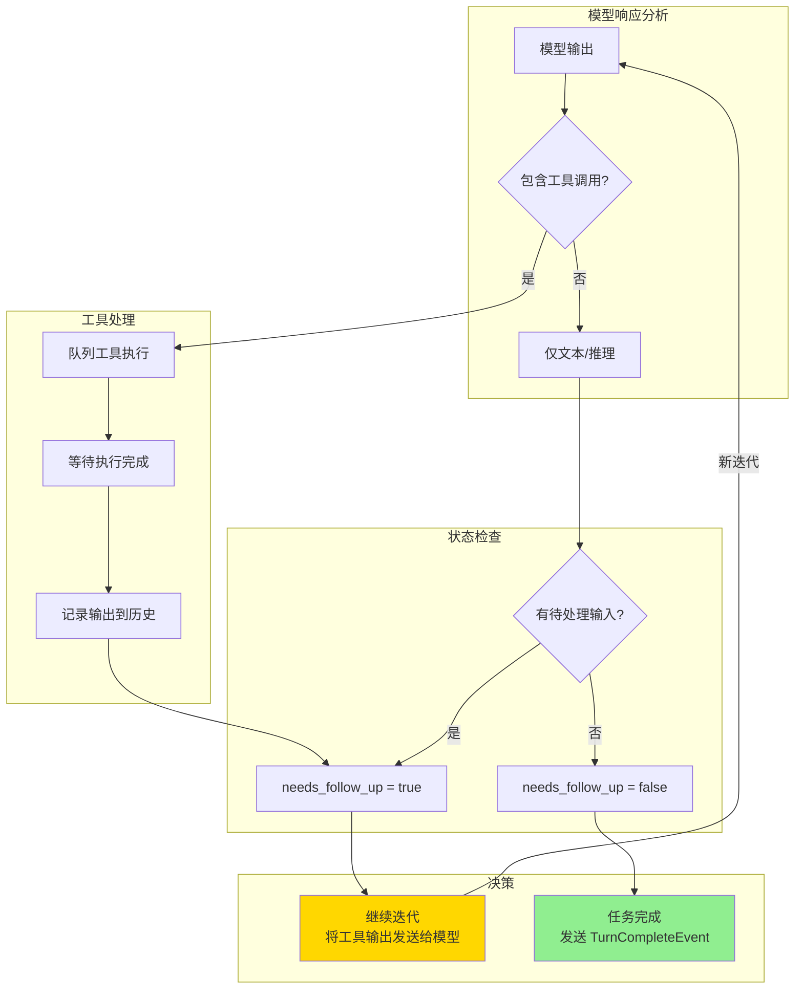
```mermaid
graph TB
    subgraph "模型响应分析"
        Output["模型输出"]
        HasTool{"包含工具调用?"}
        HasText["仅文本/推理"]
    end

    subgraph "工具处理"
        QueueTool["队列工具执行"]
        WaitTool["等待执行完成"]
        RecordOutput["记录输出到历史"]
    end

    subgraph "状态检查"
        CheckPending{"有待处理输入?"}
        SetFollowUp["needs_follow_up = true"]
        ClearFollowUp["needs_follow_up = false"]
    end

    subgraph "决策"
        Continue["继续迭代<br/>将工具输出发送给模型"]
        Complete["任务完成<br/>发送 TurnCompleteEvent"]
    end

    Output --> HasTool
    HasTool -->|是| QueueTool --> WaitTool --> RecordOutput --> SetFollowUp
    HasTool -->|否| HasText --> CheckPending

    CheckPending -->|是| SetFollowUp
    CheckPending -->|否| ClearFollowUp

    SetFollowUp --> Continue
    ClearFollowUp --> Complete

    Continue -->|"新迭代"| Output

    style Complete fill:#90EE90
    style Continue fill:#FFD700
```

**核心原理**：

1. **工具调用 = 继续迭代**：只要模型发出工具调用，就需要执行工具并将结果返回给模型
2. **纯文本 = 可能完成**：如果模型只返回文本且没有待处理输入，任务完成
3. **历史累积**：每次迭代都在历史中累积信息，模型可以看到所有之前的交互
4. **模型决定**：最终是模型决定是否继续发出工具调用，Codex 只是执行并反馈

---

*本文档基于 Codex 源码分析生成，版本日期：2026-01-19*
