# Codex 工具调用系统深度解析

> 本文档详细解析 Codex 的工具调用机制，包括工具注册、选择、调用、结果处理和成功判断等全流程。

## 目录

1. [工具系统概述](#1-工具系统概述)
2. [工具注册机制](#2-工具注册机制)
3. [工具选择与路由](#3-工具选择与路由)
4. [工具调用执行](#4-工具调用执行)
5. [审批机制](#5-审批机制)
6. [工具结果处理](#6-工具结果处理)
7. [错误处理机制](#7-错误处理机制)
8. [并行工具调用](#8-并行工具调用)
9. [完整调用流程示例](#9-完整调用流程示例)
10. [关键代码索引](#10-关键代码索引)

---

## 1. 工具系统概述

### 1.1 工具系统架构

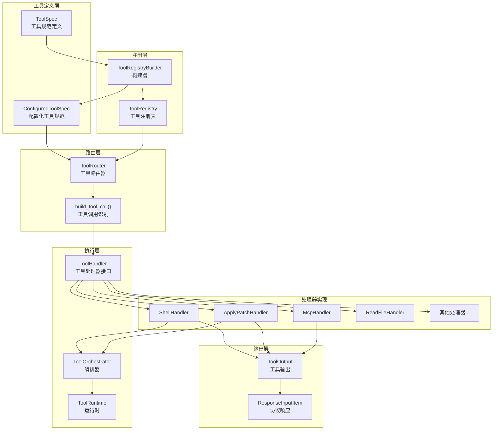
```mermaid
graph TB
    subgraph "工具定义层"
        ToolSpec["ToolSpec<br/>工具规范定义"]
        ConfiguredSpec["ConfiguredToolSpec<br/>配置化工具规范"]
    end

    subgraph "注册层"
        Builder["ToolRegistryBuilder<br/>构建器"]
        Registry["ToolRegistry<br/>工具注册表"]
    end

    subgraph "路由层"
        Router["ToolRouter<br/>工具路由器"]
        BuildCall["build_tool_call()<br/>工具调用识别"]
    end

    subgraph "执行层"
        Handler["ToolHandler<br/>工具处理器接口"]
        Orchestrator["ToolOrchestrator<br/>编排器"]
        Runtime["ToolRuntime<br/>运行时"]
    end

    subgraph "处理器实现"
        Shell["ShellHandler"]
        ApplyPatch["ApplyPatchHandler"]
        MCP["McpHandler"]
        ReadFile["ReadFileHandler"]
        Others["其他处理器..."]
    end

    subgraph "输出层"
        Output["ToolOutput<br/>工具输出"]
        Response["ResponseInputItem<br/>协议响应"]
    end

    ToolSpec --> Builder
    Builder --> ConfiguredSpec
    Builder --> Registry
    ConfiguredSpec --> Router
    Registry --> Router

    Router --> BuildCall
    BuildCall --> Handler

    Handler --> Shell
    Handler --> ApplyPatch
    Handler --> MCP
    Handler --> ReadFile
    Handler --> Others

    Shell --> Orchestrator
    ApplyPatch --> Orchestrator
    Orchestrator --> Runtime

    Shell --> Output
    ApplyPatch --> Output
    MCP --> Output
    Output --> Response
```

### 1.2 工具类型分类

| 工具类型 | 说明 | 示例 |
|---------|------|------|
| **Function** | 标准 OpenAI Functions 格式 | shell, read_file, grep_files |
| **LocalShell** | 本地 Shell 特殊格式 | local_shell |
| **Custom (Freeform)** | 自定义格式工具 | apply_patch |
| **MCP** | 外部 MCP 服务器工具 | mcp_* |
| **WebSearch** | Web 搜索工具 | web_search |

---

## 2. 工具注册机制

### 2.1 ToolSpec 定义体系

**文件位置**: `client_common.rs:164-226`

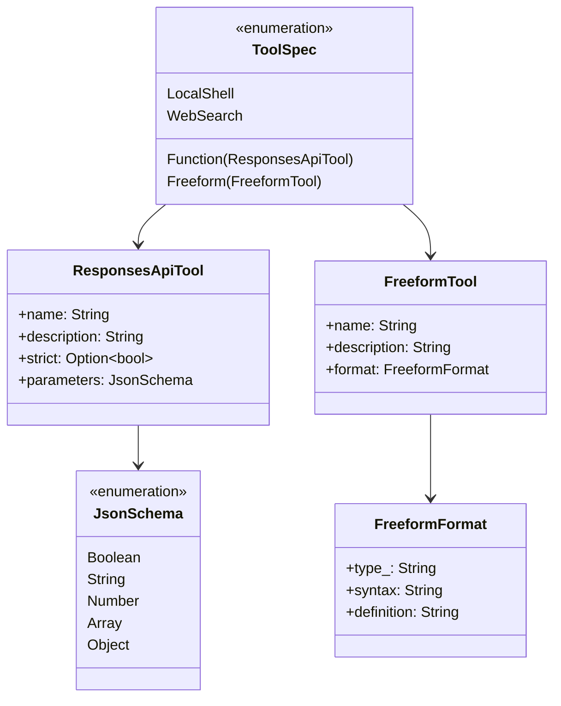
```mermaid
classDiagram
    class ToolSpec {
        <<enumeration>>
        Function(ResponsesApiTool)
        LocalShell
        WebSearch
        Freeform(FreeformTool)
    }

    class ResponsesApiTool {
        +name: String
        +description: String
        +strict: Option~bool~
        +parameters: JsonSchema
    }

    class FreeformTool {
        +name: String
        +description: String
        +format: FreeformFormat
    }

    class FreeformFormat {
        +type_: String
        +syntax: String
        +definition: String
    }

    class JsonSchema {
        <<enumeration>>
        Boolean
        String
        Number
        Array
        Object
    }

    ToolSpec --> ResponsesApiTool
    ToolSpec --> FreeformTool
    ResponsesApiTool --> JsonSchema
    FreeformTool --> FreeformFormat
```

### 2.2 ToolRegistry 构建流程

**文件位置**: `tools/registry.rs:46-226`

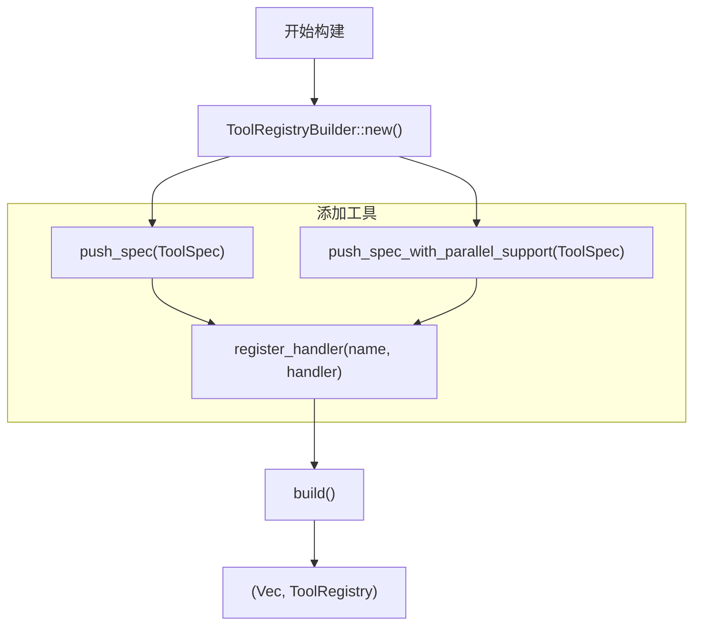
```mermaid
flowchart TD
    Start["开始构建"]
    CreateBuilder["ToolRegistryBuilder::new()"]

    subgraph "添加工具"
        AddSpec["push_spec(ToolSpec)"]
        AddSpecParallel["push_spec_with_parallel_support(ToolSpec)"]
        RegisterHandler["register_handler(name, handler)"]
    end

    Build["build()"]
    Output["(Vec<ConfiguredToolSpec>, ToolRegistry)"]

    Start --> CreateBuilder
    CreateBuilder --> AddSpec
    CreateBuilder --> AddSpecParallel
    AddSpec --> RegisterHandler
    AddSpecParallel --> RegisterHandler
    RegisterHandler --> Build
    Build --> Output
```

```rust
// 核心数据结构
pub struct ToolRegistry {
    handlers: HashMap<String, Arc<dyn ToolHandler>>,
}

pub struct ConfiguredToolSpec {
    pub spec: ToolSpec,
    pub supports_parallel_tool_calls: bool,
}
```

### 2.3 内置工具注册 (build_specs)

**文件位置**: `tools/spec.rs:1131-1296`

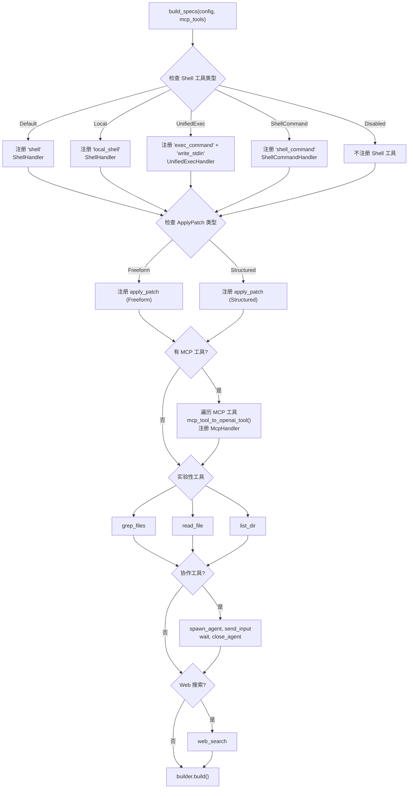
```mermaid
flowchart TD
    Start["build_specs(config, mcp_tools)"]

    CheckShell{"检查 Shell 工具类型"}
    Default["注册 'shell'<br/>ShellHandler"]
    Local["注册 'local_shell'<br/>ShellHandler"]
    UnifiedExec["注册 'exec_command' + 'write_stdin'<br/>UnifiedExecHandler"]
    ShellCmd["注册 'shell_command'<br/>ShellCommandHandler"]
    Disabled["不注册 Shell 工具"]

    CheckApplyPatch{"检查 ApplyPatch 类型"}
    APFreeform["注册 apply_patch (Freeform)"]
    APStructured["注册 apply_patch (Structured)"]

    CheckMCP{"有 MCP 工具?"}
    RegisterMCP["遍历 MCP 工具<br/>mcp_tool_to_openai_tool()<br/>注册 McpHandler"]

    CheckExperimental{"实验性工具"}
    RegGrepFiles["grep_files"]
    RegReadFile["read_file"]
    RegListDir["list_dir"]

    CheckCollab{"协作工具?"}
    RegCollab["spawn_agent, send_input<br/>wait, close_agent"]

    CheckWebSearch{"Web 搜索?"}
    RegWebSearch["web_search"]

    Build["builder.build()"]

    Start --> CheckShell
    CheckShell -->|Default| Default
    CheckShell -->|Local| Local
    CheckShell -->|UnifiedExec| UnifiedExec
    CheckShell -->|ShellCommand| ShellCmd
    CheckShell -->|Disabled| Disabled

    Default --> CheckApplyPatch
    Local --> CheckApplyPatch
    UnifiedExec --> CheckApplyPatch
    ShellCmd --> CheckApplyPatch
    Disabled --> CheckApplyPatch

    CheckApplyPatch -->|Freeform| APFreeform
    CheckApplyPatch -->|Structured| APStructured

    APFreeform --> CheckMCP
    APStructured --> CheckMCP

    CheckMCP -->|是| RegisterMCP
    CheckMCP -->|否| CheckExperimental
    RegisterMCP --> CheckExperimental

    CheckExperimental --> RegGrepFiles
    CheckExperimental --> RegReadFile
    CheckExperimental --> RegListDir

    RegGrepFiles --> CheckCollab
    RegReadFile --> CheckCollab
    RegListDir --> CheckCollab

    CheckCollab -->|是| RegCollab
    CheckCollab -->|否| CheckWebSearch
    RegCollab --> CheckWebSearch

    CheckWebSearch -->|是| RegWebSearch
    CheckWebSearch -->|否| Build
    RegWebSearch --> Build
```

### 2.4 内置工具列表

| 工具名 | 处理器 | 并行支持 | 变异性 |
|--------|--------|---------|--------|
| `shell` | ShellHandler | ❌ | 取决于命令 |
| `local_shell` | ShellHandler | ❌ | 取决于命令 |
| `exec_command` | UnifiedExecHandler | ❌ | 取决于命令 |
| `write_stdin` | UnifiedExecHandler | ❌ | 是 |
| `apply_patch` | ApplyPatchHandler | ❌ | 是 |
| `read_file` | ReadFileHandler | ✅ | 否 |
| `grep_files` | GrepFilesHandler | ✅ | 否 |
| `list_dir` | ListDirHandler | ✅ | 否 |
| `view_image` | ViewImageHandler | ✅ | 否 |
| `update_plan` | PlanHandler | ❌ | 否 |
| `mcp_*` | McpHandler | ❌ | 取决于工具 |

---

## 3. 工具选择与路由

### 3.1 ToolRouter 结构

**文件位置**: `tools/router.rs:28-56`

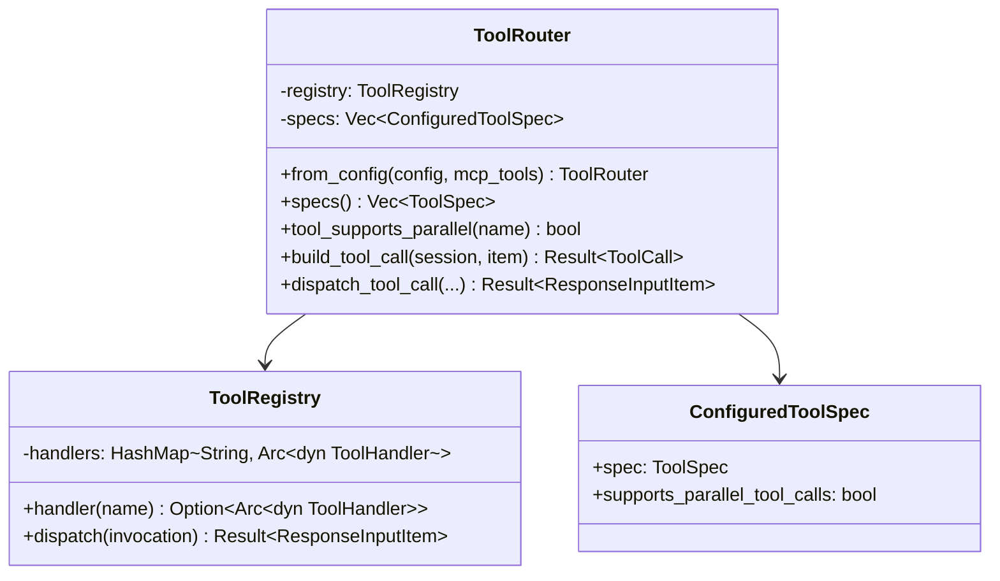
```mermaid
classDiagram
    class ToolRouter {
        -registry: ToolRegistry
        -specs: Vec~ConfiguredToolSpec~
        +from_config(config, mcp_tools) ToolRouter
        +specs() Vec~ToolSpec~
        +tool_supports_parallel(name) bool
        +build_tool_call(session, item) Result~ToolCall~
        +dispatch_tool_call(...) Result~ResponseInputItem~
    }

    class ToolRegistry {
        -handlers: HashMap~String, Arc~dyn ToolHandler~~
        +handler(name) Option~Arc~dyn ToolHandler~~
        +dispatch(invocation) Result~ResponseInputItem~
    }

    class ConfiguredToolSpec {
        +spec: ToolSpec
        +supports_parallel_tool_calls: bool
    }

    ToolRouter --> ToolRegistry
    ToolRouter --> ConfiguredToolSpec
```

### 3.2 工具调用识别 (build_tool_call)

**文件位置**: `tools/router.rs:58-127`

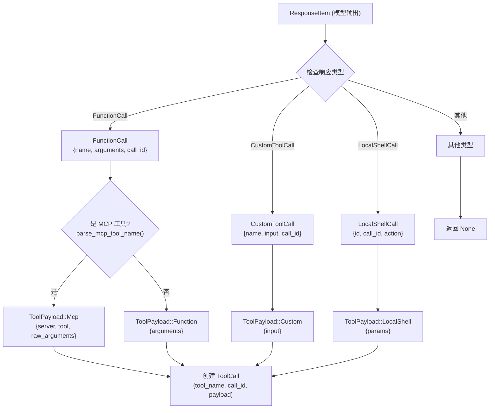
```mermaid
flowchart TD
    Input["ResponseItem (模型输出)"]

    CheckType{"检查响应类型"}

    FuncCall["FunctionCall<br/>{name, arguments, call_id}"]
    CustomCall["CustomToolCall<br/>{name, input, call_id}"]
    LocalShell["LocalShellCall<br/>{id, call_id, action}"]
    Other["其他类型"]

    CheckMCP{"是 MCP 工具?<br/>parse_mcp_tool_name()"}
    MCPPayload["ToolPayload::Mcp<br/>{server, tool, raw_arguments}"]
    FuncPayload["ToolPayload::Function<br/>{arguments}"]
    CustomPayload["ToolPayload::Custom<br/>{input}"]
    LocalPayload["ToolPayload::LocalShell<br/>{params}"]

    CreateCall["创建 ToolCall<br/>{tool_name, call_id, payload}"]
    NoCall["返回 None"]

    Input --> CheckType

    CheckType -->|FunctionCall| FuncCall
    CheckType -->|CustomToolCall| CustomCall
    CheckType -->|LocalShellCall| LocalShell
    CheckType -->|其他| Other --> NoCall

    FuncCall --> CheckMCP
    CheckMCP -->|是| MCPPayload --> CreateCall
    CheckMCP -->|否| FuncPayload --> CreateCall

    CustomCall --> CustomPayload --> CreateCall
    LocalShell --> LocalPayload --> CreateCall
```

### 3.3 ToolCall 和 ToolPayload 结构

```rust
pub struct ToolCall {
    pub tool_name: String,
    pub call_id: String,
    pub payload: ToolPayload,
}

pub enum ToolPayload {
    Function { arguments: String },           // JSON 字符串
    Custom { input: String },                 // 自定义格式
    LocalShell { params: LocalShellParams },  // Shell 参数
    Mcp {                                     // MCP 工具
        server: String,
        tool: String,
        raw_arguments: String,
    },
}
```

---

## 4. 工具调用执行

### 4.1 执行流程总览

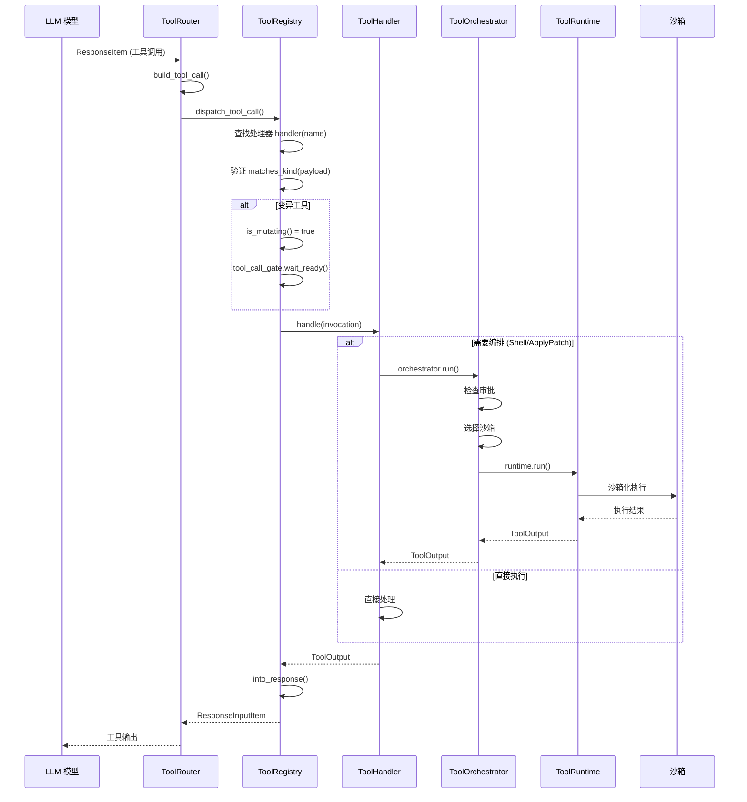
```mermaid
sequenceDiagram
    participant Model as LLM 模型
    participant Router as ToolRouter
    participant Registry as ToolRegistry
    participant Handler as ToolHandler
    participant Orchestrator as ToolOrchestrator
    participant Runtime as ToolRuntime
    participant Sandbox as 沙箱

    Model->>Router: ResponseItem (工具调用)
    Router->>Router: build_tool_call()
    Router->>Registry: dispatch_tool_call()

    Registry->>Registry: 查找处理器 handler(name)
    Registry->>Registry: 验证 matches_kind(payload)

    alt 变异工具
        Registry->>Registry: is_mutating() = true
        Registry->>Registry: tool_call_gate.wait_ready()
    end

    Registry->>Handler: handle(invocation)

    alt 需要编排 (Shell/ApplyPatch)
        Handler->>Orchestrator: orchestrator.run()
        Orchestrator->>Orchestrator: 检查审批
        Orchestrator->>Orchestrator: 选择沙箱
        Orchestrator->>Runtime: runtime.run()
        Runtime->>Sandbox: 沙箱化执行
        Sandbox-->>Runtime: 执行结果
        Runtime-->>Orchestrator: ToolOutput
        Orchestrator-->>Handler: ToolOutput
    else 直接执行
        Handler->>Handler: 直接处理
    end

    Handler-->>Registry: ToolOutput
    Registry->>Registry: into_response()
    Registry-->>Router: ResponseInputItem
    Router-->>Model: 工具输出
```

### 4.2 ToolHandler trait 定义

**文件位置**: `tools/registry.rs:15-44`

```rust
#[async_trait]
pub trait ToolHandler: Send + Sync {
    /// 返回处理器类型
    fn kind(&self) -> ToolKind;

    /// 验证 payload 类型是否匹配
    fn matches_kind(&self, payload: &ToolPayload) -> bool {
        match (self.kind(), payload) {
            (ToolKind::Function, ToolPayload::Function { .. }) => true,
            (ToolKind::Function, ToolPayload::Custom { .. }) => true,
            (ToolKind::Function, ToolPayload::LocalShell { .. }) => true,
            (ToolKind::Mcp, ToolPayload::Mcp { .. }) => true,
            _ => false,
        }
    }

    /// 判断工具是否会改变用户环境（变异性）
    async fn is_mutating(&self, _invocation: &ToolInvocation) -> bool {
        false // 默认不变异
    }

    /// 执行工具
    async fn handle(&self, invocation: ToolInvocation)
        -> Result<ToolOutput, FunctionCallError>;
}

pub enum ToolKind {
    Function,
    Mcp,
}
```

### 4.3 ToolRegistry::dispatch 执行逻辑

**文件位置**: `tools/registry.rs:67-149`

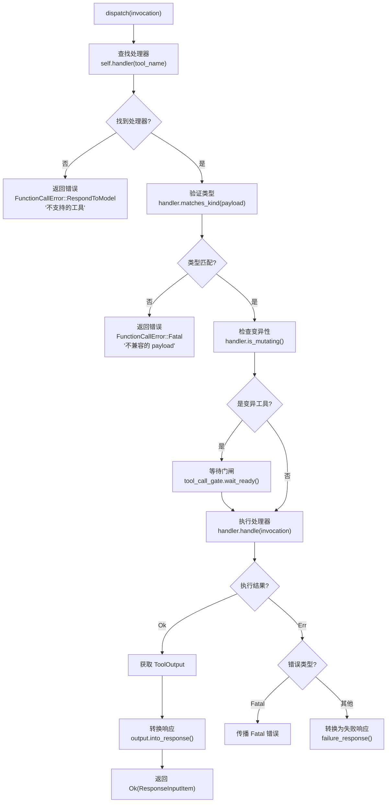
```mermaid
flowchart TD
    Start["dispatch(invocation)"]

    LookupHandler["查找处理器<br/>self.handler(tool_name)"]
    CheckFound{"找到处理器?"}
    NotFound["返回错误<br/>FunctionCallError::RespondToModel<br/>'不支持的工具'"]

    CheckKind["验证类型<br/>handler.matches_kind(payload)"]
    KindMismatch{"类型匹配?"}
    Fatal["返回错误<br/>FunctionCallError::Fatal<br/>'不兼容的 payload'"]

    CheckMutating["检查变异性<br/>handler.is_mutating()"]
    IsMutating{"是变异工具?"}
    WaitGate["等待门闸<br/>tool_call_gate.wait_ready()"]

    Execute["执行处理器<br/>handler.handle(invocation)"]
    CheckResult{"执行结果?"}

    Success["获取 ToolOutput"]
    ToResponse["转换响应<br/>output.into_response()"]
    ReturnOk["返回 Ok(ResponseInputItem)"]

    HandleError{"错误类型?"}
    FatalError["传播 Fatal 错误"]
    OtherError["转换为失败响应<br/>failure_response()"]

    Start --> LookupHandler --> CheckFound
    CheckFound -->|否| NotFound
    CheckFound -->|是| CheckKind --> KindMismatch

    KindMismatch -->|否| Fatal
    KindMismatch -->|是| CheckMutating --> IsMutating

    IsMutating -->|是| WaitGate --> Execute
    IsMutating -->|否| Execute

    Execute --> CheckResult
    CheckResult -->|Ok| Success --> ToResponse --> ReturnOk
    CheckResult -->|Err| HandleError

    HandleError -->|Fatal| FatalError
    HandleError -->|其他| OtherError
```

### 4.4 具体处理器实现

#### 4.4.1 ShellHandler

**文件位置**: `tools/handlers/shell.rs:27-196`

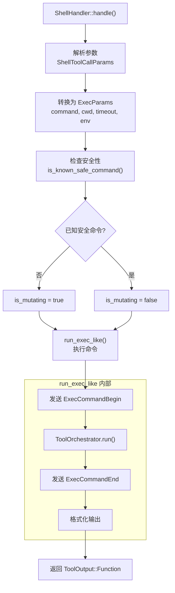
```mermaid
flowchart TD
    Start["ShellHandler::handle()"]

    ParseArgs["解析参数<br/>ShellToolCallParams"]
    ToExecParams["转换为 ExecParams<br/>command, cwd, timeout, env"]

    CheckSafe["检查安全性<br/>is_known_safe_command()"]
    IsSafe{"已知安全命令?"}
    Mutating["is_mutating = true"]
    NotMutating["is_mutating = false"]

    RunExec["run_exec_like()<br/>执行命令"]

    subgraph "run_exec_like 内部"
        EmitBegin["发送 ExecCommandBegin"]
        CallOrchestrator["ToolOrchestrator.run()"]
        EmitEnd["发送 ExecCommandEnd"]
        FormatOutput["格式化输出"]
    end

    Return["返回 ToolOutput::Function"]

    Start --> ParseArgs --> ToExecParams
    ToExecParams --> CheckSafe --> IsSafe

    IsSafe -->|是| NotMutating
    IsSafe -->|否| Mutating

    Mutating --> RunExec
    NotMutating --> RunExec

    RunExec --> EmitBegin --> CallOrchestrator --> EmitEnd --> FormatOutput --> Return
```

**已知安全命令**（不需要审批）:
- `ls`, `cat`, `head`, `tail`, `grep`, `find`
- `echo`, `pwd`, `whoami`, `date`
- `git status`, `git log`, `git diff`
- 等只读命令...

#### 4.4.2 ApplyPatchHandler

**文件位置**: `tools/handlers/apply_patch.rs:34-183`

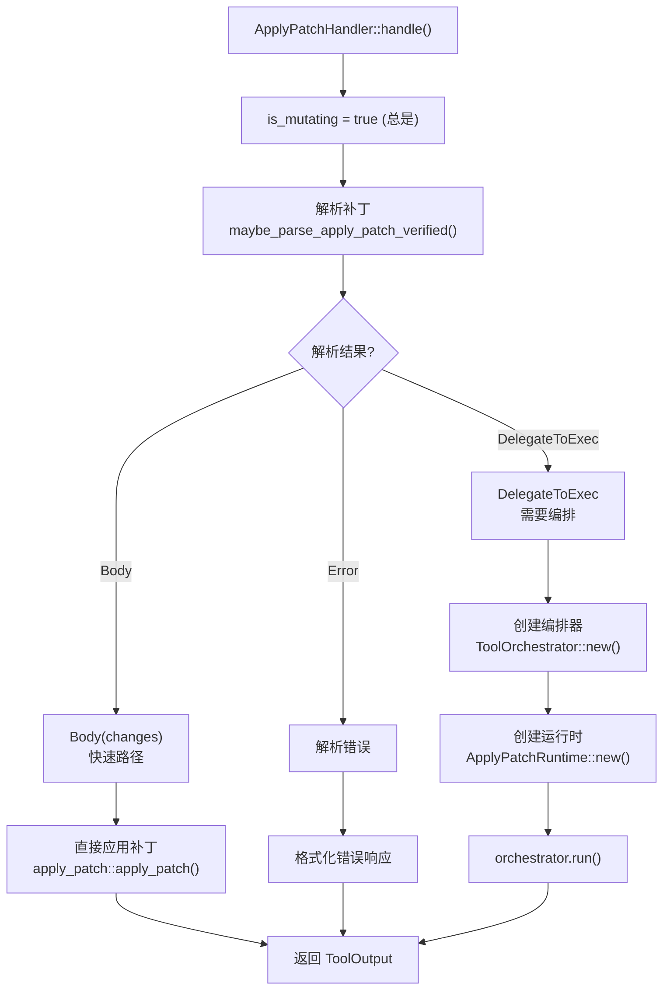
```mermaid
flowchart TD
    Start["ApplyPatchHandler::handle()"]
    AlwaysMutating["is_mutating = true (总是)"]

    ParsePatch["解析补丁<br/>maybe_parse_apply_patch_verified()"]
    CheckParse{"解析结果?"}

    FastPath["Body(changes)<br/>快速路径"]
    DelegatePath["DelegateToExec<br/>需要编排"]
    ParseError["解析错误"]

    DirectApply["直接应用补丁<br/>apply_patch::apply_patch()"]

    CreateOrchestrator["创建编排器<br/>ToolOrchestrator::new()"]
    CreateRuntime["创建运行时<br/>ApplyPatchRuntime::new()"]
    RunOrchestrator["orchestrator.run()"]

    FormatError["格式化错误响应"]
    Return["返回 ToolOutput"]

    Start --> AlwaysMutating --> ParsePatch --> CheckParse

    CheckParse -->|Body| FastPath --> DirectApply --> Return
    CheckParse -->|DelegateToExec| DelegatePath --> CreateOrchestrator
    CheckParse -->|Error| ParseError --> FormatError --> Return

    CreateOrchestrator --> CreateRuntime --> RunOrchestrator --> Return
```

#### 4.4.3 McpHandler

**文件位置**: `tools/handlers/mcp.rs:11-75`

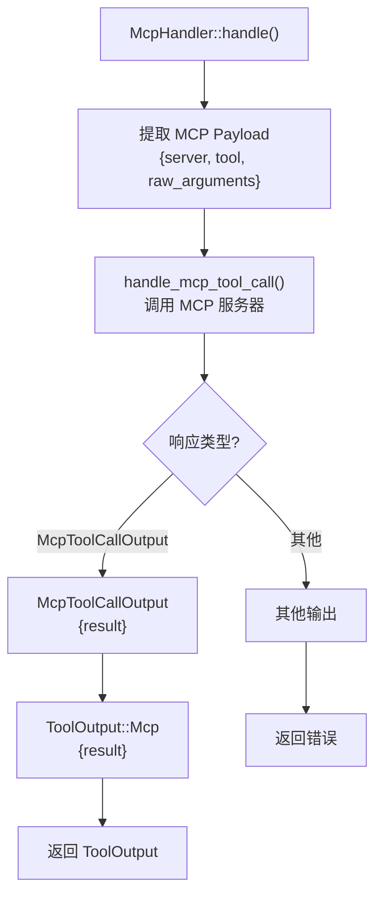
```mermaid
flowchart TD
    Start["McpHandler::handle()"]
    ExtractPayload["提取 MCP Payload<br/>{server, tool, raw_arguments}"]

    CallMCP["handle_mcp_tool_call()<br/>调用 MCP 服务器"]

    CheckResult{"响应类型?"}
    McpOutput["McpToolCallOutput<br/>{result}"]
    OtherOutput["其他输出"]

    CreateOutput["ToolOutput::Mcp<br/>{result}"]
    Error["返回错误"]

    Return["返回 ToolOutput"]

    Start --> ExtractPayload --> CallMCP --> CheckResult

    CheckResult -->|McpToolCallOutput| McpOutput --> CreateOutput --> Return
    CheckResult -->|其他| OtherOutput --> Error
```

#### 4.4.4 ReadFileHandler

**文件位置**: `tools/handlers/read_file.rs:16-151`

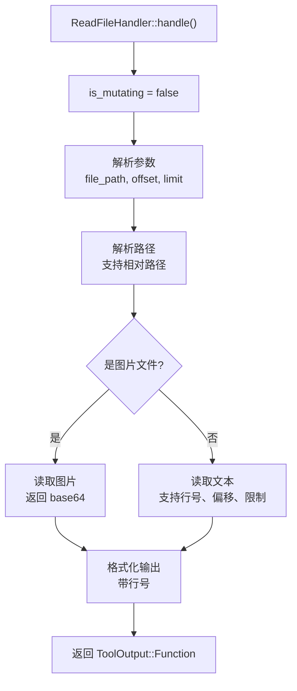
```mermaid
flowchart TD
    Start["ReadFileHandler::handle()"]
    NotMutating["is_mutating = false"]

    ParseArgs["解析参数<br/>file_path, offset, limit"]
    ResolvePath["解析路径<br/>支持相对路径"]

    CheckImage{"是图片文件?"}
    ReadImage["读取图片<br/>返回 base64"]
    ReadText["读取文本<br/>支持行号、偏移、限制"]

    FormatOutput["格式化输出<br/>带行号"]
    Return["返回 ToolOutput::Function"]

    Start --> NotMutating --> ParseArgs --> ResolvePath --> CheckImage

    CheckImage -->|是| ReadImage --> FormatOutput
    CheckImage -->|否| ReadText --> FormatOutput

    FormatOutput --> Return
```

---

## 5. 审批机制

### 5.1 ToolOrchestrator 工作流程

**文件位置**: `tools/orchestrator.rs:24-162`

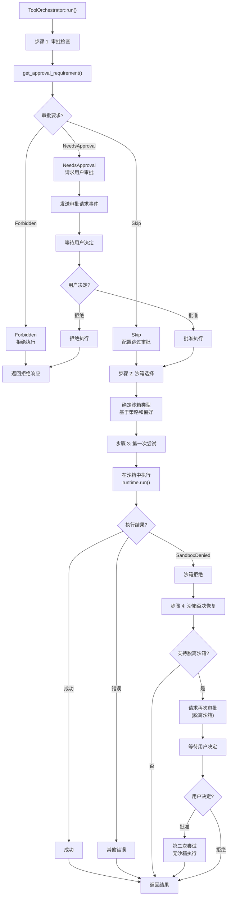
```mermaid
flowchart TD
    Start["ToolOrchestrator::run()"]

    Step1["步骤 1: 审批检查"]
    GetApproval["get_approval_requirement()"]
    CheckApproval{"审批要求?"}

    Skip["Skip<br/>配置跳过审批"]
    Forbidden["Forbidden<br/>拒绝执行"]
    NeedsApproval["NeedsApproval<br/>请求用户审批"]

    RequestApproval["发送审批请求事件"]
    WaitDecision["等待用户决定"]
    CheckDecision{"用户决定?"}
    Approved["批准执行"]
    Rejected["拒绝执行"]
    ReturnRejected["返回拒绝响应"]

    Step2["步骤 2: 沙箱选择"]
    DetermineSandbox["确定沙箱类型<br/>基于策略和偏好"]

    Step3["步骤 3: 第一次尝试"]
    FirstAttempt["在沙箱中执行<br/>runtime.run()"]
    CheckFirstResult{"执行结果?"}

    Success1["成功"]
    SandboxDenied["沙箱拒绝"]
    OtherError["其他错误"]

    Step4["步骤 4: 沙箱否决恢复"]
    CheckEscalate{"支持脱离沙箱?"}
    RequestEscalation["请求再次审批<br/>(脱离沙箱)"]
    WaitEscalation["等待用户决定"]
    CheckEscalationDecision{"用户决定?"}
    SecondAttempt["第二次尝试<br/>无沙箱执行"]

    Return["返回结果"]

    Start --> Step1 --> GetApproval --> CheckApproval

    CheckApproval -->|Skip| Skip --> Step2
    CheckApproval -->|Forbidden| Forbidden --> ReturnRejected
    CheckApproval -->|NeedsApproval| NeedsApproval --> RequestApproval

    RequestApproval --> WaitDecision --> CheckDecision
    CheckDecision -->|批准| Approved --> Step2
    CheckDecision -->|拒绝| Rejected --> ReturnRejected

    Step2 --> DetermineSandbox --> Step3 --> FirstAttempt --> CheckFirstResult

    CheckFirstResult -->|成功| Success1 --> Return
    CheckFirstResult -->|SandboxDenied| SandboxDenied --> Step4
    CheckFirstResult -->|错误| OtherError --> Return

    Step4 --> CheckEscalate
    CheckEscalate -->|是| RequestEscalation --> WaitEscalation --> CheckEscalationDecision
    CheckEscalate -->|否| Return

    CheckEscalationDecision -->|批准| SecondAttempt --> Return
    CheckEscalationDecision -->|拒绝| Return
```

### 5.2 审批要求类型

```rust
pub enum ExecApprovalRequirement {
    Skip,           // 配置跳过审批
    Forbidden,      // 策略禁止执行
    NeedsApproval { // 需要用户审批
        message: String,
        can_escalate: bool,  // 是否可以脱离沙箱
    },
}
```

### 5.3 审批缓存机制

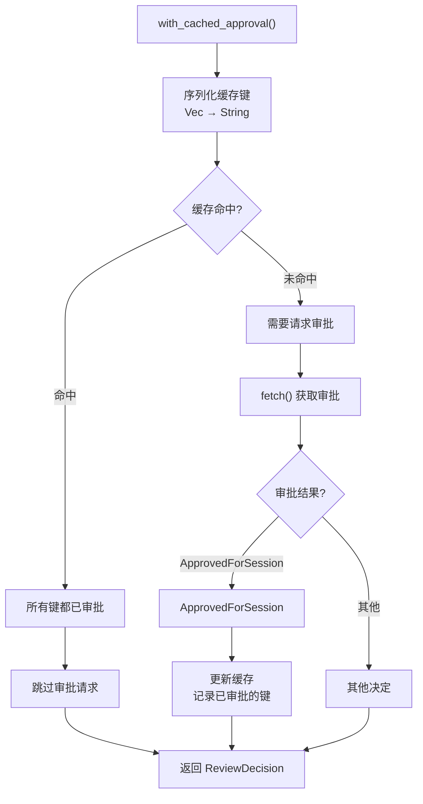
```mermaid
flowchart TD
    Start["with_cached_approval()"]

    SerializeKeys["序列化缓存键<br/>Vec<K> → String"]
    CheckCache{"缓存命中?"}

    CacheHit["所有键都已审批"]
    SkipApproval["跳过审批请求"]

    CacheMiss["需要请求审批"]
    FetchApproval["fetch() 获取审批"]
    CheckFetchResult{"审批结果?"}

    ApprovedForSession["ApprovedForSession"]
    OtherDecision["其他决定"]

    UpdateCache["更新缓存<br/>记录已审批的键"]

    Return["返回 ReviewDecision"]

    Start --> SerializeKeys --> CheckCache

    CheckCache -->|命中| CacheHit --> SkipApproval --> Return
    CheckCache -->|未命中| CacheMiss --> FetchApproval --> CheckFetchResult

    CheckFetchResult -->|ApprovedForSession| ApprovedForSession --> UpdateCache --> Return
    CheckFetchResult -->|其他| OtherDecision --> Return
```

**缓存特性**:
- 会话级缓存（Session-scoped）
- 所有键必须已审批才能跳过提示
- `ApprovedForSession` 决定会被缓存

---

## 6. 工具结果处理

### 6.1 ToolOutput 定义

**文件位置**: `tools/context.rs:58-115`

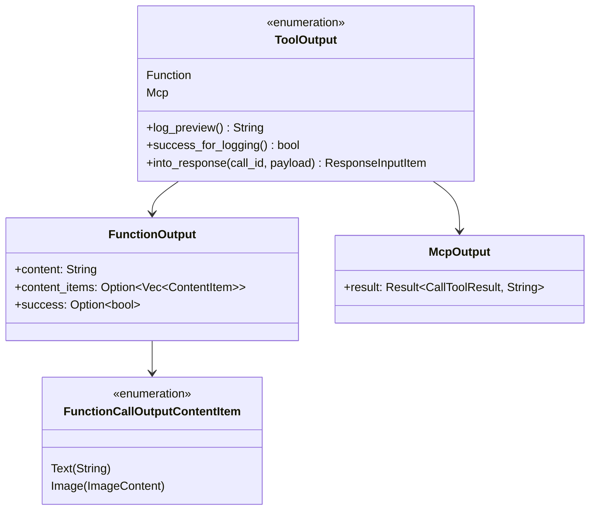
```mermaid
classDiagram
    class ToolOutput {
        <<enumeration>>
        Function
        Mcp
        +log_preview() String
        +success_for_logging() bool
        +into_response(call_id, payload) ResponseInputItem
    }

    class FunctionOutput {
        +content: String
        +content_items: Option~Vec~ContentItem~~
        +success: Option~bool~
    }

    class McpOutput {
        +result: Result~CallToolResult, String~
    }

    class FunctionCallOutputContentItem {
        <<enumeration>>
        Text(String)
        Image(ImageContent)
    }

    ToolOutput --> FunctionOutput
    ToolOutput --> McpOutput
    FunctionOutput --> FunctionCallOutputContentItem
```

### 6.2 输出格式转换

**文件位置**: `tools/mod.rs:25-91`

#### 6.2.1 结构化格式 (JSON)

```json
{
  "output": "命令执行输出...",
  "metadata": {
    "exit_code": 0,
    "duration_seconds": 1.5
  }
}
```

#### 6.2.2 自由格式 (文本)

```
Exit code: 0
Wall time: 1.5 seconds
Total output lines: 42
Output:
[command output here]
```

### 6.3 into_response 转换逻辑

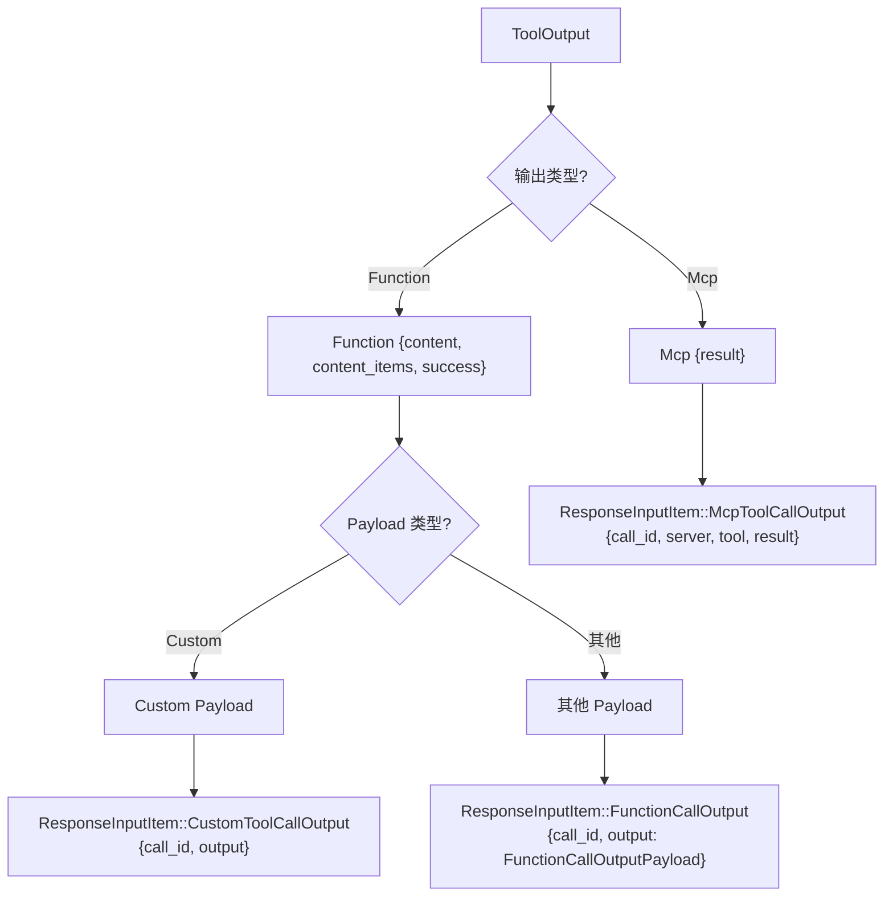
```mermaid
flowchart TD
    Input["ToolOutput"]

    CheckType{"输出类型?"}

    Function["Function {content, content_items, success}"]
    MCP["Mcp {result}"]

    CheckPayload{"Payload 类型?"}

    Custom["Custom Payload"]
    Other["其他 Payload"]

    CustomOutput["ResponseInputItem::CustomToolCallOutput<br/>{call_id, output}"]
    FuncOutput["ResponseInputItem::FunctionCallOutput<br/>{call_id, output: FunctionCallOutputPayload}"]
    McpOutput["ResponseInputItem::McpToolCallOutput<br/>{call_id, server, tool, result}"]

    Input --> CheckType

    CheckType -->|Function| Function --> CheckPayload
    CheckType -->|Mcp| MCP --> McpOutput

    CheckPayload -->|Custom| Custom --> CustomOutput
    CheckPayload -->|其他| Other --> FuncOutput
```

### 6.4 成功/失败判断

```mermaid
flowchart TD
    Output["ToolOutput"]

    CheckSuccess{"success 字段?"}

    ExplicitTrue["Some(true)"]
    ExplicitFalse["Some(false)"]
    None["None"]

    LogSuccess["记录为成功"]
    LogFailure["记录为失败"]
    DefaultSuccess["默认为成功"]

    Output --> CheckSuccess

    CheckSuccess -->|Some(true)| ExplicitTrue --> LogSuccess
    CheckSuccess -->|Some(false)| ExplicitFalse --> LogFailure
    CheckSuccess -->|None| None --> DefaultSuccess
```

**成功判断规则**:
1. 如果 `success` 字段明确设置为 `false`，则为失败
2. 如果 `success` 字段明确设置为 `true` 或未设置（`None`），则为成功
3. 对于 Shell 命令，通常基于 `exit_code == 0` 设置 `success`

---

## 7. 错误处理机制

### 7.1 FunctionCallError 类型

**文件位置**: `function_tool.rs:1-11`

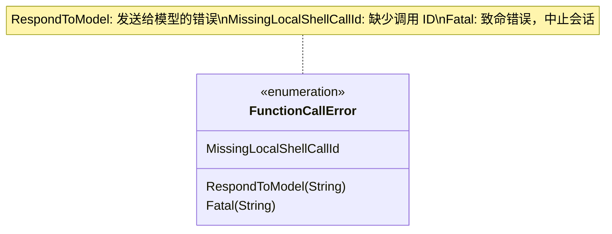
```mermaid
classDiagram
    class FunctionCallError {
        <<enumeration>>
        RespondToModel(String)
        MissingLocalShellCallId
        Fatal(String)
    }

    note for FunctionCallError "RespondToModel: 发送给模型的错误\nMissingLocalShellCallId: 缺少调用 ID\nFatal: 致命错误，中止会话"
```

### 7.2 错误类型说明

| 错误类型 | 用途 | 处理方式 |
|---------|------|---------|
| **RespondToModel** | 预期错误，应告知模型 | 转换为失败响应发送给模型 |
| **MissingLocalShellCallId** | LocalShell 特定错误 | 转换为失败响应 |
| **Fatal** | 致命错误，无法恢复 | 中止会话，传播错误 |

### 7.3 错误处理流程

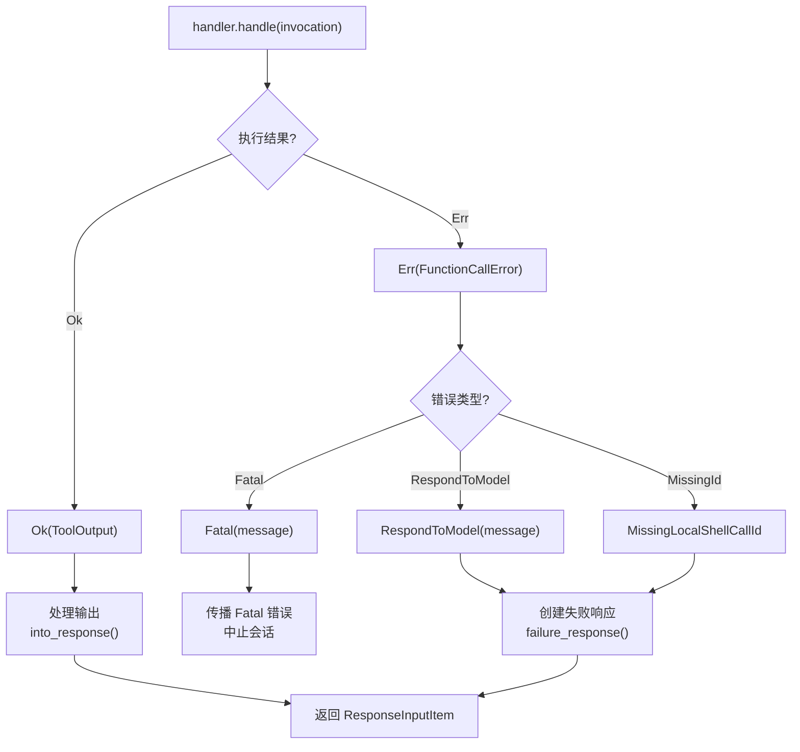
```mermaid
flowchart TD
    Execute["handler.handle(invocation)"]
    CheckResult{"执行结果?"}

    Success["Ok(ToolOutput)"]
    Error["Err(FunctionCallError)"]

    ProcessOutput["处理输出<br/>into_response()"]

    CheckErrorType{"错误类型?"}
    FatalErr["Fatal(message)"]
    RespondErr["RespondToModel(message)"]
    MissingId["MissingLocalShellCallId"]

    PropagateFatal["传播 Fatal 错误<br/>中止会话"]
    CreateFailure["创建失败响应<br/>failure_response()"]

    ReturnResponse["返回 ResponseInputItem"]

    Execute --> CheckResult

    CheckResult -->|Ok| Success --> ProcessOutput --> ReturnResponse
    CheckResult -->|Err| Error --> CheckErrorType

    CheckErrorType -->|Fatal| FatalErr --> PropagateFatal
    CheckErrorType -->|RespondToModel| RespondErr --> CreateFailure --> ReturnResponse
    CheckErrorType -->|MissingId| MissingId --> CreateFailure
```

### 7.4 失败响应格式

```rust
fn failure_response(
    call_id: String,
    payload_outputs_custom: bool,
    err: FunctionCallError,
) -> ResponseInputItem {
    let message = err.to_string();
    if payload_outputs_custom {
        // Custom 格式
        ResponseInputItem::CustomToolCallOutput {
            call_id,
            output: message,
        }
    } else {
        // Function 格式
        ResponseInputItem::FunctionCallOutput {
            call_id,
            output: FunctionCallOutputPayload {
                content: message,
                success: Some(false),  // 明确标记失败
                ..Default::default()
            },
        }
    }
}
```

---

## 8. 并行工具调用

### 8.1 并行执行机制

**文件位置**: `tools/parallel.rs:23-106`

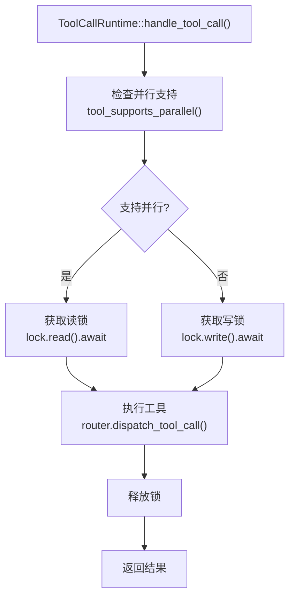
```mermaid
flowchart TD
    Start["ToolCallRuntime::handle_tool_call()"]

    CheckParallel["检查并行支持<br/>tool_supports_parallel()"]
    IsParallel{"支持并行?"}

    AcquireRead["获取读锁<br/>lock.read().await"]
    AcquireWrite["获取写锁<br/>lock.write().await"]

    Execute["执行工具<br/>router.dispatch_tool_call()"]

    Release["释放锁"]
    Return["返回结果"]

    Start --> CheckParallel --> IsParallel

    IsParallel -->|是| AcquireRead
    IsParallel -->|否| AcquireWrite

    AcquireRead --> Execute
    AcquireWrite --> Execute

    Execute --> Release --> Return
```

### 8.2 锁机制说明

```mermaid
graph TB
    subgraph "读锁 (并行工具)"
        R1["read_file A"]
        R2["read_file B"]
        R3["grep_files"]
        R4["list_dir"]
    end

    subgraph "写锁 (独占工具)"
        W1["shell: mkdir"]
        W2["apply_patch"]
        W3["exec_command"]
    end

    Lock["RwLock<()>"]

    R1 -->|"read()"| Lock
    R2 -->|"read()"| Lock
    R3 -->|"read()"| Lock
    R4 -->|"read()"| Lock

    W1 -->|"write()"| Lock
    W2 -->|"write()"| Lock
    W3 -->|"write()"| Lock

    Note1["多个读锁可以同时持有<br/>→ 并行执行"]
    Note2["写锁独占<br/>→ 顺序执行"]

    R1 --- Note1
    W1 --- Note2
```

### 8.3 支持并行的工具列表

| 工具名 | 原因 |
|--------|------|
| `read_file` | 只读操作，无副作用 |
| `grep_files` | 只读搜索 |
| `list_dir` | 只读目录列表 |
| `view_image` | 只读图片 |
| `list_mcp_resources` | 只读 MCP 资源列表 |
| `read_mcp_resource` | 只读 MCP 资源 |
| `test_sync_tool` | 测试工具 |

---

## 9. 完整调用流程示例

### 9.1 场景：执行 Shell 命令 `ls -la`

```mermaid
sequenceDiagram
    participant Model as LLM 模型
    participant Router as ToolRouter
    participant Registry as ToolRegistry
    participant ShellHandler as ShellHandler
    participant Orchestrator as ToolOrchestrator
    participant Runtime as ShellRuntime
    participant Sandbox as 沙箱
    participant OS as 操作系统

    Note over Model,OS: === 1. 模型输出工具调用 ===
    Model->>Router: ResponseItem::FunctionCall<br/>{name: "shell", arguments: {"command": ["ls", "-la"]}}

    Note over Model,OS: === 2. 工具调用识别 ===
    Router->>Router: build_tool_call()
    Router->>Router: 不是 MCP 工具
    Router->>Router: 创建 ToolCall<br/>{tool_name: "shell", payload: Function}

    Note over Model,OS: === 3. 分发到注册表 ===
    Router->>Registry: dispatch_tool_call()
    Registry->>Registry: handler("shell") → ShellHandler
    Registry->>Registry: matches_kind(Function) → true

    Note over Model,OS: === 4. 变异性检查 ===
    Registry->>ShellHandler: is_mutating()
    ShellHandler->>ShellHandler: is_known_safe_command(["ls", "-la"]) → true
    ShellHandler-->>Registry: false (不需要等待门闸)

    Note over Model,OS: === 5. 执行处理器 ===
    Registry->>ShellHandler: handle(invocation)
    ShellHandler->>ShellHandler: 解析参数 → ShellToolCallParams
    ShellHandler->>ShellHandler: 转换 → ExecParams

    Note over Model,OS: === 6. 编排执行 ===
    ShellHandler->>Orchestrator: run(ShellRuntime, req, ctx)
    Orchestrator->>Orchestrator: 检查审批 → Skip (安全命令)
    Orchestrator->>Orchestrator: 确定沙箱类型

    Orchestrator->>Runtime: run(req, sandbox_attempt)
    Runtime->>Sandbox: 创建沙箱环境
    Sandbox->>OS: 执行 ls -la
    OS-->>Sandbox: 目录列表输出
    Sandbox-->>Runtime: 执行结果

    Runtime-->>Orchestrator: ToolOutput
    Orchestrator-->>ShellHandler: ToolOutput

    Note over Model,OS: === 7. 格式化输出 ===
    ShellHandler->>ShellHandler: format_exec_output_for_model()
    ShellHandler-->>Registry: ToolOutput::Function<br/>{content: "...", success: Some(true)}

    Note over Model,OS: === 8. 转换响应 ===
    Registry->>Registry: into_response()
    Registry-->>Router: ResponseInputItem::FunctionCallOutput

    Router-->>Model: 工具输出<br/>"Exit code: 0\nOutput: ..."
```

### 9.2 场景：执行需要审批的命令 `rm -rf temp/`

```mermaid
sequenceDiagram
    participant Model as LLM 模型
    participant Router as ToolRouter
    participant Registry as ToolRegistry
    participant ShellHandler as ShellHandler
    participant Gate as ToolCallGate
    participant Orchestrator as ToolOrchestrator
    participant User as 用户

    Model->>Router: FunctionCall {name: "shell", command: ["rm", "-rf", "temp/"]}
    Router->>Registry: dispatch_tool_call()
    Registry->>ShellHandler: is_mutating()

    ShellHandler->>ShellHandler: is_known_safe_command(["rm", "-rf", "temp/"]) → false
    ShellHandler-->>Registry: true (需要等待门闸)

    Registry->>Gate: wait_ready()
    Note over Registry,Gate: 等待审批...

    Registry->>ShellHandler: handle()
    ShellHandler->>Orchestrator: run()
    Orchestrator->>Orchestrator: get_approval_requirement() → NeedsApproval

    Orchestrator->>User: ExecApprovalRequest<br/>"执行: rm -rf temp/"
    User-->>Orchestrator: ApprovedForSession

    Orchestrator->>Orchestrator: 缓存审批决定
    Orchestrator->>Orchestrator: 选择沙箱
    Orchestrator->>Orchestrator: 执行命令

    Orchestrator-->>ShellHandler: ToolOutput
    ShellHandler-->>Registry: ToolOutput
    Registry-->>Router: ResponseInputItem
    Router-->>Model: 工具输出
```

---

## 10. 关键代码索引

### 10.1 工具定义

| 文件 | 行号 | 功能 |
|------|------|------|
| `client_common.rs` | 164-226 | ToolSpec 枚举定义 |
| `tools/spec.rs` | 24-82 | ToolsConfig 配置结构 |
| `tools/spec.rs` | 1131-1296 | build_specs() 工具注册 |

### 10.2 路由与分发

| 文件 | 行号 | 功能 |
|------|------|------|
| `tools/router.rs` | 28-56 | ToolRouter 结构 |
| `tools/router.rs` | 58-127 | build_tool_call() 工具识别 |
| `tools/router.rs` | 129-187 | dispatch_tool_call() 分发 |
| `tools/registry.rs` | 15-44 | ToolHandler trait |
| `tools/registry.rs` | 67-149 | ToolRegistry::dispatch() |

### 10.3 处理器实现

| 文件 | 行号 | 功能 |
|------|------|------|
| `tools/handlers/shell.rs` | 27-196 | ShellHandler |
| `tools/handlers/apply_patch.rs` | 34-183 | ApplyPatchHandler |
| `tools/handlers/mcp.rs` | 11-75 | McpHandler |
| `tools/handlers/read_file.rs` | 16-151 | ReadFileHandler |
| `tools/handlers/unified_exec.rs` | 25-220 | UnifiedExecHandler |

### 10.4 编排与执行

| 文件 | 行号 | 功能 |
|------|------|------|
| `tools/orchestrator.rs` | 24-162 | ToolOrchestrator |
| `tools/parallel.rs` | 23-106 | ToolCallRuntime 并行执行 |
| `tools/context.rs` | 58-115 | ToolOutput 定义 |
| `tools/mod.rs` | 25-91 | 输出格式化函数 |

### 10.5 错误处理

| 文件 | 行号 | 功能 |
|------|------|------|
| `function_tool.rs` | 1-11 | FunctionCallError 枚举 |
| `tools/router.rs` | 165-186 | failure_response() |

---

## 11. 总结：工具调用全流程

```mermaid
graph TB
    subgraph "1. 注册阶段"
        Build["build_specs()"]
        Specs["ConfiguredToolSpec[]"]
        Registry["ToolRegistry"]
    end

    subgraph "2. 路由阶段"
        ModelOutput["模型输出"]
        BuildCall["build_tool_call()"]
        ToolCall["ToolCall"]
    end

    subgraph "3. 分发阶段"
        Dispatch["registry.dispatch()"]
        LookupHandler["查找 Handler"]
        CheckKind["验证 Kind"]
        CheckMutating["检查变异性"]
    end

    subgraph "4. 执行阶段"
        Handle["handler.handle()"]
        Orchestrator["编排器"]
        Approval["审批检查"]
        Sandbox["沙箱执行"]
    end

    subgraph "5. 输出阶段"
        Output["ToolOutput"]
        Response["ResponseInputItem"]
        ToModel["发送给模型"]
    end

    Build --> Specs --> Registry
    ModelOutput --> BuildCall --> ToolCall
    ToolCall --> Dispatch --> LookupHandler --> CheckKind --> CheckMutating
    CheckMutating --> Handle --> Orchestrator --> Approval --> Sandbox
    Sandbox --> Output --> Response --> ToModel

    style ToModel fill:#90EE90
```

**核心要点**：

1. **工具发现**：通过 `ToolRouter.specs()` 获取所有工具规范，发送给模型
2. **工具选择**：模型根据任务需求选择合适的工具，返回工具调用
3. **工具路由**：`build_tool_call()` 识别工具类型，`dispatch()` 分发到处理器
4. **工具执行**：处理器执行工具，可能涉及审批和沙箱
5. **结果判断**：基于 `success` 字段或 `exit_code` 判断成功/失败
6. **结果返回**：转换为 `ResponseInputItem` 发送给模型继续推理

---

*本文档基于 Codex 源码分析生成，版本日期：2026-01-19*
