# PostgreSQL MCP Server 技术设计文档

## 1. 概述

### 1.1 文档目的

本文档详细描述 PostgreSQL MCP Server 的技术架构、模块设计和数据模型，为开发提供技术指导。

### 1.2 技术栈

| 组件 | 技术选型 | 版本要求 | 用途 |
|------|----------|----------|------|
| MCP 框架 | FastMCP | >=2.0.0 | MCP 服务器框架，简化 Tool 注册 |
| SQL 解析 | SQLGlot | >=20.0.0 | SQL 语法解析、安全校验 |
| LLM 调用 | OpenAI SDK | >=1.0.0 | 调用 Qwen/OpenAI 等模型 |
| 数据库驱动 | asyncpg | >=0.29.0 | PostgreSQL 异步连接 |
| 数据验证 | Pydantic | >=2.0.0 | 配置管理、数据模型 |
| 配置管理 | pydantic-settings | >=2.0.0 | 环境变量和配置文件解析 |
| YAML 解析 | PyYAML | >=6.0.0 | 配置文件解析 |

### 1.3 设计原则

- **单一职责**：每个模块只负责一个明确的功能
- **依赖注入**：通过构造函数注入依赖，便于测试
- **异步优先**：全面使用 async/await，提高并发性能
- **防御性编程**：所有外部输入都需验证，SQL 必须经过安全检查
- **配置外置**：所有可变配置通过环境变量或配置文件管理

---

## 2. 系统架构

### 2.1 整体架构图

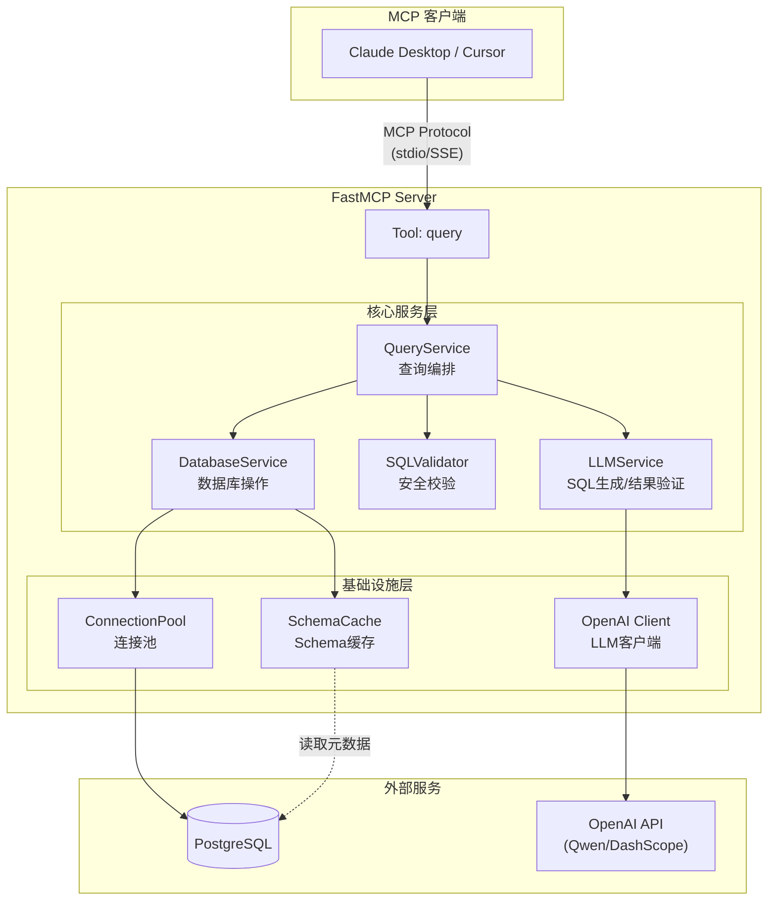
```mermaid
graph TB
    subgraph Client["MCP 客户端"]
        Claude["Claude Desktop / Cursor"]
    end

    subgraph Server["FastMCP Server"]
        Tool["Tool: query"]
        
        subgraph Core["核心服务层"]
            QS["QueryService<br/>查询编排"]
            LLM["LLMService<br/>SQL生成/结果验证"]
            VAL["SQLValidator<br/>安全校验"]
            DB["DatabaseService<br/>数据库操作"]
        end
        
        subgraph Infrastructure["基础设施层"]
            Cache["SchemaCache<br/>Schema缓存"]
            Pool["ConnectionPool<br/>连接池"]
            Client2["OpenAI Client<br/>LLM客户端"]
        end
    end

    subgraph External["外部服务"]
        PG[(PostgreSQL)]
        API["OpenAI API<br/>(Qwen/DashScope)"]
    end

    Claude -->|"MCP Protocol<br/>(stdio/SSE)"| Tool
    Tool --> QS
    QS --> LLM
    QS --> VAL
    QS --> DB
    
    LLM --> Client2
    Client2 --> API
    
    DB --> Cache
    DB --> Pool
    Pool --> PG
    Cache -.->|"读取元数据"| PG
```

**架构说明：**

1. **客户端层**：Claude Desktop 或 Cursor 通过 MCP 协议与服务器通信
2. **Tool 层**：FastMCP 注册的 `query` 工具，接收自然语言查询
3. **核心服务层**：
   - QueryService 负责编排整个查询流程
   - LLMService 负责 SQL 生成和结果验证
   - SQLValidator 负责 SQL 安全校验
   - DatabaseService 负责数据库操作
4. **基础设施层**：连接池、缓存、HTTP 客户端等底层组件
5. **外部服务**：PostgreSQL 数据库和 LLM API

### 2.2 模块依赖关系

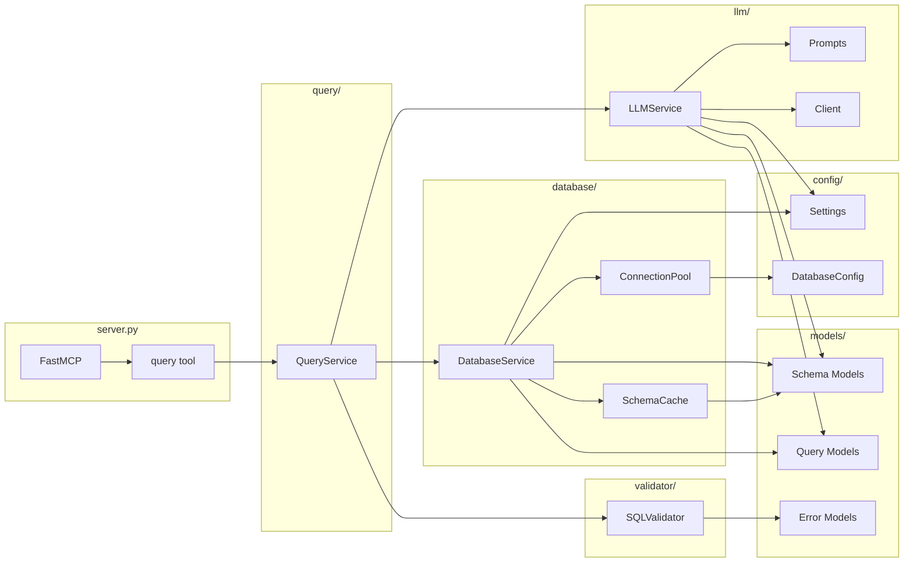
```mermaid
graph LR
    subgraph server["server.py"]
        MCP["FastMCP"]
        QueryTool["query tool"]
    end

    subgraph query["query/"]
        QueryService
    end

    subgraph llm["llm/"]
        LLMService
        Prompts
        LLMClient["Client"]
    end

    subgraph validator["validator/"]
        SQLValidator
    end

    subgraph database["database/"]
        DatabaseService
        SchemaCache
        ConnectionPool
    end

    subgraph models["models/"]
        SchemaModels["Schema Models"]
        QueryModels["Query Models"]
        ErrorModels["Error Models"]
    end

    subgraph config["config/"]
        Settings
        DatabaseConfig
    end

    MCP --> QueryTool
    QueryTool --> QueryService
    
    QueryService --> LLMService
    QueryService --> SQLValidator
    QueryService --> DatabaseService
    
    LLMService --> Prompts
    LLMService --> LLMClient
    LLMService --> SchemaModels
    LLMService --> QueryModels
    
    SQLValidator --> ErrorModels
    
    DatabaseService --> SchemaCache
    DatabaseService --> ConnectionPool
    DatabaseService --> SchemaModels
    DatabaseService --> QueryModels
    
    SchemaCache --> SchemaModels
    
    DatabaseService --> Settings
    LLMService --> Settings
    ConnectionPool --> DatabaseConfig
```

**模块职责：**

| 模块 | 职责 | 依赖 |
|------|------|------|
| server | FastMCP 服务器入口和 Tool 注册 | query |
| query | 查询流程编排 | llm, validator, database |
| llm | LLM 调用封装（SQL 生成、结果验证） | models, config |
| validator | SQL 安全校验 | models |
| database | 数据库操作和 Schema 缓存 | models, config |
| models | Pydantic 数据模型 | - |
| config | 配置管理 | - |

---

## 3. 核心流程

### 3.1 查询处理流程

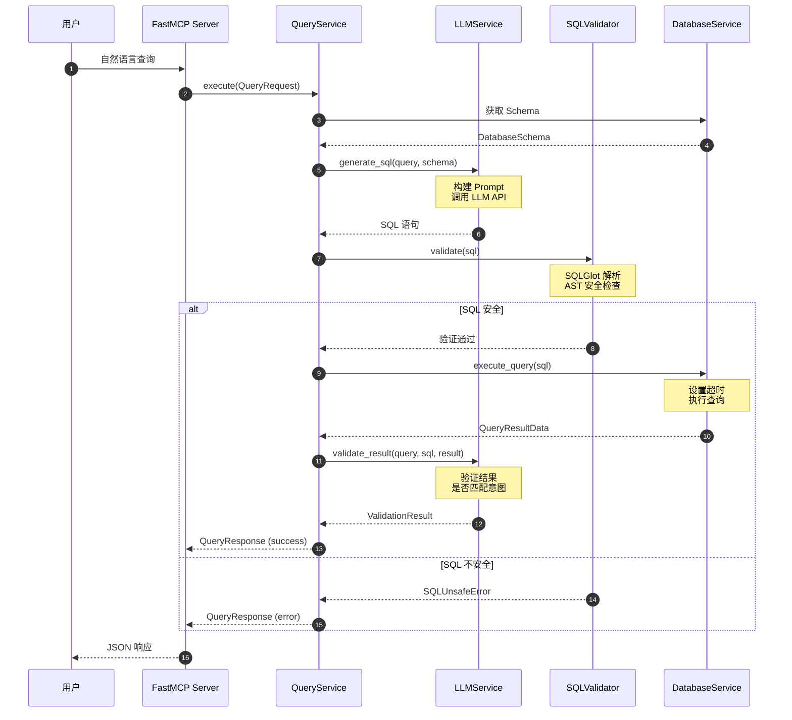
```mermaid
sequenceDiagram
    autonumber
    participant User as 用户
    participant MCP as FastMCP Server
    participant QS as QueryService
    participant LLM as LLMService
    participant Val as SQLValidator
    participant DB as DatabaseService

    User->>MCP: 自然语言查询
    MCP->>QS: execute(QueryRequest)
    
    QS->>DB: 获取 Schema
    DB-->>QS: DatabaseSchema
    
    QS->>LLM: generate_sql(query, schema)
    Note over LLM: 构建 Prompt<br/>调用 LLM API
    LLM-->>QS: SQL 语句
    
    QS->>Val: validate(sql)
    Note over Val: SQLGlot 解析<br/>AST 安全检查
    
    alt SQL 安全
        Val-->>QS: 验证通过
        QS->>DB: execute_query(sql)
        Note over DB: 设置超时<br/>执行查询
        DB-->>QS: QueryResultData
        
        QS->>LLM: validate_result(query, sql, result)
        Note over LLM: 验证结果<br/>是否匹配意图
        LLM-->>QS: ValidationResult
        
        QS-->>MCP: QueryResponse (success)
    else SQL 不安全
        Val-->>QS: SQLUnsafeError
        QS-->>MCP: QueryResponse (error)
    end
    
    MCP-->>User: JSON 响应
```

**流程说明：**

1. **接收请求**：用户通过 MCP 客户端发送自然语言查询
2. **获取 Schema**：从缓存获取数据库结构信息
3. **生成 SQL**：LLM 根据 Schema 和用户意图生成 SQL
4. **安全校验**：SQLGlot 解析 SQL 并进行安全检查
5. **执行查询**：通过连接池执行 SQL，设置超时保护
6. **验证结果**：LLM 验证查询结果是否符合用户意图
7. **返回响应**：构建 JSON 响应返回给客户端

### 3.2 SQL 安全校验流程

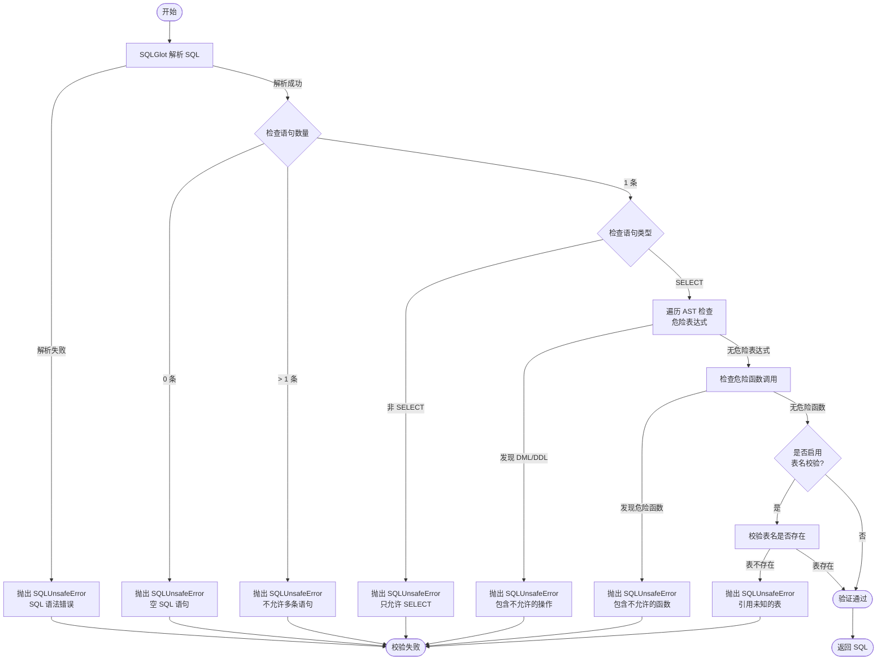
```mermaid
flowchart TD
    Start([开始]) --> Parse["SQLGlot 解析 SQL"]
    
    Parse -->|解析失败| Error1["抛出 SQLUnsafeError<br/>SQL 语法错误"]
    Parse -->|解析成功| CheckCount{"检查语句数量"}
    
    CheckCount -->|0 条| Error2["抛出 SQLUnsafeError<br/>空 SQL 语句"]
    CheckCount -->|> 1 条| Error3["抛出 SQLUnsafeError<br/>不允许多条语句"]
    CheckCount -->|1 条| CheckType{"检查语句类型"}
    
    CheckType -->|非 SELECT| Error4["抛出 SQLUnsafeError<br/>只允许 SELECT"]
    CheckType -->|SELECT| CheckExpr["遍历 AST 检查<br/>危险表达式"]
    
    CheckExpr -->|发现 DML/DDL| Error5["抛出 SQLUnsafeError<br/>包含不允许的操作"]
    CheckExpr -->|无危险表达式| CheckFunc["检查危险函数调用"]
    
    CheckFunc -->|发现危险函数| Error6["抛出 SQLUnsafeError<br/>包含不允许的函数"]
    CheckFunc -->|无危险函数| CheckTable{"是否启用<br/>表名校验?"}
    
    CheckTable -->|是| ValidateTable["校验表名是否存在"]
    CheckTable -->|否| Pass
    
    ValidateTable -->|表不存在| Error7["抛出 SQLUnsafeError<br/>引用未知的表"]
    ValidateTable -->|表存在| Pass
    
    Pass([验证通过]) --> End([返回 SQL])
    
    Error1 --> Fail([校验失败])
    Error2 --> Fail
    Error3 --> Fail
    Error4 --> Fail
    Error5 --> Fail
    Error6 --> Fail
    Error7 --> Fail
```

**校验规则：**

| 校验项 | 规则 | 错误类型 |
|--------|------|----------|
| 语法解析 | SQL 必须能被 SQLGlot 正确解析 | SQL_VALIDATION_FAILED |
| 语句数量 | 只允许单条语句 | SQL_UNSAFE |
| 语句类型 | 只允许 SELECT | SQL_UNSAFE |
| 危险表达式 | 禁止 INSERT/UPDATE/DELETE/DROP/CREATE/ALTER 等 | SQL_UNSAFE |
| 危险函数 | 禁止 pg_read_file/dblink 等 | SQL_UNSAFE |
| 表名存在性 | 可选，验证表是否存在于 Schema | SQL_UNSAFE |

### 3.3 服务器生命周期

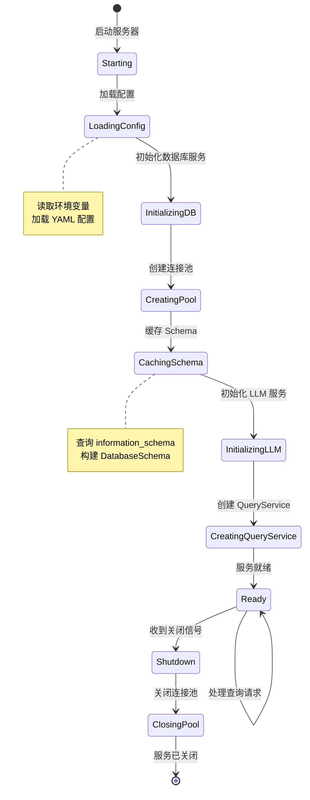
```mermaid
stateDiagram-v2
    [*] --> Starting: 启动服务器
    
    Starting --> LoadingConfig: 加载配置
    LoadingConfig --> InitializingDB: 初始化数据库服务
    
    InitializingDB --> CreatingPool: 创建连接池
    CreatingPool --> CachingSchema: 缓存 Schema
    
    CachingSchema --> InitializingLLM: 初始化 LLM 服务
    InitializingLLM --> CreatingQueryService: 创建 QueryService
    
    CreatingQueryService --> Ready: 服务就绪
    
    Ready --> Ready: 处理查询请求
    Ready --> Shutdown: 收到关闭信号
    
    Shutdown --> ClosingPool: 关闭连接池
    ClosingPool --> [*]: 服务已关闭
    
    note right of LoadingConfig
        读取环境变量
        加载 YAML 配置
    end note
    
    note right of CachingSchema
        查询 information_schema
        构建 DatabaseSchema
    end note
```

**生命周期阶段：**

1. **启动阶段**
   - 加载环境变量和配置文件
   - 解析数据库连接信息

2. **初始化阶段**
   - 创建 asyncpg 连接池
   - 查询数据库元数据并缓存
   - 初始化 OpenAI 客户端
   - 创建服务实例

3. **运行阶段**
   - 监听 MCP 请求
   - 处理查询并返回结果

4. **关闭阶段**
   - 关闭数据库连接池
   - 释放资源

---

## 4. 组件设计

### 4.1 配置管理组件

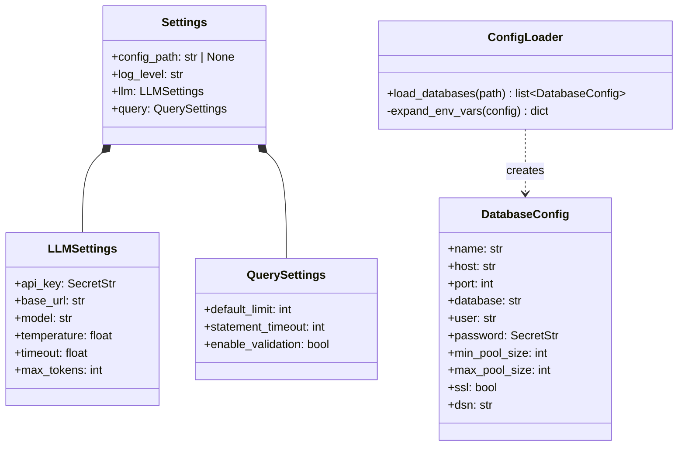
```mermaid
classDiagram
    class Settings {
        +config_path: str | None
        +log_level: str
        +llm: LLMSettings
        +query: QuerySettings
    }
    
    class LLMSettings {
        +api_key: SecretStr
        +base_url: str
        +model: str
        +temperature: float
        +timeout: float
        +max_tokens: int
    }
    
    class QuerySettings {
        +default_limit: int
        +statement_timeout: int
        +enable_validation: bool
    }
    
    class DatabaseConfig {
        +name: str
        +host: str
        +port: int
        +database: str
        +user: str
        +password: SecretStr
        +min_pool_size: int
        +max_pool_size: int
        +ssl: bool
        +dsn: str
    }
    
    class ConfigLoader {
        +load_databases(path) list~DatabaseConfig~
        -expand_env_vars(config) dict
    }
    
    Settings *-- LLMSettings
    Settings *-- QuerySettings
    ConfigLoader ..> DatabaseConfig : creates
```

**配置项说明：**

| 配置类 | 环境变量前缀 | 职责 |
|--------|--------------|------|
| Settings | PG_MCP_ | 主配置，聚合子配置 |
| LLMSettings | LLM_ | LLM 调用参数 |
| QuerySettings | QUERY_ | 查询执行参数 |
| DatabaseConfig | - | 数据库连接配置 |

### 4.2 数据库组件

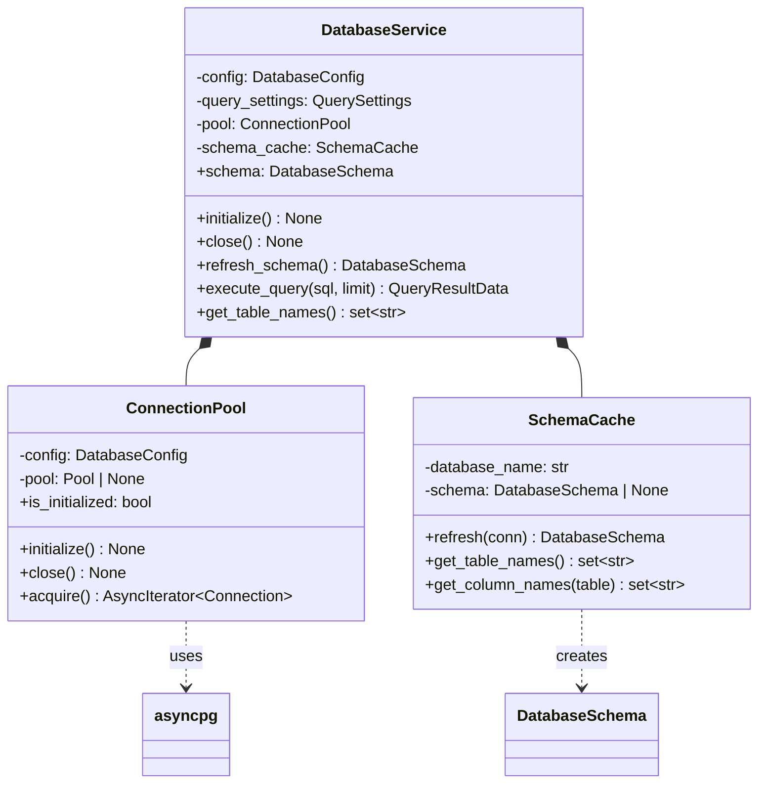
```mermaid
classDiagram
    class DatabaseService {
        -config: DatabaseConfig
        -query_settings: QuerySettings
        -pool: ConnectionPool
        -schema_cache: SchemaCache
        +initialize() None
        +close() None
        +refresh_schema() DatabaseSchema
        +execute_query(sql, limit) QueryResultData
        +schema: DatabaseSchema
        +get_table_names() set~str~
    }
    
    class ConnectionPool {
        -config: DatabaseConfig
        -pool: Pool | None
        +initialize() None
        +close() None
        +acquire() AsyncIterator~Connection~
        +is_initialized: bool
    }
    
    class SchemaCache {
        -database_name: str
        -schema: DatabaseSchema | None
        +refresh(conn) DatabaseSchema
        +get_table_names() set~str~
        +get_column_names(table) set~str~
    }
    
    DatabaseService *-- ConnectionPool
    DatabaseService *-- SchemaCache
    ConnectionPool ..> asyncpg : uses
    SchemaCache ..> DatabaseSchema : creates
```

**组件职责：**

| 组件 | 职责 | 关键方法 |
|------|------|----------|
| DatabaseService | 统一管理数据库操作 | initialize, execute_query |
| ConnectionPool | 管理 asyncpg 连接池 | acquire (上下文管理器) |
| SchemaCache | 缓存数据库元数据 | refresh, get_table_names |

### 4.3 LLM 组件

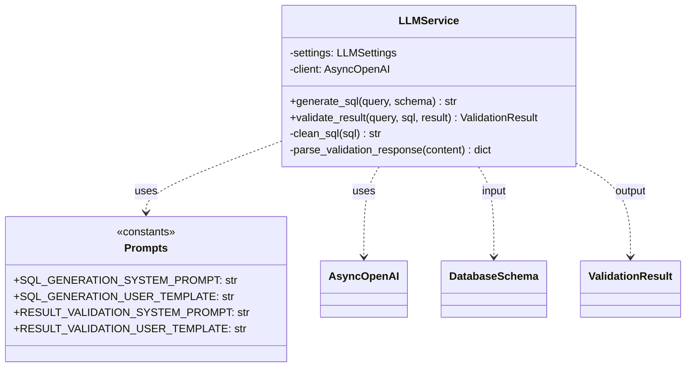
```mermaid
classDiagram
    class LLMService {
        -settings: LLMSettings
        -client: AsyncOpenAI
        +generate_sql(query, schema) str
        +validate_result(query, sql, result) ValidationResult
        -clean_sql(sql) str
        -parse_validation_response(content) dict
    }
    
    class Prompts {
        <<constants>>
        +SQL_GENERATION_SYSTEM_PROMPT: str
        +SQL_GENERATION_USER_TEMPLATE: str
        +RESULT_VALIDATION_SYSTEM_PROMPT: str
        +RESULT_VALIDATION_USER_TEMPLATE: str
    }
    
    LLMService ..> Prompts : uses
    LLMService ..> AsyncOpenAI : uses
    LLMService ..> DatabaseSchema : input
    LLMService ..> ValidationResult : output
```

**Prompt 设计：**

| Prompt | 用途 | 关键指令 |
|--------|------|----------|
| SQL 生成 System | 设定 SQL 助手角色 | 只生成 SELECT，基于 Schema，不加 LIMIT |
| SQL 生成 User | 提供上下文 | Schema 信息 + 用户查询 |
| 结果验证 System | 设定验证者角色 | 验证匹配度，输出 JSON |
| 结果验证 User | 提供验证数据 | 原查询 + SQL + 结果样本 |

### 4.4 校验组件

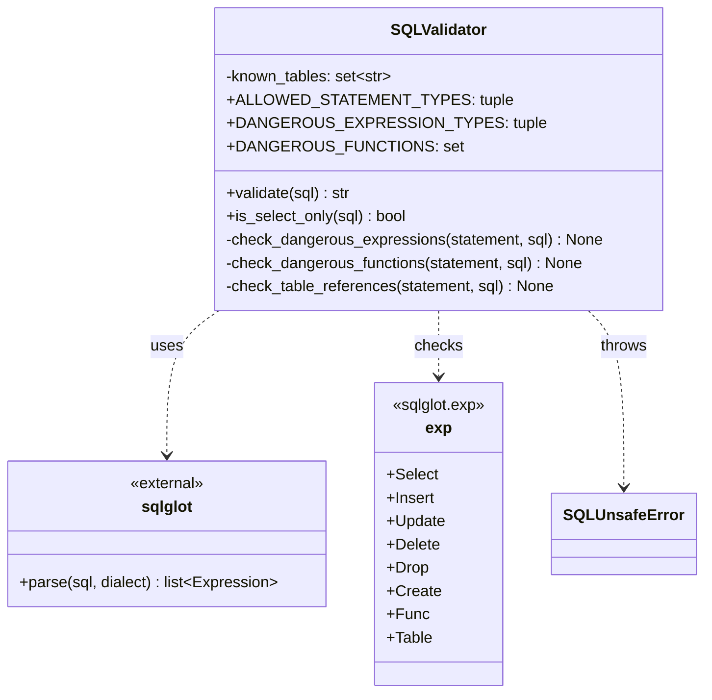
```mermaid
classDiagram
    class SQLValidator {
        -known_tables: set~str~
        +ALLOWED_STATEMENT_TYPES: tuple
        +DANGEROUS_EXPRESSION_TYPES: tuple
        +DANGEROUS_FUNCTIONS: set
        +validate(sql) str
        +is_select_only(sql) bool
        -check_dangerous_expressions(statement, sql) None
        -check_dangerous_functions(statement, sql) None
        -check_table_references(statement, sql) None
    }
    
    class sqlglot {
        <<external>>
        +parse(sql, dialect) list~Expression~
    }
    
    class exp {
        <<sqlglot.exp>>
        +Select
        +Insert
        +Update
        +Delete
        +Drop
        +Create
        +Func
        +Table
    }
    
    SQLValidator ..> sqlglot : uses
    SQLValidator ..> exp : checks
    SQLValidator ..> SQLUnsafeError : throws
```

**危险操作黑名单：**

| 类别 | 禁止项 |
|------|--------|
| DML | INSERT, UPDATE, DELETE, MERGE |
| DDL | CREATE, ALTER, DROP, TRUNCATE |
| 权限 | GRANT, REVOKE |
| 其他 | COPY, EXECUTE, CALL, Command |
| 函数 | pg_read_file, pg_ls_dir, dblink, lo_import/export |

---

## 5. 数据模型

### 5.1 Schema 模型

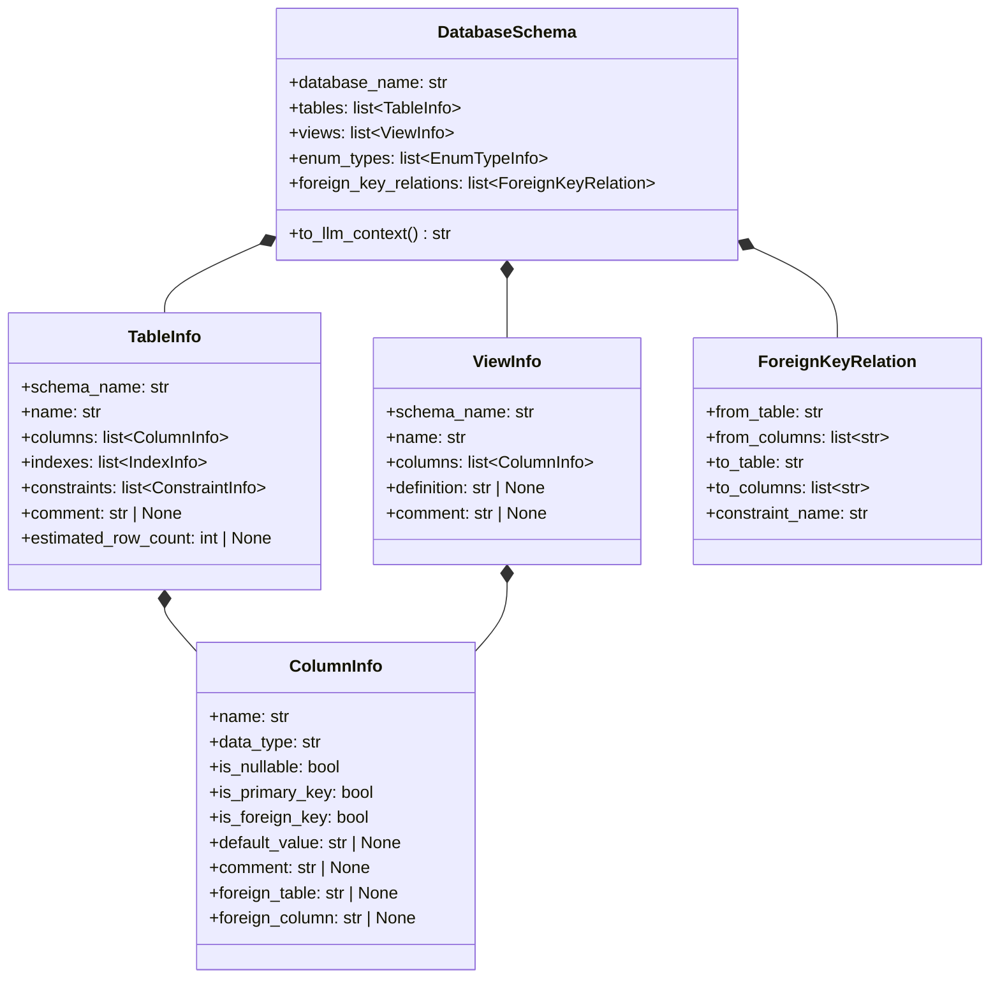
```mermaid
classDiagram
    class DatabaseSchema {
        +database_name: str
        +tables: list~TableInfo~
        +views: list~ViewInfo~
        +enum_types: list~EnumTypeInfo~
        +foreign_key_relations: list~ForeignKeyRelation~
        +to_llm_context() str
    }
    
    class TableInfo {
        +schema_name: str
        +name: str
        +columns: list~ColumnInfo~
        +indexes: list~IndexInfo~
        +constraints: list~ConstraintInfo~
        +comment: str | None
        +estimated_row_count: int | None
    }
    
    class ColumnInfo {
        +name: str
        +data_type: str
        +is_nullable: bool
        +is_primary_key: bool
        +is_foreign_key: bool
        +default_value: str | None
        +comment: str | None
        +foreign_table: str | None
        +foreign_column: str | None
    }
    
    class ViewInfo {
        +schema_name: str
        +name: str
        +columns: list~ColumnInfo~
        +definition: str | None
        +comment: str | None
    }
    
    class ForeignKeyRelation {
        +from_table: str
        +from_columns: list~str~
        +to_table: str
        +to_columns: list~str~
        +constraint_name: str
    }
    
    DatabaseSchema *-- TableInfo
    DatabaseSchema *-- ViewInfo
    DatabaseSchema *-- ForeignKeyRelation
    TableInfo *-- ColumnInfo
    ViewInfo *-- ColumnInfo
```

**模型用途：**

| 模型 | 数据来源 | 用途 |
|------|----------|------|
| DatabaseSchema | 聚合所有元数据 | 提供给 LLM 作为上下文 |
| TableInfo | information_schema.tables | 描述表结构 |
| ColumnInfo | information_schema.columns | 描述列信息 |
| ForeignKeyRelation | information_schema.table_constraints | 描述表关系 |

### 5.2 查询模型

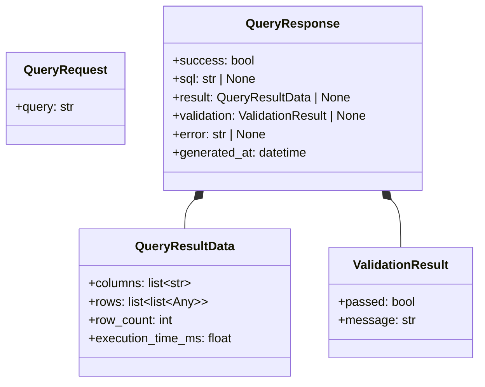
```mermaid
classDiagram
    class QueryRequest {
        +query: str
    }
    
    class QueryResponse {
        +success: bool
        +sql: str | None
        +result: QueryResultData | None
        +validation: ValidationResult | None
        +error: str | None
        +generated_at: datetime
    }
    
    class QueryResultData {
        +columns: list~str~
        +rows: list~list~Any~~
        +row_count: int
        +execution_time_ms: float
    }
    
    class ValidationResult {
        +passed: bool
        +message: str
    }
    
    QueryResponse *-- QueryResultData
    QueryResponse *-- ValidationResult
```

**字段约束：**

| 模型 | 字段 | 约束 |
|------|------|------|
| QueryRequest | query | 1-4096 字符 |
| QueryResultData | row_count | >= 0 |
| QueryResultData | execution_time_ms | >= 0 |

### 5.3 错误模型

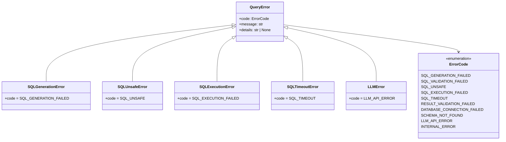
```mermaid
classDiagram
    class ErrorCode {
        <<enumeration>>
        SQL_GENERATION_FAILED
        SQL_VALIDATION_FAILED
        SQL_UNSAFE
        SQL_EXECUTION_FAILED
        SQL_TIMEOUT
        RESULT_VALIDATION_FAILED
        DATABASE_CONNECTION_FAILED
        SCHEMA_NOT_FOUND
        LLM_API_ERROR
        INTERNAL_ERROR
    }
    
    class QueryError {
        +code: ErrorCode
        +message: str
        +details: str | None
    }
    
    class SQLGenerationError {
        +code = SQL_GENERATION_FAILED
    }
    
    class SQLUnsafeError {
        +code = SQL_UNSAFE
    }
    
    class SQLExecutionError {
        +code = SQL_EXECUTION_FAILED
    }
    
    class SQLTimeoutError {
        +code = SQL_TIMEOUT
    }
    
    class LLMError {
        +code = LLM_API_ERROR
    }
    
    QueryError <|-- SQLGenerationError
    QueryError <|-- SQLUnsafeError
    QueryError <|-- SQLExecutionError
    QueryError <|-- SQLTimeoutError
    QueryError <|-- LLMError
    QueryError --> ErrorCode
```

---

## 6. 项目结构

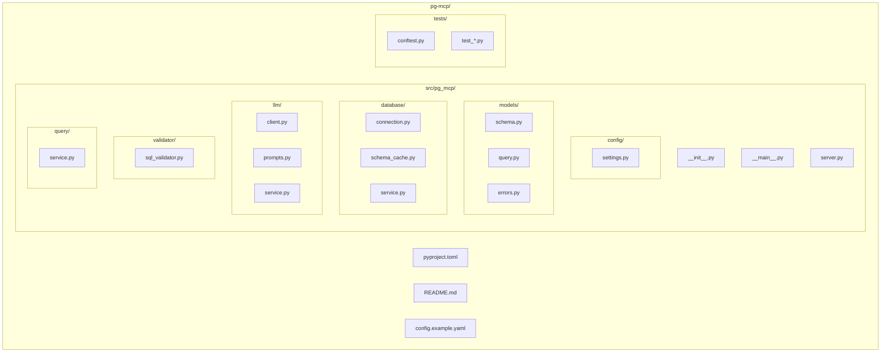
```mermaid
graph TD
    subgraph Root["pg-mcp/"]
        pyproject["pyproject.toml"]
        readme["README.md"]
        config_example["config.example.yaml"]
        
        subgraph src["src/pg_mcp/"]
            init["__init__.py"]
            main["__main__.py"]
            server["server.py"]
            
            subgraph config_dir["config/"]
                settings["settings.py"]
            end
            
            subgraph models_dir["models/"]
                schema_py["schema.py"]
                query_py["query.py"]
                errors_py["errors.py"]
            end
            
            subgraph database_dir["database/"]
                connection["connection.py"]
                schema_cache["schema_cache.py"]
                db_service["service.py"]
            end
            
            subgraph llm_dir["llm/"]
                client["client.py"]
                prompts["prompts.py"]
                llm_service["service.py"]
            end
            
            subgraph validator_dir["validator/"]
                sql_validator["sql_validator.py"]
            end
            
            subgraph query_dir["query/"]
                query_service["service.py"]
            end
        end
        
        subgraph tests_dir["tests/"]
            conftest["conftest.py"]
            test_files["test_*.py"]
        end
    end
```

**目录说明：**

| 目录 | 内容 | 文件数 |
|------|------|--------|
| config/ | 配置类定义 | 1 |
| models/ | Pydantic 数据模型 | 3 |
| database/ | 数据库相关组件 | 3 |
| llm/ | LLM 调用相关组件 | 3 |
| validator/ | SQL 校验器 | 1 |
| query/ | 查询编排服务 | 1 |
| tests/ | 测试文件 | 5+ |

---

## 7. 配置说明

### 7.1 环境变量

| 变量名 | 必填 | 默认值 | 描述 |
|--------|------|--------|------|
| `LLM_API_KEY` | 是 | - | LLM API 密钥 |
| `LLM_BASE_URL` | 否 | DashScope 端点 | LLM API 地址 |
| `LLM_MODEL` | 否 | qwen-plus | 模型名称 |
| `LLM_TEMPERATURE` | 否 | 0.1 | 生成温度 (0-2) |
| `LLM_TIMEOUT` | 否 | 30.0 | 请求超时(秒) |
| `LLM_MAX_TOKENS` | 否 | 2048 | 最大生成 token 数 |
| `QUERY_DEFAULT_LIMIT` | 否 | 100 | 默认返回行数限制 |
| `QUERY_STATEMENT_TIMEOUT` | 否 | 30000 | SQL 执行超时(毫秒) |
| `QUERY_ENABLE_VALIDATION` | 否 | true | 是否启用 LLM 结果验证 |
| `PG_MCP_CONFIG_PATH` | 是 | - | 配置文件路径 |
| `PG_MCP_LOG_LEVEL` | 否 | INFO | 日志级别 |

### 7.2 数据库配置文件

| 字段 | 类型 | 必填 | 默认值 | 描述 |
|------|------|------|--------|------|
| name | string | 是 | - | 数据库别名 |
| host | string | 否 | localhost | 主机地址 |
| port | int | 否 | 5432 | 端口 |
| database | string | 是 | - | 数据库名 |
| user | string | 是 | - | 用户名 |
| password | string | 是 | - | 密码，支持 `${ENV_VAR}` |
| min_pool_size | int | 否 | 2 | 最小连接数 |
| max_pool_size | int | 否 | 10 | 最大连接数 |
| ssl | bool | 否 | false | 是否启用 SSL |

---

## 8. 错误处理

### 8.1 错误处理流程

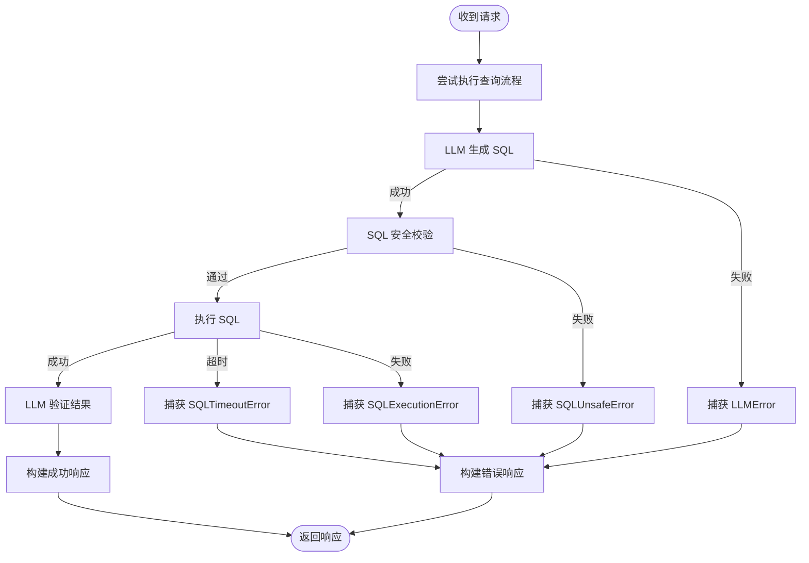
```mermaid
flowchart TD
    Request([收到请求]) --> TryExecute["尝试执行查询流程"]
    
    TryExecute --> GenSQL["LLM 生成 SQL"]
    GenSQL -->|成功| Validate["SQL 安全校验"]
    GenSQL -->|失败| HandleLLMError["捕获 LLMError"]
    
    Validate -->|通过| Execute["执行 SQL"]
    Validate -->|失败| HandleUnsafe["捕获 SQLUnsafeError"]
    
    Execute -->|成功| ValidateResult["LLM 验证结果"]
    Execute -->|超时| HandleTimeout["捕获 SQLTimeoutError"]
    Execute -->|失败| HandleExecError["捕获 SQLExecutionError"]
    
    ValidateResult --> Success["构建成功响应"]
    
    HandleLLMError --> ErrorResponse["构建错误响应"]
    HandleUnsafe --> ErrorResponse
    HandleTimeout --> ErrorResponse
    HandleExecError --> ErrorResponse
    
    Success --> Return([返回响应])
    ErrorResponse --> Return
```

### 8.2 错误分类

| 错误码 | 场景 | 用户提示 | 处理策略 |
|--------|------|----------|----------|
| SQL_GENERATION_FAILED | LLM 无法生成 SQL | 请更清晰描述查询需求 | 记录日志，建议重试 |
| SQL_UNSAFE | SQL 包含危险操作 | 该查询包含不允许的操作 | 记录安全日志 |
| SQL_EXECUTION_FAILED | 数据库执行错误 | 查询执行失败：{error} | 返回数据库错误 |
| SQL_TIMEOUT | 查询超时 | 查询超时，请简化查询 | 建议优化 |
| LLM_API_ERROR | LLM API 调用失败 | AI 服务暂时不可用 | 可重试 |

---

## 9. 测试策略

### 9.1 测试金字塔

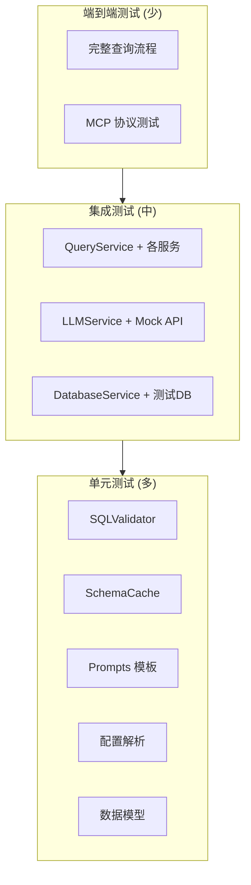
```mermaid
graph TB
    subgraph E2E["端到端测试 (少)"]
        E2E1["完整查询流程"]
        E2E2["MCP 协议测试"]
    end
    
    subgraph Integration["集成测试 (中)"]
        Int1["QueryService + 各服务"]
        Int2["LLMService + Mock API"]
        Int3["DatabaseService + 测试DB"]
    end
    
    subgraph Unit["单元测试 (多)"]
        Unit1["SQLValidator"]
        Unit2["SchemaCache"]
        Unit3["Prompts 模板"]
        Unit4["配置解析"]
        Unit5["数据模型"]
    end
    
    E2E --> Integration
    Integration --> Unit
```

### 9.2 测试覆盖重点

| 模块 | 测试重点 | Mock 对象 |
|------|----------|-----------|
| SQLValidator | 各类 SQL 校验规则 | 无 |
| LLMService | SQL 生成、结果验证 | OpenAI API |
| DatabaseService | 连接池、Schema 缓存、查询执行 | 数据库连接 |
| QueryService | 完整流程、错误传播 | LLM + DB |

---

## 10. 部署配置

### 10.1 部署架构

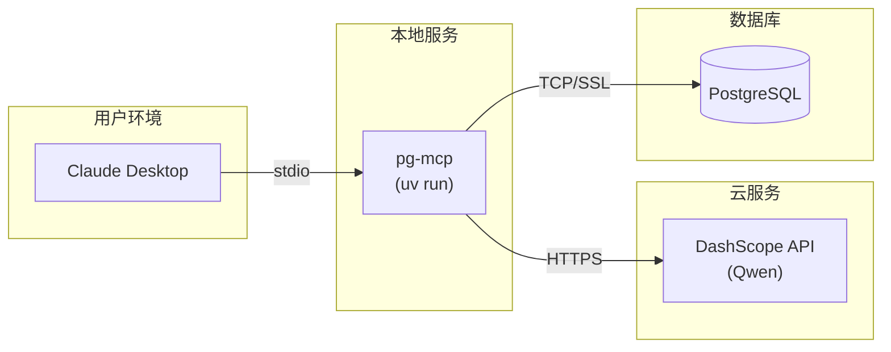
```mermaid
graph LR
    subgraph Client["用户环境"]
        Claude["Claude Desktop"]
    end
    
    subgraph Local["本地服务"]
        MCP["pg-mcp<br/>(uv run)"]
    end
    
    subgraph Cloud["云服务"]
        LLM["DashScope API<br/>(Qwen)"]
    end
    
    subgraph Database["数据库"]
        PG[(PostgreSQL)]
    end
    
    Claude -->|stdio| MCP
    MCP -->|HTTPS| LLM
    MCP -->|TCP/SSL| PG
```

### 10.2 Claude Desktop 配置

配置文件位置：
- macOS: `~/Library/Application Support/Claude/claude_desktop_config.json`
- Windows: `%APPDATA%\Claude\claude_desktop_config.json`

配置项：

| 字段 | 值 |
|------|-----|
| command | uv |
| args | ["run", "--directory", "/path/to/pg-mcp", "pg-mcp"] |
| env.LLM_API_KEY | API 密钥 |
| env.PG_MCP_CONFIG_PATH | 配置文件路径 |

---

## 11. 依赖项

### 11.1 运行时依赖

| 包名 | 版本 | 用途 |
|------|------|------|
| mcp[cli] | >=1.0.0 | MCP 框架 |
| asyncpg | >=0.29.0 | PostgreSQL 异步驱动 |
| openai | >=1.0.0 | LLM 调用 |
| sqlglot | >=20.0.0 | SQL 解析 |
| pydantic | >=2.0.0 | 数据验证 |
| pydantic-settings | >=2.0.0 | 配置管理 |
| pyyaml | >=6.0.0 | YAML 解析 |

### 11.2 开发依赖

| 包名 | 版本 | 用途 |
|------|------|------|
| pytest | >=7.0.0 | 测试框架 |
| pytest-asyncio | >=0.21.0 | 异步测试 |
| pytest-cov | >=4.0.0 | 覆盖率 |

---

## 12. 修订历史

| 版本 | 日期 | 变更说明 |
|------|------|----------|
| 1.0 | 2026-01-24 | 初始版本 |
| 1.1 | 2026-01-24 | 移除代码示例，保留设计描述 |
| 1.2 | 2026-01-24 | 使用 Mermaid 图表重构 |
