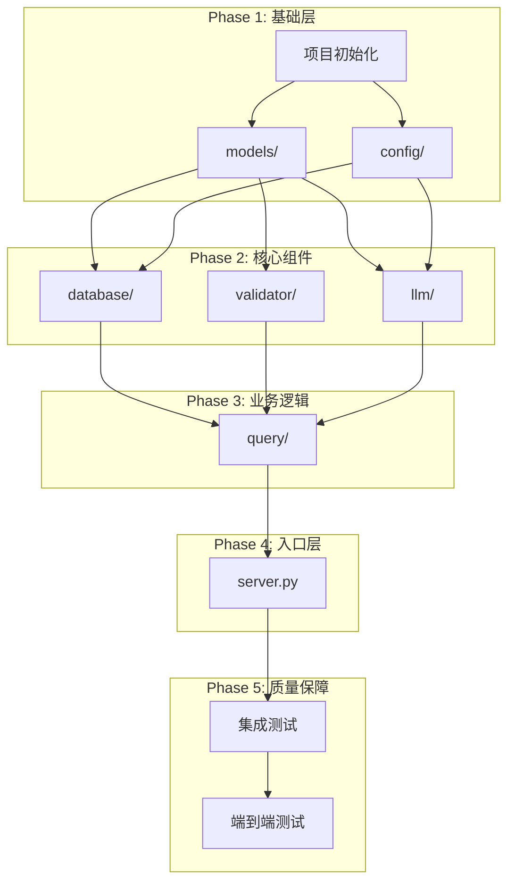

# PostgreSQL MCP Server 实现计划

## 1. 概述

### 1.1 文档目的

本文档详细规划 PostgreSQL MCP Server 的实现步骤，包括开发阶段划分、任务分解、依赖关系和验收标准，为开发团队提供清晰的实施路线图。

### 1.2 关联文档

| 文档 | 用途 |
|------|------|
| [0001-pg-mcp-prd.md](./0001-pg-mcp-prd.md) | 产品需求定义 |
| [0002-pg-mcp-design.md](./0002-pg-mcp-design.md) | 技术架构设计 |

### 1.3 项目目标

- 构建完整的 PostgreSQL MCP Server
- 支持自然语言查询数据库
- 确保 SQL 安全校验
- 实现 LLM 结果验证

---

## 2. 模块依赖关系

### 2.1 依赖图



### 2.2 模块实现顺序

| 顺序 | 模块 | 依赖 | 原因 |
|------|------|------|------|
| 1 | 项目初始化 | 无 | 建立项目结构和依赖 |
| 2 | models/ | 无 | 纯数据模型，无外部依赖 |
| 3 | config/ | 无 | 配置类依赖 Pydantic |
| 4 | database/ | models, config | 需要使用数据模型和配置 |
| 5 | validator/ | models | 需要错误模型 |
| 6 | llm/ | models, config | 需要数据模型和 LLM 配置 |
| 7 | query/ | database, validator, llm | 编排所有服务 |
| 8 | server.py | query | 注册 MCP Tool |

---

## 3. 实现阶段

### Phase 1: 项目初始化与基础模块

**目标**：建立项目骨架，实现无外部依赖的基础模块

#### 1.1 项目初始化

| 任务 | 描述 | 产出文件 | 验收标准 |
|------|------|----------|----------|
| 1.1.1 创建项目结构 | 使用 uv 初始化 Python 项目 | `pyproject.toml` | `uv sync` 成功 |
| 1.1.2 配置依赖 | 添加运行时和开发依赖 | `pyproject.toml` | 依赖安装成功 |
| 1.1.3 创建包结构 | 创建 `src/pg_mcp/` 目录结构 | 目录和 `__init__.py` | 包可导入 |
| 1.1.4 配置示例 | 创建配置文件示例 | `config.example.yaml` | 格式正确 |
| 1.1.5 README | 项目说明文档 | `README.md` | 包含使用说明 |

**目录结构**：

```
pg-mcp/
├── pyproject.toml
├── README.md
├── config.example.yaml
├── src/
│   └── pg_mcp/
│       ├── __init__.py
│       ├── __main__.py
│       ├── server.py
│       ├── config/
│       │   └── __init__.py
│       ├── models/
│       │   └── __init__.py
│       ├── database/
│       │   └── __init__.py
│       ├── llm/
│       │   └── __init__.py
│       ├── validator/
│       │   └── __init__.py
│       └── query/
│           └── __init__.py
└── tests/
    ├── __init__.py
    └── conftest.py
```

#### 1.2 数据模型 (models/)

| 任务 | 描述 | 产出文件 | 验收标准 |
|------|------|----------|----------|
| 1.2.1 Schema 模型 | 数据库元数据模型 | `models/schema.py` | 单元测试通过 |
| 1.2.2 查询模型 | 请求/响应/结果模型 | `models/query.py` | 单元测试通过 |
| 1.2.3 错误模型 | 错误码和异常类 | `models/errors.py` | 单元测试通过 |
| 1.2.4 模块导出 | 统一导出接口 | `models/__init__.py` | 导入成功 |

**1.2.1 Schema 模型详细设计**：

```
models/schema.py 包含：
├── ColumnInfo          # 列信息
├── IndexInfo           # 索引信息（可选）
├── ConstraintInfo      # 约束信息（可选）
├── TableInfo           # 表信息
├── ViewInfo            # 视图信息
├── EnumTypeInfo        # 枚举类型信息
├── ForeignKeyRelation  # 外键关系
└── DatabaseSchema      # 数据库 Schema 聚合
    └── to_llm_context() -> str  # 转换为 LLM 上下文
```

**1.2.2 查询模型详细设计**：

```
models/query.py 包含：
├── QueryRequest        # 查询请求
│   └── query: str (1-4096 字符)
├── QueryResultData     # 查询结果数据
│   ├── columns: list[str]
│   ├── rows: list[list[Any]]
│   ├── row_count: int
│   └── execution_time_ms: float
├── ValidationResult    # 验证结果
│   ├── passed: bool
│   └── message: str
└── QueryResponse       # 查询响应
    ├── success: bool
    ├── sql: str | None
    ├── result: QueryResultData | None
    ├── validation: ValidationResult | None
    ├── error: str | None
    └── generated_at: datetime
```

**1.2.3 错误模型详细设计**：

```
models/errors.py 包含：
├── ErrorCode (Enum)    # 错误码枚举
│   ├── SQL_GENERATION_FAILED
│   ├── SQL_VALIDATION_FAILED
│   ├── SQL_UNSAFE
│   ├── SQL_EXECUTION_FAILED
│   ├── SQL_TIMEOUT
│   ├── RESULT_VALIDATION_FAILED
│   ├── DATABASE_CONNECTION_FAILED
│   ├── SCHEMA_NOT_FOUND
│   ├── LLM_API_ERROR
│   └── INTERNAL_ERROR
├── QueryError          # 基础异常类
├── SQLGenerationError  # SQL 生成错误
├── SQLUnsafeError      # SQL 不安全错误
├── SQLExecutionError   # SQL 执行错误
├── SQLTimeoutError     # SQL 超时错误
└── LLMError            # LLM 调用错误
```

#### 1.3 配置管理 (config/)

| 任务 | 描述 | 产出文件 | 验收标准 |
|------|------|----------|----------|
| 1.3.1 配置类定义 | Settings, LLMSettings, QuerySettings, DatabaseConfig | `config/settings.py` | 单元测试通过 |
| 1.3.2 配置加载器 | YAML 文件解析，环境变量替换 | `config/settings.py` | 单元测试通过 |
| 1.3.3 模块导出 | 统一导出接口 | `config/__init__.py` | 导入成功 |

**配置类详细设计**：

```
config/settings.py 包含：
├── LLMSettings         # LLM 配置
│   ├── api_key: SecretStr
│   ├── base_url: str = "https://dashscope.aliyuncs.com/compatible-mode/v1"
│   ├── model: str = "qwen-plus"
│   ├── temperature: float = 0.1
│   ├── timeout: float = 30.0
│   └── max_tokens: int = 2048
├── QuerySettings       # 查询配置
│   ├── default_limit: int = 100
│   ├── statement_timeout: int = 30000
│   └── enable_validation: bool = True
├── Settings            # 主配置
│   ├── config_path: str | None
│   ├── log_level: str = "INFO"
│   ├── llm: LLMSettings
│   └── query: QuerySettings
├── DatabaseConfig      # 数据库配置
│   ├── name: str
│   ├── host: str = "localhost"
│   ├── port: int = 5432
│   ├── database: str
│   ├── user: str
│   ├── password: SecretStr
│   ├── min_pool_size: int = 2
│   ├── max_pool_size: int = 10
│   ├── ssl: bool = False
│   └── dsn: str (computed)
└── ConfigLoader        # 配置加载器
    ├── load_databases(path) -> list[DatabaseConfig]
    └── _expand_env_vars(config) -> dict
```

**Phase 1 验收标准**：

- [ ] `uv run python -c "from pg_mcp.models import *"` 成功
- [ ] `uv run python -c "from pg_mcp.config import *"` 成功
- [ ] `uv run pytest tests/test_models.py` 通过
- [ ] `uv run pytest tests/test_config.py` 通过

---

### Phase 2: 核心组件实现

**目标**：实现数据库、LLM 和校验三个核心组件

#### 2.1 数据库组件 (database/)

| 任务 | 描述 | 产出文件 | 验收标准 |
|------|------|----------|----------|
| 2.1.1 连接池 | asyncpg 连接池封装 | `database/connection.py` | 单元测试通过 |
| 2.1.2 Schema 缓存 | 元数据查询和缓存 | `database/schema_cache.py` | 单元测试通过 |
| 2.1.3 数据库服务 | 统一 DatabaseService | `database/service.py` | 集成测试通过 |
| 2.1.4 模块导出 | 统一导出接口 | `database/__init__.py` | 导入成功 |

**2.1.1 连接池详细设计**：

```
database/connection.py 包含：
├── ConnectionPool
│   ├── __init__(config: DatabaseConfig)
│   ├── async initialize() -> None
│   ├── async close() -> None
│   ├── @asynccontextmanager acquire() -> AsyncIterator[Connection]
│   └── @property is_initialized: bool
```

**关键实现点**：
- 使用 `asyncpg.create_pool()` 创建连接池
- 支持 SSL 连接
- 优雅关闭处理

**2.1.2 Schema 缓存详细设计**：

```
database/schema_cache.py 包含：
├── SchemaCache
│   ├── __init__(database_name: str)
│   ├── async refresh(conn: Connection) -> DatabaseSchema
│   ├── get_table_names() -> set[str]
│   ├── get_column_names(table: str) -> set[str]
│   └── @property schema: DatabaseSchema | None
```

**Schema 查询 SQL**：

| 查询对象 | 信息源 |
|----------|--------|
| 表和列 | `information_schema.tables`, `information_schema.columns` |
| 主键 | `information_schema.table_constraints`, `information_schema.key_column_usage` |
| 外键 | `information_schema.referential_constraints` |
| 索引 | `pg_indexes` |
| 视图 | `information_schema.views` |
| 枚举 | `pg_type`, `pg_enum` |
| 注释 | `pg_description` |
| 行数估计 | `pg_class.reltuples` |

**2.1.3 数据库服务详细设计**：

```
database/service.py 包含：
├── DatabaseService
│   ├── __init__(config: DatabaseConfig, query_settings: QuerySettings)
│   ├── async initialize() -> None
│   ├── async close() -> None
│   ├── async refresh_schema() -> DatabaseSchema
│   ├── async execute_query(sql: str, limit: int | None) -> QueryResultData
│   ├── @property schema: DatabaseSchema
│   └── get_table_names() -> set[str]
```

**execute_query 实现要点**：
- 设置 `statement_timeout`
- 自动添加 LIMIT（如果未指定）
- 计算执行时间
- 异常转换为 SQLExecutionError 或 SQLTimeoutError

#### 2.2 SQL 校验器 (validator/)

| 任务 | 描述 | 产出文件 | 验收标准 |
|------|------|----------|----------|
| 2.2.1 校验器实现 | SQLGlot 解析和校验 | `validator/sql_validator.py` | 单元测试通过 |
| 2.2.2 模块导出 | 统一导出接口 | `validator/__init__.py` | 导入成功 |

**2.2.1 校验器详细设计**：

```
validator/sql_validator.py 包含：
├── SQLValidator
│   ├── __init__(known_tables: set[str] | None = None)
│   ├── ALLOWED_STATEMENT_TYPES: tuple = (exp.Select,)
│   ├── DANGEROUS_EXPRESSION_TYPES: tuple = (
│   │     exp.Insert, exp.Update, exp.Delete, exp.Merge,
│   │     exp.Create, exp.Alter, exp.Drop, exp.Truncate,
│   │     exp.Grant, exp.Revoke, exp.Command
│   │   )
│   ├── DANGEROUS_FUNCTIONS: set = {
│   │     "pg_read_file", "pg_read_binary_file", "pg_ls_dir",
│   │     "pg_stat_file", "dblink", "dblink_exec",
│   │     "lo_import", "lo_export"
│   │   }
│   ├── validate(sql: str) -> str
│   ├── is_select_only(sql: str) -> bool
│   ├── _check_dangerous_expressions(statement, sql) -> None
│   ├── _check_dangerous_functions(statement, sql) -> None
│   └── _check_table_references(statement, sql) -> None
```

**校验流程**：

```
1. SQLGlot 解析 SQL
   ├── 失败 → SQLUnsafeError("SQL 语法错误")
   └── 成功 → 继续

2. 检查语句数量
   ├── 0 条 → SQLUnsafeError("空 SQL 语句")
   ├── > 1 条 → SQLUnsafeError("不允许多条语句")
   └── 1 条 → 继续

3. 检查语句类型
   ├── 非 SELECT → SQLUnsafeError("只允许 SELECT")
   └── SELECT → 继续

4. 遍历 AST 检查危险表达式
   ├── 发现危险 → SQLUnsafeError("包含不允许的操作")
   └── 无危险 → 继续

5. 检查危险函数调用
   ├── 发现危险 → SQLUnsafeError("包含不允许的函数")
   └── 无危险 → 继续

6. 可选：校验表名
   ├── 表不存在 → SQLUnsafeError("引用未知的表")
   └── 表存在 → 验证通过
```

**测试用例矩阵**：

| 测试分类 | 测试输入示例 | 预期结果 |
|----------|--------------|----------|
| 正常 SELECT | `SELECT * FROM users` | 通过 |
| 带 WHERE | `SELECT * FROM users WHERE id = 1` | 通过 |
| 带 JOIN | `SELECT * FROM a JOIN b ON ...` | 通过 |
| 子查询 | `SELECT * FROM (SELECT ...)` | 通过 |
| INSERT | `INSERT INTO users VALUES (...)` | 拒绝 |
| UPDATE | `UPDATE users SET ...` | 拒绝 |
| DELETE | `DELETE FROM users` | 拒绝 |
| DROP | `DROP TABLE users` | 拒绝 |
| 多语句 | `SELECT 1; DROP TABLE x` | 拒绝 |
| 危险函数 | `SELECT pg_read_file('/etc/passwd')` | 拒绝 |
| 语法错误 | `SELEC * FRM users` | 拒绝 |

#### 2.3 LLM 组件 (llm/)

| 任务 | 描述 | 产出文件 | 验收标准 |
|------|------|----------|----------|
| 2.3.1 Prompt 模板 | SQL 生成和结果验证 Prompt | `llm/prompts.py` | 代码审查 |
| 2.3.2 LLM 服务 | OpenAI SDK 封装 | `llm/service.py` | 集成测试通过 |
| 2.3.3 模块导出 | 统一导出接口 | `llm/__init__.py` | 导入成功 |

**2.3.1 Prompt 模板设计**：

```
llm/prompts.py 包含：
├── SQL_GENERATION_SYSTEM_PROMPT
│   """
│   你是一个 PostgreSQL 专家，根据用户的自然语言描述生成 SQL 查询语句。
│   
│   规则：
│   1. 只生成 SELECT 查询语句
│   2. 基于提供的数据库 Schema 信息
│   3. 不要添加 LIMIT 子句，系统会自动处理
│   4. 只返回 SQL 语句，不要包含解释或 markdown 格式
│   5. 使用标准 PostgreSQL 语法
│   """
├── SQL_GENERATION_USER_TEMPLATE
│   """
│   ## 数据库 Schema
│   
│   {schema}
│   
│   ## 用户查询
│   
│   {query}
│   
│   请生成相应的 SQL 查询语句。
│   """
├── RESULT_VALIDATION_SYSTEM_PROMPT
│   """
│   你是一个数据分析专家，负责验证 SQL 查询结果是否符合用户的原始意图。
│   
│   请分析以下信息并判断：
│   1. 查询结果是否回答了用户的问题
│   2. 数据是否看起来合理
│   3. 如果结果为空，分析可能的原因
│   
│   以 JSON 格式返回：
│   {"passed": true/false, "message": "说明"}
│   """
└── RESULT_VALIDATION_USER_TEMPLATE
    """
    ## 用户原始查询
    
    {query}
    
    ## 生成的 SQL
    
    {sql}
    
    ## 查询结果
    
    列: {columns}
    行数: {row_count}
    样本数据（前 5 行）:
    {sample_rows}
    
    请验证结果是否符合用户意图。
    """
```

**2.3.2 LLM 服务详细设计**：

```
llm/service.py 包含：
├── LLMService
│   ├── __init__(settings: LLMSettings)
│   ├── async generate_sql(query: str, schema: DatabaseSchema) -> str
│   │   ├── 构建 Prompt
│   │   ├── 调用 OpenAI API
│   │   ├── 清理返回的 SQL（移除 markdown 等）
│   │   └── 返回纯 SQL 或抛出 SQLGenerationError
│   ├── async validate_result(
│   │     query: str, sql: str, result: QueryResultData
│   │   ) -> ValidationResult
│   │   ├── 构建验证 Prompt
│   │   ├── 调用 OpenAI API
│   │   ├── 解析 JSON 响应
│   │   └── 返回 ValidationResult
│   ├── _clean_sql(sql: str) -> str
│   │   ├── 移除 ```sql 标记
│   │   ├── 移除多余空白
│   │   └── 返回清理后的 SQL
│   └── _parse_validation_response(content: str) -> dict
        ├── 尝试解析 JSON
        └── 失败时返回默认通过
```

**Phase 2 验收标准**：

- [ ] `uv run pytest tests/test_validator.py` 通过
- [ ] `uv run pytest tests/test_database.py` 通过（需要测试数据库）
- [ ] `uv run pytest tests/test_llm.py` 通过（需要 Mock 或真实 API）
- [ ] 所有危险 SQL 被正确拦截

---

### Phase 3: 业务逻辑层

**目标**：实现查询编排服务

#### 3.1 查询服务 (query/)

| 任务 | 描述 | 产出文件 | 验收标准 |
|------|------|----------|----------|
| 3.1.1 查询服务实现 | 编排 LLM/Validator/Database | `query/service.py` | 集成测试通过 |
| 3.1.2 模块导出 | 统一导出接口 | `query/__init__.py` | 导入成功 |

**3.1.1 查询服务详细设计**：

```
query/service.py 包含：
├── QueryService
│   ├── __init__(
│   │     llm_service: LLMService,
│   │     database_service: DatabaseService,
│   │     validator: SQLValidator,
│   │     query_settings: QuerySettings
│   │   )
│   ├── async execute(request: QueryRequest) -> QueryResponse
│   │   ├── 1. 获取 Schema
│   │   ├── 2. LLM 生成 SQL
│   │   ├── 3. SQL 安全校验
│   │   ├── 4. 执行 SQL
│   │   ├── 5. 可选：LLM 验证结果
│   │   └── 6. 构建响应
│   └── _build_error_response(error: QueryError) -> QueryResponse
```

**execute 流程详细设计**：

```
async def execute(request: QueryRequest) -> QueryResponse:
    try:
        # 1. 获取 Schema
        schema = self.database_service.schema
        
        # 2. LLM 生成 SQL
        sql = await self.llm_service.generate_sql(request.query, schema)
        
        # 3. SQL 安全校验
        self.validator.validate(sql)
        
        # 4. 执行 SQL
        result = await self.database_service.execute_query(
            sql, 
            limit=self.query_settings.default_limit
        )
        
        # 5. 可选：LLM 验证结果
        validation = None
        if self.query_settings.enable_validation:
            validation = await self.llm_service.validate_result(
                request.query, sql, result
            )
        
        # 6. 构建成功响应
        return QueryResponse(
            success=True,
            sql=sql,
            result=result,
            validation=validation,
            generated_at=datetime.now(UTC)
        )
        
    except QueryError as e:
        return self._build_error_response(e)
    except Exception as e:
        return self._build_error_response(
            QueryError(ErrorCode.INTERNAL_ERROR, str(e))
        )
```

**Phase 3 验收标准**：

- [ ] `uv run pytest tests/test_query_service.py` 通过
- [ ] 完整查询流程可正常执行
- [ ] 错误处理覆盖所有异常场景

---

### Phase 4: MCP 服务器入口

**目标**：实现 FastMCP 服务器和 Tool 注册

#### 4.1 服务器实现

| 任务 | 描述 | 产出文件 | 验收标准 |
|------|------|----------|----------|
| 4.1.1 服务器入口 | FastMCP 服务器实现 | `server.py` | 服务器可启动 |
| 4.1.2 主入口 | `__main__.py` | `__main__.py` | `uv run pg-mcp` 可执行 |
| 4.1.3 包初始化 | 版本信息等 | `__init__.py` | 导入成功 |

**4.1.1 服务器详细设计**：

```
server.py 包含：
├── create_server() -> FastMCP
│   """创建并配置 FastMCP 服务器"""
│
├── lifespan(server: FastMCP)
│   """服务器生命周期管理"""
│   ├── 启动时：
│   │   ├── 加载配置
│   │   ├── 初始化 DatabaseService
│   │   ├── 初始化 LLMService
│   │   ├── 创建 SQLValidator
│   │   └── 创建 QueryService
│   └── 关闭时：
│       └── 关闭数据库连接池
│
├── @mcp.tool()
│   async def query(query: str) -> str:
│       """根据自然语言描述查询数据库"""
│       ├── 创建 QueryRequest
│       ├── 调用 QueryService.execute()
│       └── 返回 JSON 格式响应
│
└── def main():
    """服务器主入口"""
    mcp = create_server()
    mcp.run()
```

**4.1.2 `__main__.py` 设计**：

```python
from pg_mcp.server import main

if __name__ == "__main__":
    main()
```

**4.1.3 pyproject.toml 入口配置**：

```toml
[project.scripts]
pg-mcp = "pg_mcp.server:main"
```

**Phase 4 验收标准**：

- [ ] `uv run pg-mcp --help` 显示帮助信息
- [ ] 服务器可通过 stdio 启动
- [ ] MCP 客户端可发现 `query` Tool

---

### Phase 5: 测试与质量保障

**目标**：完成集成测试和端到端测试

#### 5.1 测试文件规划

| 测试文件 | 测试范围 | 测试类型 |
|----------|----------|----------|
| `tests/test_models.py` | 数据模型验证 | 单元测试 |
| `tests/test_config.py` | 配置加载 | 单元测试 |
| `tests/test_validator.py` | SQL 校验 | 单元测试 |
| `tests/test_database.py` | 数据库操作 | 集成测试 |
| `tests/test_llm.py` | LLM 调用 | 集成测试（Mock） |
| `tests/test_query_service.py` | 查询服务 | 集成测试 |
| `tests/test_server.py` | MCP 服务器 | 端到端测试 |

#### 5.2 测试工具配置

**conftest.py 设计**：

```python
# tests/conftest.py
import pytest
import asyncio
from unittest.mock import AsyncMock, MagicMock

@pytest.fixture
def event_loop():
    """创建事件循环"""
    loop = asyncio.new_event_loop()
    yield loop
    loop.close()

@pytest.fixture
def mock_llm_service():
    """Mock LLM 服务"""
    service = AsyncMock()
    service.generate_sql.return_value = "SELECT * FROM users"
    service.validate_result.return_value = ValidationResult(
        passed=True, 
        message="验证通过"
    )
    return service

@pytest.fixture
def mock_database_service():
    """Mock 数据库服务"""
    service = AsyncMock()
    service.schema = DatabaseSchema(...)
    service.execute_query.return_value = QueryResultData(...)
    return service

@pytest.fixture
def sample_schema():
    """示例 Schema"""
    return DatabaseSchema(
        database_name="test",
        tables=[
            TableInfo(
                schema_name="public",
                name="users",
                columns=[
                    ColumnInfo(name="id", data_type="integer", ...),
                    ColumnInfo(name="name", data_type="varchar", ...),
                ]
            )
        ]
    )
```

#### 5.3 测试覆盖率目标

| 模块 | 目标覆盖率 | 重点 |
|------|------------|------|
| models/ | 95%+ | 边界条件、验证规则 |
| config/ | 90%+ | 环境变量、配置解析 |
| validator/ | 100% | 所有安全规则 |
| database/ | 80%+ | 连接、查询、缓存 |
| llm/ | 80%+ | API 调用、解析 |
| query/ | 90%+ | 流程编排、错误处理 |
| server.py | 70%+ | 生命周期、Tool 注册 |

**Phase 5 验收标准**：

- [ ] 所有单元测试通过
- [ ] 集成测试通过
- [ ] 总体测试覆盖率 > 80%
- [ ] SQL 安全校验 100% 覆盖

---

## 4. 详细任务清单

### 4.1 Phase 1 任务清单（基础层）

| ID | 任务 | 预估复杂度 | 依赖 |
|----|------|------------|------|
| P1-01 | 创建项目目录结构 | 低 | - |
| P1-02 | 配置 pyproject.toml | 低 | P1-01 |
| P1-03 | 创建包结构和 __init__.py | 低 | P1-01 |
| P1-04 | 实现 models/errors.py | 低 | P1-03 |
| P1-05 | 实现 models/schema.py | 中 | P1-03 |
| P1-06 | 实现 models/query.py | 中 | P1-04 |
| P1-07 | 编写 models 单元测试 | 中 | P1-04,05,06 |
| P1-08 | 实现 config/settings.py | 中 | P1-03 |
| P1-09 | 编写 config 单元测试 | 中 | P1-08 |
| P1-10 | 创建 config.example.yaml | 低 | P1-08 |
| P1-11 | 创建 README.md | 低 | - |

### 4.2 Phase 2 任务清单（核心组件）

| ID | 任务 | 预估复杂度 | 依赖 |
|----|------|------------|------|
| P2-01 | 实现 database/connection.py | 中 | P1-08 |
| P2-02 | 实现 database/schema_cache.py | 高 | P1-05, P2-01 |
| P2-03 | 实现 database/service.py | 高 | P2-01, P2-02 |
| P2-04 | 编写 database 测试 | 高 | P2-03 |
| P2-05 | 实现 validator/sql_validator.py | 高 | P1-04 |
| P2-06 | 编写 validator 测试（全覆盖） | 高 | P2-05 |
| P2-07 | 实现 llm/prompts.py | 中 | - |
| P2-08 | 实现 llm/service.py | 高 | P1-05, P1-06, P2-07 |
| P2-09 | 编写 llm 测试 | 中 | P2-08 |

### 4.3 Phase 3 任务清单（业务逻辑）

| ID | 任务 | 预估复杂度 | 依赖 |
|----|------|------------|------|
| P3-01 | 实现 query/service.py | 高 | P2-03, P2-05, P2-08 |
| P3-02 | 编写 query 集成测试 | 高 | P3-01 |

### 4.4 Phase 4 任务清单（入口层）

| ID | 任务 | 预估复杂度 | 依赖 |
|----|------|------------|------|
| P4-01 | 实现 server.py | 高 | P3-01 |
| P4-02 | 实现 __main__.py | 低 | P4-01 |
| P4-03 | 配置 pyproject.toml scripts | 低 | P4-02 |
| P4-04 | 编写 server 测试 | 中 | P4-01 |

### 4.5 Phase 5 任务清单（质量保障）

| ID | 任务 | 预估复杂度 | 依赖 |
|----|------|------------|------|
| P5-01 | 完善 conftest.py fixtures | 中 | P4-04 |
| P5-02 | 端到端测试 | 高 | P5-01 |
| P5-03 | 测试覆盖率报告 | 低 | P5-02 |
| P5-04 | 修复覆盖率不足的区域 | 中 | P5-03 |

---

## 5. 风险与应对

### 5.1 技术风险

| 风险 | 可能性 | 影响 | 应对措施 |
|------|--------|------|----------|
| SQLGlot 不支持某些 PostgreSQL 语法 | 中 | 中 | 使用 `dialect="postgres"` 参数，必要时添加特殊处理 |
| LLM 生成的 SQL 质量不稳定 | 高 | 中 | 优化 Prompt，降低 temperature，添加示例 |
| asyncpg 连接池配置不当 | 低 | 高 | 充分测试，参考最佳实践 |
| 大型 Schema 导致 LLM 上下文超限 | 中 | 高 | Schema 压缩策略，仅包含相关表 |

### 5.2 集成风险

| 风险 | 可能性 | 影响 | 应对措施 |
|------|--------|------|----------|
| MCP 协议兼容性问题 | 低 | 高 | 使用官方 SDK，充分测试 |
| 测试数据库环境不可用 | 中 | 中 | Docker 化测试环境，提供 setup 脚本 |
| DashScope API 变更 | 低 | 中 | 使用 OpenAI 兼容层，便于切换 |

---

## 6. 验收标准汇总

### 6.1 功能验收

| 验收项 | 标准 |
|--------|------|
| MCP 服务器启动 | `uv run pg-mcp` 成功启动，无错误 |
| Tool 注册 | MCP 客户端可发现 `query` Tool |
| Schema 缓存 | 启动时成功获取并缓存数据库 Schema |
| SQL 生成 | 自然语言查询可生成有效 SQL |
| SQL 安全校验 | 所有危险 SQL 被正确拦截 |
| SQL 执行 | SELECT 查询可正常执行并返回结果 |
| 结果验证 | LLM 验证功能正常工作 |
| 错误处理 | 各类错误返回正确的错误码和消息 |

### 6.2 安全验收

| 验收项 | 测试方法 |
|--------|----------|
| 禁止 INSERT | 输入包含 INSERT 的查询，验证被拒绝 |
| 禁止 UPDATE | 输入包含 UPDATE 的查询，验证被拒绝 |
| 禁止 DELETE | 输入包含 DELETE 的查询，验证被拒绝 |
| 禁止 DROP | 输入包含 DROP 的查询，验证被拒绝 |
| 禁止多语句 | 输入 `SELECT 1; DROP TABLE x`，验证被拒绝 |
| 禁止危险函数 | 输入 `SELECT pg_read_file(...)`，验证被拒绝 |

### 6.3 性能验收

| 验收项 | 标准 |
|--------|------|
| Schema 缓存加载 | < 5 秒（单数据库） |
| SQL 生成响应 | < 10 秒 |
| SQL 执行 | 遵循配置的超时设置 |

---

## 7. 修订历史

| 版本 | 日期 | 变更说明 |
|------|------|----------|
| 1.0 | 2026-01-24 | 初始版本 |
